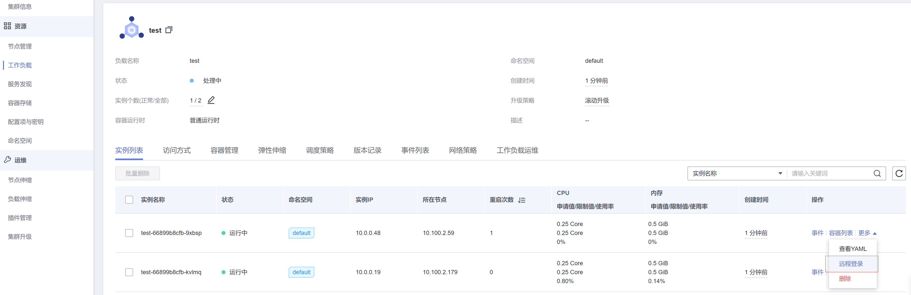

# 登录容器

CCE提供了从控制台登录容器的功能。

登录容器的功能会启动一个CloudShell，并初始化启动kubectl，然后会自动执行kubectl exec命令登录到容器中。

## 登录容器

您可以在工作负载的实例列表处找到登录入口，如下所示。

**图 1**  登录容器  

单击登录后，会弹出如下窗口。请选择要登录的容器以及命令，然后单击“确定“。

跳转到CloudShell，如下图所示。在这里可以看到登录容器就是启动了一个CloudShell，并初始化启动kubectl，然后自动执行了kubectl exec命令登录到容器。

> **说明：** 
>请等待kubectl exec 命令自动执行后再操作，此命令出现需要一段时间 5-10秒。

## 退出\(关闭\)容器

退出时建议单击右上角关闭按钮，否则下次登录时依然是上次关闭的cloudshell界面。

**图 2**  退出容器  

