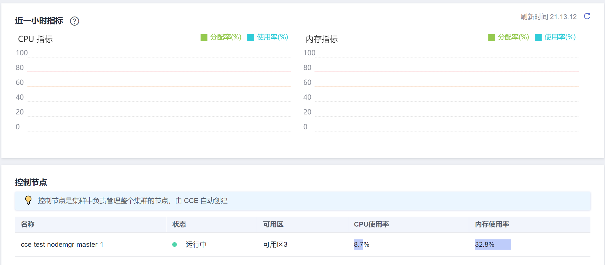
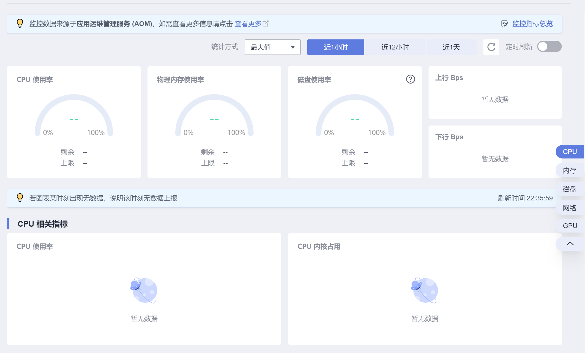

# 监控概述

CCE配合AOM对集群进行全方位的监控，在创建节点时会默认安装AOM的ICAgent（在集群kube-system命名空间下名为icagent的DaemonSet），ICAgent默认采集集群底层资源以及运行在集群上负载的监控数据；另外，ICAgent还能采集负载的自定义指标监控数据。

-   资源监控指标

    资源基础监控包含CPU/内存/磁盘等，具体请参见[资源监控指标](#section205486212251)。您可以在CCE控制台从集群、节点、工作负载等维度查看这些监控指标数据，也可以在AOM中查看。

-   自定义指标

    ICAgent采集应用程序中的自定义指标并上传到AOM，具体使用方法请参见[自定义监控](自定义监控.md)。

-   NPD监控

    node-problem-detector（简称：npd）是一款监控集群节点异常事件的插件，以及对接第三方监控平台功能的组件。它是一个在每个节点上运行的守护程序，可从不同的守护进程中搜集节点问题并将其报告给apiserver。node-problem-detector可以作为DaemonSet运行， 也可以独立运行。

    CCE在NPD 1.16.0版本起做了功能增强，支持检查节点常用资源、组件状态和事件，并提供故障隔离功能。详细内容请参见[npd](npd.md)。

另外您还可以在集群中安装Prometheus插件，使用Prometheus采集监控数据并呈现，具体请参见[使用Prometheus插件监控](使用Prometheus插件监控.md)。

## 资源监控指标

在CCE控制台，可以查看如下指标。

**表 1**  资源监控指标

<table><thead align="left"><tr id="row15860113172219"><th class="cellrowborder" valign="top" width="32.910000000000004%" id="mcps1.2.3.1.1">
监控指标

</th>
<th class="cellrowborder" valign="top" width="67.09%" id="mcps1.2.3.1.2">
指标含义

</th>
</tr>
</thead>
<tbody><tr id="row1165317863215"><td class="cellrowborder" valign="top" width="32.910000000000004%" headers="mcps1.2.3.1.1 ">
CPU分配率

</td>
<td class="cellrowborder" valign="top" width="67.09%" headers="mcps1.2.3.1.2 ">
分配给工作负载使用的CPU占比。

</td>
</tr>
<tr id="row174421766321"><td class="cellrowborder" valign="top" width="32.910000000000004%" headers="mcps1.2.3.1.1 ">
内存分配率

</td>
<td class="cellrowborder" valign="top" width="67.09%" headers="mcps1.2.3.1.2 ">
分配给工作负载使用的内存占比。

</td>
</tr>
<tr id="row286081319224"><td class="cellrowborder" valign="top" width="32.910000000000004%" headers="mcps1.2.3.1.1 ">
CPU使用率

</td>
<td class="cellrowborder" valign="top" width="67.09%" headers="mcps1.2.3.1.2 ">
CPU使用率。

</td>
</tr>
<tr id="row13860161342214"><td class="cellrowborder" valign="top" width="32.910000000000004%" headers="mcps1.2.3.1.1 ">
内存使用率

</td>
<td class="cellrowborder" valign="top" width="67.09%" headers="mcps1.2.3.1.2 ">
内存使用率。

</td>
</tr>
<tr id="row86911734143211"><td class="cellrowborder" valign="top" width="32.910000000000004%" headers="mcps1.2.3.1.1 ">
磁盘使用率

</td>
<td class="cellrowborder" valign="top" width="67.09%" headers="mcps1.2.3.1.2 ">
磁盘使用率。

</td>
</tr>
<tr id="row3860113172218"><td class="cellrowborder" valign="top" width="32.910000000000004%" headers="mcps1.2.3.1.1 ">
下行速率

</td>
<td class="cellrowborder" valign="top" width="67.09%" headers="mcps1.2.3.1.2 ">
一般指从网络下载数据到节点的速度，单位KB/s。

</td>
</tr>
<tr id="row148151597255"><td class="cellrowborder" valign="top" width="32.910000000000004%" headers="mcps1.2.3.1.1 ">
上行速率

</td>
<td class="cellrowborder" valign="top" width="67.09%" headers="mcps1.2.3.1.2 ">
一般指从节点上传网络的速度，单位KB/s。

</td>
</tr>
<tr id="row109361229181319"><td class="cellrowborder" valign="top" width="32.910000000000004%" headers="mcps1.2.3.1.1 ">
磁盘读取速率

</td>
<td class="cellrowborder" valign="top" width="67.09%" headers="mcps1.2.3.1.2 ">
每秒从磁盘读出的数据量，单位KB/s。

</td>
</tr>
<tr id="row1857594171313"><td class="cellrowborder" valign="top" width="32.910000000000004%" headers="mcps1.2.3.1.1 ">
磁盘写入速率

</td>
<td class="cellrowborder" valign="top" width="67.09%" headers="mcps1.2.3.1.2 ">
每秒写入磁盘的数据量，单位KB/s。

</td>
</tr>
</tbody>
</table>

在AOM控制台，可以查看主机指标和容器实例的指标，详细的指标内容请参见[指标总览](https://support.huaweicloud.com/productdesc-aom2/aom_01_0020.html)。

## 查看集群监控数据

单击集群名称进入集群，在左侧导航栏单击集群信息，在右侧可看到集群所有节点（不含控制节点）近一小时的CPU指标和内存指标。

**监控名词解释：**

-   CPU分配率 = 集群下运行的Pod CPU配额申请值（Request）之和 / 集群下所有节点（不含控制节点）的CPU可分配量之和
-   内存分配率 = 集群下运行的Pod 内存配额申请值（Request）之和 / 集群下所有节点（不含控制节点）的内存可分配量之和
-   CPU使用率 = 集群下所有节点（不含控制节点）上实际使用的CPU使用率的平均值。
-   内存使用率 = 集群下所有节点（不含控制节点）上实际使用的内存使用率的平均值。

> **说明：** 
>节点资源（CPU或内存）可分配量=总量-预留值-驱逐阈值。详情请参见[节点预留资源计算公式](节点预留资源计算公式.md)。

CCE提供了控制节点的状态、所在可用区、CPU使用率和内存使用率。

## 查看节点监控数据

除了在集群监控界面查看所有节点监控数据外，您还可以查看单个节点的监控数据。单击集群名称进入集群，在左侧导航栏选择“节点管理“，在右侧节点所在行单击“监控“。

监控数据来源与AOM，可查看节点的监控数据包括CPU、内存、磁盘、网络、GPU等。

## 查看工作负载的监控数据

工作负载的监控数据可以在工作负载详情的监控页面下查看。单击集群名称进入集群，在左侧导航栏选择“工作负载“，在右侧工作负载所在行单击“监控“。

监控数据来源与AOM，可查看工作负载的监控数据包括CPU、内存、网络、GPU等。

**监控名词解释：**

-   工作负载CPU使用率 = 工作负载各个Pod中CPU使用率的最大值
-   工作负载内存使用率 = 工作负载各个Pod中内存使用率的最大值

您还可以单击“查看更多“直接跳转到AOM控制台查看工作负载的监控数据。

## 查看容器实例Pod的监控数据

在工作负载详情页面的实例列表页签中可以查看Pod的监控数据。

**监控名词解释：**

-   Pod CPU使用率 = Pod实际使用的CPU核数 / 业务容器CPU核数限制值之和（未配置限制值时采用节点总量）
-   Pod 内存使用率 = Pod实际使用的物理内存 / 业务容器物理内存限制值之和（未配置限制值时采用节点总量）

