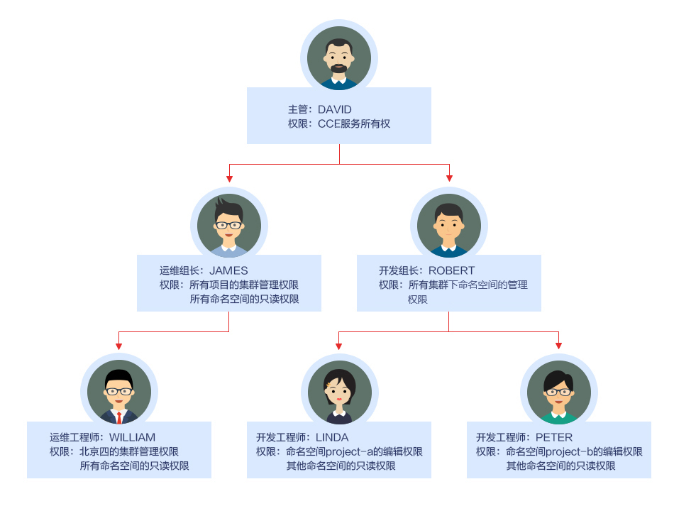
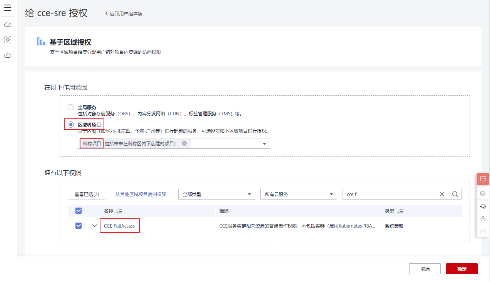
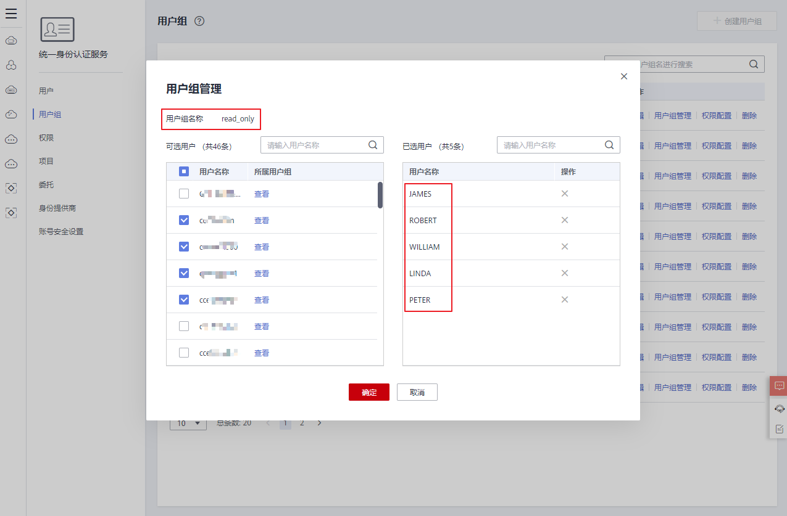
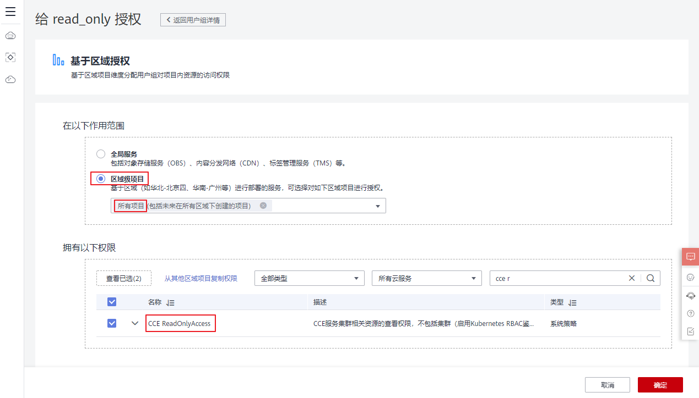
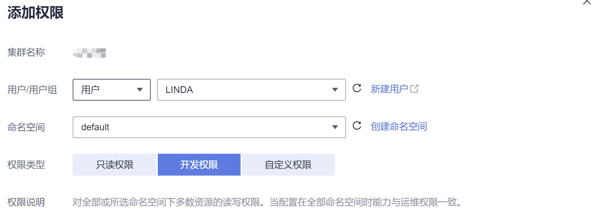

# 示例：某部门权限设计及配置

## 概述

随着容器技术的快速发展，原有的分布式任务调度模式正在被基于Kubernetes的技术架构所取代。云容器引擎（Cloud Container Engine，简称CCE）是华为云推出的高度可扩展的、高性能的企业级Kubernetes集群，支持社区原生应用和工具。借助云容器引擎，您可以在华为云上轻松部署、管理和扩展容器化应用程序，快速高效的将微服务部署在云端。

为方便企业中的管理人员对集群中的资源权限进行管理，CCE后台提供了多种维度的细粒度权限策略和管理方式。CCE的权限管理包括“集群权限”和“命名空间权限”两种能力，分别从集群和命名空间两个层面对用户组或用户进行细粒度授权，具体解释如下：

-   **集群权限：**是基于IAM系统策略的授权，可以让用户组拥有“集群管理”、“节点管理”、“节点池管理”、“模板市场”、“插件管理”权限。
-   **命名空间权限：**是基于Kubernetes RBAC能力的授权，可以让用户或用户组拥有Kubernetes资源的权限，如“工作负载”、“网络管理”、“存储管理”、“命名空间”等的权限。

基于IAM系统策略的“集群权限”与基于Kubernetes RBAC能力的“命名空间权限”，两者是完全独立的，互不影响，但要配合使用。同时，为用户组设置的权限将作用于用户组下的全部用户。当给用户或用户组添加多个权限时，多个权限会同时生效（取并集）。

## 权限设计

下面我们以一个公司为例进行介绍。

通常一个公司中有多个部门或项目，每个部门又有多个成员，所以在配置权限前需要先进行详细设计，并在设置权限之前提前为每个成员创建用户名，便于后续对用户进行用户组归属和权限设置。

下图为某公司某部门的组织架构图和相关人员的权限设计，我们将按照该设计对每个角色的权限设置进行演示：

## 主管：DAVID

用户“DAVID”为该公司某部门的主管，根据权限设计我们需要为其配置CCE服务的所有权限（包括集群权限和命名空间权限），因此需要在统一身份认证服务 IAM中单独为DAVID创建用户组“cce-admin”，并配置所有项目的权限：“CCE Administrator”，这样主管DAVID的权限就配置好了。

> **说明：** 
>**CCE Administrator：**CCE的管理员权限，拥有该服务的所有权限，不需要再赋予其他权限。
>**CCE FullAccess、CCE ReadOnlyAccess：**CCE的集群管理权限，仅针对与集群相关的资源（如集群、节点）有效，您必须确保同时配置了“命名空间权限”，才能有操作Kubernetes资源（如工作负载、Service等）的权限。

**图 1**  为主管DAVID所在的用户组授权  

## 运维组长：JAMES

用户“JAMES”为该部门的运维组长，需要设置所有项目的集群权限和所有命名空间的只读权限。

我们需要在统一身份认证服务 IAM中先为用户“JAMES”单独创建用户组“cce-sre”并将其添加到用户组“cce-sre”中，然后为用户组“cce-sre”配置所有项目的集群权限：“CCE FullAccess”，用户组“cce-sre”便拥有了所有项目的集群管理权限，接下来还需要为其设置命名空间的只读权限。

**图 2**  为运维组长JAMES所在的用户组授权  

**为所有组长和工程师添加所有集群和命名空间的只读权限**

我们可以在统一身份认证服务 IAM中再创建一个只读用户组“read\_only”，然后将相关用户都添加到此用户组中。

-   两个开发工程师虽然他们不需要配置集群的管理权限，但也需要查看CCE控制台，因此需要有集群的只读权限才能满足需求。
-   运维工程师需要北京四集群的管理权限，为方便管理，这里我们先为其赋予集群的只读权限。
-   运维组长已经拥有了所有集群的管理权限，为方便管理，我们也可以将其添加到“read\_only”用户组中，为其赋予集群的只读权限。

如下图，我们将JAMES、ROBERT、WILLIAM、LINDA、PETER五个用户都添加到用户组“read\_only”中：

**图 3**  将相关用户添加到“read\_only”用户组中  

接下来为用户组“read\_only”赋予集群的只读权限。

**图 4**  为用户组赋予集群的只读权限  

然后返回CCE控制台，为这五个用户所在的用户组“read\_only”增加命名空间的只读权限，单击左侧栏目树中的“权限管理 \> 命名空间权限”，为用户组“read\_only”逐个赋予所有集群的“view”权限。

**图 5**  为用户组赋予命名空间的只读权限  

设置完成后，运维组长“JAMES”就拥有了所有项目的集群管理权限和所有命名空间的只读权限，而开发组长“ROBERT”、运维工程师“WILLIAM”以及两位开发工程师“LINDA”和“PRTER”则拥有了所有集群和命名空间的只读权限。

## 开发组长：ROBERT

用户“ROBERT”作为开发组的组长，虽然在上一步中已经为其设置了所有集群和命名空间的只读权限，但显然还不够，还需要为其设置所有命名空间的管理权限。

因此需要再在CCE控制台的“权限管理 \> 命名空间权限”中单独为其赋予所有集群下全部命名空间的管理员权限，如下图：

**图 6**  为用户ROBERT赋予命名空间的管理权限  

## 运维工程师：WILLIAM

运维工程师“WILLIAM”虽然也有了所有集群和命名空间的只读权限，但还需要在统一身份认证服务 IAM中为其设置北京四的集群管理权限，因此我们单独为其创建一个用户组“cce-sre-b4”，然后配置北京四项目的“CCE FullAccess”。

**图 7**  为用户WILLIAM所在的用户组配置北京四项目的集群管理权限  

由于之前已经为其设置过所有命名空间的只读权限，所以运维工程师“WILLIAM”现在就拥有了北京四的集群管理权限和所有命名空间的只读权限。

## 开发工程师：LINDA、PETER

“LINDA”和“PETER”是开发工程师，由于前面已经在用户组“read-only”中为两位工程师配置了集群和命名空间的只读权限，这里只需要在CCE控制台的“权限管理 \> 命名空间权限”中再另外配置相应命名空间的编辑权限即可。

**图 8**  为开发工程师分别配置命名空间的编辑权限  

至此，该部门的所有权限就设置完成了。

## 相关问题

1.  **能否只配置命名空间权限，不配置集群管理权限？**

    答：由于界面权限是由IAM系统策略进行判断，所以，如果未配置集群管理权限，就没有打开界面的权限。

2.  **如果不配置集群管理权限的情况下，是否可以使用API呢？**

    答：答案也是否定的，因为API都需要进行IAM的token认证。

3.  **如果不配置集群管理权限，是否可以使用kubectl命令呢？**

    答：答案是肯定的。但前提是要先从界面上下载kubectl配置文件。所以，如果先配置了集群权限，然后再界面下载认证文件。后面再删除集群管理权限（保留命名空间权限），依然可以使用kubectl来操作Kubernetes集群。

