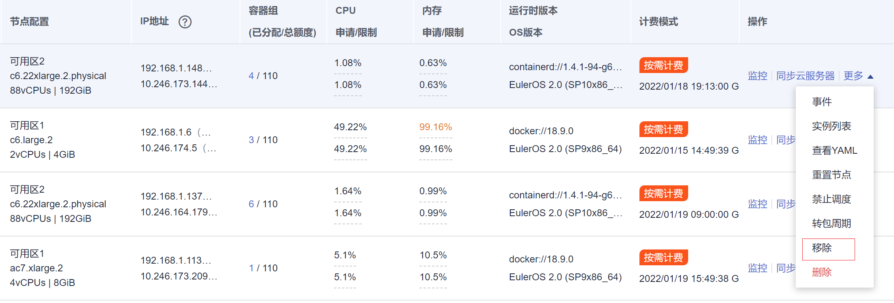

# 移除节点<a name="cce_10_0338"></a>

## 操作场景<a name="section1730974915433"></a>

在集群中移除节点会将该节点移出集群，然后重装节点的操作系统，并清理节点上的CCE组件。

移除不会删除节点对应的服务器。移除前请确认您的正常业务运行不受影响，请谨慎操作。

节点移出集群后会继续开机运行，并继续产生费用。

## 约束限制<a name="section3145212449"></a>

-   当且仅当CCE集群状态为运行中或不可用时允许移除节点。
-   当且仅当CCE节点状态为运行中、不可用或错误时允许被移除。
-   为使CCE节点正常移除，且移除后能正常重装操作系统清理CCE组件，请确保服务器处于正常运行中状态。
-   若节点在CCE集群移除后重装操作系统失败，请手动完成失败节点的操作系统重装，并在重装后登录节点执行清理脚本完成CCE组件清理，具体步骤参见[重装操作系统失败如何处理](#section149069481111)。
-   移除节点会导致与节点关联的[本地持久存储卷](本地持久存储卷和临时存储卷.md)类型的PVC/PV数据丢失，无法恢复，且PVC/PV无法再正常使用。移除节点时使用了本地持久存储卷的Pod会从移除的节点上驱逐，并重新创建Pod，Pod会一直处于pending状态，因为Pod使用的PVC带有节点标签，由于冲突无法调度成功。

## 注意事项<a name="section152591751204415"></a>

-   移除节点会涉及Pod迁移，可能会影响业务，请在业务低峰期操作。
-   操作过程中可能存在非预期风险，请提前做好相关的数据备份。
-   操作过程中，后台会把当前节点设置为不可调度状态。
-   移除节点重装操作系统后将清理原有的LVM分区，通过LVM管理的数据将会清空，请提前做好相关的数据备份。

## 操作步骤<a name="section1313874144519"></a>

1.  登录CCE控制台，单击集群名称进入集群。
2.  在左侧列表中选择节点管理，单击节点后的“更多 \> 移除”。

    **图 1**  移除节点<a name="fig18804131145913"></a>  
    

    您还可以选中多个节点一起移除，如下图所示。

    **图 2**  一次移除多个节点<a name="fig1699119521125"></a>  
    

3.  在弹出的“移除节点”配置重装操作系统需要的登录信息，单击“是”，等待完成节点移除。

    移除节点后，原有节点上的工作负载实例会自动迁移至其他可用节点。


## 重装操作系统失败如何处理<a name="section149069481111"></a>

移除节点重装操作系统可能会失败，如果碰到这种情况，您可以执行如下步骤重装操作系统并清理节点上的CCE组件。

1.  登录服务器的管理控制台，完成操作系统的重装，详细步骤请参见[切换操作系统](https://support.huaweicloud.com/usermanual-ecs/zh-cn_topic_0031523135.html)。
2.  登录服务器，执行如下命令完成CCE组件和LVM数据的清理。

    将如下脚本写入**clean.sh**文件。

    ```
    lsblk
    vgs --noheadings | awk '{print $1}' | xargs vgremove -f
    pvs --noheadings | awk '{print $1}' | xargs pvremove -f
    lvs --noheadings | awk '{print $1}' | xargs -i lvremove -f --select {}
    function init_data_disk() {
        all_devices=$(lsblk -o KNAME,TYPE | grep disk | grep -v nvme | awk '{print $1}' | awk '{ print "/dev/"$1}')
        for device in ${all_devices[@]}; do
            isRootDisk=$(lsblk -o KNAME,MOUNTPOINT $device 2>/dev/null| grep -E '[[:space:]]/$' | wc -l )
            if [[ ${isRootDisk} != 0 ]]; then
                continue
            fi
            dd if=/dev/urandom of=${device} bs=512 count=64
            return
        done
        exit 1
    }
    init_data_disk
    lsblk
    ```

    执行如下命令。

    **bash clean.sh**


