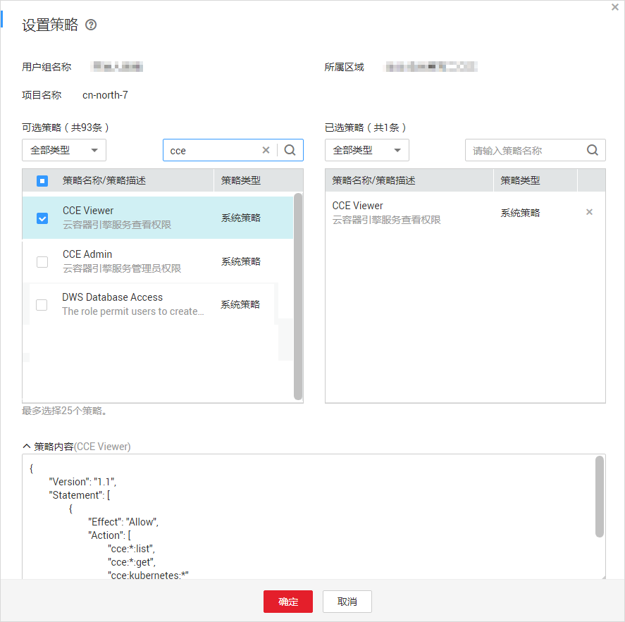
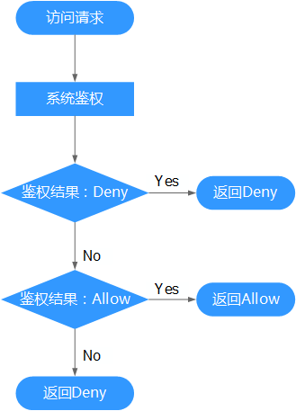

# 策略语法<a name="cce_01_0180"></a>

## 策略结构<a name="section34287870"></a>

策略结构包括：Version（策略版本号）和Statement（策略权限语句），其中Statement可以有多个，表示不同的授权项。

**图 1**  策略结构<a name="fig6755360"></a>  


## 策略语法<a name="section10352173123317"></a>

如下以“CCE Viewer”策略为例，说明策略语法组成。



```
{
        "Version": "1.1",
        "Statement": [
                {
                        "Effect": "Allow",
                        "Action": [
                                "cce:*:get",
                                "cce:*:list",
                                "cce:kubernetes:*",
                                "ecs:*:get",
                                "ecs:*:list",
                                "evs:*:get",
                                "evs:*:list",
                                "evs:*:count",
                                "vpc:*:get",
                                "vpc:*:list",
                                "elb:*:get",
                                "elb:*:list",
                                "sfs:*:get",
                                "sfs:*:list",
                                "aom:*:get",
                                "aom:*:list",
                                "aom:autoScalingRule:*"
                        ]
                }
        ]
}
```

-   Version：标识策略的版本号，主要用于区分Role-Based Access Control（RBAC）策略和细粒度策略。
    -   1.0：RBAC策略。RBAC策略是将服务作为一个整体进行授权，授权后，用户可以拥有这个服务的所有权限。
    -   1.1：细粒度策略。相比RBAC策略，细粒度策略基于服务的API接口进行权限拆分，授权更加精细。授权后，用户可以对这个服务执行特定的操作。细粒度策略包括系统预置和用户自定义两种：

-   Statement：策略授权语句，描述策略的详细信息，包含Effect（作用）和Action（授权项）。
    -   Effect（作用）

        作用包含两种：Allow（允许）和Deny（拒绝），系统预置策略仅包含允许的授权语句，自定义策略中可以同时包含允许和拒绝的授权语句，当策略中既有允许又有拒绝的授权语句时，遵循Deny优先的原则。

    -   Action（授权项）

        对资源的具体操作权限，格式为：服务名:资源类型:操作，支持单个或多个操作权限，支持通配符号\*，通配符号表示所有。

        示例：

        -   "cce:\*:get"，其中cce为服务名，\*为资源类型，get为操作，该授权项表示cce所有的资源类型的查询权限。
        -   "cce:kubernetes:\*"，其中cce为服务名，kubernetes为资源类型，\*为操作，该授权项表示对CCE中的kubernetes的所有权限。


## 检查规则<a name="section6295723"></a>

当用户被授予多个策略，或者一个策略中包含多个授权语句，这些策略中既有Allow又有Deny的授权语句时，遵循Deny优先的原则。在用户访问资源时，权限检查逻辑如下：

**图 2**  系统鉴权逻辑图<a name="fig48552050"></a>  


> **说明：**   
>每条策略做评估时， Action之间是或\(or\)的关系。  

1.  用户访问系统，发起操作请求。
2.  系统评估用户被授予的访问策略，鉴权开始。
3.  在用户被授予的访问策略中，系统将优先寻找显式拒绝指令。如找到一个适用的显式拒绝，系统将返回Deny决定。
4.  如果没有找到显式拒绝指令，系统将寻找适用于请求的任何Allow指令。如果找到一个显式允许指令，系统将返回Allow决定。
5.  如果找不到显式允许，最终决定为Deny，鉴权结束。

