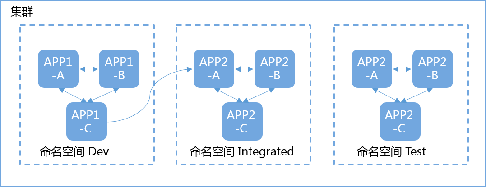
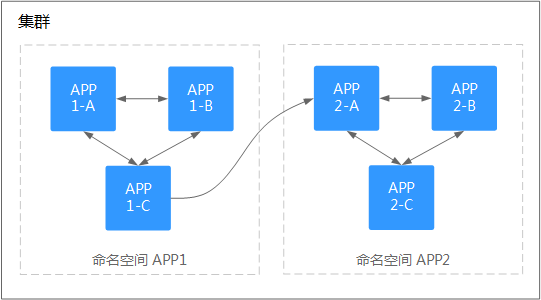

# 管理命名空间

## 使用命名空间

-   创建工作负载时，您可以选择对应的命名空间，实现资源或租户的隔离。
-   查询工作负载时，选择对应的命名空间，查看对应命名空间下的所有工作负载。

## 命名空间使用实践

-   **按照不同环境划分命名空间**

    一般情况下，工作负载发布会经历开发环境、联调环境、测试环境，最后到生产环境的过程。这个过程中不同环境部署的工作负载相同，只是在逻辑上进行了定义。分为两种做法：

    -   分别创建不同集群。

        不同集群之间，资源不能共享。同时，不同环境中的服务互访需要通过负载均衡才能实现。

    -   不同环境创建对应命名空间。

        同个命名空间下，通过服务名称（Service name）可直接访问。跨命名空间的可以通过服务名称、命名空间名称访问。

        例如下图，开发环境/联调环境/测试环境分别创建了命名空间。

        **图 1**  不同环境创建对应命名空间  
        

-   **按照应用划分命名空间**

    对于同个环境中，应用数量较多的情况，建议进一步按照工作负载类型划分命名空间。例如下图中，按照APP1和APP2划分不同命名空间，将不同工作负载在逻辑上当做一个工作负载组进行管理。且同一个命名空间内的工作负载可以通过服务名称访问，不同命名空间下的通过服务名称、命名空间名称访问。

    **图 2**  按照工作负载划分命名空间  
    

## 删除命名空间

删除命名空间会删除该命名空间下所有的资源（如工作负载，短任务、配置项等），请谨慎操作。

1.  登录CCE控制台，在左侧导航栏中选择“ 资源管理 \> 命名空间”。
2.  在“集群”下拉框中，选择命名空间所在的集群。
3.  选中待删除的命名空间，单击“删除“。

    根据系统提示进行删除操作。系统内置的命名空间不支持删除。

