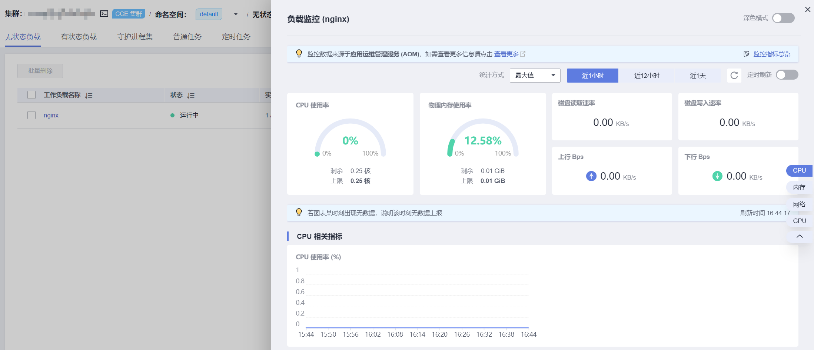
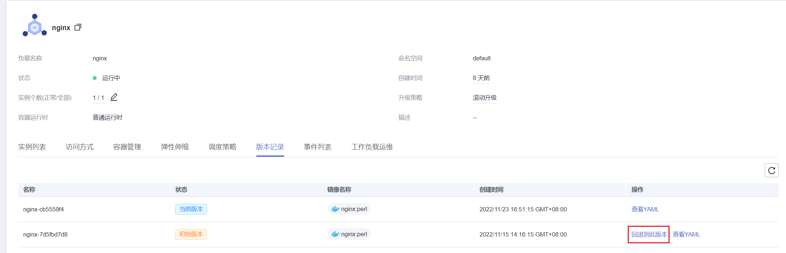

# 管理工作负载和任务

## 操作场景

工作负载创建后，您可以对其执行升级、编辑YAML、日志、监控、回退、删除等操作。

**表 1**  工作负载/任务管理

<table><thead align="left"><tr id="zh-cn_topic_0107283638_row856143916184"><th class="cellrowborder" valign="top" width="24.610000000000003%" id="mcps1.2.3.1.1">
操作

</th>
<th class="cellrowborder" valign="top" width="75.39%" id="mcps1.2.3.1.2">
描述

</th>
</tr>
</thead>
<tbody><tr id="row125441054163414"><td class="cellrowborder" valign="top" width="24.610000000000003%" headers="mcps1.2.3.1.1 ">
<a href="#zh-cn_topic_0107283638_section15303324141816">监控</a>

</td>
<td class="cellrowborder" valign="top" width="75.39%" headers="mcps1.2.3.1.2 ">
可以通过CCE控制台查看工作负载和容器组的CPU和内存占用情况，以确定需要的资源规格。

</td>
</tr>
<tr id="zh-cn_topic_0107283638_row75714395185"><td class="cellrowborder" valign="top" width="24.610000000000003%" headers="mcps1.2.3.1.1 ">
<a href="#zh-cn_topic_0107283638_section51511928173817">日志</a>

</td>
<td class="cellrowborder" valign="top" width="75.39%" headers="mcps1.2.3.1.2 ">
可查看工作负载的日志信息。

</td>
</tr>
<tr id="zh-cn_topic_0107283638_row657239111818"><td class="cellrowborder" valign="top" width="24.610000000000003%" headers="mcps1.2.3.1.1 ">
<a href="#zh-cn_topic_0107283638_section17604174417381">升级</a>

</td>
<td class="cellrowborder" valign="top" width="75.39%" headers="mcps1.2.3.1.2 ">
可以通过更换镜像或镜像版本实现无状态工作负载、有状态工作负载、守护进程集的快速升级，业务无中断。

</td>
</tr>
<tr id="zh-cn_topic_0107283638_row1657153916181"><td class="cellrowborder" valign="top" width="24.610000000000003%" headers="mcps1.2.3.1.1 ">
<a href="#zh-cn_topic_0107283638_section21669213390">编辑YAML</a>

</td>
<td class="cellrowborder" valign="top" width="75.39%" headers="mcps1.2.3.1.2 ">
可通过在线YAML编辑窗对无状态工作负载、有状态工作负载、守护进程集和容器组的YAML文件进行修改和下载。普通任务和定时任务的YAML文件仅支持查看、复制和下载。

</td>
</tr>
<tr id="zh-cn_topic_0107283638_row1571539101815"><td class="cellrowborder" valign="top" width="24.610000000000003%" headers="mcps1.2.3.1.1 ">
<a href="#zh-cn_topic_0107283638_section13324541124815">回退</a>

</td>
<td class="cellrowborder" valign="top" width="75.39%" headers="mcps1.2.3.1.2 ">
无状态工作负载可以进行回退操作，仅无状态工作负载可用。

</td>
</tr>
<tr id="zh-cn_topic_0107283638_row1957163914184"><td class="cellrowborder" valign="top" width="24.610000000000003%" headers="mcps1.2.3.1.1 ">
<a href="#section132451237607">重新部署</a>

</td>
<td class="cellrowborder" valign="top" width="75.39%" headers="mcps1.2.3.1.2 ">
工作负载可以进行重新部署操作，重新部署后将重启负载下的全部容器组Pod。

</td>
</tr>
<tr id="zh-cn_topic_0107283638_row936119475198"><td class="cellrowborder" valign="top" width="24.610000000000003%" headers="mcps1.2.3.1.1 ">
<a href="#zh-cn_topic_0107283638_section12087915401">关闭/开启升级</a>

</td>
<td class="cellrowborder" valign="top" width="75.39%" headers="mcps1.2.3.1.2 ">
无状态工作负载可以进行关闭/开启升级操作，仅无状态工作负载可用。

</td>
</tr>
<tr id="zh-cn_topic_0107283638_row133611447101912"><td class="cellrowborder" valign="top" width="24.610000000000003%" headers="mcps1.2.3.1.1 ">
<a href="#zh-cn_topic_0107283638_section5931193015488">标签管理</a>

</td>
<td class="cellrowborder" valign="top" width="75.39%" headers="mcps1.2.3.1.2 ">
标签是以key/value键值对的形式附加在工作负载上的。添加标签后，可通过标签对工作负载进行管理和选择，主要用于设置亲和性与反亲和性调度。任务或定时任务无法使用标签管理功能。

</td>
</tr>
<tr id="zh-cn_topic_0107283638_row123611847141914"><td class="cellrowborder" valign="top" width="24.610000000000003%" headers="mcps1.2.3.1.1 ">
<a href="#zh-cn_topic_0107283638_section14423721191418">删除</a>

</td>
<td class="cellrowborder" valign="top" width="75.39%" headers="mcps1.2.3.1.2 ">
若工作负载无需再使用，您可以将工作负载或任务删除。工作负载或任务删除后，将无法恢复，请谨慎操作。

</td>
</tr>
<tr id="zh-cn_topic_0107283638_row62541871218"><td class="cellrowborder" valign="top" width="24.610000000000003%" headers="mcps1.2.3.1.1 ">
<a href="#zh-cn_topic_0107283638_section1947616516301">事件</a>

</td>
<td class="cellrowborder" valign="top" width="75.39%" headers="mcps1.2.3.1.2 ">
查看具体实例的事件名称、事件类型、发生次数、Kubernetes事件、首次和最近发生的时间。

</td>
</tr>
<tr id="row5748521152120"><td class="cellrowborder" valign="top" width="24.610000000000003%" headers="mcps1.2.3.1.1 ">
停止/启动

</td>
<td class="cellrowborder" valign="top" width="75.39%" headers="mcps1.2.3.1.2 ">
停止/启动一个定时任务，该功能仅定时任务可用。

</td>
</tr>
</tbody>
</table>

## 监控

您可以通过CCE控制台查看工作负载和容器组的CPU和内存占用情况，以确定需要的资源规格。本文以无状态工作负载为例说明如何使用监控功能。

1.  登录CCE控制台，进入一个已有的集群，在左侧导航栏中选择“工作负载”。
2.  选择“无状态负载”页签，单击已创建工作负载后的“监控“。在监控页面，可查看工作负载的CPU利用率和物理内存使用率。

    **图 1**  查看无状态工作负载监控  
    

3.  单击工作负载名称，可在“实例列表”中单击某个实例的“监控“按钮，查看相应实例的CPU使用率、内存使用率。

## 日志

您可以通过“日志“功能查看无状态工作负载、有状态工作负载、守护进程集、普通任务的日志信息。本文以无状态工作负载为例说明如何查看日志。

1.  登录CCE控制台，进入一个已有的集群，在左侧导航栏中选择“工作负载”。
2.  选择“无状态负载”页签，单击工作负载后的“日志“。

    在弹出的“日志“窗口中可以根据时间查看日志信息。

    **图 2**  查看无状态工作负载日志  
    

    > **说明：** 
    >云容器引擎服务对接了应用运维管理服务AOM提供日志查看、检索功能，默认存储时长为7天。华为云每月赠送租户500M免费日志采集额度，超过免费额度部分将产生费用（[了解计费详情](https://www.huaweicloud.com/notice/2018/20190929175154404.html)）。当前日志使用情况请[点此查看](https://console.huaweicloud.com/aom/#/aom/als/setting)。

## 升级

您可以通过CCE控制台实现无状态工作负载、有状态工作负载、守护进程集的快速升级。

本文以无状态工作负载为例说明如何进行升级。

若需要更换镜像或镜像版本，您需要提前将镜像上传到容器镜像服务，上传方法请参见[通过Docker客户端上传镜像](https://support.huaweicloud.com/usermanual-swr/swr_01_0011.html)。

1.  登录CCE控制台，进入一个已有的集群，在左侧导航栏中选择“工作负载”。
2.  选择“无状态负载”页签，单击待升级工作负载后的“升级“。

    > **说明：** 
    >-   暂不支持批量升级多个工作负载。
    >-   有状态工作负载升级时，若升级类型为替换升级，需要用户手动删除实例后才能升级成功，否则界面会始终显示“升级中“。

3.  请根据业务需求进行工作负载的升级，参数设置方法与创建工作负载时一致。
4.  更新完成后，单击“升级工作负载“，并手动确认YAML文件差异后提交升级。

## 编辑YAML

可通过在线YAML编辑窗对无状态工作负载、有状态工作负载、守护进程集和容器组的YAML文件进行修改和下载。普通任务和定时任务的YAML文件仅支持查看、复制和下载。本文以无状态工作负载为例说明如何在线编辑YAML。

1.  登录CCE控制台，进入一个已有的集群，在左侧导航栏中选择“工作负载”。
2.  选择“无状态负载”页签，单击工作负载后的“更多 \> 编辑YAML“，在弹出的“编辑YAML“窗中可对当前工作负载的YAML文件进行修改。
3.  单击“修改“，在弹出的提示框中单击“确定“，完成修改。
4.  （可选）在“编辑YAML“窗中，单击“下载“，可下载该YAML文件。

## 回退（仅无状态工作负载可用）

所有无状态工作负载的发布历史记录都保留在系统中，您可以回退到指定的版本。

1.  登录CCE控制台，进入一个已有的集群，在左侧导航栏中选择“工作负载”。
2.  选择“无状态负载”页签，单击待回退工作负载后的“更多 \> 回退“。
3.  选择回退版本，单击“回退到此版本“，并手动确认YAML文件差异后单击“确定“。

    

## 重新部署

重新部署将重启负载下的全部容器组Pod。本文以无状态工作负载为例说明如何重新部署工作负载。

1.  登录CCE控制台，进入一个已有的集群，在左侧导航栏中选择“工作负载”。
2.  选择“无状态负载”页签，单击工作负载后的“更多 \> 重新部署“。
3.  在弹出的提示框中单击“是“，即可完成工作负载的重新部署。

## 关闭/开启升级（仅无状态工作负载可用）

无状态工作负载可以进行“关闭/开启升级”操作。

-   关闭升级后，对负载进行的升级操作可以正常下发，但不会被应用到实例。

    如果您正在滚动升级的过程中，滚动升级会在关闭升级命令下发后停止，出现新旧实例共存的状态。

-   开启升级后，负载可以正常升级和回退，负载下的实例会与负载当前的最新信息进行一次同步，如果有不一致的，则会自动按照负载的最新信息进行升级。

> **须知：** 
>工作负载状态在关闭升级时无法执行回退操作。

1.  登录CCE控制台，进入一个已有的集群，在左侧导航栏中选择“工作负载”。
2.  选择“无状态负载”页签，单击工作负载后方操作栏中的“更多 \> 关闭/开启升级”。
3.  在弹出的信息提示框中，单击“是”。

## 标签管理

标签是以key/value键值对的形式附加在工作负载上的。添加标签后，可通过标签对工作负载进行管理和选择，主要用于设置亲和性与反亲和性调度。您可以给多个工作负载打标签，也可以给指定的某个工作负载打标签。

您可以根据业务需求对无状态工作负载、有状态工作负载和守护进程集的标签进行管理，本文以无状态工作负载为例说明如何使用标签管理功能。

如下图，假设为工作负载（例如名称为APP1、APP2、APP3）定义了3个标签：release、env、role。不同工作负载定义了不同的取值，分别为：

-   APP 1：\[release:alpha;env:development;role:frontend\]
-   APP 2：\[release:beta;env:testing;role:frontend\]
-   APP 3：\[release:alpha;env:production;role:backend\]

在使用调度或其他功能时，选择“key/value“值分别为“role/frontend“的工作负载，则会选择到“APP1和APP2“。

**图 3**  标签案例  

1.  登录CCE控制台，进入一个已有的集群，在左侧导航栏中选择“工作负载”。
2.  选择“无状态负载”页签，单击工作负载后方操作栏中的“更多 \> 标签管理”。
3.  单击“添加”，输入键和值后单击“确定“。

    **图 4**  标签管理  
    

    > **说明：** 
    >标签格式要求如下：以字母和数字开头或结尾，由字母、数字、连接符（-）、下划线（\_）、点号（.）组成且63字符以内。

## 删除工作负载/任务

若工作负载无需再使用，您可以将工作负载或任务删除。工作负载或任务删除后，将无法恢复，请谨慎操作。本文以无状态工作负载为例说明如何使用删除功能。

1.  登录CCE控制台，进入一个已有的集群，在左侧导航栏中选择“工作负载”。
2.  单击待删除工作负载后的“更多 \> 删除“，删除工作负载。

    请仔细阅读系统提示，删除操作无法恢复，请谨慎操作。

3.  单击“是“。

    > **说明：** 
    >-   若Pod所在节点不可用或者关机，负载无法删除时可以在详情页面实例列表选择强制删除。
    >-   请确保要删除的存储没有被其他负载使用，导入和存在快照的存储只做解关联操作。

## 事件

本文以无状态工作负载为例说明如何使用事件功能。任务或定时任务中的事件功能可直接单击工作负载操作栏中的“事件“按钮查看。

1.  登录CCE控制台，进入一个已有的集群，在左侧导航栏中选择“工作负载”。
2.  选择“无状态负载”页签，单击工作负载名称，可在“实例列表”中单击某个实例的“事件“按钮，查看该工作负载或具体实例的事件名称、事件类型、发生次数、Kubernetes事件、首次和最近发生的时间。

    > **说明：** 
    >事件保存时间为1小时，1小时后自动清除数据。

