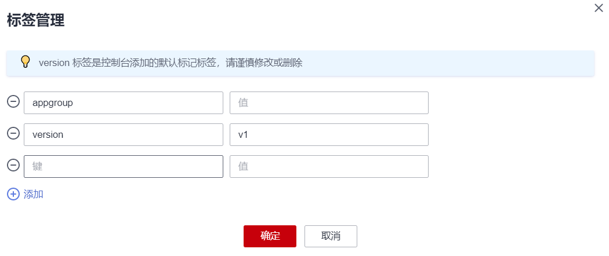

# 管理工作负载和任务

-   [操作场景](#section430113764416)
-   [日志](#section51511928173817)
-   [升级](#section17604174417381)
-   [编辑YAML](#section21669213390)
-   [伸缩](#section11703514131711)
-   [监控](#section15303324141816)
-   [回退（仅无状态工作负载可用）](#section13324541124815)
-   [暂停（仅无状态工作负载可用）](#section10207209154017)
-   [恢复（仅无状态工作负载可用）](#section12087915401)
-   [标签管理](#section5931193015488)
-   [删除工作负载/任务](#section14423721191418)
-   [事件](#section1947616516301)

## 操作场景

工作负载创建后，您可以对其执行伸缩、升级、编辑YAML、日志、监控、回退、删除等操作。

1.  

    **表 1**  工作负载/任务管理

    
    <table><thead align="left"><tr id="row856143916184"><th class="cellrowborder" valign="top" width="24.610000000000003%" id="mcps1.2.3.1.1">
操作

    </th>
    <th class="cellrowborder" valign="top" width="75.39%" id="mcps1.2.3.1.2">
描述

    </th>
    </tr>
    </thead>
    <tbody><tr id="row75714395185"><td class="cellrowborder" valign="top" width="24.610000000000003%" headers="mcps1.2.3.1.1 ">
<a href="#section51511928173817">日志</a>

    </td>
    <td class="cellrowborder" valign="top" width="75.39%" headers="mcps1.2.3.1.2 ">
可查看无状态工作负载、有状态工作负载、守护进程集、普通任务的日志信息

    </td>
    </tr>
    <tr id="row657239111818"><td class="cellrowborder" valign="top" width="24.610000000000003%" headers="mcps1.2.3.1.1 ">
<a href="#section17604174417381">升级</a>

    </td>
    <td class="cellrowborder" valign="top" width="75.39%" headers="mcps1.2.3.1.2 ">
可以通过更换镜像或镜像版本实现无状态工作负载、有状态工作负载、守护进程集的快速升级，业务无中断。

    </td>
    </tr>
    <tr id="row1657153916181"><td class="cellrowborder" valign="top" width="24.610000000000003%" headers="mcps1.2.3.1.1 ">
<a href="#section21669213390">编辑YAML</a>

    </td>
    <td class="cellrowborder" valign="top" width="75.39%" headers="mcps1.2.3.1.2 ">
可通过在线YAML编辑窗对无状态工作负载、有状态工作负载、守护进程集和容器组的YAML文件进行修改和下载。普通任务和定时任务的YAML文件仅支持查看、复制和下载。

    </td>
    </tr>
    <tr id="row105733961815"><td class="cellrowborder" valign="top" width="24.610000000000003%" headers="mcps1.2.3.1.1 ">
<a href="#section11703514131711">伸缩</a>

    </td>
    <td class="cellrowborder" valign="top" width="75.39%" headers="mcps1.2.3.1.2 ">
可以根据业务需求自行定义无状态工作负载、有状态工作负载和守护进程集的伸缩策略，降低因应对业务变化和高峰压力而人为反复调整资源的工作量，帮助您节约资源和人力成本。

    </td>
    </tr>
    <tr id="row75733951812"><td class="cellrowborder" valign="top" width="24.610000000000003%" headers="mcps1.2.3.1.1 ">
<a href="#section15303324141816">监控</a>

    </td>
    <td class="cellrowborder" valign="top" width="75.39%" headers="mcps1.2.3.1.2 ">
可以通过CCE控制台查看无状态工作负载、守护进程集和容器组的CPU和内存占用情况，以确定需要的资源规格。

    </td>
    </tr>
    <tr id="row1571539101815"><td class="cellrowborder" valign="top" width="24.610000000000003%" headers="mcps1.2.3.1.1 ">
<a href="#section13324541124815">回退</a>

    </td>
    <td class="cellrowborder" valign="top" width="75.39%" headers="mcps1.2.3.1.2 ">
无状态工作负载可以进行回退操作，仅无状态工作负载可用。

    </td>
    </tr>
    <tr id="row1957163914184"><td class="cellrowborder" valign="top" width="24.610000000000003%" headers="mcps1.2.3.1.1 ">
<a href="#section10207209154017">暂停</a>

    </td>
    <td class="cellrowborder" valign="top" width="75.39%" headers="mcps1.2.3.1.2 ">
无状态工作负载可以进行暂停操作，仅无状态工作负载可用。

    </td>
    </tr>
    <tr id="row936119475198"><td class="cellrowborder" valign="top" width="24.610000000000003%" headers="mcps1.2.3.1.1 ">
<a href="#section12087915401">恢复</a>

    </td>
    <td class="cellrowborder" valign="top" width="75.39%" headers="mcps1.2.3.1.2 ">
无状态工作负载可以进行恢复操作，仅无状态工作负载可用。

    </td>
    </tr>
    <tr id="row133611447101912"><td class="cellrowborder" valign="top" width="24.610000000000003%" headers="mcps1.2.3.1.1 ">
<a href="#section5931193015488">标签管理</a>

    </td>
    <td class="cellrowborder" valign="top" width="75.39%" headers="mcps1.2.3.1.2 ">
标签是以key/value键值对的形式附加在工作负载上的。添加标签后，可通过标签对工作负载进行管理和选择，主要用于设置亲和性与反亲和性调度。

    </td>
    </tr>
    <tr id="row123611847141914"><td class="cellrowborder" valign="top" width="24.610000000000003%" headers="mcps1.2.3.1.1 ">
<a href="#section14423721191418">删除</a>

    </td>
    <td class="cellrowborder" valign="top" width="75.39%" headers="mcps1.2.3.1.2 ">
若工作负载无需再使用，您可以将工作负载或任务删除。工作负载或任务删除后，将无法恢复，请谨慎操作。

    </td>
    </tr>
    <tr id="row13361747201913"><td class="cellrowborder" valign="top" width="24.610000000000003%" headers="mcps1.2.3.1.1 ">
<a href="cce_01_0249.md">访问方式</a>

    </td>
    <td class="cellrowborder" valign="top" width="75.39%" headers="mcps1.2.3.1.2 ">
您可根据业务需要选择工作负载的访问方式：<a href="集群内访问(ClusterIP).md">集群内访问(ClusterIP)</a>、<a href="节点访问(NodePort).md">节点访问(NodePort)</a>、<a href="cce_01_0114.md">负载均衡(LoadBalancer)</a>、<a href="DNAT网关(DNAT).md">DNAT网关(DNAT)</a>。

    </td>
    </tr>
    <tr id="row9361124791911"><td class="cellrowborder" valign="top" width="24.610000000000003%" headers="mcps1.2.3.1.1 ">
<a href="调度策略概述.md">调度策略</a>

    </td>
    <td class="cellrowborder" valign="top" width="75.39%" headers="mcps1.2.3.1.2 ">
CCE支持“自定义调度策略”和“简易调度策略”。自定义调度策略开放节点亲和、工作负载亲和以及工作负载反亲和调度策略的配置，以满足用户的更高需求。简易调度策略提供简单便捷以及足够功能的调度方式。

    </td>
    </tr>
    <tr id="row425414782110"><td class="cellrowborder" valign="top" width="24.610000000000003%" headers="mcps1.2.3.1.1 ">
<a href="对接Prometheus实现自定义指标监控.md">工作负载运维</a>

    </td>
    <td class="cellrowborder" valign="top" width="75.39%" headers="mcps1.2.3.1.2 ">
可通过<a href="对接Prometheus实现自定义指标监控.md">自定义指标监控</a>自定义上报信息的监控系统，可通过<a href="性能管理配置（性能瓶颈分析）.md">性能管理配置</a>快速进行工作负载问题定位与性能瓶颈分析，改善用户体验。

    </td>
    </tr>
    <tr id="row62541871218"><td class="cellrowborder" valign="top" width="24.610000000000003%" headers="mcps1.2.3.1.1 ">
<a href="#section1947616516301">事件</a>

    </td>
    <td class="cellrowborder" valign="top" width="75.39%" headers="mcps1.2.3.1.2 ">
查看该工作负载或具体实例的事件名称、事件类型、发生次数、Kubernetes事件、首次和最近发生的时间。

    </td>
    </tr>
    </tbody>
    </table>

## 日志

您可以通过“日志“功能查看无状态工作负载、有状态工作负载、守护进程集、普通任务的日志信息。本文以无状态工作负载为例说明如何查看日志。

1.  登录[CCE控制台](https://console.huaweicloud.com/cce2.0/?utm_source=helpcenter)，在左侧导航栏中选择“工作负载 \> 无状态负载 Deployment”。
2.  单击工作负载后的“日志“。

    在弹出的“日志“窗口中可以查看最近5分钟、最近30分钟、最近1小时内的日志信息。

    **图 1**  查看无状态工作负载日志  
    

    > **说明：** 
    >云容器引擎服务对接了应用运维管理服务AOM提供日志查看、检索功能。华为云于2019年10月10日对应用运维管理服务进行价格调整，每月赠送租户500M免费日志采集额度，超过免费额度部分将产生费用（[了解计费详情](https://www.huaweicloud.com/notice/2018/20190929175154404.html)）。当前日志使用情况请[点此查看](https://console.huaweicloud.com/aom/#/aom/als/setting)。

## 升级

基于CCE，您可以通过更换镜像或镜像版本实现无状态工作负载、有状态工作负载、守护进程集的快速升级，业务无中断。本文以无状态工作负载为例说明如何进行升级。

若需要更换镜像或镜像版本，您需要提前将镜像上传到容器镜像服务，上传方法请参见[通过Docker客户端上传镜像](https://support.huaweicloud.com/usermanual-swr/swr_01_0011.html)。

1.  登录[CCE控制台](https://console.huaweicloud.com/cce2.0/?utm_source=helpcenter)，在左侧导航栏中选择“工作负载 \> 无状态负载 Deployment”，单击待升级工作负载后的“升级“。

    > **说明：** 
    >有状态工作负载升级时，若升级类型为替换升级，需要用户手动删除实例后才能升级成功，否则界面会始终显示“升级中“。

2.  请根据业务需求进行工作负载的升级。
    -   **镜像名称：**单击“更换镜像”，选择新的镜像。

        **图 2**  更换镜像  
        

    -   **镜像版本：**在镜像版本后的下拉框中选择对应版本。

        **图 3**  更换镜像版本  
        

    -   **容器名称：**单击容器名称后的，修改容器名称。
    -   **特权容器：**开启后，容器将可以访问主机上的所有设备。
    -   **容器规格：**可分别设置CPU配额、内存配额、GPU配额和昇腾 310配额。
    -   **高级设置：**
        -   **生命周期：**用于设置容器启动和运行时需要执行的命令。
            -   启动命令：设置容器启动时执行的命令，具体请参见[设置容器启动命令](设置容器启动命令.md)。
            -   启动后处理：设置容器成功运行后执行的命令，详细配置方法请参见[设置容器生命周期](设置容器生命周期.md)。
            -   停止前处理：设置容器结束前执行的命令，通常用于删除日志/临时文件等，详细配置方法请参见[设置容器生命周期](设置容器生命周期.md)。

        -   **健康检查：**CCE提供了存活与业务两种探针，用于判断容器和用户业务是否正常运行。详细配置方法请参见[设置容器健康检查](设置容器健康检查.md)。
            -   工作负载存活探针：检查容器是否正常，不正常则重启实例。
            -   工作负载业务探针：检查用户业务是否就绪，不就绪则不转发流量到当前实例。

        -   **环境变量：**在容器中添加环境变量，一般用于通过环境变量设置参数。

            在“环境变量“页签，单击“添加环境变量“，当前支持三种类型：

            -   手动添加：输入变量名称、变量/变量引用。
            -   密钥导入：输入变量名称，选择导入的密钥名称和数据。您需要提前创建密钥，具体请参见[创建密钥](创建密钥.md)。
            -   配置项导入：输入变量名称，选择导入的配置项名称和数据。您需要提前创建配置项，具体请参见[创建配置项](创建配置项.md)。

                > **说明：** 
                >对于已设置的环境变量，单击环境变量后的“编辑”，可对该环境变量进行编辑。单击环境变量后的“删除”，可删除该环境变量。

        -   **数据存储：**给容器挂载数据存储，支持本地磁盘和云存储，适用于需持久化存储、高磁盘IO等场景。具体请参见[本地磁盘存储](本地磁盘存储.md)、[文件存储卷](文件存储卷.md)、[对象存储卷](对象存储卷.md)、[极速文件存储卷](极速文件存储卷.md)。

            > **说明：** 
            >有状态工作负载只能在创建时添加数据存储，创建完成后无法再添加。

        -   **安全设置：**对容器权限进行设置，保护系统和其他容器不受其影响。

            请输入用户ID，容器将以当前用户权限运行。

        -   **容器日志：**设置容器日志采集策略、配置日志目录。用于收集容器日志便于统一管理和分析。详细配置请参见[采集容器标准输出日志](采集容器标准输出日志.md)、[采集容器内路径日志](采集容器内路径日志.md)。

3.  更新完成后，单击“提交“。

## 编辑YAML

可通过在线YAML编辑窗对无状态工作负载、有状态工作负载、守护进程集和容器组的YAML文件进行修改和下载。普通任务和定时任务的YAML文件仅支持查看、复制和下载。本文以无状态工作负载为例说明如何在线编辑YAML。

1.  登录[CCE控制台](https://console.huaweicloud.com/cce2.0/?utm_source=helpcenter)，在左侧导航栏中选择“工作负载 \> 无状态负载 Deployment”。
2.  单击工作负载后的“更多 \> 编辑YAML“，在弹出的“编辑YAML“窗中可对当前工作负载的YAML文件进行修改。
3.  单击“修改“，在弹出的提示框中单击“确定“，完成修改。
4.  （可选）在“编辑YAML“窗中，单击“下载“，可下载该YAML文件。

## 伸缩

您可以根据业务需求自行定义无状态工作负载、有状态工作负载和守护进程集的伸缩策略，降低因应对业务变化和高峰压力而人为反复调整资源的工作量，帮助您节约资源和人力成本。本文以无状态工作负载为例说明如何使用伸缩功能。

1.  登录[CCE控制台](https://console.huaweicloud.com/cce2.0/?utm_source=helpcenter)，在左侧导航栏中选择“工作负载 \> 无状态负载 Deployment”。
2.  单击待设置伸缩策略工作负载后的“更多 \> 伸缩“，进入工作负载详情页面。
3.  在“伸缩“页签，可设置“弹性伸缩“和“手动伸缩“策略，或“编辑伸缩规则“。

    详细设置方法请参见[工作负载弹性伸缩](工作负载弹性伸缩.md)。

## 监控

您可以通过CCE控制台查看无状态工作负载、守护进程集和容器组的CPU和内存占用情况，以确定需要的资源规格。本文以无状态工作负载为例说明如何使用监控功能。

1.  登录[CCE控制台](https://console.huaweicloud.com/cce2.0/?utm_source=helpcenter)，在左侧导航栏中选择“工作负载 \> 无状态负载 Deployment”。
2.  单击已创建工作负载的名称，进入工作负载详情页面。在监控页签，可查看工作负载的CPU利用率和物理内存使用率。
3.  单击“实例列表”，单击某个实例名称前的，单击“监控“。
4.  查看相应实例的CPU使用率、内存使用率。
    -   CPU使用率。

        横坐标表示时间，纵坐标表示CPU使用率。绿色线条表示CPU使用率，红色线条表示CPU使用限额。

        > **说明：** 
        >CPU使用量需要计算，故初次显示时，CPU使用量会比内存使用量晚一分钟左右显示。
        >只有实例处于运行状态时，才能查看CPU使用量。

    -   物理内存使用率。

        横坐标表示时间，纵坐标表示内存使用量。绿色线条表示内存使用率，红色线条表示内存使用限额。

        > **说明：** 
        >实例处于非运行状态时，无法查看内存使用量。

## 回退（仅无状态工作负载可用）

所有无状态工作负载的发布历史记录都保留在系统中，您可以回退到指定的版本。

1.  登录[CCE控制台](https://console.huaweicloud.com/cce2.0/?utm_source=helpcenter)，在左侧导航栏中选择“工作负载 \> 无状态负载 Deployment”。
2.  单击待回退工作负载后的“更多 \> 回退“。
3.  在“回退到该版本“后，选择回退版本，单击“确定“。

## 暂停（仅无状态工作负载可用）

无状态工作负载可以进行暂停操作。暂停后，对负载进行的升级操作可以正常下发，但不会被应用到实例。

如果您正在滚动升级的过程中，滚动升级会在暂停命令下发后停止，出现新旧实例共存的状态。

1.  登录[CCE控制台](https://console.huaweicloud.com/cce2.0/?utm_source=helpcenter)，在左侧导航栏中选择“工作负载 \> 无状态负载 Deployment”。
2.  单击待暂停的工作负载后方操作栏中的“更多 \> 暂停”。
3.  在弹出的负载暂停信息提示框中，单击“确认”。
4.  单击“确定”，可完成暂停操作。

    > **须知：** 
    >工作负载状态为暂停中时无法执行回退操作。

## 恢复（仅无状态工作负载可用）

暂停中的负载可以进行恢复操作。恢复后，负载可以正常升级和回退，负载下的实例会与负载当前的最新信息进行一次同步，如果有不一致的，则会自动按照负载的最新信息进行升级。

1.  登录[CCE控制台](https://console.huaweicloud.com/cce2.0/?utm_source=helpcenter)，在左侧导航栏中选择“工作负载 \> 无状态负载 Deployment”。
2.  单击待恢复的工作负载后方操作栏中的“更多 \> 恢复”。
3.  在弹出的负载恢复信息提示框中，单击“确认”。

## 标签管理

标签是以key/value键值对的形式附加在工作负载上的。添加标签后，可通过标签对工作负载进行管理和选择，主要用于设置亲和性与反亲和性调度。您可以给多个工作负载打标签，也可以给指定的某个工作负载打标签。

您可以根据业务需求对无状态工作负载、有状态工作负载和守护进程集的标签进行管理，本文以无状态工作负载为例说明如何使用标签管理功能。

如下图，假设为工作负载（例如名称为APP1、APP2、APP3）定义了3个标签：release、env、role。不同工作负载定义了不同的取值，分别为：

-   APP 1：\[release:alpha;env:development;role:frontend\]
-   APP 2：\[release:beta;env:testing;role:frontend\]
-   APP 3：\[release:alpha;env:production;role:backend\]

在使用调度或其他功能时，选择“key/value“值分别为“role/frontend“的工作负载，则会选择到“APP1和APP2“。

**图 4**  标签案例  

1.  登录[CCE控制台](https://console.huaweicloud.com/cce2.0/?utm_source=helpcenter)，在左侧导航栏中选择“工作负载 \> 无状态负载 Deployment”。
2.  单击待添加标签的工作负载，进入工作负载详情页面。
3.  单击“标签管理“，单击“添加标签“，输入键和值，单击“确定“。

    **图 5**  标签管理  
    

    > **说明：** 
    >标签格式要求如下：以字母和数字开头或结尾，由字母、数字、连接符（-）、下划线（\_）、点号（.）组成且63字符以内。

## 删除工作负载/任务

若工作负载无需再使用，您可以将工作负载或任务删除。工作负载或任务删除后，将无法恢复，请谨慎操作。本文以无状态工作负载为例说明如何使用删除功能。

1.  登录[CCE控制台](https://console.huaweicloud.com/cce2.0/?utm_source=helpcenter)，在左侧导航栏中选择“工作负载 \> 无状态负载 Deployment”。
2.  单击待删除工作负载后的“更多 \> 删除“，删除工作负载。

    请仔细阅读系统提示，删除操作无法恢复，请谨慎操作。

3.  单击“是“。

    > **说明：** 
    >-   若Pod所在节点不可用或者关机，负载无法删除时可以在详情页面实例列表选择强制删除。
    >-   请确保要删除的存储没有被其他负载使用，导入和存在快照的存储只做解关联操作。

## 事件

在工作负载详情页面中，单击“事件“页签或“实例列表“页签，可查看该工作负载或具体实例的事件名称、事件类型、发生次数、Kubernetes事件、首次和最近发生的时间。

> **说明：** 
>事件保存时间为1小时，1小时后自动清除数据。

