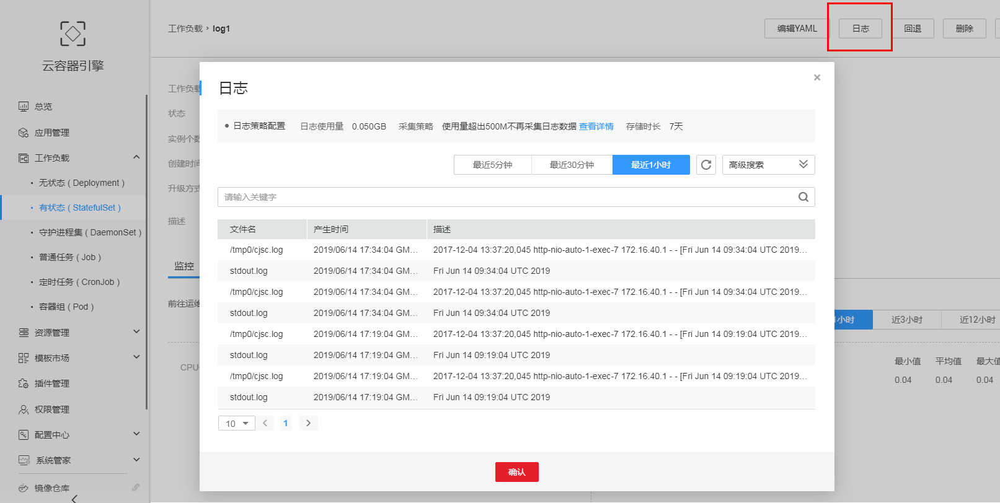

# 管理有状态工作负载

有状态工作负载创建后，您可以对其执行升级、日志、伸缩、编辑YAML、监控、删除等操作。

## 工作负载日志

您可以通过“日志“功能查看无状态工作负载的日志信息。

1.  登录[CCE控制台](https://console.huaweicloud.com/cce2.0/?utm_source=helpcenter)，在左侧导航栏中选择“工作负载 \> 有状态（StatefulSet）”。
2.  单击工作负载后的“日志“。

    在弹出的“日志“窗口中可以查看最近5分钟、最近30分钟、最近1小时内的日志信息。

    **图 1**  查看有状态工作负载日志  
    

    > **说明：**   
    >云容器引擎服务对接了应用运维管理服务AOM提供日志查看、检索功能。华为云于2019年10月10日对应用运维管理服务进行价格调整，每月赠送租户500M免费日志采集额度，超过免费额度部分将产生费用（[了解计费详情](https://www.huaweicloud.com/notice/2018/20190929175154404.html)）。当前日志使用情况请[点此查看](https://console.huaweicloud.com/aom/#/aom/als/setting)。  

## 工作负载升级

基于CCE，您可以通过更换镜像或镜像版本实现工作负载的快速升级，业务无中断。

若需要更换镜像或镜像版本，您需要提前将镜像上传到容器镜像服务，上传方法请参见[通过Docker客户端上线镜像](https://support.huaweicloud.com/usermanual-swr/swr_01_0011.html)。

> **说明：**   
>有状态工作负载升级时，若升级类型为替换升级，需要用户手动删除实例后才能升级成功，否则界面会始终显示“升级中“。  

1.  登录[CCE控制台](https://console.huaweicloud.com/cce2.0/?utm_source=helpcenter)，在左侧导航栏中选择“工作负载 \> 有状态（StatefulSet）”，单击待升级工作负载后的“升级“。
2.  请根据业务需求进行工作负载的升级。
    -   **镜像名称：**单击“更换镜像”，选择新的镜像。

        **图 2**  更换镜像  
        

    -   **镜像版本：**在镜像版本后的下拉框中选择对应版本。

        **图 3**  更换镜像版本  
        

    -   **容器名称：**单击容器名称后的，修改容器名称。
    -   **特权容器：**开启后，容器将可以访问主机上的所有设备。
    -   **容器规格：**可分别设置CPU配额、内存配额、GPU配额和D芯片配额。
    -   **高级设置：**
        -   **生命周期：**用于设置容器启动和运行时需要执行的命令。
            -   启动命令：设置容器启动时执行的命令，详情请参见[设置容器启动命令](设置容器启动命令.md)。
            -   启动后处理：设置容器成功运行后执行的命令，详细配置方法请参见[设置容器生命周期](设置容器生命周期.md)。
            -   停止前处理：设置容器结束前执行的命令，通常用于删除日志/临时文件等，详细配置方法请参见[设置容器生命周期](设置容器生命周期.md)。

        -   **健康检查：**CCE提供了存活与业务两种探针，用于判断容器和用户业务是否正常运行。详细配置方法请参见[设置容器健康检查](设置容器健康检查.md)。
            -   工作负载存活探针：检查容器是否正常，不正常则重启实例。
            -   工作负载业务探针：检查用户业务是否就绪，不就绪则不转发流量到当前实例。

        -   **环境变量：**在容器中添加环境变量，一般用于通过环境变量设置参数。

            在“环境变量“页签，单击“添加环境变量“，当前支持三种类型：

            -   手动添加：输入变量名称、变量/变量引用。
            -   密钥导入：输入变量名称，选择导入的密钥名称和数据。您需要提前创建密钥，详情请参见[创建密钥](创建密钥.md)。
            -   配置项导入：输入变量名称，选择导入的配置项名称和数据。您需要提前创建配置项，详情请参见[创建配置项](创建配置项.md)。

                > **说明：**   
                >对于已设置的环境变量，单击环境变量后的“编辑”，可对该环境变量进行编辑。单击环境变量后的“删除”，可删除该环境变量。  

        -   **数据存储：**给容器挂载数据存储，支持本地磁盘和云存储，适用于需持久化存储、高磁盘IO等场景。详情请参见[使用本地磁盘存储](使用本地磁盘存储.md)、[使用文件存储卷](使用文件存储卷.md)、[使用对象存储卷](使用对象存储卷.md)、[使用极速文件存储卷](使用极速文件存储卷.md)。
        -   **安全设置：**对容器权限进行设置，保护系统和其他容器不受其影响。

            请输入用户ID，容器将以当前用户权限运行。

        -   **容器日志：**设置容器日志采集策略、配置日志目录。用于收集容器日志便于统一管理和分析。详细配置请参见[采集容器标准输出日志](采集容器标准输出日志.md)、[采集容器内路径日志](采集容器内路径日志.md)。

3.  更新完成后，单击“提交“。

## 编辑YAML

可通过在线YAML编辑窗对工作负载的YAML文件进行修改和下载。

1.  登录[CCE控制台](https://console.huaweicloud.com/cce2.0/?utm_source=helpcenter)，在左侧导航栏中选择“工作负载 \> 有状态（StatefulSet）”。
2.  单击工作负载后的“更多 \> 编辑YAML“，在弹出的“编辑YAML“窗中可对当前工作负载的YAML文件进行修改。
3.  单击“修改“，在弹出的提示框中单击“确定“，完成修改。
4.  （可选）在“编辑YAML“窗中，单击“下载“，可下载该YAML文件。

## 工作负载伸缩

您可以根据业务需求自行定义工作负载的伸缩策略，降低因应对业务变化和高峰压力而人为反复调整资源的工作量，帮助您节约资源和人力成本。

1.  登录[CCE控制台](https://console.huaweicloud.com/cce2.0/?utm_source=helpcenter)，在左侧导航栏中选择“工作负载 \> 有状态（StatefulSet）”。
2.  单击待设置伸缩策略工作负载后的“更多 \> 伸缩“。
3.  在“伸缩“页签，可设置“缩容策略“和“手动伸缩“策略。详细设置方法请参见[工作负载伸缩](工作负载伸缩.md)。

## 删除工作负载

若工作负载无需再使用，您可以将工作负载删除。工作负载删除后，将无法恢复，请谨慎操作。

1.  登录[CCE控制台](https://console.huaweicloud.com/cce2.0/?utm_source=helpcenter)，在左侧导航栏中选择“工作负载 \> 有状态（StatefulSet）”。
2.  单击待删除工作负载后的“更多 \> 删除“，删除工作负载。

    请仔细阅读系统提示。

3.  单击“确定“。

