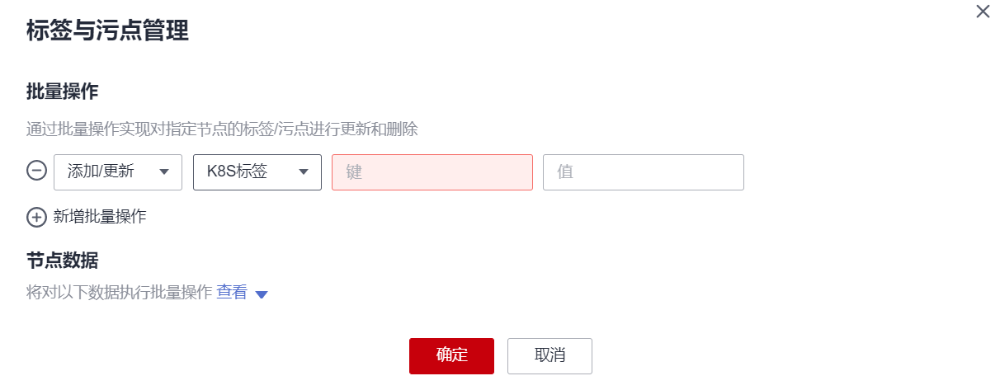

# 管理节点标签

节点标签可以给节点打上不同的标签，给节点定义不同的属性，通过这些标签可以快速的了解各个节点的特点。

## 节点标签使用场景

节点标签的主要使用场景有两类。

-   节点管理：通过节点标签管理节点，给节点分类。
-   工作负载与节点的亲和与反亲和：
    -   有的工作负载需要的CPU大，有的工作负载需要的内存大，有的工作负载需要IO大，可能会影响其他工作负载正常工作等等，此时建议给节点添加不同标签。在部署工作负载的时候，就可以选择相应标签的节点亲和部署，保证系统正常工作；反之，可以使用节点的反亲和部署。
    -   一个系统可以分为多个模块，每个模块由多个微服务组成，为保证后期运维的高效，可以将节点打上对应模块的标签，让各模块部署到各自的节点模块上，互不干扰，方便开发到各自节点上去维护。

## 节点固有标签

节点创建出来会存在一些固有的标签，并且是无法删除的，这些标签的含义请参见[表1](#table83962234533)。

**表 1**  节点固有标签

<table><thead align="left"><tr id="row941112314533"><th class="cellrowborder" valign="top" width="39%" id="mcps1.2.3.1.1">
键

</th>
<th class="cellrowborder" valign="top" width="61%" id="mcps1.2.3.1.2">
说明

</th>
</tr>
</thead>
<tbody><tr id="row846191265011"><td class="cellrowborder" valign="top" width="39%" headers="mcps1.2.3.1.1 ">
新：topology.kubernetes.io/region

旧：failure-domain.beta.kubernetes.io/region

</td>
<td class="cellrowborder" valign="top" width="61%" headers="mcps1.2.3.1.2 ">
表示节点当前所在区域。

</td>
</tr>
<tr id="row11957143818577"><td class="cellrowborder" valign="top" width="39%" headers="mcps1.2.3.1.1 ">
新：topology.kubernetes.io/zone

旧：failure-domain.beta.kubernetes.io/zone

</td>
<td class="cellrowborder" valign="top" width="61%" headers="mcps1.2.3.1.2 ">
表示节点所在区域的可用区。

</td>
</tr>
<tr id="row186452248235"><td class="cellrowborder" valign="top" width="39%" headers="mcps1.2.3.1.1 ">
新：node.kubernetes.io/baremetal

旧：failure-domain.beta.kubernetes.io/is-baremetal

</td>
<td class="cellrowborder" valign="top" width="61%" headers="mcps1.2.3.1.2 ">
表示是否为裸金属节点。

例如：false，表示非裸金属节点

</td>
</tr>
<tr id="row187691733134919"><td class="cellrowborder" valign="top" width="39%" headers="mcps1.2.3.1.1 ">
node.kubernetes.io/container-engine

</td>
<td class="cellrowborder" valign="top" width="61%" headers="mcps1.2.3.1.2 ">
表示容器引擎。

例如：docker、containerd

</td>
</tr>
<tr id="row5551359185318"><td class="cellrowborder" valign="top" width="39%" headers="mcps1.2.3.1.1 ">
node.kubernetes.io/instance-type

</td>
<td class="cellrowborder" valign="top" width="61%" headers="mcps1.2.3.1.2 ">
节点实例规格。

</td>
</tr>
<tr id="row11411923145318"><td class="cellrowborder" valign="top" width="39%" headers="mcps1.2.3.1.1 ">
kubernetes.io/arch

</td>
<td class="cellrowborder" valign="top" width="61%" headers="mcps1.2.3.1.2 ">
节点处理器架构。

</td>
</tr>
<tr id="row18812913105819"><td class="cellrowborder" valign="top" width="39%" headers="mcps1.2.3.1.1 ">
kubernetes.io/hostname

</td>
<td class="cellrowborder" valign="top" width="61%" headers="mcps1.2.3.1.2 ">
节点名称。

</td>
</tr>
<tr id="row15479121185815"><td class="cellrowborder" valign="top" width="39%" headers="mcps1.2.3.1.1 ">
kubernetes.io/os

</td>
<td class="cellrowborder" valign="top" width="61%" headers="mcps1.2.3.1.2 ">
节点操作系统类型。

</td>
</tr>
<tr id="row85011821447"><td class="cellrowborder" valign="top" width="39%" headers="mcps1.2.3.1.1 ">
node.kubernetes.io/subnetid

</td>
<td class="cellrowborder" valign="top" width="61%" headers="mcps1.2.3.1.2 ">
节点所在子网的ID。

</td>
</tr>
<tr id="row15411523165312"><td class="cellrowborder" valign="top" width="39%" headers="mcps1.2.3.1.1 ">
os.architecture

</td>
<td class="cellrowborder" valign="top" width="61%" headers="mcps1.2.3.1.2 ">
表示节点处理器架构。

例如：amd64，表示AMD64位架构的处理器

</td>
</tr>
<tr id="row17411162365318"><td class="cellrowborder" valign="top" width="39%" headers="mcps1.2.3.1.1 ">
os.name

</td>
<td class="cellrowborder" valign="top" width="61%" headers="mcps1.2.3.1.2 ">
节点的操作系统名称。

</td>
</tr>
<tr id="row1041115238531"><td class="cellrowborder" valign="top" width="39%" headers="mcps1.2.3.1.1 ">
os.version

</td>
<td class="cellrowborder" valign="top" width="61%" headers="mcps1.2.3.1.2 ">
操作系统节点内核版本。

</td>
</tr>
<tr id="row23484510537"><td class="cellrowborder" valign="top" width="39%" headers="mcps1.2.3.1.1 ">
node.kubernetes.io/container-engine

</td>
<td class="cellrowborder" valign="top" width="61%" headers="mcps1.2.3.1.2 ">
节点所用容器引擎。

</td>
</tr>
<tr id="row1545112635314"><td class="cellrowborder" valign="top" width="39%" headers="mcps1.2.3.1.1 ">
accelerator/huawei-npu

</td>
<td class="cellrowborder" valign="top" width="61%" headers="mcps1.2.3.1.2 ">
NPU节点标签。

</td>
</tr>
<tr id="row157991762533"><td class="cellrowborder" valign="top" width="39%" headers="mcps1.2.3.1.1 ">
accelerator

</td>
<td class="cellrowborder" valign="top" width="61%" headers="mcps1.2.3.1.2 ">
GPU节点标签。

</td>
</tr>
<tr id="row43521213544"><td class="cellrowborder" valign="top" width="39%" headers="mcps1.2.3.1.1 ">
cce.cloud.com/cce-nodepool

</td>
<td class="cellrowborder" valign="top" width="61%" headers="mcps1.2.3.1.2 ">
节点池节点专属标签。

</td>
</tr>
</tbody>
</table>

## 添加/删除节点标签

1.  登录CCE控制台。
2.  单击集群名称进入集群，在左侧选择“节点管理“，勾选节点，单击左上方“标签与污点管理“。
3.  在弹出的窗口中，在“批量操作“下方单击“新增批量操作“，然后选择“添加/更新“或“删除“。

    填写需要增加/删除标签的“键”和“值”，单击“确定”。

    例如，填写的键为“deploy\_qa”，值为“true”，就可以从逻辑概念表示该节点是用来部署QA（测试）环境使用。

    **图 1**  添加节点标签  
    

4.  标签添加成功后，再次进入该界面，在节点数据下可查看到已经添加的标签。

