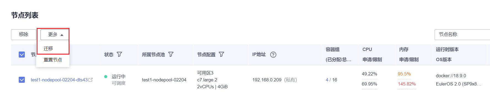

# 管理节点池

## 约束与限制

默认节点池DefaultPool不支持如下管理操作。

## 配置管理

为方便对CCE集群中的kubernetes配置参数进行管理，CCE提供了配置管理功能，通过该功能您可以对核心组件进行深度配置，更多信息请参见[kubelet](https://kubernetes.io/zh/docs/reference/command-line-tools-reference/kubelet/)。

仅支持在**v1.15及以上版本**的集群中对节点池进行配置，V1.15以下版本不显示该功能。

1.  登录CCE控制台。
2.  单击集群名称进入集群，在左侧选择“节点管理“，在右侧选择“节点池“页签。
3.  单击节点池名称后的“更多 \> 配置管理“。
4.  在侧边栏滑出的“配置管理“窗口中，根据业务需求修改Kubernetes的参数值：

    **表 1**  kubelet组件配置

    
    <table><thead align="left"><tr id="row59201451536"><th class="cellrowborder" valign="top" width="20%" id="mcps1.2.5.1.1">
参数

    </th>
    <th class="cellrowborder" valign="top" width="30%" id="mcps1.2.5.1.2">
详情

    </th>
    <th class="cellrowborder" valign="top" width="20%" id="mcps1.2.5.1.3">
默认

    </th>
    <th class="cellrowborder" valign="top" width="30%" id="mcps1.2.5.1.4">
修改限制

    </th>
    </tr>
    </thead>
    <tbody><tr id="row11921251238"><td class="cellrowborder" valign="top" width="20%" headers="mcps1.2.5.1.1 ">
cpu-manager-policy

    </td>
    <td class="cellrowborder" valign="top" width="30%" headers="mcps1.2.5.1.2 ">
CPU绑核配置，详情请参见<a href="CPU绑核.md">CPU绑核</a>。

    <ul id="ul25409302147"><li>none：关闭工作负载实例独占CPU的功能，优点是CPU共享池的可分配核数较多。</li><li>static：开启工作负载实例独占CPU，适用于对CPU缓存和调度延迟敏感的场景。</li></ul>
    <ul id="ul05404301146"><li>enhanced-static：在支持CPU独占的基础上，增强支持给Burstable Pods配置CPU优先使用核，适用于波峰、波谷相差大且大部分时间处于波谷状态的工作负载。</li></ul>
    </td>
    <td class="cellrowborder" valign="top" width="20%" headers="mcps1.2.5.1.3 ">
none

    </td>
    <td class="cellrowborder" rowspan="8" valign="top" width="30%" headers="mcps1.2.5.1.4 ">
支持在节点池生命周期中修改

    </td>
    </tr>
    <tr id="row192120517312"><td class="cellrowborder" valign="top" headers="mcps1.2.5.1.1 ">
kube-api-qps

    </td>
    <td class="cellrowborder" valign="top" headers="mcps1.2.5.1.2 ">
与kube-apiserver通信的qps

    </td>
    <td class="cellrowborder" valign="top" headers="mcps1.2.5.1.3 ">
100

    </td>
    </tr>
    <tr id="row189211251930"><td class="cellrowborder" valign="top" headers="mcps1.2.5.1.1 ">
kube-api-burst

    </td>
    <td class="cellrowborder" valign="top" headers="mcps1.2.5.1.2 ">
与kube-apiserver通信的burst

    </td>
    <td class="cellrowborder" valign="top" headers="mcps1.2.5.1.3 ">
100

    </td>
    </tr>
    <tr id="row1992115514319"><td class="cellrowborder" valign="top" headers="mcps1.2.5.1.1 ">
max-pods

    </td>
    <td class="cellrowborder" valign="top" headers="mcps1.2.5.1.2 ">
kubelet管理的pod上限

    </td>
    <td class="cellrowborder" valign="top" headers="mcps1.2.5.1.3 ">
40

    
20

    </td>
    </tr>
    <tr id="row1423519271022"><td class="cellrowborder" valign="top" headers="mcps1.2.5.1.1 ">
pod-pids-limit

    </td>
    <td class="cellrowborder" valign="top" headers="mcps1.2.5.1.2 ">
K8s 限制进程数

    </td>
    <td class="cellrowborder" valign="top" headers="mcps1.2.5.1.3 ">
-1

    </td>
    </tr>
    <tr id="row139221751031"><td class="cellrowborder" valign="top" headers="mcps1.2.5.1.1 ">
with-local-dns

    </td>
    <td class="cellrowborder" valign="top" headers="mcps1.2.5.1.2 ">
是否使用本地IP作为该节点的ClusterDNS

    </td>
    <td class="cellrowborder" valign="top" headers="mcps1.2.5.1.3 ">
false

    </td>
    </tr>
    <tr id="row1016115483359"><td class="cellrowborder" valign="top" headers="mcps1.2.5.1.1 ">
event-qps

    </td>
    <td class="cellrowborder" valign="top" headers="mcps1.2.5.1.2 ">
事件创建QPS限制

    </td>
    <td class="cellrowborder" valign="top" headers="mcps1.2.5.1.3 ">
5

    </td>
    </tr>
    <tr id="row119221051531"><td class="cellrowborder" valign="top" headers="mcps1.2.5.1.1 ">
allowed-unsafe-sysctls

    </td>
    <td class="cellrowborder" valign="top" headers="mcps1.2.5.1.2 ">
允许使用的不安全系统配置。

    
CCE从<strong id="b1254312564568">1.17.17</strong>集群版本开始，kube-apiserver开启了pod安全策略，需要在pod安全策略的allowedUnsafeSysctls中增加相应的配置才能生效（1.17.17以下版本的集群可不配置）。详情请参见<a href="PodSecurityPolicy配置.md#section155111941177">Pod安全策略开放非安全系统配置示例</a>。

    </td>
    <td class="cellrowborder" valign="top" headers="mcps1.2.5.1.3 ">
[]

    </td>
    </tr>
    <tr id="row12311326570"><td class="cellrowborder" valign="top" width="20%" headers="mcps1.2.5.1.1 ">
over-subscription-resource

    </td>
    <td class="cellrowborder" valign="top" width="30%" headers="mcps1.2.5.1.2 ">
节点超卖特性。

    
设置为true表示开启节点超卖特性，节点超卖的特性请参见<a href="在线离线作业混合部署.md">在线离线作业混合部署</a>。

    </td>
    <td class="cellrowborder" valign="top" width="20%" headers="mcps1.2.5.1.3 ">
true

    </td>
    <td class="cellrowborder" valign="top" width="30%" headers="mcps1.2.5.1.4 ">
-

    </td>
    </tr>
    <tr id="row12765512616"><td class="cellrowborder" valign="top" width="20%" headers="mcps1.2.5.1.1 ">
colocation

    </td>
    <td class="cellrowborder" valign="top" width="30%" headers="mcps1.2.5.1.2 ">
节点混部特性。

    
设置为true表示开启节点混部特性，节点混部的特性请参见<a href="在线离线作业混合部署.md">在线离线作业混合部署</a>。

    </td>
    <td class="cellrowborder" valign="top" width="20%" headers="mcps1.2.5.1.3 ">
true

    </td>
    <td class="cellrowborder" valign="top" width="30%" headers="mcps1.2.5.1.4 ">
-

    </td>
    </tr>
    <tr id="row362443718199"><td class="cellrowborder" valign="top" width="20%" headers="mcps1.2.5.1.1 ">
kube-reserved-mem

    
system-reserved-mem

    </td>
    <td class="cellrowborder" valign="top" width="30%" headers="mcps1.2.5.1.2 ">
节点内存预留。

    </td>
    <td class="cellrowborder" valign="top" width="20%" headers="mcps1.2.5.1.3 ">
随节点规格变动，具体请参见<a href="节点预留资源计算公式.md">节点预留资源计算公式</a>

    </td>
    <td class="cellrowborder" valign="top" width="30%" headers="mcps1.2.5.1.4 ">
kube-reserved-mem，system-reserved-mem之和小于内存的一半

    </td>
    </tr>
    <tr id="row0769163972815"><td class="cellrowborder" valign="top" width="20%" headers="mcps1.2.5.1.1 ">
topology-manager-policy

    </td>
    <td class="cellrowborder" valign="top" width="30%" headers="mcps1.2.5.1.2 ">
设置拓扑管理策略。

    
合法值包括：

    <ul id="ul9802545113118"><li>restricted：kubelet 仅接受在所请求资源上实现最佳 NUMA对齐的Pod。</li><li>best-effort：kubelet会优先选择在 CPU 和设备资源上实现NUMA对齐的Pod。</li><li>none（默认）：不启用拓扑管理策略。</li><li>single-numa-node：kubelet仅允许在 CPU和设备资源上对齐到同一NUMA节点的Pod。</li></ul>
    </td>
    <td class="cellrowborder" valign="top" width="20%" headers="mcps1.2.5.1.3 ">
none

    </td>
    <td class="cellrowborder" rowspan="2" valign="top" width="30%" headers="mcps1.2.5.1.4 ">
支持在节点池生命周期中修改

    
 须知： 

请谨慎修改，修改topology-manager-policy和topology-manager-scope会重启kubelet，并且以更改后的策略重新计算容器实例的资源分配，这有可能导致已经运行的容器实例重启甚至无法进行资源分配。

    

    

    </td>
    </tr>
    <tr id="row363114444281"><td class="cellrowborder" valign="top" headers="mcps1.2.5.1.1 ">
topology-manager-scope

    </td>
    <td class="cellrowborder" valign="top" headers="mcps1.2.5.1.2 ">
设置拓扑管理策略的资源对齐粒度。合法值包括：

    <ul id="ul3384836153218"><li>container （默认)：对齐粒度为容器级</li><li>pod：对齐粒度为pod级</li></ul>
    </td>
    <td class="cellrowborder" valign="top" headers="mcps1.2.5.1.3 ">
container

    </td>
    </tr>
    <tr id="row111258127710"><td class="cellrowborder" valign="top" width="20%" headers="mcps1.2.5.1.1 ">
resolv-conf

    </td>
    <td class="cellrowborder" valign="top" width="30%" headers="mcps1.2.5.1.2 ">
容器指定DNS解析配置文件

    </td>
    <td class="cellrowborder" valign="top" width="20%" headers="mcps1.2.5.1.3 ">
默认为空值

    </td>
    <td class="cellrowborder" valign="top" width="30%" headers="mcps1.2.5.1.4 ">
-

    </td>
    </tr>
    </tbody>
    </table>

    **表 2**  kube-proxy组件配置

    
    <table><thead align="left"><tr id="row167189181747"><th class="cellrowborder" valign="top" width="20%" id="mcps1.2.5.1.1">
参数

    </th>
    <th class="cellrowborder" valign="top" width="30%" id="mcps1.2.5.1.2">
详情

    </th>
    <th class="cellrowborder" valign="top" width="20%" id="mcps1.2.5.1.3">
默认

    </th>
    <th class="cellrowborder" valign="top" width="30%" id="mcps1.2.5.1.4">
修改限制

    </th>
    </tr>
    </thead>
    <tbody><tr id="row207193186419"><td class="cellrowborder" valign="top" width="20%" headers="mcps1.2.5.1.1 ">
conntrack-min

    </td>
    <td class="cellrowborder" valign="top" width="30%" headers="mcps1.2.5.1.2 ">
sysctl -w net.nf_conntrack_max

    </td>
    <td class="cellrowborder" valign="top" width="20%" headers="mcps1.2.5.1.3 ">
131072

    </td>
    <td class="cellrowborder" rowspan="2" valign="top" width="30%" headers="mcps1.2.5.1.4 ">
支持在节点池生命周期中修改

    </td>
    </tr>
    <tr id="row6523175217418"><td class="cellrowborder" valign="top" headers="mcps1.2.5.1.1 ">
conntrack-tcp-timeout-close-wait

    </td>
    <td class="cellrowborder" valign="top" headers="mcps1.2.5.1.2 ">
sysctl -w net.netfilter.nf_conntrack_tcp_timeout_close_wait

    </td>
    <td class="cellrowborder" valign="top" headers="mcps1.2.5.1.3 ">
1h0m0s

    </td>
    </tr>
    </tbody>
    </table>

    **表 3**  网络组件配置（仅CCE Turbo集群可见）

    
    <table><thead align="left"><tr id="row1410911019116"><th class="cellrowborder" valign="top" width="20%" id="mcps1.2.5.1.1">
参数

    </th>
    <th class="cellrowborder" valign="top" width="30%" id="mcps1.2.5.1.2">
详情

    </th>
    <th class="cellrowborder" valign="top" width="20%" id="mcps1.2.5.1.3">
默认

    </th>
    <th class="cellrowborder" valign="top" width="30%" id="mcps1.2.5.1.4">
修改限制

    </th>
    </tr>
    </thead>
    <tbody><tr id="row6109501911"><td class="cellrowborder" valign="top" width="20%" headers="mcps1.2.5.1.1 ">
nic-threshold

    </td>
    <td class="cellrowborder" valign="top" width="30%" headers="mcps1.2.5.1.2 ">
节点池级别的节点绑定容器网卡数低水位:节点绑定容器网卡数高水位

    
 说明： 

此参数配置废弃中，请采用其他4个容器网卡动态预热参数。

    

    </td>
    <td class="cellrowborder" valign="top" width="20%" headers="mcps1.2.5.1.3 ">
默认：0:0

    </td>
    <td class="cellrowborder" valign="top" width="30%" headers="mcps1.2.5.1.4 ">
-

    </td>
    </tr>
    <tr id="row113597313118"><td class="cellrowborder" valign="top" width="20%" headers="mcps1.2.5.1.1 ">
nic-minimum-target

    </td>
    <td class="cellrowborder" valign="top" width="30%" headers="mcps1.2.5.1.2 ">
节点池级别的节点最少绑定容器网卡数

    </td>
    <td class="cellrowborder" valign="top" width="20%" headers="mcps1.2.5.1.3 ">
默认：10

    </td>
    <td class="cellrowborder" valign="top" width="30%" headers="mcps1.2.5.1.4 ">
-

    </td>
    </tr>
    <tr id="row1330911415115"><td class="cellrowborder" valign="top" width="20%" headers="mcps1.2.5.1.1 ">
nic-maximum-target

    </td>
    <td class="cellrowborder" valign="top" width="30%" headers="mcps1.2.5.1.2 ">
节点池级别的节点预热容器网卡上限检查值

    </td>
    <td class="cellrowborder" valign="top" width="20%" headers="mcps1.2.5.1.3 ">
默认：0

    </td>
    <td class="cellrowborder" valign="top" width="30%" headers="mcps1.2.5.1.4 ">
-

    </td>
    </tr>
    <tr id="row48521749118"><td class="cellrowborder" valign="top" width="20%" headers="mcps1.2.5.1.1 ">
nic-warm-target

    </td>
    <td class="cellrowborder" valign="top" width="30%" headers="mcps1.2.5.1.2 ">
节点池级别的节点动态预热容器网卡数

    </td>
    <td class="cellrowborder" valign="top" width="20%" headers="mcps1.2.5.1.3 ">
默认：2

    </td>
    <td class="cellrowborder" valign="top" width="30%" headers="mcps1.2.5.1.4 ">
-

    </td>
    </tr>
    <tr id="row10457153114"><td class="cellrowborder" valign="top" width="20%" headers="mcps1.2.5.1.1 ">
nic-max-above-warm-target

    </td>
    <td class="cellrowborder" valign="top" width="30%" headers="mcps1.2.5.1.2 ">
节点池级别的节点预热容器网卡回收阈值

    </td>
    <td class="cellrowborder" valign="top" width="20%" headers="mcps1.2.5.1.3 ">
默认：2

    </td>
    <td class="cellrowborder" valign="top" width="30%" headers="mcps1.2.5.1.4 ">
-

    </td>
    </tr>
    </tbody>
    </table>

    **表 4**  节点池Pod安全组配置（仅CCE Turbo集群可见）

    
    <table><thead align="left"><tr id="row10416122195916"><th class="cellrowborder" valign="top" width="20%" id="mcps1.2.5.1.1">
参数

    </th>
    <th class="cellrowborder" valign="top" width="30%" id="mcps1.2.5.1.2">
详情

    </th>
    <th class="cellrowborder" valign="top" width="20%" id="mcps1.2.5.1.3">
默认

    </th>
    <th class="cellrowborder" valign="top" width="30%" id="mcps1.2.5.1.4">
修改限制

    </th>
    </tr>
    </thead>
    <tbody><tr id="row104166213595"><td class="cellrowborder" valign="top" width="20%" headers="mcps1.2.5.1.1 ">
security_groups_for_nodepool

    </td>
    <td class="cellrowborder" valign="top" width="30%" headers="mcps1.2.5.1.2 "><ul id="ul1641174410590"><li>节点池上Pod默认使用的安全组，可填写安全组 ID，不配置则使用集群容器网络的默认安全组，并且最多可同时指定5个安全组ID，中间以英文分号（;）分隔。</li><li>优先级低于<a href="安全组策略（SecurityGroup）.md">SecurityGroup</a>资源对象配置的安全组。</li></ul>
    </td>
    <td class="cellrowborder" valign="top" width="20%" headers="mcps1.2.5.1.3 ">
-

    </td>
    <td class="cellrowborder" valign="top" width="30%" headers="mcps1.2.5.1.4 ">
-

    </td>
    </tr>
    </tbody>
    </table>

    **表 5**  容器引擎Docker配置（仅使用Docker的节点池可见）

    
    <table><thead align="left"><tr id="row1066210231324"><th class="cellrowborder" valign="top" width="20%" id="mcps1.2.5.1.1">
参数

    </th>
    <th class="cellrowborder" valign="top" width="30%" id="mcps1.2.5.1.2">
详情

    </th>
    <th class="cellrowborder" valign="top" width="20%" id="mcps1.2.5.1.3">
默认

    </th>
    <th class="cellrowborder" valign="top" width="30%" id="mcps1.2.5.1.4">
修改限制

    </th>
    </tr>
    </thead>
    <tbody><tr id="row46629235211"><td class="cellrowborder" valign="top" width="20%" headers="mcps1.2.5.1.1 ">
native-umask

    </td>
    <td class="cellrowborder" valign="top" width="30%" headers="mcps1.2.5.1.2 ">
`--exec-opt native.umask

    </td>
    <td class="cellrowborder" valign="top" width="20%" headers="mcps1.2.5.1.3 ">
normal

    </td>
    <td class="cellrowborder" valign="top" width="30%" headers="mcps1.2.5.1.4 ">
不支持修改

    </td>
    </tr>
    <tr id="row106633238210"><td class="cellrowborder" valign="top" width="20%" headers="mcps1.2.5.1.1 ">
docker-base-size

    </td>
    <td class="cellrowborder" valign="top" width="30%" headers="mcps1.2.5.1.2 ">
`--storage-opts dm.basesize

    </td>
    <td class="cellrowborder" valign="top" width="20%" headers="mcps1.2.5.1.3 ">
0

    </td>
    <td class="cellrowborder" valign="top" width="30%" headers="mcps1.2.5.1.4 ">
不支持修改

    </td>
    </tr>
    <tr id="row866332311214"><td class="cellrowborder" valign="top" width="20%" headers="mcps1.2.5.1.1 ">
insecure-registry

    </td>
    <td class="cellrowborder" valign="top" width="30%" headers="mcps1.2.5.1.2 ">
不安全的镜像源地址

    </td>
    <td class="cellrowborder" valign="top" width="20%" headers="mcps1.2.5.1.3 ">
false

    </td>
    <td class="cellrowborder" valign="top" width="30%" headers="mcps1.2.5.1.4 ">
不支持修改

    </td>
    </tr>
    <tr id="row174045431722"><td class="cellrowborder" valign="top" width="20%" headers="mcps1.2.5.1.1 ">
limitcore

    </td>
    <td class="cellrowborder" valign="top" width="30%" headers="mcps1.2.5.1.2 ">
容器core文件的大小限制，单位是Byte

    </td>
    <td class="cellrowborder" valign="top" width="20%" headers="mcps1.2.5.1.3 ">
5368709120

    </td>
    <td class="cellrowborder" valign="top" width="30%" headers="mcps1.2.5.1.4 ">
-

    </td>
    </tr>
    <tr id="row14622447029"><td class="cellrowborder" valign="top" width="20%" headers="mcps1.2.5.1.1 ">
default-ulimit-nofile

    </td>
    <td class="cellrowborder" valign="top" width="30%" headers="mcps1.2.5.1.2 ">
容器内句柄数限制

    </td>
    <td class="cellrowborder" valign="top" width="20%" headers="mcps1.2.5.1.3 ">
{soft}:{hard}

    </td>
    <td class="cellrowborder" valign="top" width="30%" headers="mcps1.2.5.1.4 ">
该值大小不可超过节点内核参数nr_open的值，且不能是负数。

    
节点内核参数nr_open可通过以下命令获取：

    <pre class="screen" id="screen716912711319">sysctl -a | grep nr_open</pre>
    </td>
    </tr>
    </tbody>
    </table>

    **表 6**  容器引擎Containerd配置（仅使用Containerd的节点池可见）

    
    <table><thead align="left"><tr id="row43641548185711"><th class="cellrowborder" valign="top" width="20%" id="mcps1.2.5.1.1">
参数

    </th>
    <th class="cellrowborder" valign="top" width="30%" id="mcps1.2.5.1.2">
详情

    </th>
    <th class="cellrowborder" valign="top" width="20%" id="mcps1.2.5.1.3">
默认

    </th>
    <th class="cellrowborder" valign="top" width="30%" id="mcps1.2.5.1.4">
修改限制

    </th>
    </tr>
    </thead>
    <tbody><tr id="row676183115711"><td class="cellrowborder" valign="top" width="20%" headers="mcps1.2.5.1.1 ">
devmapper-base-size

    </td>
    <td class="cellrowborder" valign="top" width="30%" headers="mcps1.2.5.1.2 ">
单容器可用数据空间

    </td>
    <td class="cellrowborder" valign="top" width="20%" headers="mcps1.2.5.1.3 ">
-

    </td>
    <td class="cellrowborder" valign="top" width="30%" headers="mcps1.2.5.1.4 ">
不支持修改

    </td>
    </tr>
    <tr id="row12785231135715"><td class="cellrowborder" valign="top" width="20%" headers="mcps1.2.5.1.1 ">
limitcore

    </td>
    <td class="cellrowborder" valign="top" width="30%" headers="mcps1.2.5.1.2 ">
容器core文件的大小限制，单位是Byte

    </td>
    <td class="cellrowborder" valign="top" width="20%" headers="mcps1.2.5.1.3 ">
5368709120

    </td>
    <td class="cellrowborder" valign="top" width="30%" headers="mcps1.2.5.1.4 ">
-

    </td>
    </tr>
    <tr id="row578518313579"><td class="cellrowborder" valign="top" width="20%" headers="mcps1.2.5.1.1 ">
default-ulimit-nofile

    </td>
    <td class="cellrowborder" valign="top" width="30%" headers="mcps1.2.5.1.2 ">
容器内句柄数限制

    </td>
    <td class="cellrowborder" valign="top" width="20%" headers="mcps1.2.5.1.3 ">
1048576

    </td>
    <td class="cellrowborder" valign="top" width="30%" headers="mcps1.2.5.1.4 ">
该值大小不可超过节点内核参数nr_open的值，且不能是负数。

    
节点内核参数nr_open可通过以下命令获取：

    <pre class="screen" id="screen878553175719">sysctl -a | grep nr_open</pre>
    </td>
    </tr>
    </tbody>
    </table>

5.  单击“确定“，完成配置操作。

## 编辑节点池

1.  登录CCE控制台。
2.  单击集群名称进入集群，在左侧选择“节点管理“，在右侧选择“节点池“页签。
3.  单击节点池名称后的“编辑“，在弹出的“编辑节点池“页面中配置参数。

    **基础配置**

    **表 7**  基础配置

    
    <table><thead align="left"><tr id="row194522023319"><th class="cellrowborder" valign="top" width="28.000000000000004%" id="mcps1.2.3.1.1">
参数

    </th>
    <th class="cellrowborder" valign="top" width="72%" id="mcps1.2.3.1.2">
参数说明

    </th>
    </tr>
    </thead>
    <tbody><tr id="row164535216319"><td class="cellrowborder" valign="top" width="28.000000000000004%" headers="mcps1.2.3.1.1 ">
节点池名称

    </td>
    <td class="cellrowborder" valign="top" width="72%" headers="mcps1.2.3.1.2 ">
自定义节点池名称。

    </td>
    </tr>
    <tr id="row1245342103115"><td class="cellrowborder" valign="top" width="28.000000000000004%" headers="mcps1.2.3.1.1 ">
节点数量

    </td>
    <td class="cellrowborder" valign="top" width="72%" headers="mcps1.2.3.1.2 ">
请根据业务需求调整节点个数。

    </td>
    </tr>
    <tr id="row545316217315"><td class="cellrowborder" valign="top" width="28.000000000000004%" headers="mcps1.2.3.1.1 ">
弹性伸缩

    </td>
    <td class="cellrowborder" valign="top" width="72%" headers="mcps1.2.3.1.2 ">
默认不开启。

    
单击开启后，节点池将根据业务需求自动创建或删除节点池内的节点，参数设置如下：

    <ul id="ul11453322315"><li>节点数上限和节点数下限：您可设置节点数的上限和下限，保证节点数在合理的范围内伸缩。</li><li>优先级：该数值表示节点池之间进行弹性扩容的优先级，数值越大优先级越高，如设置为4的节点池比设置为1的节点池优先启动扩容。若多个节点池的值设置相同，如都设置为2，表示这几个节点池之间不分优先级，系统将按最小资源浪费原则进行扩容。</li><li>冷却时间：请设置时间，单位为分钟。弹性缩容冷却时间是指当前节点池扩容出的节点多长时间不能被缩容。</li></ul>
    
为保证功能的正常使用，节点池开启弹性扩缩容功能后，请务必安装<a href="autoscaler.md">AutoScaler插件</a>。

    </td>
    </tr>
    </tbody>
    </table>

    **高级配置**

    **表 8**  高级配置

    
    <table><thead align="left"><tr id="row1886164917324"><th class="cellrowborder" valign="top" width="28.000000000000004%" id="mcps1.2.3.1.1">
参数

    </th>
    <th class="cellrowborder" valign="top" width="72%" id="mcps1.2.3.1.2">
参数说明

    </th>
    </tr>
    </thead>
    <tbody><tr id="row1888624910324"><td class="cellrowborder" valign="top" width="28.000000000000004%" headers="mcps1.2.3.1.1 ">
K8s标签

    </td>
    <td class="cellrowborder" valign="top" width="72%" headers="mcps1.2.3.1.2 ">
单击“添加标签”可以设置附加到Kubernetes 对象（比如Pods）上的键值对，最多可以添加20条标签。

    
使用该标签可区分不同节点，可结合工作负载的亲和能力实现容器Pod调度到指定节点的功能。详细请参见<a href="https://kubernetes.io/docs/concepts/overview/working-with-objects/labels/" target="_blank" rel="noopener noreferrer">Labels and Selectors</a>。

    
 说明： 

修改“K8s标签”后，节点池下的存量节点会同步更新。

    

    </td>
    </tr>
    <tr id="row10887134923219"><td class="cellrowborder" valign="top" width="28.000000000000004%" headers="mcps1.2.3.1.1 ">
资源标签

    </td>
    <td class="cellrowborder" valign="top" width="72%" headers="mcps1.2.3.1.2 ">
通过为资源添加标签，可以对资源进行自定义标记，实现资源的分类。

    
您可以在TMS中创建“预定义标签”，预定义标签对所有支持标签功能的服务资源可见，通过使用预定义标签可以提升标签创建和迁移效率。具体请参见<a href="https://support.huaweicloud.com/usermanual-tms/zh-cn_topic_0144368884.html" target="_blank" rel="noopener noreferrer">创建预定义标签</a>。

    
CCE服务会自动帮您创建CCE-Dynamic-Provisioning-Node=节点id的标签。

    
 说明： 

修改“资源标签”后，新增节点时自动生效，存量节点需要手动重置节点后生效。

    

    </td>
    </tr>
    <tr id="row3887849173215"><td class="cellrowborder" valign="top" width="28.000000000000004%" headers="mcps1.2.3.1.1 ">
污点(Taints)

    </td>
    <td class="cellrowborder" valign="top" width="72%" headers="mcps1.2.3.1.2 ">
默认为空。支持给节点加Taints来设置反亲和性，每个节点最多配置10条Taints，每条Taints包含以下3个参数：<ul id="ul188871749133213"><li>Key：必须以字母或数字开头，可以包含字母、数字、连字符、下划线和点，最长63个字符；另外可以使用DNS子域作为前缀。</li><li>Value：必须以字符或数字开头，可以包含字母、数字、连字符、下划线和点，最长63个字符。</li><li>Effect：只可选NoSchedule，PreferNoSchedule或NoExecute。</li></ul>
    

    
Taints的使用请参见<a href="管理节点污点（taint）.md">管理节点污点（taint）</a>。

    
 说明： 

修改“污点(Taints)”后，节点池下的存量节点会同步更新。

    

    </td>
    </tr>
    <tr id="row105511962411"><td class="cellrowborder" valign="top" width="28.000000000000004%" headers="mcps1.2.3.1.1 ">
编辑密钥对

    </td>
    <td class="cellrowborder" valign="top" width="72%" headers="mcps1.2.3.1.2 ">
仅使用密钥对登录的节点池支持编辑，您可重新选择一个密钥对。

    
 说明： 

编辑密钥对后，新增节点时自动生效，存量节点需要手动重置节点后生效。

    

    </td>
    </tr>
    </tbody>
    </table>

4.  配置完成后，单击“确定“。

    在节点池列表中可查看到节点池状态为“伸缩中“，待状态变为“完成“，节点池参数编辑成功，修改的配置后将同步到节点池下的已有节点。

## 删除节点池

删除节点池，会先删除节点池中的节点，节点删除后，原有节点上的工作负载实例会自动迁移至其他节点池的可用节点。如果工作负载实例具有特定的节点选择器，且如果集群中的其他节点均不符合标准，则工作负载实例可能仍处于无法安排的状态。

1.  登录CCE控制台。
2.  单击集群名称进入集群，在左侧选择“节点管理“，在右侧选择“节点池“页签。
3.  单击节点池名称后的“更多 \> 删除“。
4.  在弹出的“删除节点池“窗口中，请仔细阅读界面提示。
5.  确定要对节点池进行删除操作后，请在弹窗中单击“是“，即可完成节点池的删除。

## 拷贝节点池

通过CCE控制台可以方便的拷贝现有节点池的配置，从而创建新的节点池。

1.  登录CCE控制台。
2.  单击集群名称进入集群，在左侧选择“节点管理“，在右侧选择“节点池“页签。
3.  单击节点池名称后的“更多 \> 拷贝“。
4.  在弹出的“拷贝节点池“窗口中，可以看到拷贝的节点池配置，您可以根据需要进行修改，确定配置后单击“下一步：规格确认“。
5.  在“规格确认“步骤中再次确认规格并单击“提交“，即可完成节点池的拷贝并创建新的节点池。

## 迁移节点

您可以将同一个集群下某个节点池中的节点迁移到默认节点池（defaultpool）中，暂不支持将默认节点池（defaultpool）中的节点迁移到其他节点池中，也不支持将自定义节点池中的节点迁移到其他自定义节点池。

1.  登录CCE控制台，单击集群名称进入集群。
2.  在左侧导航栏中选择“节点管理“，并切换至“节点池“页签。
3.  单击待迁移的节点池名称后的“节点列表“。
4.  勾选需要迁移的节点，单击“更多 \> 迁移”，将节点批量迁移至默认节点池。

    您也可以在单个节点的“操作”栏中，单击“更多 \> 迁移”，迁移单个节点。

    

5.  在弹出的“迁移节点“窗口中进行确认。

    > **说明：** 
    >迁移完成后，节点原有资源标签、K8s标签、Taints不受影响。

