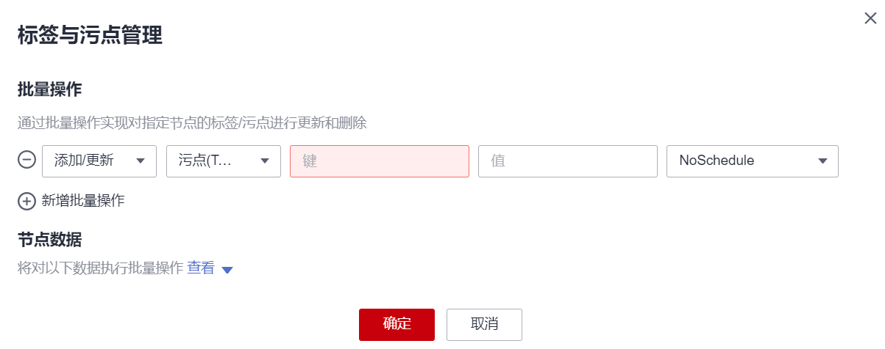
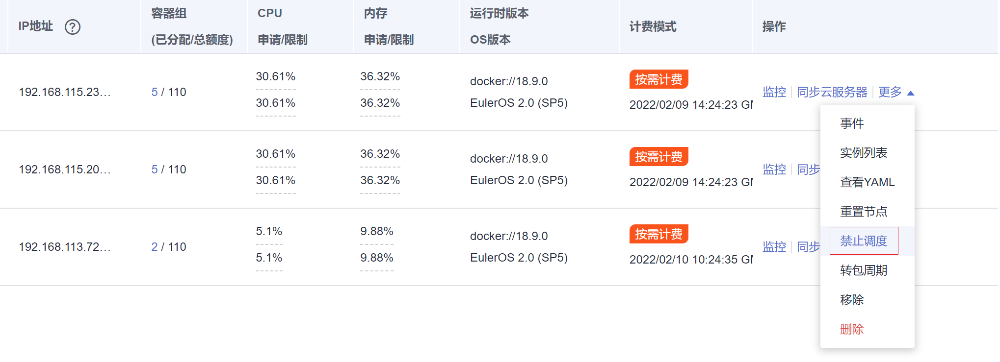
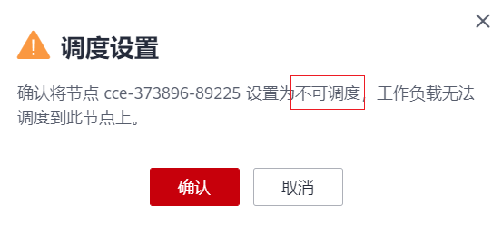
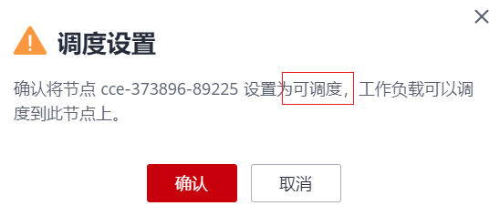

# 管理节点污点（taint）<a name="cce_10_0352"></a>

污点（taint）能够使节点排斥某些特定的Pod，从而避免Pod调度到该节点上。

## 污点<a name="section1660016436407"></a>

节点污点是与“效果”相关联的键值对。以下是可用的效果：

-   NoSchedule：不能容忍此污点的 Pod 不会被调度到节点上；现有 Pod 不会从节点中逐出。
-   PreferNoSchedule：Kubernetes 会尽量避免将不能容忍此污点的 Pod 安排到节点上。
-   NoExecute：如果 Pod 已在节点上运行，则会将该 Pod 从节点中逐出；如果尚未在节点上运行，则不会将其安排到节点上。

使用** kubectl taint** **node **_nodename_  命令可以给节点增加污点，如下所示。

```
$ kubectl get node
NAME             STATUS   ROLES    AGE    VERSION
192.168.10.170   Ready    <none>   73d    v1.19.8-r1-CCE21.4.1.B003
192.168.10.240   Ready    <none>   4h8m   v1.19.8-r1-CCE21.6.1.2.B001
$ kubectl taint node 192.168.10.240 key1=value1:NoSchedule
node/192.168.10.240 tainted
```

通过describe命名和get命令可以查看到污点的配置。

```
$ kubectl describe node 192.168.10.240
Name:               192.168.10.240
...
Taints:             key1=value1:NoSchedule
...
$ kubectl get node 192.168.10.240 -oyaml
apiVersion: v1
...
spec:
  providerID: 06a5ea3a-0482-11ec-8e1a-0255ac101dc2
  taints:
  - effect: NoSchedule
    key: key1
    value: value1
...
```

去除污点可以使用如下命令，在NoSchedule后加一个“-“。

```
$ kubectl taint node 192.168.10.240 key1=value1:NoSchedule-
node/192.168.10.240 untainted
$ kubectl describe node 192.168.10.240
Name:               192.168.10.240
...
Taints:             <none>
...
```

在CCE控制台上同样可以管理节点的污点，且可以批量操作。

1.  登录CCE控制台。
2.  单击集群名称进入集群，在左侧选择“节点管理“，勾选节点，单击左上方“标签与污点管理“。
3.  在弹出的窗口中，在“批量操作“下方单击“新增批量操作“，单击“添加/更新“，选择“污点\(Taints\)“。

    填写需要增加污点的“键”和“值”，选择污点的效果，单击“确定”。

    **图 1**  添加污点<a name="fig9294102272718"></a>  
    

4.  污点添加成功后，再次进入该界面，在节点数据下可查看到已经添加的污点。

## 节点调度设置<a name="section15643100155"></a>

在CCE控制台上可以配置调度设置，登录CCE控制台进入节点，选择“节点管理“，在节点列表右侧单击“更多 \> 禁止调度“。



弹出如下对话框，单击“确认“，即可将节点设置为不可调度。



这个操作会给节点打上污点，使用kubectl可以查看污点的内容。

```
$ kubectl describe node 192.168.10.240
...
Taints:             node.kubernetes.io/unschedulable:NoSchedule
...
```

在CCE控制台相同位置再次设置，即可将去除污点，将节点设置为可调度。



## 容忍度（Toleration）<a name="section2047442210417"></a>

容忍度应用于Pod上，允许（但并不要求）Pod 调度到带有与之匹配的污点的节点上。

污点和容忍度相互配合，可以用来避免 Pod 被分配到不合适的节点上。 每个节点上都可以应用一个或多个污点，这表示对于那些不能容忍这些污点的 Pod，是不会被该节点接受的。

可以在 Pod 中容忍度。

```
apiVersion: v1
kind: Pod
metadata:
  name: nginx
  labels:
    env: test
spec:
  containers:
  - name: nginx
    image: nginx
    imagePullPolicy: IfNotPresent
  tolerations:
  - key: "key1"
    operator: "Equal"
    value: "value1"
    effect: "NoSchedule"  
```

上面示例表示这个Pod容忍标签为key1=value1，效果为NoSchedule的污点，所以这个Pod能够调度到对应的节点上。

同样还可以按如下方式写，表示当节点有key1这个污点时，可以调度到节点。

```
tolerations:
- key: "key1"
  operator: "Exists"
  effect: "NoSchedule"
```

