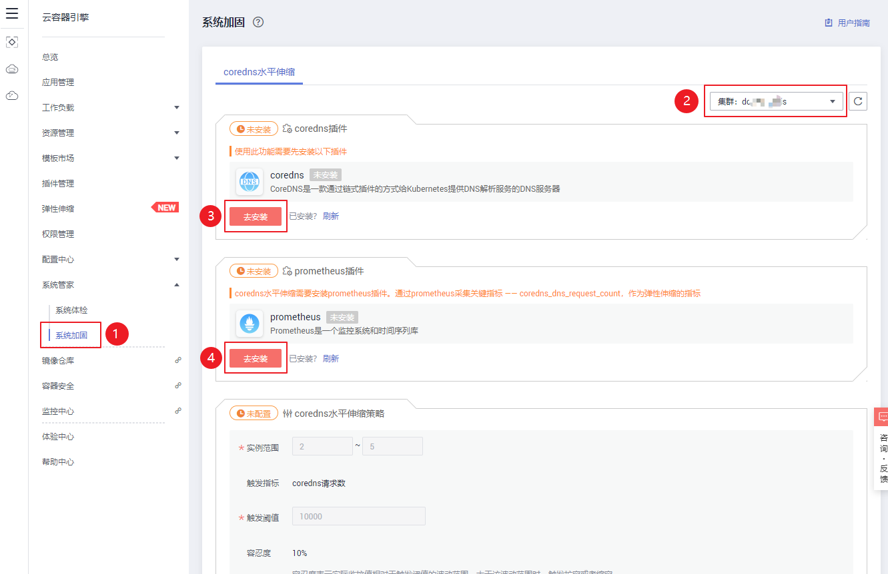
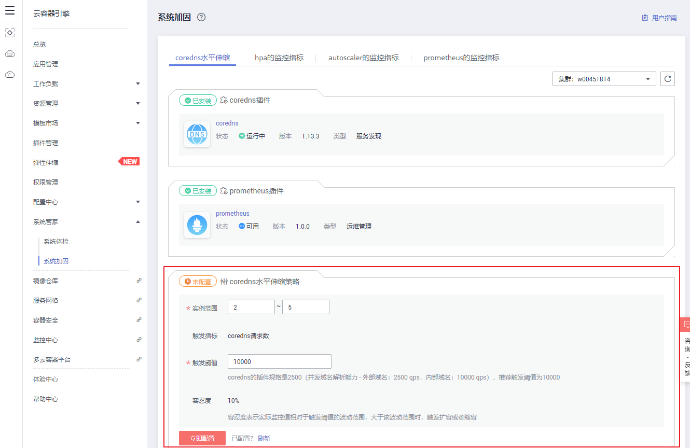

# 系统加固

系统管家主要分为两部分：系统体检和系统加固，本章节主要介绍系统加固。

系统加固主要用于对一些系统组件（如[coredns插件](CoreDNS（系统资源插件-必装）.md)）进行加固。当前已支持coredns自动水平伸缩，根据coredns的请求量情况自动伸缩其实例个数，以防止请求量过大导致coredns解析性能下降或者解析超时失败。

您还可以在系统加固页面查看hpa的监控指标、autoscaler的监控指标和prometheus的监控指标。

## 前提条件

-   使用系统加固功能前需安装[prometheus插件](prometheus.md)，该插件用于系统监控和报警。core-dns就是根据其自定义prometheus指标“coredns\_dns\_request\_count\_total”来进行水平伸缩。
-   使用coredns水平伸缩功能前需安装[coredns插件](CoreDNS（系统资源插件-必装）.md)，该插件是一款通过链式插件的方式为Kubernetes提供域名解析服务的DNS服务器，集群创建时为必装插件，若您手动删除请重新安装。
-   查看hpa的监控指标前还需安装[cce-hpa-controller插件](cce-hpa-controller.md)。cce-hpa-controller是一款CCE自研的插件，能够基于CPU利用率、内存利用率等指标，对无状态工作负载进行弹性扩缩容。
-   查看hpa的监控指标前还需安装[autoscaler插件](autoscaler.md)。autoscaler插件是一款k8s集群自动扩容缩容node节点的插件。

## 配置coredns水平伸缩

1.  登录[CCE控制台](https://console.huaweicloud.com/cce2.0/?utm_source=helpcenter)，在左侧导航栏中选择“系统管家  \>  系统加固“。
2.  在系统加固页面，可以看到“coredns水平伸缩“页签，有如下两种情况：

    **未安装插件：**若未安装[coredns](CoreDNS（系统资源插件-必装）.md)和[prometheus](prometheus.md)插件，请按照页签下的提示进行安装。插件安装完成后，单击“系统管家  \>  系统加固“返回系统加固页面进行相应操作。

    **图 1**  安装系统加固所需插件  
    

    **已安装插件：**若已安装插件，可直接在系统加固页面进行相应操作。

    **图 2**  配置实例伸缩策略  
    

3.  在“coredns水平伸缩策略“中，配置以下参数，其中带“\*”的参数为必填参数：

    > **须知：** 
    >[coredns](CoreDNS（系统资源插件-必装）.md)和[prometheus](prometheus.md)插件未安装时，无法配置coredns水平伸缩策略。

    **表 1**  配置参数说明

    
    <table><thead align="left"><tr id="row173212251235"><th class="cellrowborder" valign="top" width="28.000000000000004%" id="mcps1.2.3.1.1">
参数

    </th>
    <th class="cellrowborder" valign="top" width="72%" id="mcps1.2.3.1.2">
参数说明

    </th>
    </tr>
    </thead>
    <tbody><tr id="row163229255313"><td class="cellrowborder" valign="top" width="28.000000000000004%" headers="mcps1.2.3.1.1 ">
* 实例范围

    </td>
    <td class="cellrowborder" valign="top" width="72%" headers="mcps1.2.3.1.2 ">
根据业务需求，设置实例的伸缩范围。

    </td>
    </tr>
    <tr id="row6334727910"><td class="cellrowborder" valign="top" width="28.000000000000004%" headers="mcps1.2.3.1.1 ">
触发指标

    </td>
    <td class="cellrowborder" valign="top" width="72%" headers="mcps1.2.3.1.2 ">
coredns请求数，不可修改。

    </td>
    </tr>
    <tr id="row111551253912"><td class="cellrowborder" valign="top" width="28.000000000000004%" headers="mcps1.2.3.1.1 ">
* 触发阈值

    </td>
    <td class="cellrowborder" valign="top" width="72%" headers="mcps1.2.3.1.2 ">
根据在coredns插件安装时选择的规格，推荐触发阈值。

    
如：coredns的插件规格是2500（并发域名解析能力 - 外部域名：2500 qps，内部域名：10000 qps），则推荐触发阈值为10000。

    </td>
    </tr>
    <tr id="row1535723154615"><td class="cellrowborder" valign="top" width="28.000000000000004%" headers="mcps1.2.3.1.1 ">
容忍度

    </td>
    <td class="cellrowborder" valign="top" width="72%" headers="mcps1.2.3.1.2 ">
默认10%，不可修改。

    
容忍度表示实际监控值相对于触发目标值的波动范围，大于该波动范围时，触发扩容或者缩容。

    </td>
    </tr>
    </tbody>
    </table>

4.  参数配置完成后，单击“立即配置“完成操作。

