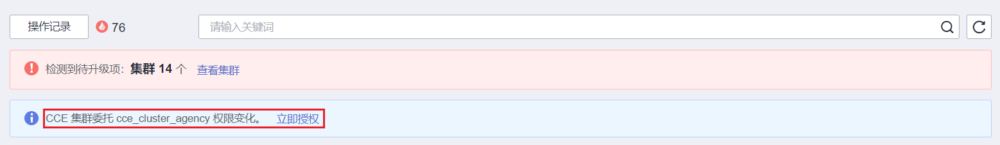

# 系统委托说明

由于CCE在运行中对计算、存储、网络以及监控等各类云服务资源都存在依赖关系，因此当您首次登录CCE控制台时，CCE将自动请求获取当前区域下的云资源权限，从而更好地为您提供服务。服务权限包括：

-   计算类服务

    CCE集群创建节点时会关联创建云服务器，因此需要获取访问弹性云服务器、裸金属服务器的权限。

-   存储类服务

    CCE支持为集群下节点和容器挂载存储，因此需要获取访问云硬盘、弹性文件、对象存储等服务的权限。

-   网络类服务

    CCE支持集群下容器发布为对外访问的服务，因此需要获取访问虚拟私有云、弹性负载均衡等服务的权限。

-   容器与监控类服务

    CCE集群下容器支持镜像拉取、监控和日志分析等功能，需要获取访问容器镜像、应用管理等服务的权限。

当您同意授权后，CCE将在IAM中自动创建帐号委托，将帐号内的其他资源操作权限委托给华为云CCE服务进行操作。关于资源委托详情，您可参考[委托](https://support.huaweicloud.com/usermanual-iam/iam_01_0054.html)进行了解。

CCE自动创建的委托如下：

-   [cce\_admin\_trust](#section123269912477)
-   [cce\_cluster\_agency](#section75459432507)

## cce\_admin\_trust委托说明

cce\_admin\_trust委托具有Tenant Administrator权限。Tenant Administrator拥有除IAM管理外的全部云服务管理员权限，用于对CCE所依赖的其他云服务资源进行调用，且该授权仅在当前区域生效。

如果您在多个区域中使用CCE服务，则需在每个区域中分别申请云资源权限。您可前往“IAM控制台 \> 委托“页签，单击“cce\_admin\_trust“查看各区域的授权记录。

> **说明：** 
>由于CCE对其他云服务有许多依赖，如果没有Tenant Administrator权限，可能会因为某个服务权限不足而影响CCE功能的正常使用。因此在使用CCE服务期间，请不要自行删除或者修改“cce\_admin\_trust”委托。

## cce\_cluster\_agency委托说明

cce\_cluster\_agency委托没有Tenant Administrator系统角色，只包含CCE组件需要的云服务资源操作权限，用于生成CCE集群中组件使用的临时访问凭证。

> **说明：** 
>-   cce\_cluster\_agency委托仅支持1.21及以上版本新建的集群。
>-   创建cce\_cluster\_agency委托时将会自动创建名为“CCE cluster policies”的自定义策略，请勿删除该策略。

若当前cce\_cluster\_agency委托的权限与CCE期望的权限不同时，控制台会提示权限变化，需要您重新授权。

以下场景中，可能会出现cce\_cluster\_agency委托重新授权：

-   CCE组件依赖的权限可能会随版本变动而发生变化。例如新增组件需要依赖新的权限，CCE将会更新期望的权限列表，此时需要您重新为cce\_cluster\_agency委托授权。
-   当您手动修改了cce\_cluster\_agency委托的权限时，该委托中拥有的权限与CCE期望的权限不相同，此时也会出现重新授权的提示。若您重新进行授权，该委托中手动修改的权限可能会失效。

