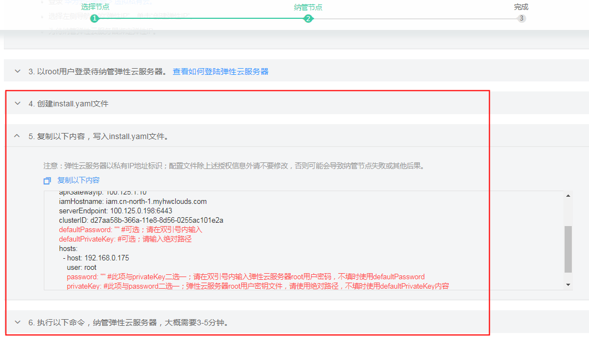

# 纳管已有节点<a name="cce_01_0034"></a>

CCE当前支持两种添加节点的方式，本节指导用户纳管已有节点。纳管节点是指将“已购买的弹性云服务器（ECS）加入到CCE虚拟机集群中“。

## 前提条件<a name="section4156147355"></a>

已购买符合如下条件的弹性云服务器：

-   弹性云服务器购买成功，状态为“运行中“。
-   弹性云服务器需要“与当前集群在同个子网“下。
-   操作系统为：EulerOS 2.2 64bit、CentOS 7.4 64bit。
-   弹性云服务器规格至少为CPU必须2核及以上，内存必须2GB及以上。

> **注意：**   
>-   建议选择新购买的“弹性云服务器“进行纳管，以避免因为在“已有弹性云服务器“上做了某些改动导致纳管失败。  
>-   待纳管弹性云服务器若已安装docker，在纳管过程中将重装高可靠的docker版本，以保障容器服务可靠性。  
>-   第一次纳管节点的时候，会在“容器镜像服务”创建一个“组织”，用与存放用户相关配置文件，大小约几十KB，请保证容器镜像服务的“组织”配额足够。  

## 纳管已有节点<a name="section443142094715"></a>

1.  登录CCE控制台，单击左侧导航栏的“资源管理 \> 集群管理”，单击待纳管集群下的“新增节点  \>  纳管节点“。界面中展示了当前符合要求的弹性云服务器。
2.  勾选需要纳管的弹性云服务器，单击“下一步“。
3.  请参照界面中提示的步骤纳管节点。
    1.  请给docker单独挂载数据盘，或者为docker创建Linux LVM型磁盘分区，否则将会纳管失败。

        > **说明：**   
        >docker数据盘支持指定块设备，若未指定，系统将第一块可用的裸盘给docker使用。  

        -   方式一：给docker单独挂载数据盘，建议≥80G。详细步骤请参见“帮助中心 \> 云硬盘 \> 用户指南 \> 入门\> 挂载云硬盘\> 挂载共享云硬盘“。
        -   方式二：为docker创建Linux LVM型磁盘分区，详细方法请参见[为docker创建Linux LVM型磁盘分区](为docker创建Linux-LVM型磁盘分区.md)。

    2.  （可选）若选择的弹性云服务器未绑定弹性IP，请执行绑定操作。
        1.  登录管理控制台。
        2.  在服务列表中，选择“网络 \> 虚拟私有云”。
        3.  在左侧导航树，单击“弹性公网IP”，单击“购买弹性公网IP”。

            **图 1**  购买弹性公网IP<a name="fig13232320502"></a>  
            

        4.  弹性IP的规格保持默认即可，购买量请根据需求选择，一台弹性云服务器可绑定一个弹性IP，单击“立即申请“。
        5.  在弹性IP列表中，单击弹性IP地址后的“绑定“。勾选需要绑定的云服务器，单击“确定“。

    3.  以root用户登录待纳管弹性云服务器。登录方法请参见[登录Linux弹性云服务器](https://support-intl.huaweicloud.com/zh-cn/usermanual-ecs/zh-cn_topic_0017955380.html)。
    4.  请参照界面中的4-6步提示完成操作。

        > **说明：**   
        >在执行“步骤5 编写install.yaml“文件时，您还可以为docker指定卷组和使用量（volume group），详细请参见[docker挂载磁盘高级设置](#section059123814313)。  

        **图 2**  纳管节点<a name="fig61881611312"></a>  
        


4.  操作完成后，单击“下一步”，单击“完成“。

    系统将自动跳转至节点管理，等待节点纳管成功。


## docker挂载磁盘高级设置<a name="section059123814313"></a>

在为docker挂载磁盘时，支持如下高级选项：

-   dockerBlockDevices：为 docker（使用direct-lvm模式存储驱动）挂载块存储，支持裸盘和Linux LVM型分区。

    示例：

    ```
    user:
      domainName: test
      username: test
      password: ""
      projectName: southchina
    apiGatewayIp: 10.125.*.*
    iamHostname: iam.ap-southeast-1.myhuaweicloud.com
    serverEndpoint: 10.125.*.*:*
    clusterID: 87b87621-2c4a-11e8-9c6f-0255ac180ce6
    hosts:
      - host: 10.0.*.*
        user: root
        password: "******"  #root用户密码
        nodeConfig:
          dockerBlockDevices: "/dev/xvdb1,/dev/xvdb2" #指定docker使用的块设备并以‘,’隔开，不填时使用默认第一块可用裸盘
    ```

    参数说明如下：

    -   dockerBlockDevices：块存储设备路径，有多个块存储时，以“,”分割。不配置该参数时，系统默认使用待纳管节点上的第一个块存储设备。
    -   其余参数请与界面操作步骤 5“install.yaml“中的参数值保持一致。

-   dockerThinpool和kubernetesLV：

    dockerThinpool主要为docker（使用direct-lvm模式存储驱动）指定卷组和使用量。kubernetesLV为纳管节点上kubernetes组件kubelet指定卷组和使用量。

    > **注意：**   
    >dockerThinpool与kubernetesLV参数需同时配置使用，不能与dockerBlockDevices同时使用。  

    示例：

    ```
    user:
      domainName: test
      username: test
      password: ""
      projectName: southchina
    apiGatewayIp: 10.125.*.*
    iamHostname: iam.ap-southeast-1.myhuaweicloud.com
    serverEndpoint: 10.125.*.*:*
    clusterID: 87b87621-2c4a-11e8-9c6f-0255ac180ce6
    hosts:
      - host: 10.0.*.*
        user: root
        password: "******"  #root用户密码
        nodeConfig:
           dockerThinpool: "vgdocker/100G"
           kubernetesLV: "vgdocker/100%FREE"
    ```

    参数说明如下：

    -   dockerThinpool：用于纳管节点时为docker创建thinpool进行数据存储，取值格式为“卷组名/使用量“，其中“使用量“支持使用单位有M、G、T表示或%VG（使用该卷组总量的百分比）、%FREE（使用该卷组剩余总量的百分比）表示。
    -   kubernetesLV：用于纳管节点上工作负载的临时数据存储，取值格式为“卷组名/使用量“，其中“使用量“支持使用单位有M、G、T表示或%VG（使用该卷组总量的百分比）、%FREE（使用该卷组剩余总量的百分比）表示。

    -   其余参数请与界面操作步骤 5“install.yaml“中的参数值保持一致。


## 移除节点<a name="section885345071917"></a>

移除节点指从集群中移除“弹性云服务器（简称ECS）“，并不会删除ECS和卸载已安装的CCE相关组件。仅纳管的节点支持移除操作。

> **说明：**   
>仅纳管的节点支持移除操作，新增节点请选择删除。  

1.  在CCE控制台中，选择导航栏的“资源管理 \> 节点管理“，勾选需要卸载的节点名称，单击“移除纳管节点“。
2.  在弹出的卸载节点弹框中，输入**REMOVE**，确认删除该节点，单击“确定“。
3.  以上步骤仅从集群中移除了节点（即弹性云服务器ECS），并不会删除节点和已安装的CCE相关组件。请根据界面中展示的步骤清理CCE相关资源。

    若未按照界面提示清理CCE相关资源，后续需要清理资源时请参照[如何快速清理CCE节点组件？](如何快速清理CCE节点组件.md)中操作处理。


