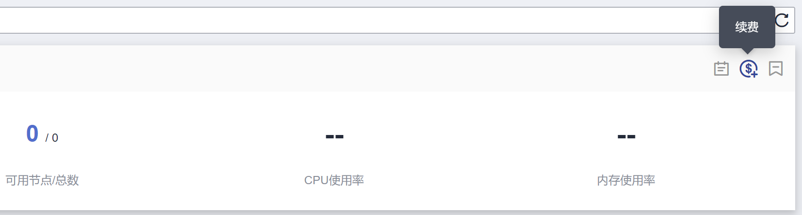

# 续费集群（包年/包月）

客户购买包周期集群后，支持续费包周期资源。

## 操作步骤

本节以计费模式为“包年/包月“的CCE集群为例，介绍如何为购买的集群续费。

> **须知：** 
>包周期的集群超期未续费将会被系统删除，删除后集群内的节点以及运行的业务都将销毁，请务必及时续费或[开通自动续费](https://support.huaweicloud.com/usermanual-billing/renewals_topic_20000003.html)。

1.  登录CCE控制台，在左侧导航栏中选择“集群管理“。
2.  单击待续费集群后的。

    **图 1**  续费集群  
    

3.  在弹出的“续费“页面中，根据系统提示进行续费操作。

    > **说明：** 
    >-   您已选择操作的资源（高亮显示）和其他资源有关联关系，请确认是否同时操作。
    >-   续费周期生效前进行变更，只允许退订实例，不能退订续费周期。
    >-   续费资源不能享受5天无理由退订。

4.  单击“去支付“，在打开的支付页面中核对订单金额，并选择支付方式后单击“确认付款“。
5.  完成付款后，可单击“返回我的订单“或“返回续费管理“页面查看和管理订单信息。

