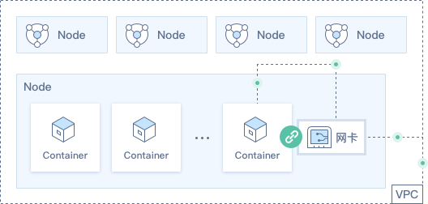
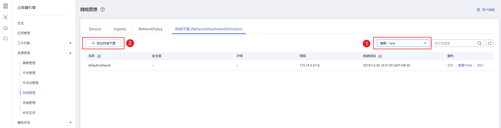
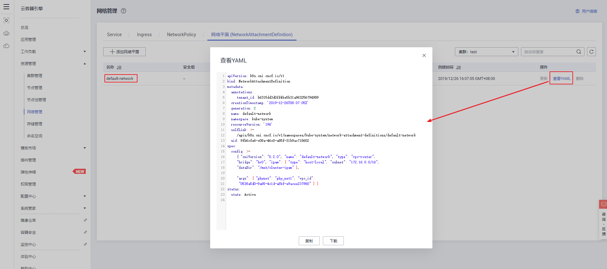
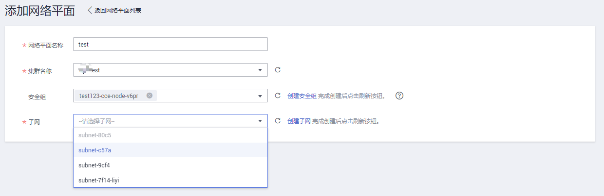
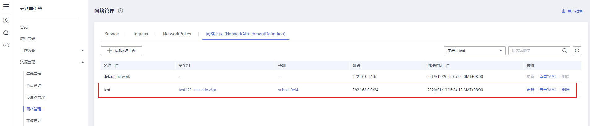
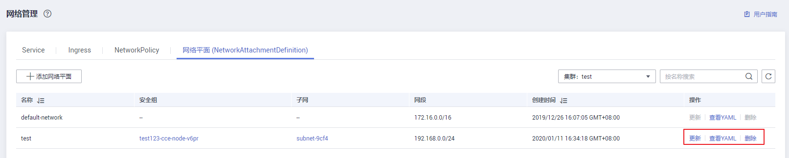

# 网络平面（NetworkAttachmentDefinition）

网络平面（NetworkAttachmentDefinition）是集群的一种crd资源，为容器对接ENI（Elastic Network Interface，弹性网卡服务）提供配置项，如VPC，子网等。关联网络平面的工作负载支持对接弹性网卡服务，容器能直接绑定弹性网卡，并对外提供服务。

**图 1**  网络平面  

## 限制条件

-   仅网络模型为VPC网络的混合集群支持创建。
-   VPC Router网络模型不支持NetworkPolicy。
-   需v1.13.7-r0及以上版本的集群才能启用，v1.13.7-r0以下版本集群需要升级到最新版本后才能启用。

## 通过界面创建

1.  单击CCE左侧导航栏的“资源管理 \> 网络管理”。
2.  在“网络平面（NetworkAttachmentDefinition）“页签下，在右上角选择框中点选要操作的集群，单击“添加网络平面“。

    **图 2**  添加网络平面  
    

    集群默认创建一个“default-network“，默认的network资源包含了tenant\_id、vpc\_id、subnet等等信息。

    **图 3**  默认网络平面  
    

3.  在添加网络平面页面，设置基本信息。

    -   网络平面名称：自定义名称，请输入长度范围为4-63的字符。

        default-network、default、mgnt0、mgnt1四个名称为系统预留，请勿使用。

    -   集群名称：请选择要添加网络平面的集群。
    -   安全组：安全组给弹性网卡提供访问策略，最多可以选择5条，未选择时默认使用缺省安全组。
    -   子网：请选择子网。若无子网可选请单击后方的“创建子网“进行创建，创建完成后单击刷新按钮。

    **图 4**  填写网络平面参数  
    

4.  完成基本配置后单击“创建“，创建完成后页面将自动返回到网络平面列表页，可以看到新添加的网络平面已在列表中。

    **图 5**  添加网络平面成功  
    

## 其他操作

您可以查看新添加网络平面的YAML，也可以对新添加的网络平面进行“删除“操作。

**图 6**  管理网络平面  

