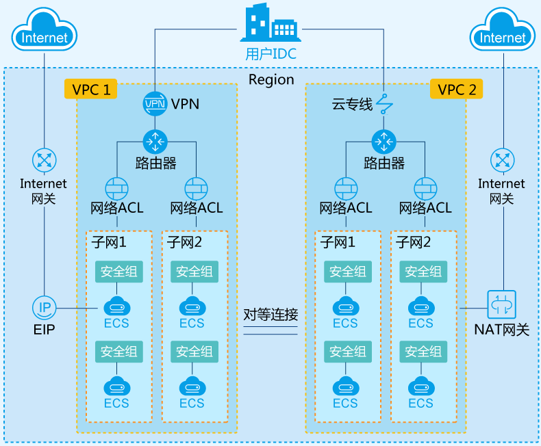
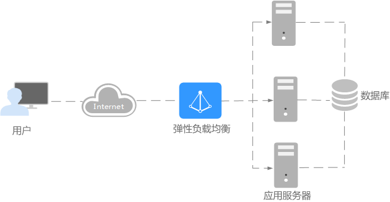

# 网络概述

云容器引擎为满足多种复杂场景下工作负载间的互相访问，提供了不同的访问方式，从而满足不同场景提供不同访问通道。

## 使用约束

-   每个命名空间下，创建的服务数量不能超过6000个。此处的服务对应kubernetes的service资源，即工作负载所添加的服务。
-   容器开启hostPort或hostNetwork网络模式后，若需对外提供服务，则需要给容器所在节点开启对应端口的安全组\(containerPort\)。

## 网络能力

云容器引擎通过将Kubernetes网络和VPC的深度集成，提供了稳定高性能的容器网络。在容器服务中，支持以下类型的互联互通。

-   **集群内访问（ClusterIP）**

    表示工作负载暴露给同一集群内其他工作负载访问的方式，可以通过“集群内部域名“访问。集群内部域名格式为“<自定义的访问方式名称\>.<工作负载所在命名空间\>.svc.cluster.local“，例如“nginx.default.svc.cluster.local“。详细请参见[集群内访问（ClusterIP）](集群内访问(ClusterIP).md)。

-   **节点访问（NodePort）**

    节点访问 \( NodePort \)是指在每个节点的IP上开放一个静态端口，通过静态端口对外暴露服务。节点访问 \( NodePort \)会路由到ClusterIP服务，这个ClusterIP服务会自动创建。通过请求 <NodeIP\>:<NodePort\>，可以从集群的外部访问一个NodePort服务。详细请参见[节点访问（NodePort）](节点访问(NodePort).md)。

    节点访问有VPC内网访问或弹性公网IP访问两种方式：

    -   VPC内网访问：是指无弹性IP时工作负载可以让同一VPC内其他工作负载访问，通过“集群节点的IP”的服务地址访问，主要场景：云上同一VPC内其他工作负载需要访问kubernetes集群内部的工作负载。
    -   弹性公网IP访问：是指通过弹性IP从公网访问工作负载，一般用于系统中需要暴露到公网的服务。该访问方式需要给集群内任一节点绑定弹性IP，并设置一个映射在节点上的端口，其中节点端口的范围在30000-32767之间，例如访问地址为10.117.117.117:30000。

-   **负载均衡 \( LoadBalancer \)**

    通过弹性负载均衡从公网访问工作负载，与弹性IP方式相比提供了高可靠的保障，一般用于系统中需要暴露到公网的服务。访问方式由公网弹性负载均衡ELB服务地址以及设置的访问端口组成，例如“10.117.117.117:80“。详细请参见[负载均衡 \( LoadBalancer \)](负载均衡(LoadBalancer).md)。

-   **DNAT网关 \( DNAT \)**

    “NAT网关“可以为集群节点提供网络地址转换服务，使多个节点可以共享使用弹性IP。与弹性IP方式相比增强了可靠性，弹性IP无需与单个节点绑定，任何节点状态的异常不影响其访问。访问方式由公网弹性IP地址以及设置的访问端口组成，例如“10.117.117.117:80”。详细请参见[DNAT网关 \( DNAT \)](DNAT网关(DNAT).md)。

-   **七层负载均衡（Ingress）**

    与四层负载均衡的区别在于，七层负载均衡支持URI配置，通过对应的URI将访问流量分发到对应的服务。同时，服务根据不同URI实现不同的功能。

    七层负载采用了增强型弹性负载均衡，该访问方式由公网弹性负载均衡ELB服务地址、设置的访问端口组成、定义的URI组成，例如：10.117.117.117:80/helloworld。详细请参见[七层负载均衡（Ingress）](七层负载均衡(Ingress).md)。

## 七层负载均衡（Ingress）

通常情况下，service 和 pod 的 IP 仅可在集群内部访问。集群外部的请求需要通过负载均衡转发到 service 在 Node 上暴露的 NodePort 上，然后再由 kube-proxy 通过边缘路由器 \(edge router\) 将其转发给相关的 Pod 或者丢弃，而 Ingress 就是为进入集群的请求提供路由规则的集合。

Ingress 可以给 service 提供集群外部访问的 URL、负载均衡、SSL 终止、HTTP 路由等。为了配置这些 Ingress 规则，集群管理员需要部署一个 Ingress controller，它监听 Ingress 和 service 的变化，并根据规则配置负载均衡并提供访问入口。

Ingress 的组成部分：

-   Nginx：实现负载均衡到pod的集合。
-   Ingress Controller：从集群api获取services对应pod的ip到nginx配置文件中。
-   Ingress：为nginx创建虚拟主机。

Ingress的创建与管理请参见[七层负载均衡\(Ingress\)](七层负载均衡(Ingress).md)。

## 网络策略（NetworkPolicy）

网络策略（NetworkPolicy）是一种关于pod间及pod与其他网络端点间所允许的通信规则的规范。

NetworkPolicy 资源使用标签选择pod，并定义选定pod所允许的通信规则，详细请参见[网络策略\(NetworkPolicy\)](网络策略(NetworkPolicy).md)。

## 网络底层基础设施

-   **VPC**

    虚拟私有云（Virtual Private Cloud，以下简称VPC），是基于华为云创建的自定义私有网络，不同的专有网络之间彻底逻辑隔离。可以为云服务器、云数据库和负载均衡等构建隔离的、用户自主配置和管理的虚拟网络环境，提升用户云上资源的安全性，简化用户的网络部署。

    您可以在VPC中定义安全组、VPN、IP地址段、带宽等网络特性。用户可以通过VPC方便地管理、配置内部网络，进行安全、快捷的网络变更。同时，用户可以自定义安全组内与组间弹性云服务器的访问规则，加强弹性云服务器的安全保护。具体请参见[什么是虚拟私有云](https://support.huaweicloud.com/productdesc-vpc/zh-cn_topic_0013748729.html)。

    **图 1**  VPC组成  
    

-   **ELB**

    弹性负载均衡（Elastic Load Balance，简称ELB）是将访问流量根据转发策略分发到后端多台服务器的流量分发控制服务。弹性负载均衡可以通过流量分发扩展应用系统对外的服务能力，通过消除单点故障提升应用系统的可用性。具体请参见[什么是弹性负载均衡](https://support.huaweicloud.com/productdesc-elb/zh-cn_topic_0015479966.html)。

    **图 2**  弹性负载均衡  
    

    弹性负载均衡支持经典型、增强型两种负载均衡：

    -   经典型负载均衡：适用于访问量较小，应用模型简单的web业务。
    -   增强型负载均衡：适用于访问量较大的web业务，提供基于域名和URL的路由均衡能力，实现更加灵活的业务转发。

    两者的详细区别请参见[增强型与经典型负载均衡的功能区别](https://support.huaweicloud.com/productdesc-elb/zh_cn_elb_01_0007.html)。

