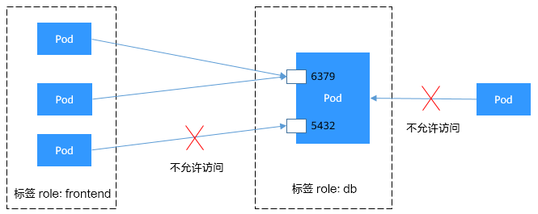
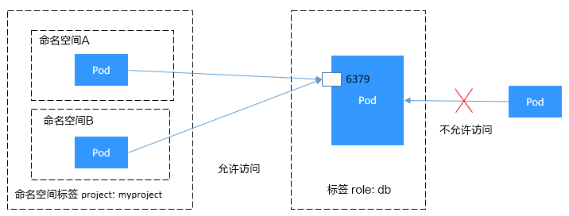

# 网络策略（NetworkPolicy）<a name="cce_10_0059"></a>

NetworkPolicy是Kubernetes设计用来限制Pod访问的对象，通过设置NetworkPolicy策略，可以允许Pod被哪些地址访问（即入规则Ingress）、或Pod访问哪些地址（即出规则Egress）。这相当于从应用的层面构建了一道防火墙，进一步保证了网络安全。

NetworkPolicy支持的能力取决于集群的网络插件的能力，如CCE的集群只支持设置Pod的入规则。

默认情况下，如果命名空间中不存在任何策略，则所有进出该命名空间中的Pod的流量都被允许。

NetworkPolicy的规则可以选择如下3种：

-   namespaceSelector：根据命名空间的标签选择，具有该标签的命名空间都可以访问。
-   podSelector：根据Pod的标签选择，具有该标签的Pod都可以访问。
-   ipBlock：根据网络选择，网段内的IP地址都可以访问。（CCE当前不支持此种方式）

## 约束与限制<a name="section332285584912"></a>

-   当前仅**容器隧道网络模型**的集群支持网络策略（NetworkPolicy）。
-   网络策略（NetworkPolicy）暂不支持设置出方向（egress）。
-   不支持对IPv6地址网络隔离。

## 使用Ingress规则<a name="section24857465594"></a>

-   **使用podSelector设置访问范围**

    ```
    apiVersion: networking.k8s.io/v1
    kind: NetworkPolicy
    metadata:
      name: test-network-policy
      namespace: default
    spec:
      podSelector:                  # 规则对具有role=db标签的Pod生效
        matchLabels:
          role: db
      ingress:                      # 表示入规则
      - from:
        - podSelector:              # 只允许具有role=frontend标签的Pod访问
            matchLabels:
              role: frontend
        ports:                      # 只能使用TCP协议访问6379端口
        - protocol: TCP
          port: 6379
    ```

    示意图如下所示。

    **图 1**  podSelector<a name="zh-cn_topic_0249851123_fig139410543444"></a>  
    


-   **使用namespaceSelector设置访问范围**

    ```
    apiVersion: networking.k8s.io/v1
    kind: NetworkPolicy
    metadata:
      name: test-network-policy
    spec:
      podSelector:                  # 规则对具有role=db标签的Pod生效
        matchLabels:
          role: db
      ingress:                      # 表示入规则
      - from:
        - namespaceSelector:        # 只允许具有project=myproject标签的命名空间中的Pod访问
            matchLabels:
              project: myproject
        ports:                      # 只能使用TCP协议访问6379端口
        - protocol: TCP
          port: 6379
    ```

    示意图如下所示。

    **图 2**  namespaceSelector<a name="zh-cn_topic_0249851123_fig127351855617"></a>  
    


## 在控制台创建网络策略<a name="section349662212313"></a>

1.  登录CCE控制台，单击集群名称进入集群。
2.  在左侧导航栏中选择“服务发现“，在右侧选择“网络策略“页签，单击右上角“创建网络策略“。
    -   策略名称：自定义输入NetworkPolicy名称。
    -   命名空间：选择网络策略所在命名空间。
    -   选择器：输入标签选择要关联的Pod，然后单击添加。您也可以单击“引用负载标签“直接引用已有负载的标签。
    -   入方向规则：单击添加入方向规则，参数设置请参见[表1](#table166419994515)。

        

        **表 1**  添加入方向规则

        <a name="table166419994515"></a>
        <table><thead align="left"><tr id="row186401397458"><th class="cellrowborder" valign="top" width="15%" id="mcps1.2.3.1.1"><p id="p163919913452"><a name="p163919913452"></a><a name="p163919913452"></a>参数</p>
        </th>
        <th class="cellrowborder" valign="top" width="85%" id="mcps1.2.3.1.2"><p id="p9639394455"><a name="p9639394455"></a><a name="p9639394455"></a>参数说明</p>
        </th>
        </tr>
        </thead>
        <tbody><tr id="row13640129124519"><td class="cellrowborder" valign="top" width="15%" headers="mcps1.2.3.1.1 "><p id="p5640395455"><a name="p5640395455"></a><a name="p5640395455"></a>协议端口</p>
        </td>
        <td class="cellrowborder" valign="top" width="85%" headers="mcps1.2.3.1.2 "><p id="p1864016912457"><a name="p1864016912457"></a><a name="p1864016912457"></a>请选择对应的协议类型和端口，目前支持TCP和UDP协议。</p>
        </td>
        </tr>
        <tr id="row1164011917451"><td class="cellrowborder" valign="top" width="15%" headers="mcps1.2.3.1.1 "><p id="p66400984510"><a name="p66400984510"></a><a name="p66400984510"></a>源对象命名空间</p>
        </td>
        <td class="cellrowborder" valign="top" width="85%" headers="mcps1.2.3.1.2 "><p id="p164014916457"><a name="p164014916457"></a><a name="p164014916457"></a>选择允许哪个命名空间的对象访问。不填写表示和当前策略属于同一命名空间。</p>
        </td>
        </tr>
        <tr id="row1564115912452"><td class="cellrowborder" valign="top" width="15%" headers="mcps1.2.3.1.1 "><p id="p8640792450"><a name="p8640792450"></a><a name="p8640792450"></a>源对象Pod标签</p>
        </td>
        <td class="cellrowborder" valign="top" width="85%" headers="mcps1.2.3.1.2 "><p id="p590912241576"><a name="p590912241576"></a><a name="p590912241576"></a>允许带有这个标签的Pod访问，不填写表示命名空间下全部Pod。</p>
        </td>
        </tr>
        </tbody>
        </table>

3.  设置完成后，单击“确定“。

