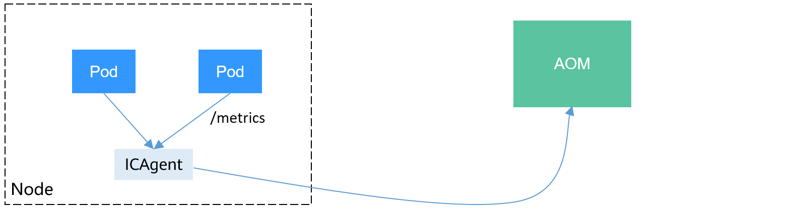
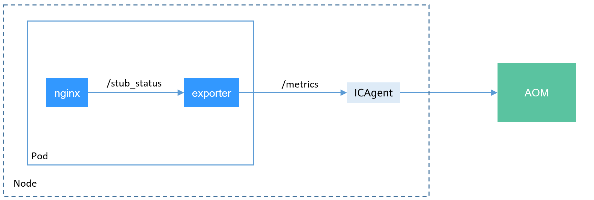
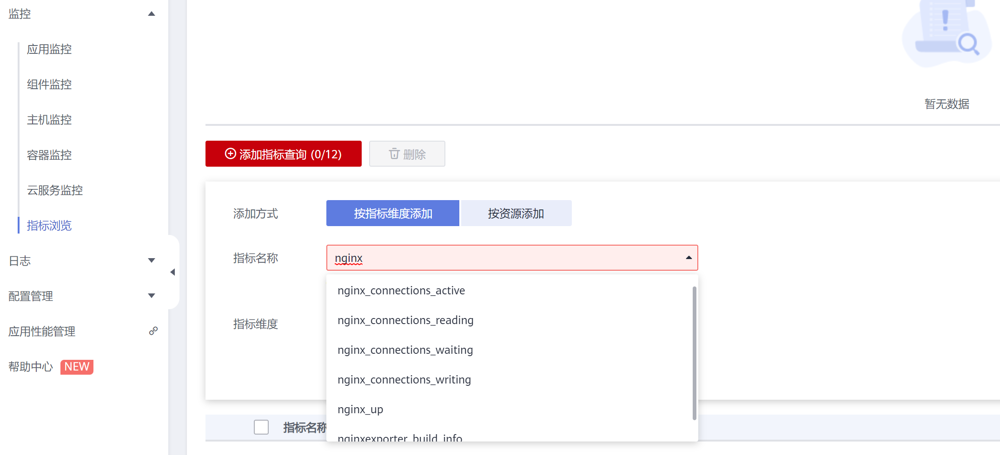

# 自定义监控<a name="cce_10_0201"></a>

CCE支持上传自定义指标到AOM，节点上的ICAgent会定期调用负载中配置的监控指标接口读取监控数据，然后上传到AOM上。



负载的自定义指标接口可以在创建时配置。本文将通过一个Nginx应用的示例演示如何上报自定义监控指标到AOM。

## 约束与限制<a name="section11634016215"></a>

-   ICAgent兼容[Prometheus](https://prometheus.io/)的监控数据规范，Pod提供的自定义指标必须满足Prometheus的监控数据规范才能够被ICAgent采集。
-   ICAgent仅支持上报[Gauge指标类型](https://prometheus.io/docs/concepts/metric_types/)的指标。
-   ICAgent调用自定义指标的接口周期为1分钟，不支持修改。

## Prometheus监控数据采集说明<a name="section173671127160"></a>

Prometheus通过周期性的调用应用程序的监控指标接口（默认为“/metrics“）获取监控数据，应用程序需要提供监控指标接口Prometheus调用，且监控数据需要满足Prometheus的规范，如下所示。

```
# TYPE nginx_connections_active gauge
nginx_connections_active 2
# TYPE nginx_connections_reading gauge
nginx_connections_reading 0
```

Prometheus提供了各种语言的客户端，客户端具体请参见[Prometheus CLIENT LIBRARIES](https://prometheus.io/docs/instrumenting/clientlibs/)，开发Exporter具体方法请参见[WRITING EXPORTERS](https://prometheus.io/docs/instrumenting/writing_exporters/)。Prometheus社区提供丰富的第三方exporter可以直接使用，具体请参见[EXPORTERS AND INTEGRATIONS](https://prometheus.io/docs/instrumenting/exporters/)。

## 准备应用<a name="section14984815298"></a>

Nginx本身有个名叫ngx\_http\_stub\_status\_module的模块，这个模块提供了基本的监控功能，通过在nginx.conf的配置可以提供一个对外访问Nginx监控数据的接口，如下所示，在http下添加server配置即可让nginx提供对外访问的监控数据的接口。

```
user  nginx;
worker_processes  auto;

error_log  /var/log/nginx/error.log warn;
pid        /var/run/nginx.pid;

events {
    worker_connections  1024;
}

http {
    include       /etc/nginx/mime.types;
    default_type  application/octet-stream;
    log_format  main  '$remote_addr - $remote_user [$time_local] "$request" '
                      '$status $body_bytes_sent "$http_referer" '
                      '"$http_user_agent" "$http_x_forwarded_for"';

    access_log  /var/log/nginx/access.log  main;
    sendfile        on;
    #tcp_nopush     on;
    keepalive_timeout  65;
    #gzip  on;
    include /etc/nginx/conf.d/*.conf;

    server {
      listen 8080;
      server_name  localhost;
      location /stub_status {
         stub_status on;
         access_log off;
      }
    }
}
```

将上面配置保存到nginx.conf文件，使用该配置重新制作一个镜像，Dockerfile文件如下所示。

```
FROM nginx:1.21.5-alpine
ADD nginx.conf /etc/nginx/nginx.conf
EXPOSE 80
CMD ["nginx", "-g", "daemon off;"]
```

使用上面Dockerfile构建镜像并上传到SWR镜像仓库，镜像名称为nginx:exporter。上传镜像的具体方法请参见[客户端上传镜像](https://support.huaweicloud.com/usermanual-swr/swr_01_0011.html)。

**docker build -t nginx:exporter .**

**docker tag nginx:exporter swr.cn-east-3.myhuaweicloud.com/dev-container/nginx:exporter**

**docker push swr.cn-east-3.myhuaweicloud.com/dev-container/nginx:exporter**

使用nginx:exporter运行容器后，可以通过http://<ip\_address\>:8080/stub\_status获取到nginx的监控数据，其中<ip\_address\>为容器的IP地址，监控数据如下所示。

```
# curl http://127.0.0.1:8080/stub_status
Active connections: 3 
server accepts handled requests
 146269 146269 212 
Reading: 0 Writing: 1 Waiting: 2
```

## 部署应用<a name="section1539954011362"></a>

如上所述的nginx:exporter提供的监控数据，其数据格式并不满足Prometheus的要求，需要将其转换成Prometheus需要的格式，可以使用[nginx-prometheus-exporter](https://github.com/nginxinc/nginx-prometheus-exporter)来转换Nginx的指标，如下所示。



使用nginx:exporter和nginx-prometheus-exporter部署到同一个Pod，如下所示。

```
kind: Deployment
apiVersion: apps/v1
metadata:
  name: nginx-exporter
  namespace: default
spec:
  replicas: 1
  selector:
    matchLabels:
      app: nginx-exporter
  template:
    metadata:
      labels:
        app: nginx-exporter
      annotations:
        metrics.alpha.kubernetes.io/custom-endpoints: '[{"api":"prometheus","path":"/metrics","port":"9113","names":""}]'
    spec:
      containers:
        - name: container-0
          image: 'nginx:exporter'  # 替换为您上传到SWR的镜像地址
          resources:
            limits:
              cpu: 250m
              memory: 512Mi
            requests:
              cpu: 250m
              memory: 512Mi
        - name: container-1
          image: 'nginx/nginx-prometheus-exporter:0.9.0'
          command:
            - nginx-prometheus-exporter
          args:
            - '-nginx.scrape-uri=http://127.0.0.1:8080/stub_status'
      imagePullSecrets:
        - name: default-secret
```

> **说明：** 
>nginx/nginx-prometheus-exporter:0.9.0需要从公网拉取，需要集群节点上有一个公网IP。

nginx-prometheus-exporter需要一个启动命令，nginx-prometheus-exporter -nginx.scrape-uri=http://127.0.0.1:8080/stub\_status，用于获取nginx的监控数据。

另外Pod需要添加一个annotations，metrics.alpha.kubernetes.io/custom-endpoints: '\[\{"api":"prometheus","path":"**/metrics**","port":"**9113**","names":""\}\]'。

## 配置验证<a name="section42551081185"></a>

应用部署后，可以通过访问Nginx构造一些访问数据，然后在AOM中查看是否能够获取到相应的监控数据。

```
$ kubectl get pod
NAME                              READY   STATUS    RESTARTS   AGE
nginx-exporter-78859765db-6j8sw   2/2     Running   0          4m
$ kubectl exec -it nginx-exporter-78859765db-6j8sw -- /bin/sh
Defaulting container name to container-0.
Use 'kubectl describe pod/nginx-exporter-78859765db-6j8sw -n default' to see all of the containers in this pod.
/ # curl http://localhost
<!DOCTYPE html>
<html>
<head>
<title>Welcome to nginx!</title>
<style>
html { color-scheme: light dark; }
body { width: 35em; margin: 0 auto;
font-family: Tahoma, Verdana, Arial, sans-serif; }
</style>
</head>
<body>
<h1>Welcome to nginx!</h1>
<p>If you see this page, the nginx web server is successfully installed and
working. Further configuration is required.</p>

<p>For online documentation and support please refer to
<a href="http://nginx.org/">nginx.org</a>.<br/>
Commercial support is available at
<a href="http://nginx.com/">nginx.com</a>.</p>

<p><em>Thank you for using nginx.</em></p>
</body>
</html>
/ #
```

可以看到访问了一次Nginx。

登录AOM，在左侧目录选择“监控 \> 指标浏览“，可以查看到Nginx相关的监控指标，如“nginx\_connections\_active“。



