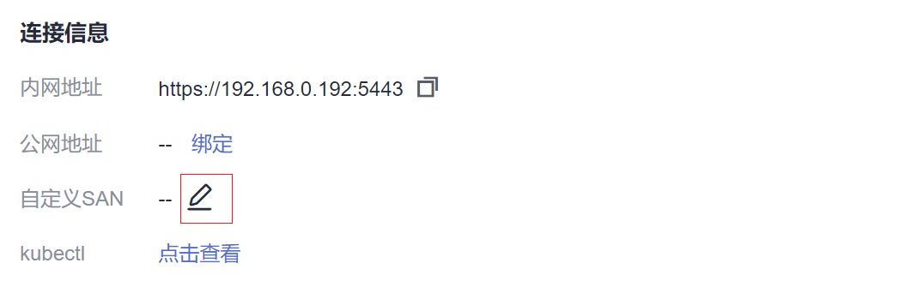

# 自定义集群证书SAN

## 操作场景

集群服务端证书中签入的**主题备用名称（Subject Alternative Name，缩写SAN）**。SAN通常在TLS握手阶段被用于客户端校验服务端的合法性：服务端证书是否被客户端信任的CA所签发，且证书中的SAN是否与客户端实际访问的IP地址或DNS域名匹配。

当客户端无法直接访问集群内网私有IP地址或者公网弹性IP地址时，您可以将客户端可直接访问的IP地址或者DNS域名签入集群服务端证书，以支持客户端开启双向认证，提高安全性。典型场景例如DNAT访问、域名访问等特殊场景。

## 约束与限制

仅支持1.19及以上版本集群。

## 域名双向认证说明

从1.19，1.21版本集群支持域名双向认证。域名双向认证有如下特点：

-   下载最新的kubectl配置文件kubeconfig.json时，kubeconfig.json默认配置双向认证，并配置当前集群所有可访问地址（包括集群的内网私有IP地址、集群的公网弹性IP地址、自定义域名）。
-   集群绑定或解绑弹性IP、配置或更新自定义域名时，集群服务端证书将同步签入最新的集群访问地址（包括集群绑定的弹性IP、集群配置的所有自定义域名）。
-   异步同步集群通常耗时约5-10min，同步结果可以在操作记录中查看“同步证书”。

早期创建的1.19版本集群未开启域名双向认证。您可以通过在下载的kubectl配置文件kubeconfig.json中查看是否已经开启域名双向认证，如果包含"insecure-skip-tls-verify": true则说明未开启，如[图1](#fig1941342411)所示。您可以重新下载kubeconfig.json文件开启域名双向认证。

**图 1**  未开启域名双向认证  

## 添加自定义SAN

1.  登录CCE控制台。
2.  在集群列表中单击集群，进入集群详情页。
3.  在连接信息的自定义SAN处单击，在弹出的窗口中添加IP地址或域名，然后单击“保存“。

    

    > **说明：** 
    >1. 当前操作将会短暂重启kube-apiserver并更新kubeConfig.json文件，请避免在此期间操作集群。
    >2. 请输入域名或ip，以英文逗号（,）分隔，最多128个。
    >3. 自定义域名如需绑定弹性公网，请确保已配置公网地址。

## 域名访问场景的典型使用方式

-   客户端配置Host域名指定DNS域名地址，或者客户端主机配置/etc/hosts，添加响应域名映射。
-   云上内网使用，云解析服务DNS支持配置集群弹性IP与自定义域名的映射关系。后续更新弹性IP可以继续使用双向认证+自定义域名访问集群，无需重新下载kubeconfig.json配置文件。
-   自建DNS服务器，自行添加A记录。

