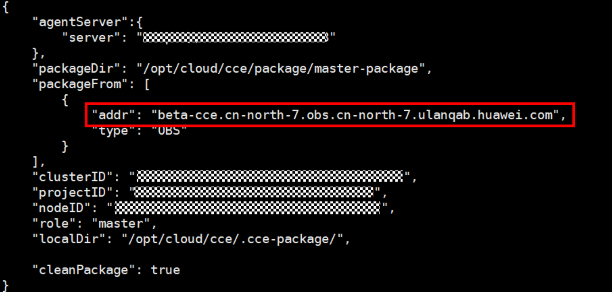

# 节点CCEAgent版本检查<a name="cce_10_0442"></a>

## 检查项内容<a name="section02471314164418"></a>

检测当前节点的CCE包管理组件cce-agent是否为最新版本。

## 解决方案<a name="section17382153594420"></a>

cce-agent非最新版本时，自动更新失败，该问题通常由OBS地址失效或组件版本过低引起。

1.  登录检查通过的**正常节点**，获取cce-agent配置文件路径，查看有效OBS地址。

    ```
    cat `ps aux | grep cce-agent | grep -v grep | awk -F '-f ''{print $2}'`
    ```

    配置文件内的OBS配置地址字段为packageFrom.addr

    

2.  登陆检查失败的**异常节点**，参考上一步重新获取OBS地址，检查是否一致。若不一致，请将异常节点的OBS地址修改为正确地址。
3.  通过以下命令下载最新的二进制文件。
    -   x86系统

        ```
        curl -k "https://{您获取的obs地址}/cluster-versions/base/cce-agent" > /tmp/cce-agent
        ```

    -   ARM系统

        ```
        curl -k "https://{您获取的obs地址}/cluster-versions/base/cce-agent-arm" > /tmp/cce-agent-arm
        ```

4.  替换原有的cce-agent二进制文件。
    -   x86系统

        ```
        mv -f /tmp/cce-agent /usr/local/bin/cce-agent
        chmod 750 /usr/local/bin/cce-agent
        chown root:root /usr/local/bin/cce-agent
        ```

    -   ARM系统

        ```
        mv -f /tmp/cce-agent-arm /usr/local/bin/cce-agent-arm
        chmod 750 /usr/local/bin/cce-agent-arm
        chown root:root /usr/local/bin/cce-agent-arm
        ```

5.  重启cce-agent服务。

    ```
    systemctl restart cce-agent
    ```

    若您对上述执行过程有疑问，请联系技术支持人员。


