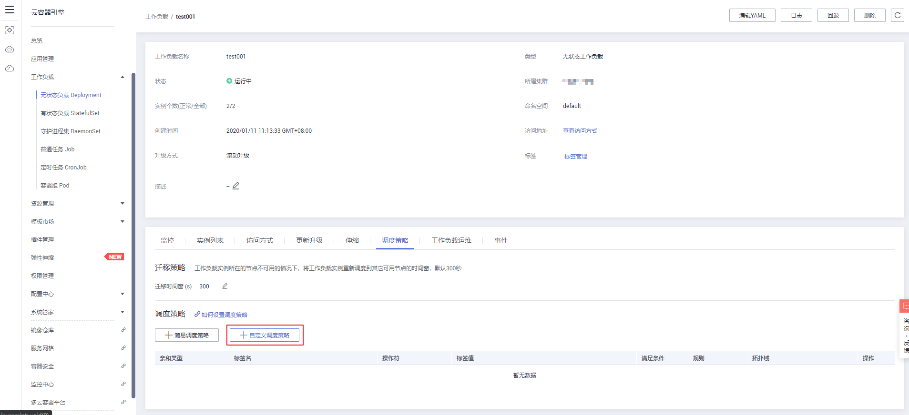
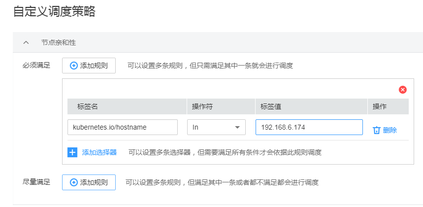

# 节点亲和性<a name="cce_01_0232"></a>

## 通过控制台设置<a name="section14975195565810"></a>

1.  登录[CCE控制台](https://console.huaweicloud.com/cce2.0/?utm_source=helpcenter)，在左侧导航栏中选择“工作负载 \> 无状态负载 Deployment”或“工作负载 \> 有状态负载 StatefulSet”。
2.  在无状态工作负载或有状态工作负载列表中，单击工作负载名称进入详情页，单击“调度策略 \> 自定义调度策略”。

    **图 1**  自定义调度策略<a name="fig1149695815347"></a>  
    

3.  在节点亲和性设置中，依据节点中的标签进行业务需求的设置。

    > **说明：**   
    >节点亲和性调度支持必须满足和尽量满足（硬约束Required/软约束Preferred），以及可以设置相应的匹配关系（In, NotIn, Exists, DoesNotExist, Gt, and Lt）：  
    >-   **必须满足：**即硬约束，设置必须要满足的条件，对应于requiredDuringSchedulingIgnoredDuringExecution，您可以添加多条必须满足的规则，多条规则间是一种“或”的关系，即只需要满足一条规则即会进行调度。  
    >-   **尽量满足：**即软约束，设置尽量满足的条件，对应于preferredDuringSchedulingIgnoredDuringExecution，您可以添加多条尽量满足的规则，无论是满足其中一条或者是都不满足都会进行调度。另外可以为规则设置权重值，权重值越高会被优先调度。  
    >-   **选择器：**对应于matchExpressions，您可以添加多条选择器，多条选择器之间是一种“与”的关系，即需要满足全部选择器才能依据此条规则进行调度。  
    >-   **标签名：**对应节点的标签，可以使用默认的标签也可以用户自定义标签。  
    >-   **匹配关系：**即操作符，可以设置六种匹配关系（In, NotIn, Exists, DoesNotExist. Gt, and Lt）。In和NotIn操作符可以添加单个值或者多个value值（多值使用；进行划分），Exists和DoesNotExist判断某个label是否存在，不需设置value值。Gt和Lt判断label的值大于或者小于某个值（value值要求整数）。  

    **图 2**  节点亲和性调度策略<a name="fig1738211131918"></a>  
    


## 通过kubectl命令行设置<a name="section9155952131619"></a>

本节以nginx为例，创建[图2](#fig1738211131918)中的节点亲和性。

**前提条件**

已有使用nginx容器的工作负载和节点。

**操作步骤**

使用内置节点标签kubernetes.io/hostname，并添加相应的节点，同时设置操作符为In，最后单击“确定“提交。

设置后的工作负载节点亲和性所得的yaml如下：

```
apiVersion: extensions/v1beta1
kind: Deployment
metadata:
  name: nginx
  namespace: default
spec:
  replicas: 2
  selector:
    matchLabels:
      app: nginx
  template:
    metadata:
      labels:
        app: nginx
    spec:
      imagePullSecrets:
        - name: default-secret
      affinity:
        nodeAffinity:
          requiredDuringSchedulingIgnoredDuringExecution:
            nodeSelectorTerms:
              - matchExpressions:
                  - key: kubernetes.io/hostname
                    operator: In
                    values:
                      - 192.168.6.174
```

