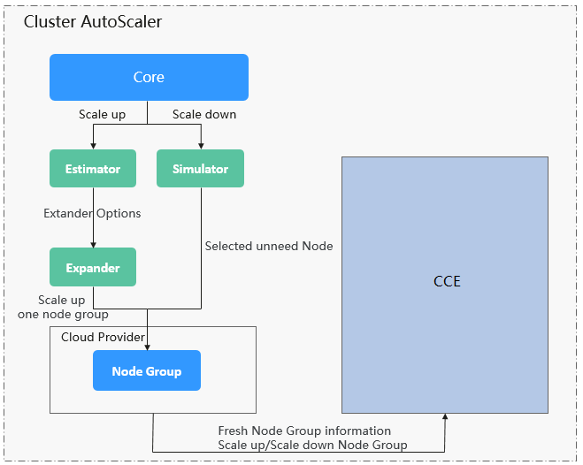

# 节点伸缩原理

HPA是针对Pod级别的，但是如果集群的资源不够了，那就只能对节点进行扩容了。集群节点的弹性伸缩本来是一件非常麻烦的事情，但是好在现在的集群大多都是构建在云上，云上可以直接调用接口添加删除节点，这就使得集群节点弹性伸缩变得非常方便。

[Autoscaler](https://github.com/kubernetes/autoscaler/tree/master/cluster-autoscaler)是Kubernetes提供的集群节点弹性伸缩组件，根据Pod调度状态及资源使用情况对集群的节点进行自动扩容缩容。

## 前提条件

使用节点伸缩功能前，需要安装[autoscaler](autoscaler.md)插件，插件版本要求1.13.8及以上。

## Autoscaler工作原理

Autoscaler（简称CA）的主要流程包括两部分：

-   ScaleUp流程： CA会每隔10s检查一次所有不可调度的Pod，根据用户设置的策略，选择出一个符合要求的节点组进行扩容。
-   ScaleDown流程：CA每隔10s会扫描一次所有的Node，如果该Node上所有的Pod Requests少于用户定义的缩容百分比时，CA会模拟将该节点上的Pod是否能迁移到其他节点，如果可以的话，当满足不被需要的时间窗以后，该节点就会被移除。

如上所述，当集群节点处于一段时间空闲状态时（默认10min），会触发集群缩容操作。

当节点存在以下几种状态的pod时，不可缩容：

1.  节点上的Pod有设置PodDisruptionBudget，当移除Pod不满足对应条件时，节点不会缩容。
2.  节点上的Pod由于一些限制，如亲和、反亲和或者taints等，无法调度到其他节点，节点不会缩容。
3.  节点上的Pod拥有"cluster-autoscaler.kubernetes.io/safe-to-evict": "false"这个annotations时，节点不缩容。
4.  节点上存在kube-system命名空间下的Pod（除kube-system命名空间下Daemonset创建的Pod），节点不缩容。
5.  节点上有非controller（Deployment/ReplicaSet/Job/StatefulSet）创建的Pod，节点不缩容。

## AutoScaler架构

AutoScaler架构如[图1](#fig114831750115719)所示，主要由以下几个核心模块组成：

**图 1**  AutoScaler架构图  

**说明如下：**

-   Estimator： 负责扩容场景下，评估满足当前不可调度Pod时，每个节点池需要扩容的节点数量。
-   Simulator： 负责缩容场景下，找到满足缩容条件的节点。
-   Expander： 负责在扩容场景下，根据用户设置的不同的策略来，从Estimator选出的节点池中，选出一个最佳的选择。当前Expander有多种策略：
    -   Random： 随机选择一个节点池，如果用户没有设置的话，默认是Random。
    -   most-Pods： 选择此次扩容后能满足调度最多Pod的节点池，如果有相同的，再随机选择一个。
    -   least-waste： 选择此次扩容完成后，具有最小浪费的CPU或者Mem资源的节点池。
    -   price： 选择此次扩容所需节点金额最小的节点池。
    -   priority： 根据用户自定义的权重，选择权重最高的节点池。

**当前CCE提供除Price以外的所有的策略，当前CCE插件默认使用least-waste策略。**

