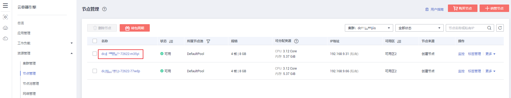
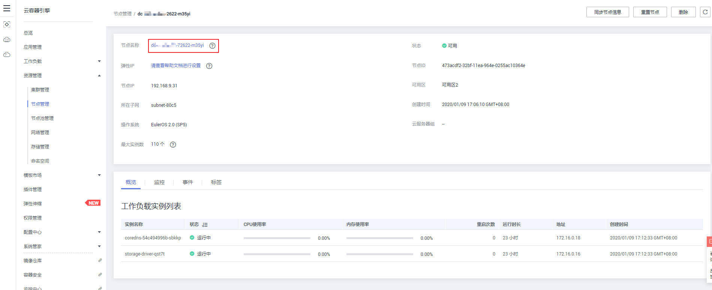
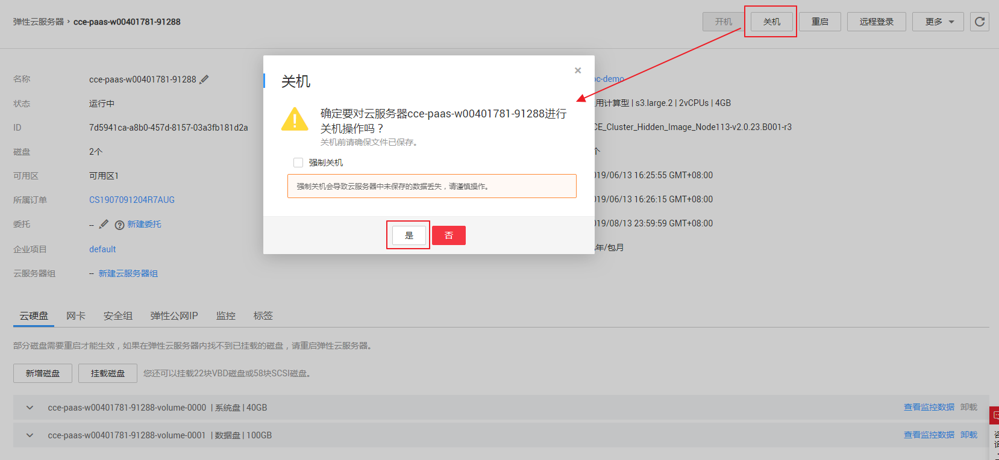

# 节点关机

集群中的节点关机后，该节点以及节点内的业务将停止运行，节点关机前，请先确认您的正常业务运行将不受影响，请谨慎操作。

节点关机后不再收费，详情请参见[CCE计费说明](https://support.huaweicloud.com/price-cce/zh-cn_topic_0088404328.html)。

## 限制条件

-   节点关机会涉及Pod迁移，可能会影响业务，请在业务低峰期操作。
-   操作过程中可能存在非预期风险，请提前做好相关的数据备份。
-   操作过程中，后台会把当前节点设置为不可调度状态。
-   节点关机仅能对Worker节点关机，不会对Master节点关机。

## 操作方法

1.  登录[CCE控制台](https://console.huaweicloud.com/cce2.0/?utm_source=helpcenter)，在左侧导航栏中选择“资源管理 \> 节点管理“。
2.  在节点管理列表中，单击待关机节点的名称，进入节点管理详情页。

    **图 1**  节点管理  
    

3.  单击“基本信息“中的节点名称，进入云服务器控制台中的弹性云服务器详情页。

    **图 2**  节点详情页  
    

4.  在弹性云服务器详情页中，单击右上角的“关机“，在弹出的关机窗口中单击“是“，即可完成关机操作。

    **图 3**  弹性云服务器详情页  
    

