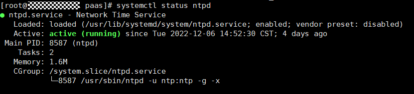
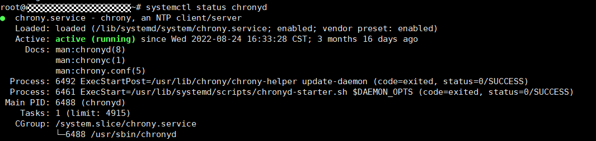

# 节点时钟同步服务器检查

## 检查项内容

检查节点时钟同步服务器ntpd或chronyd是否运行正常。

## 解决方案

-   **问题场景一：ntpd运行异常**

    请登陆该节点，执行**systemctl status ntpd**命令查询ntpd服务运行状态。若回显状态异常，请执行**system restart ntpd**命令后重新查询状态。

    以下为正常回显：

    

    若重启ntpd服务无法解决该问题，请联系技术支持人员。

-   **问题场景二：chronyd运行异常**

    请登陆该节点，执行**systemctl status chronyd**命令查询chronyd服务运行状态。若回显状态异常，请执行**system restart chronyd**命令后重新查询状态。

    以下为正常回显：

    

    若重启chronyd服务无法解决该问题，请联系技术支持人员。

