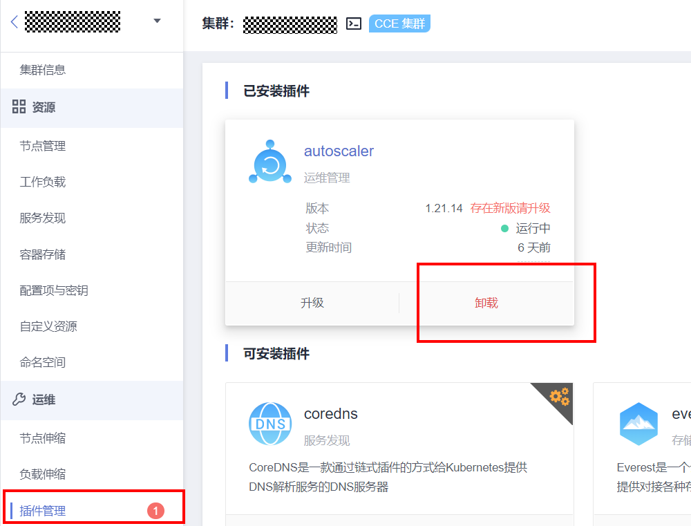
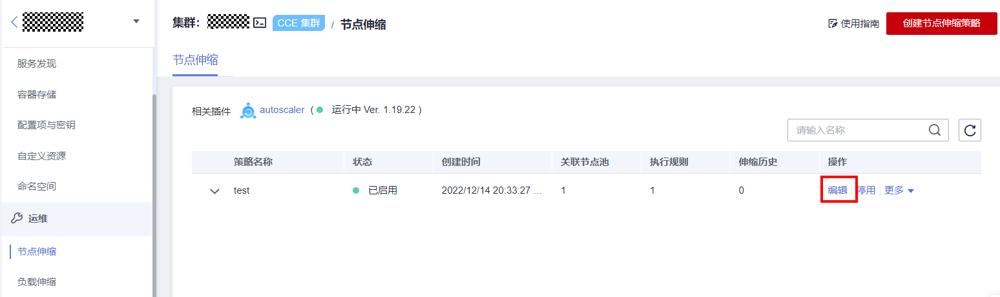
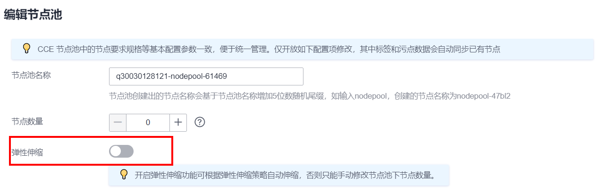

# 节点池检查

## 检查项内容

当前检查项包括以下内容：

-   检查节点池状态是否正常
-   检查节点池弹性伸缩能力是否关闭

## 解决方案

-   **问题场景一：节点池状态异常**

    请登录CCE控制台，前往“集群信息-\>资源-\>节点管理-\>节点池”，查看问题节点池状态。若该节点池状态处于伸缩中，请等待节点池伸缩完毕，并参考[问题场景二](#li2791152121810)关闭节点池弹性伸缩能力。

    

-   **问题场景二：节点池弹性伸缩能力未关闭**

    **解决方案一（推荐）**

    请登录CCE控制台，前往“集群信息-\>运维-\>插件管理-\>autoscaler插件”处，卸载该插件。

    

    > **说明：** 
    >卸载autoscaler插件前，请单击“升级“按钮，备份当前插件配置，便于重装时还原插件配置。
    >卸载autoscaler插件前，请进入“运维-\>节点伸缩页面”，备份当前伸缩策略，便于重装时还原节点伸缩策略，这些策略会随autoscaler插件卸载而清除。

    节点伸缩策略：通过编辑按钮获取并备份

    

    **解决方案二**

    若您并不希望卸载autoscaler插件，请登录CCE控制台，前往“集群信息-\>节点管理-\>节点池”，单击对应节点池的“编辑”按钮，关闭弹性伸缩功能。

    

    > **说明：** 
    >关闭弹性伸缩时，请备份当前节点池弹性伸缩配置，便于开启时还原配置。

