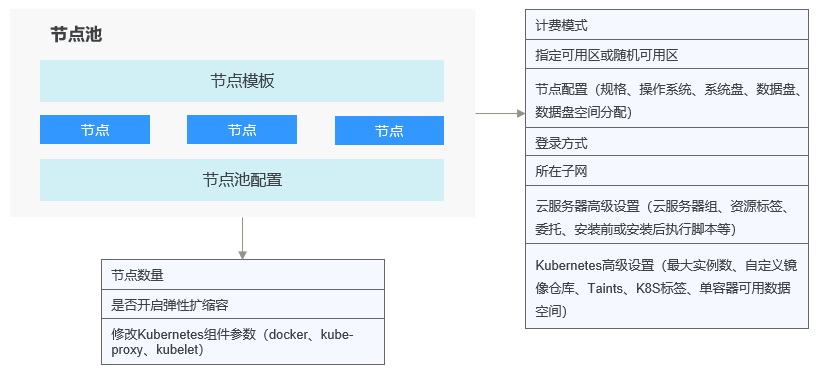

# 节点池概述

-   [简介](#section11993204511284)
-   [节点池架构](#section1486732122217)
-   [应用场景](#section32131316256)
-   [功能点及注意事项](#section0234145518267)
-   [将工作负载部署到特定节点池](#section12603142443319)
-   [相关操作](#section17716744163316)

## 简介

为帮助您更好地管理Kubernetes集群内的节点，云容器引擎CCE引入节点池概念。节点池是集群中具有相同配置的一组节点，一个节点池包含一个节点或多个节点。

您可以在[CCE控制台](https://console.huaweicloud.com/cce2.0/?utm_source=helpcenter)中创建新的自定义节点池，借助节点池基本功能方便快捷地创建、管理和销毁节点，而不会影响整个集群。新节点池中所有节点的参数和类型都彼此相同，您无法在节点池中配置单个节点，任何配置更改都会影响节点池中的所有节点。

在云容器引擎中，创建集群时配置的节点参数和类型将成为默认节点池“DefaultPool”，该节点池不可编辑、删除或迁移，也不支持扩容、弹性伸缩。

通过节点池功能您还可以实现节点的动态扩缩容：

-   当集群中出现因资源不足而无法调度的实例（Pod）时，自动触发扩容，为您减少人力成本。
-   当满足节点空闲等缩容条件时，自动触发缩容，为您节约资源成本。

本章节介绍节点池在云容器引擎（CCE）中的工作原理，以及如何创建和管理节点池。

## 节点池架构

**图 1**  节点池整体架构图  

通常情况下，节点池内的节点均具有如下相同属性：

-   节点操作系统。
-   节点Kubernetes组件启动参数。
-   节点自定义启动脚本。
-   节点“K8S标签“及“Taints“设置。

此外，CCE将同时围绕节点池扩展以下属性：

-   节点池级别操作系统。
-   节点池级别每节点的Pod数上限。

## 应用场景

当业务需要使用大规模集群时，推荐您使用节点池进行节点管理，以提高大规模集群易用性。

下表介绍了多种大规模集群管理场景，并分别展示节点池在每种场景下发挥的作用：

**表 1**  节点池场景及作用

<table><thead align="left"><tr id="row336414719256"><th class="cellrowborder" valign="top" width="39.32%" id="mcps1.2.3.1.1">
场景

</th>
<th class="cellrowborder" valign="top" width="60.68%" id="mcps1.2.3.1.2">
作用

</th>
</tr>
</thead>
<tbody><tr id="row736464715258"><td class="cellrowborder" valign="top" width="39.32%" headers="mcps1.2.3.1.1 ">
集群存在较多异构节点（机型配置不同）

</td>
<td class="cellrowborder" valign="top" width="60.68%" headers="mcps1.2.3.1.2 ">
通过节点池可规范节点分组管理。

</td>
</tr>
<tr id="row1136494714252"><td class="cellrowborder" valign="top" width="39.32%" headers="mcps1.2.3.1.1 ">
集群需要频繁扩缩容节点

</td>
<td class="cellrowborder" valign="top" width="60.68%" headers="mcps1.2.3.1.2 ">
通过节点池可降低操作成本。

</td>
</tr>
<tr id="row1936417470257"><td class="cellrowborder" valign="top" width="39.32%" headers="mcps1.2.3.1.1 ">
集群内应用程序调度规则复杂

</td>
<td class="cellrowborder" valign="top" width="60.68%" headers="mcps1.2.3.1.2 ">
通过节点池标签可快速指定业务调度规则。

</td>
</tr>
<tr id="row53641847192519"><td class="cellrowborder" valign="top" width="39.32%" headers="mcps1.2.3.1.1 ">
集群内节点日常维护

</td>
<td class="cellrowborder" valign="top" width="60.68%" headers="mcps1.2.3.1.2 ">
通过节点池可便捷操作 Kubernetes 版本升级、Docker 版本升级。

</td>
</tr>
</tbody>
</table>

## 功能点及注意事项

<table><thead align="left"><tr id="row15843151716271"><th class="cellrowborder" valign="top" width="21.942194219421943%" id="mcps1.1.4.1.1">
功能点

</th>
<th class="cellrowborder" valign="top" width="39.603960396039604%" id="mcps1.1.4.1.2">
功能说明

</th>
<th class="cellrowborder" valign="top" width="38.453845384538454%" id="mcps1.1.4.1.3">
注意事项

</th>
</tr>
</thead>
<tbody><tr id="row68431917172718"><td class="cellrowborder" valign="top" width="21.942194219421943%" headers="mcps1.1.4.1.1 ">
创建节点池

</td>
<td class="cellrowborder" valign="top" width="39.603960396039604%" headers="mcps1.1.4.1.2 ">
新增节点池， 暂不支持包年包月类型。

</td>
<td class="cellrowborder" valign="top" width="38.453845384538454%" headers="mcps1.1.4.1.3 ">
单个集群不建议超过100个节点池。

</td>
</tr>
<tr id="row1084351717279"><td class="cellrowborder" valign="top" width="21.942194219421943%" headers="mcps1.1.4.1.1 ">
删除节点池

</td>
<td class="cellrowborder" valign="top" width="39.603960396039604%" headers="mcps1.1.4.1.2 ">
删除节点池时会先删除节点池中的节点，原有节点上的工作负载实例会自动迁移至其他节点池的可用节点。

</td>
<td class="cellrowborder" valign="top" width="38.453845384538454%" headers="mcps1.1.4.1.3 ">
如果工作负载实例具有特定的节点选择器，且如果集群中的其他节点均不符合标准，则工作负载实例可能仍处于无法安排的状态。

</td>
</tr>
<tr id="row118434173271"><td class="cellrowborder" valign="top" width="21.942194219421943%" headers="mcps1.1.4.1.1 ">
节点池开启弹性伸缩

</td>
<td class="cellrowborder" valign="top" width="39.603960396039604%" headers="mcps1.1.4.1.2 ">
开启弹性伸缩后，节点池将根据集群负载情况自动创建或删除节点池内的节点。

</td>
<td class="cellrowborder" valign="top" width="38.453845384538454%" headers="mcps1.1.4.1.3 ">
节点池中的节点建议不要放置重要数据，以防止节点被弹性缩容，数据无法恢复。

</td>
</tr>
<tr id="row5843131718272"><td class="cellrowborder" valign="top" width="21.942194219421943%" headers="mcps1.1.4.1.1 ">
节点池关闭弹性伸缩

</td>
<td class="cellrowborder" valign="top" width="39.603960396039604%" headers="mcps1.1.4.1.2 ">
关闭弹性伸缩后，节点池内节点数量不随集群负载情况自动调整。

</td>
<td class="cellrowborder" valign="top" width="38.453845384538454%" headers="mcps1.1.4.1.3 ">
/

</td>
</tr>
<tr id="row98435171275"><td class="cellrowborder" valign="top" width="21.942194219421943%" headers="mcps1.1.4.1.1 ">
调整节点池大小

</td>
<td class="cellrowborder" valign="top" width="39.603960396039604%" headers="mcps1.1.4.1.2 ">
支持直接调整节点池内节点个数。若减小节点数量，将从现有节点池内随机缩容节点。

</td>
<td class="cellrowborder" valign="top" width="38.453845384538454%" headers="mcps1.1.4.1.3 ">
开启弹性伸缩后，不建议手动调整节点池大小。

</td>
</tr>
<tr id="row18431117142713"><td class="cellrowborder" valign="top" width="21.942194219421943%" headers="mcps1.1.4.1.1 ">
调整节点池配置

</td>
<td class="cellrowborder" valign="top" width="39.603960396039604%" headers="mcps1.1.4.1.2 ">
可修改节点池名称、节点个数、K8S标签、Taints及资源标签。

</td>
<td class="cellrowborder" valign="top" width="38.453845384538454%" headers="mcps1.1.4.1.3 ">
修改K8S标签和Taints会对节点池内节点全部生效，可能会引起Pod重新调度，请谨慎变更。

</td>
</tr>
<tr id="row170102513272"><td class="cellrowborder" valign="top" width="21.942194219421943%" headers="mcps1.1.4.1.1 ">
添加已有节点

</td>
<td class="cellrowborder" valign="top" width="39.603960396039604%" headers="mcps1.1.4.1.2 ">
可添加不属于集群的节点到节点池。要求如下：

<ul id="ul55791728192710"><li>待添加节点需与CCE集群在同一虚拟私有云和子网内。</li><li>实例未被其他集群使用且实例与节点池配置相同（机型、计费模式等）。</li></ul>
</td>
<td class="cellrowborder" valign="top" width="38.453845384538454%" headers="mcps1.1.4.1.3 ">
无特殊情况时，不建议添加已有节点，推荐直接新建节点池。

</td>
</tr>
<tr id="row1209255271"><td class="cellrowborder" valign="top" width="21.942194219421943%" headers="mcps1.1.4.1.1 ">
移出节点池内节点

</td>
<td class="cellrowborder" valign="top" width="39.603960396039604%" headers="mcps1.1.4.1.2 ">
可以将同一个集群下某个节点池中的节点迁移到默认节点池（defaultpool）中

</td>
<td class="cellrowborder" valign="top" width="38.453845384538454%" headers="mcps1.1.4.1.3 ">
暂不支持将默认节点池（defaultpool）中的节点迁移到其他节点池中，也不支持将自定义节点池中的节点迁移到其他自定义节点池。

</td>
</tr>
<tr id="row425414163469"><td class="cellrowborder" valign="top" width="21.942194219421943%" headers="mcps1.1.4.1.1 ">
拷贝节点池

</td>
<td class="cellrowborder" valign="top" width="39.603960396039604%" headers="mcps1.1.4.1.2 ">
可以方便的拷贝现有节点池的配置，从而创建新的节点池。

</td>
<td class="cellrowborder" valign="top" width="38.453845384538454%" headers="mcps1.1.4.1.3 ">
/

</td>
</tr>
<tr id="row1238761814711"><td class="cellrowborder" valign="top" width="21.942194219421943%" headers="mcps1.1.4.1.1 ">
配置kubernetes参数

</td>
<td class="cellrowborder" valign="top" width="39.603960396039604%" headers="mcps1.1.4.1.2 ">
通过该功能您可以对核心组件进行深度配置。

</td>
<td class="cellrowborder" valign="top" width="38.453845384538454%" headers="mcps1.1.4.1.3 "><ul id="ul131631956486"><li>本功能仅支持在v1.15及以上版本的集群中对节点池进行配置，V1.15以下版本不显示该功能。</li><li>默认节点池DefaultPool不支持修改该类配置。</li></ul>
</td>
</tr>
</tbody>
</table>

## 将工作负载部署到特定节点池

在定义工作负载时，您可以间接的控制将其部署在哪个节点池上。

例如，您可以通过[CCE控制台](https://console.huaweicloud.com/cce2.0/?utm_source=helpcenter)中工作负载页面的“调度策略“设置工作负载与节点的亲和性，强制将该工作负载部署到特定节点池上，从而实现该工作负载仅在该节点池中的节点上运行的目的。如果您需要更好地控制工作负载实例的调度位置，您可以使用[调度策略概述](调度策略概述.md)章节中关于工作负载与节点的亲和或反亲和策略相关说明。

您也可以为容器指定资源请求，工作负载将仅在满足资源请求的节点上运行。

例如，如果工作负载定义了需要包含四个CPU的容器，则工作负载将不会选择在具有两个CPU的节点上运行。

## 相关操作

您可以登录[CCE控制台](https://console.huaweicloud.com/cce2.0/?utm_source=helpcenter)并参考以下文档， 进行节点池对应的操作：

-   [创建节点池](创建节点池.md)
-   [管理节点池](管理节点池.md)
-   [创建无状态负载\(Deployment\)](创建无状态负载(Deployment).md)
-   [工作负载和节点的亲和性](工作负载和节点的亲和性.md)

