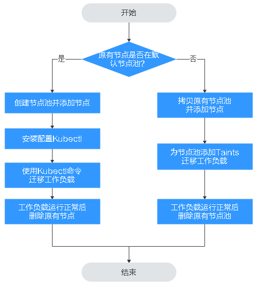

# 节点滚动升级

## 操作场景

节点滚动升级就是先创建新节点，然后将工作负载迁移到新的节点上，再删除老的节点。迁移流程如[图1](#fig1689610598118)所示。

**图 1**  节点迁移流程  

## 约束与限制

-   现有节点和工作负载待迁移的节点必须在同一集群。
-   当前仅支持在Kubernetes v1.13.10及以后集群版本执行此操作。
-   默认节点池DefaultPool不支持修改配置。

## 原有节点在默认节点池

1.  创建新的节点。
    1.  登录CCE控制台，在左侧导航栏中选择“资源管理 \> 节点池管理”。
    2.  在集群选择框中，选择现有节点所属的集群。
    3.  单击“创建节点池”，设置节点池如下参数，其他参数根据需要进行修改，参数说明请参见[创建节点池](创建节点池-36.md)。
        1.  节点池名称：新建节点池的名称，例如nodepool-demo。
        2.  节点购买数量：本例添加一个节点。
        3.  节点规格：请根据业务需求选择相应的节点规格。
        4.  操作系统：选择节点对应的操作系统。
        5.  登录方式**：**支持密码和密钥对。
            -   选择“密码“：用户名默认为“root”，请输入登录节点的密码，并确认密码。

                登录节点时需要使用该密码，请妥善管理密码，系统无法获取您设置的密码内容。

            -   选择“密钥对“：在选项框中选择用于登录本节点的密钥对，并单击勾选确认信息。

                密钥对用于远程登录节点时的身份认证。若没有密钥对，可单击选项框右侧的“创建密钥对”来新建，创建密钥对操作步骤请参见[创建密钥对](https://support.huaweicloud.com/usermanual-ecs/zh-cn_topic_0014250631.html)。

    4.  单击“下一步：配置确认”。确认节点池配置后，单击“提交”。

        单击**“**返回节点池管理**”**返回节点池列表。在节点列表中可查看到新建节点池已创建，且状态为“正常”。

2.  单击节点池名称，在节点列表中可查看到新建节点的IP地址。

1.  安装配置kubectl。
    1.  在左侧导航栏中选择“资源管理 \> 集群管理”，单击现有节点所在集群下的“命令行工具 \> kubectl”。
    2.  在集群详情页中的**“**kubectl**”**页签下，请参照界面中的提示信息完成集群连接。

1.  迁移工作负载。

    1.  给需要迁移工作负载的节点打上Taint（污点）。

        **kubectl taint node**_ \[node\] _**key=value:**_\[effect\]_

        其中，_\[node\]_为待迁移工作负载所在节点的IP；_\[effect\]_取值为NoSchedule、PreferNoSchedule或NoExecute，此处必须设置为NoSchedule。

        -   NoSchedule：一定不能被调度。
        -   PreferNoSchedule：尽量不要调度。
        -   NoExecute：不仅不会调度，还会驱逐Node上已有的Pod。

        > **说明：** 
        >若需要重新设置污点时，可执行**kubectl taint node **_\[node\] _**key:\[**_effect\]_**-**命令去除污点。

    2.  安全驱逐节点上的工作负载。

        **kubectl drain **_\[node\]_

        其中，_\[node\]_为待转移工作负载所在节点的IP。

    3.  在左侧导航栏中选择“工作负载 \> 无状态负载 Deployment”。在工作负载列表中，待迁移工作负载的状态由“运行中”变为“未就绪”。工作负载状态再次变为“运行中”，表示迁移成功。

    > **说明：** 
    >迁移工作负载时，若工作负载配置了节点亲和性，则工作负载会一直提示“未就绪”等异常情况。请单击工作负载名称进入到负载详情页，在选择“调度策略”页签，删除原节点的亲和性配置，并单击“简易调度策略”配置新的节点亲和性和反亲和性策略，详情请参见[简易调度策略](简易调度策略.md)。

    工作负载迁移成功后，在工作负载详情页的“实例列表”页签，可查看到工作负载状已迁移到[1](#li375022715214)中所创建的节点上。

1.  删除原有节点。

    工作负载迁移成功且运行正常后，即可在“资源管理 \> 节点管理”中删除原有节点。

## 原有节点不在默认节点池

1.  拷贝节点池并添加节点。
    1.  登录CCE控制台，在左侧导航栏中选择“资源管理 \> 节点池管理”。
    2.  在集群选择框中，选择现有节点所属的集群。

        在节点池列表中，查找到原有节点所在的节点池。

    3.  单击该节点池名称后的“更多 \> 拷贝”，在“创建节点池”页面下设置如下参数，其他参数根据需要进行修改，参数说明请参见[创建节点池](创建节点池-36.md)。
        -   节点池名称：新建节点池的名称，例如nodepool-demo。
        -   节点购买数量：本例添加一个节点。
        -   节点规格：请根据业务需求选择相应的节点规格。
        -   操作系统：选择节点对应的操作系统。
        -   登录方式**：**支持密码和密钥对。
            -   选择“密码“：用户名默认为“root”，请输入登录节点的密码，并确认密码。

                登录节点时需要使用该密码，请妥善管理密码，系统无法获取您设置的密码内容。

            -   选择“密钥对“：在选项框中选择用于登录本节点的密钥对，并单击勾选确认信息。

                密钥对用于远程登录节点时的身份认证。若没有密钥对，可单击选项框右侧的“创建密钥对”来新建，创建密钥对操作步骤请参见[创建密钥对](https://support.huaweicloud.com/usermanual-ecs/zh-cn_topic_0014250631.html)。

    4.  单击“下一步：配置确认”。确认节点池配置后，单击“提交”。

        单击**“**返回节点池管理**”**返回节点池列表。在节点列表中可查看到新建节点池已创建，且状态为“正常”。

2.  单击节点池名称，在节点列表中可查看到新建节点的IP地址。

1.  迁移工作负载。

    1.  单击节点池nodepool-demo后的“编辑”配置Taints参数。
    2.  单击“Add Taint”，输入Key和Value值，Effect选项有NoSchedule、PreferNoSchedule或NoExecute，此处必须选择“NoExecute”。

        -   NoSchedule：一定不能被调度。
        -   PreferNoSchedule：尽量不要调度。
        -   NoExecute：不仅不会调度，还会驱逐Node上已有的Pod。

        > **说明：** 
        >若需要重新设置污点时，单击“删除”去除污点。

    3.  单击“保存”。
    4.  在左侧导航栏中选择“工作负载 \> 无状态负载 Deployment”。在工作负载列表中，待迁移工作负载的状态由“运行中”变为“未就绪”。工作负载状态再次变为“运行中”，表示迁移成功。

    > **说明：** 
    >迁移工作负载时，若工作负载配置了节点亲和性，则工作负载会一直提示“未就绪”等异常情况。请单击工作负载名称进入到负载详情页，在选择“调度策略”页签，删除原节点的亲和性配置，并单击“简易调度策略”配置新的节点亲和性和反亲和性策略，详情请参见[简易调度策略](简易调度策略.md)。

    工作负载迁移成功后，在工作负载详情页的“Pods”页签，可查看到工作负载状已迁移到[1](#li1992616214312)中所创建的节点上。

1.  删除原有节点。

    工作负载迁移成功且运行正常后，即可在“资源管理 \> 节点池管理”中删除原有节点。

