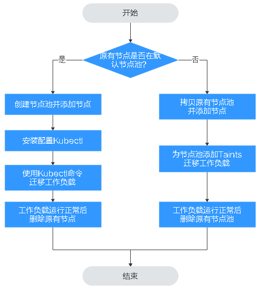

# 节点滚动升级

## 操作场景

节点滚动升级就是先创建新节点，然后将工作负载迁移到新的节点上，再删除老的节点。迁移流程如[图1](#fig1689610598118)所示。

**图 1**  节点迁移流程  

## 约束与限制

-   现有节点和工作负载待迁移的节点必须在同一集群。
-   当前仅支持在Kubernetes v1.13.10及以后集群版本执行此操作。
-   默认节点池DefaultPool不支持修改配置。

## 原有节点在默认节点池

1.  创建新的节点池。具体请参见[创建节点池](创建节点池.md)。
2.  单击节点池名称，在节点列表中可查看到新建节点的IP地址。

1.  安装配置kubectl。具体请参见[通过kubectl连接集群](通过kubectl连接集群.md)。

1.  迁移工作负载。

    1.  给需要迁移工作负载的节点打上Taint（污点）。

        **kubectl taint node**_ \[node\] _**key=value:**_\[effect\]_

        其中，_\[node\]_为待迁移工作负载所在节点的IP；_\[effect\]_取值为NoSchedule、PreferNoSchedule或NoExecute，此处必须设置为NoSchedule。

        -   NoSchedule：一定不能被调度。
        -   PreferNoSchedule：尽量不要调度。
        -   NoExecute：不仅不会调度，还会驱逐Node上已有的Pod。

        > **说明：** 
        >若需要重新设置污点时，可执行**kubectl taint node **_\[node\] _**key:\[**_effect\]_**-**命令去除污点。

    2.  安全驱逐节点上的工作负载。

        **kubectl drain **_\[node\]_

        其中，_\[node\]_为待转移工作负载所在节点的IP。

    3.  在左侧导航栏中选择“工作负载 \> 无状态负载 Deployment”。在工作负载列表中，待迁移工作负载的状态由“运行中”变为“未就绪”。工作负载状态再次变为“运行中”，表示迁移成功。

    > **说明：** 
    >迁移工作负载时，若工作负载配置了节点亲和性，则工作负载会一直提示“未就绪”等异常情况。请单击工作负载名称进入到负载详情页，在选择“调度策略”页签，删除原节点的亲和性配置，配置新的节点亲和性和反亲和性策略，详情请参见[调度策略（亲和与反亲和）](调度策略（亲和与反亲和）.md)。

    工作负载迁移成功后，在工作负载详情页的“实例列表”页签，可查看到工作负载状已迁移到[1](#li375022715214)中所创建的节点上。

1.  删除原有节点。

    工作负载迁移成功且运行正常后，即可删除原有节点。

## 原有节点不在默认节点池

1.  拷贝节点池并添加节点。具体请参见[拷贝节点池](管理节点池.md#section550619571556)。
2.  单击节点池名称操作列的“节点列表“，在节点列表中可查看到新建节点的IP地址。

1.  迁移工作负载。

    1.  单击原节点池后的“编辑”配置Taints参数。
    2.  输入污点\(Taints\)的Key和Value值，Effect选项有NoSchedule、PreferNoSchedule或NoExecute，此处必须选择“NoExecute”，单击“添加”。

        -   NoSchedule：一定不能被调度。
        -   PreferNoSchedule：尽量不要调度。
        -   NoExecute：不仅不会调度，还会驱逐Node上已有的Pod。

        > **说明：** 
        >若需要重新设置污点，需删除已配置污点。

    3.  单击“确定”。
    4.  在左侧导航栏中选择“工作负载 \> 无状态负载 Deployment”。在工作负载列表中，待迁移工作负载的状态由“运行中”变为“未就绪”。工作负载状态再次变为“运行中”，表示迁移成功。

    > **说明：** 
    >迁移工作负载时，若工作负载配置了节点亲和性，则工作负载会一直提示“未就绪”等异常情况。请单击工作负载名称进入到负载详情页，在选择“调度策略”页签，删除原节点的亲和性配置，配置新的节点亲和性和反亲和性策略，详情请参见[调度策略（亲和与反亲和）](调度策略（亲和与反亲和）.md)。

    工作负载迁移成功后，在工作负载详情页的“Pods”页签，可查看到工作负载状已迁移到[1](#li1992616214312)中所创建的节点上。

1.  删除原有节点。

    工作负载迁移成功且运行正常后，即可删除原有节点。

