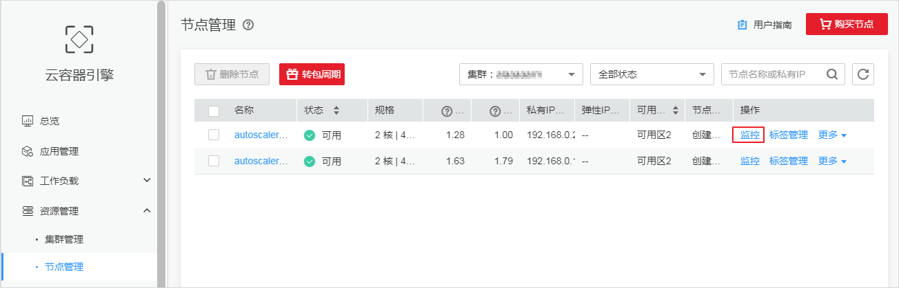
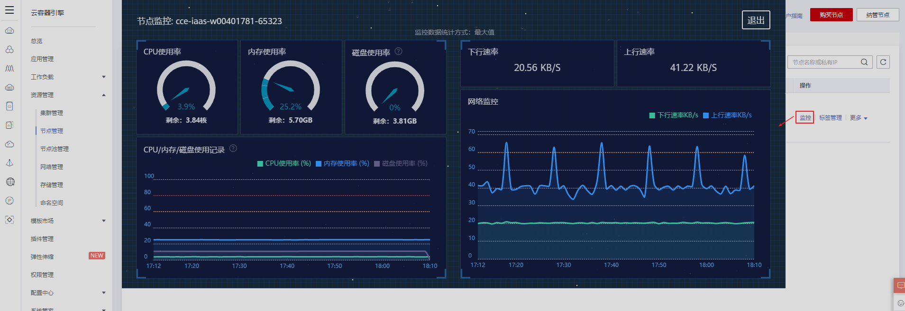

# 节点监控

## 操作场景

云容器引擎（CCE）与云监控服务（Cloud Eye）无缝集成，可以实时查看每个集群工作节点的资源使用情况，您可以使用该服务监控您的节点，执行自动实时监控、告警和通知操作，帮助您更好地了解节点的各项性能指标。

云监控服务（Cloud Eye）为您提供一个针对弹性云服务器、带宽等资源的立体化监控平台。让您全面了解云上的资源使用情况、业务的运行状况，并及时收到异常告警做出反应，保证业务顺畅运行。具体请参见[什么是云监控？](https://support.huaweicloud.com/productdesc-ces/zh-cn_topic_0015479882.html)。

华为云提供的云监控服务，可以对节点运行状态进行日常监控。您可以通过CCE控制台或云监控服务控制台，直观地查看节点的各项监控指标。

由于监控数据的获取与传输会花费一定时间，因此，云监控显示的是当前时间5～10分钟前的节点状态。如果您的节点刚刚创建完成，请等待5～10分钟后查看监控数据。

## 操作步骤

1.  登录CCE控制台，在左侧导航栏中选择“资源管理 \> 节点管理“。
2.  在列表右上角选择所需的集群，在该集群下选择所需的节点。
3.  单击节点名称后的“监控”，在云监控服务中可查看监控信息。

    **图 1**  节点监控  
    

4.  在弹出节点监控窗口中，可查看该节点的基本监控信息，包括CPU使用率、内存使用率、磁盘使用率、CPU/内存/磁盘使用记录、上行速率、下行速率、网络监控等指标。

    **图 2**  监控指标  
    

    **表 1**  支持的主要监控指标

    
    <table><thead align="left"><tr id="row15860113172219"><th class="cellrowborder" valign="top" width="32.910000000000004%" id="mcps1.2.3.1.1">
监控指标

    </th>
    <th class="cellrowborder" valign="top" width="67.09%" id="mcps1.2.3.1.2">
指标含义

    </th>
    </tr>
    </thead>
    <tbody><tr id="row286081319224"><td class="cellrowborder" valign="top" width="32.910000000000004%" headers="mcps1.2.3.1.1 ">
CPU使用率

    </td>
    <td class="cellrowborder" valign="top" width="67.09%" headers="mcps1.2.3.1.2 ">
该指标为从物理机层面采集的CPU使用率，数据准确性低于从弹性云服务器内部采集的数据。 详情请参见<a href="https://support.huaweicloud.com/ces_faq/ces_faq_0040.html" target="_blank" rel="noopener noreferrer">为什么会出现基础监控与操作系统监控数据不一致的问题？</a>

    </td>
    </tr>
    <tr id="row13860161342214"><td class="cellrowborder" valign="top" width="32.910000000000004%" headers="mcps1.2.3.1.1 ">
内存使用率

    </td>
    <td class="cellrowborder" valign="top" width="67.09%" headers="mcps1.2.3.1.2 ">
该指标用于统计节点的内存使用率。

    </td>
    </tr>
    <tr id="row86911734143211"><td class="cellrowborder" valign="top" width="32.910000000000004%" headers="mcps1.2.3.1.1 ">
磁盘使用率

    </td>
    <td class="cellrowborder" valign="top" width="67.09%" headers="mcps1.2.3.1.2 ">
节点的磁盘使用率，统计对象是使用率最大的磁盘，而非所有磁盘的平均使用率；

    
节点的磁盘剩余容量，统计对象是剩余容量最大的磁盘，而非所有磁盘的剩余容量之和。

    </td>
    </tr>
    <tr id="row786011319224"><td class="cellrowborder" valign="top" width="32.910000000000004%" headers="mcps1.2.3.1.1 ">
CPU/内存/磁盘使用记录

    </td>
    <td class="cellrowborder" valign="top" width="67.09%" headers="mcps1.2.3.1.2 ">
可查看一小时内的CPU使用率、内存使用率和磁盘使用率的曲线。

    </td>
    </tr>
    <tr id="row3860113172218"><td class="cellrowborder" valign="top" width="32.910000000000004%" headers="mcps1.2.3.1.1 ">
下行速率

    </td>
    <td class="cellrowborder" valign="top" width="67.09%" headers="mcps1.2.3.1.2 ">
一般指从网络下载数据到节点的速度，单位KB/S。

    </td>
    </tr>
    <tr id="row148151597255"><td class="cellrowborder" valign="top" width="32.910000000000004%" headers="mcps1.2.3.1.1 ">
上行速率

    </td>
    <td class="cellrowborder" valign="top" width="67.09%" headers="mcps1.2.3.1.2 ">
一般指从节点上传网络的速度，单位KB/S。

    </td>
    </tr>
    <tr id="row158166972516"><td class="cellrowborder" valign="top" width="32.910000000000004%" headers="mcps1.2.3.1.1 ">
网络监控

    </td>
    <td class="cellrowborder" valign="top" width="67.09%" headers="mcps1.2.3.1.2 ">
可查看一小时内的下行速率、上行速率的曲线。

    </td>
    </tr>
    </tbody>
    </table>

## 相关操作

-   [查看主机监控的监控指标](https://support.huaweicloud.com/usermanual-ces/zh-cn_topic_0079332017.html)
-   [支持的监控指标](支持的监控指标.md)
-   [设置告警规则](设置告警规则.md)

