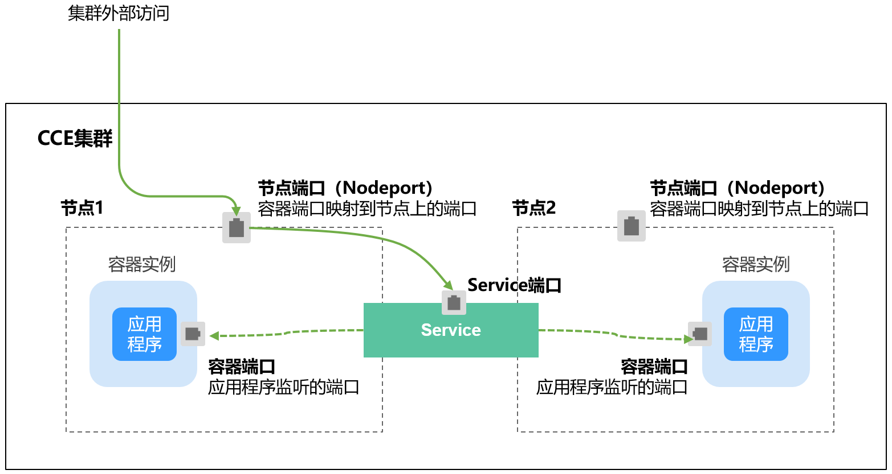
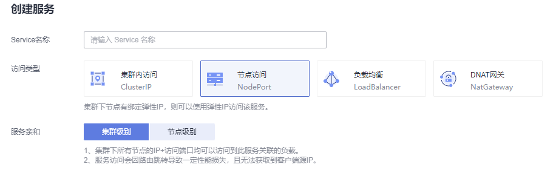

# 节点访问\(NodePort\)<a name="cce_10_0142"></a>

## 操作场景<a name="section13654155944916"></a>

节点访问 \( NodePort \)是指在每个节点的IP上开放一个静态端口，通过静态端口对外暴露服务。节点访问 \( NodePort \)会路由到ClusterIP服务，这个ClusterIP服务会自动创建。通过请求 <NodeIP\>:<NodePort\>，可以从集群的外部访问一个NodePort服务。

**图 1**  NodePort访问<a name="fig6819133414131"></a>  


## 约束与限制<a name="section8501151104219"></a>

-   “节点访问 \( NodePort \)“默认为VPC内网访问，如果需要使用弹性IP通过公网访问该服务，请提前在集群的节点上绑定弹性IP。
-   创建service后，如果服务亲和从集群级别切换为节点级别，连接跟踪表将不会被清理，建议用户创建service后不要修改服务亲和属性，如需修改请重新创建service。
-   CCE Turbo集群仅支持集群级别服务亲和。
-   VPC网络模式下，当某容器A通过NodePort类型服务发布时，且服务亲和设置为节点级别（即externalTrafficPolicy为local），部署在同节点的容器B将无法通过节点IP+NodePort访问容器A。

## 创建NodePort类型Service<a name="section1325012312139"></a>

1.  登录CCE控制台，进入集群。
2.  在左侧导航栏中选择“服务发现“，在右上角单击“创建服务“。
3.  设置集群内访问参数。
    -   **Service名称：**自定义服务名称，可与工作负载名称保持一致。
    -   **访问类型**：选择“节点访问 NodePort“。
    -   **命名空间：**工作负载所在命名空间。
    -   **服务亲和：**详情请参见[externalTrafficPolicy（服务亲和）](#section18134208069)。
        -   集群级别：集群下所有节点的IP+访问端口均可以访问到此服务关联的负载，服务访问会因路由跳转导致一定性能损失，且无法获取到客户端源IP。
        -   节点级别：只有通过负载所在节点的IP+访问端口才可以访问此服务关联的负载，服务访问没有因路由跳转导致的性能损失，且可以获取到客户端源IP。

    -   **选择器：**添加标签，Service根据标签选择Pod，填写后单击“添加“。也可以引用已有工作负载的标签，单击“引用负载标签“，在弹出的窗口中选择负载，然后单击“确定“。
    -   **IPv6：**默认不开启，开启后服务的集群内IP地址（ClusterIP）变为IPv6地址，具体请参见[如何通过CCE搭建IPv4/IPv6双栈集群？](https://support.huaweicloud.com/bestpractice-cce/cce_bestpractice_00222.html)。**该功能仅在1.15及以上版本的集群创建时开启了IPv6功能才会显示。**
    -   **端口配置：**
        -   协议：请根据业务的协议类型选择。
        -   服务端口：Service使用的端口，端口范围为1-65535。
        -   容器端口：工作负载程序实际监听的端口，需用户确定。例如nginx默认使用80端口。
        -   节点端口：即NodePort，建议选择“自动生成“；也可以指定端口，默认范围为30000-32767。

4.  单击“确定”，创建Service。

## kubectl命令行创建<a name="section7114174773118"></a>

您可以通过kubectl命令行设置Service访问方式。本节以nginx为例，说明kubectl命令实现节点访问的方法。

1.  请参见[通过kubectl连接集群](通过kubectl连接集群.md)，使用kubectl连接集群。
2.  创建并编辑nginx-deployment.yaml以及nginx-nodeport-svc.yaml文件。

    其中，nginx-deployment.yaml和nginx-nodeport-svc.yaml为自定义名称，您可以随意命名。

    **vi nginx-deployment.yaml**

    ```
    apiVersion: apps/v1
    kind: Deployment
    metadata:
      name: nginx
    spec:
      replicas: 1
      selector:
        matchLabels:
          app: nginx
      template:
        metadata:
          labels:
            app: nginx
        spec:
          containers:
          - image: nginx:latest
            name: nginx
          imagePullSecrets:
          - name: default-secret
    ```

    **vi nginx-nodeport-svc.yaml**

    ```
    apiVersion: v1
    kind: Service
    metadata:
      labels:
        app: nginx
      name: nginx-nodeport
    spec:
      ports:
      - name: service
        nodePort: 30000     # 节点端口，取值范围为30000-32767
        port: 8080          # 访问Service的端口
        protocol: TCP       # 访问Service的协议，支持TCP和UDP
        targetPort: 80      # Service访问目标容器的端口，此端口与容器中运行的应用强相关，如本例中nginx镜像默认使用80端口
      selector:             # 标签选择器，Service通过标签选择Pod，将访问Service的流量转发给Pod，此处选择带有 app:nginx 标签的Pod
        app: nginx
      type: NodePort        # Service的类型，NodePort表示在通过节点端口访问
    ```

3.  创建工作负载。

    **kubectl create -f nginx-deployment.yaml**

    回显如下，表示工作负载已创建完成。

    ```
    deployment "nginx" created
    ```

    **kubectl get po**

    回显如下，工作负载状态为Running，表示工作负载已处于运行状态。

    ```
    NAME                     READY     STATUS             RESTARTS   AGE
    nginx-2601814895-qhxqv   1/1       Running            0          9s
    ```

4.  创建服务。

    **kubectl create -f nginx-nodeport-svc.yaml**

    回显如下，表示服务开始创建。

    ```
    service "nginx-nodeport" created
    ```

    **kubectl get svc**

    回显如下，表示服务已创建完成。

    ```
    # kubectl get svc
    NAME             TYPE        CLUSTER-IP     EXTERNAL-IP   PORT(S)          AGE
    kubernetes       ClusterIP   10.247.0.1     <none>        443/TCP          4d8h
    nginx-nodeport   NodePort    10.247.30.40   <none>        8080:30000/TCP   18s
    ```

5.  访问Service。

    默认情况下，NodePort类型Service可以通过**任意节点IP:节点端口**访问。

    在集群同VPC下或集群容器内都可以访问，如果给节点绑定公网IP，也可以使用公网IP访问。如下所示，在集群上创建一个容器，从容器中使用节点IP:节点端口访问。

    ```
    # kubectl get node -owide
    NAME           STATUS   ROLES    AGE    INTERNAL-IP    EXTERNAL-IP   OS-IMAGE                KERNEL-VERSION                CONTAINER-RUNTIME
    10.100.0.136   Ready    <none>   152m   10.100.0.136   <none>        CentOS Linux 7 (Core)   3.10.0-1160.25.1.el7.x86_64   docker://18.9.0
    10.100.0.5     Ready    <none>   152m   10.100.0.5     <none>        CentOS Linux 7 (Core)   3.10.0-1160.25.1.el7.x86_64   docker://18.9.0
    # kubectl run -i --tty --image nginx:alpine test --rm /bin/sh
    If you don't see a command prompt, try pressing enter.
    / # curl 10.100.0.136:30000
    <!DOCTYPE html>
    <html>
    <head>
    <title>Welcome to nginx!</title>
    <style>
        body {
            width: 35em;
            margin: 0 auto;
            font-family: Tahoma, Verdana, Arial, sans-serif;
        }
    </style>
    </head>
    <body>
    <h1>Welcome to nginx!</h1>
    <p>If you see this page, the nginx web server is successfully installed and
    working. Further configuration is required.</p>
    
    <p>For online documentation and support please refer to
    <a href="http://nginx.org/">nginx.org</a>.<br/>
    Commercial support is available at
    <a href="http://nginx.com/">nginx.com</a>.</p>
    
    <p><em>Thank you for using nginx.</em></p>
    </body>
    </html>
    / # 
    ```


## externalTrafficPolicy（服务亲和）<a name="section18134208069"></a>

NodePort类型的Service接收请求时先从访问到节点，然后转到Service，再由Service选择一个Pod转发到该Pod，选择的Pod不一定在接收请求的节点上。默认情况下，从任意节点IP+服务端口都能访问到后端工作负载，当Pod不在接收请求的节点上时，请求会在跳转到Pod所在的节点，带来一定性能损失。

Service有一个配置参数externalTrafficPolicy，如下所示。

```
apiVersion: v1
kind: Service
metadata:
  name: nginx-nodeport
spec:
  externalTrafficPolicy: local
  ports:
  - name: service
    nodePort: 30000
    port: 80
    protocol: TCP
    targetPort: 80
  selector:
    app: nginx
  type: NodePort
```

当externalTrafficPolicy取值为**local**时，通过节点IP:服务端口的请求只会转发给本节点上的Pod，如果节点没有Pod的话请求会挂起。

externalTrafficPolicy还有一个取值是**cluster**，也是默认取值，就是前面说的请求会在集群内转发。

在CCE 控制台创建NodePort类型Service时也可以配置该参数。



总结externalTrafficPolicy两个取值。

-   cluster（集群级别）：集群下所有节点的IP+访问端口均可以访问到此服务关联的负载，服务访问会因路由跳转导致一定性能损失，且无法获取到客户端源IP。
-   local（节点级别）：只有通过负载所在节点的IP+访问端口才可以访问此服务关联的负载，服务访问没有因路由跳转导致的性能损失，且可以获取到客户端源IP。

