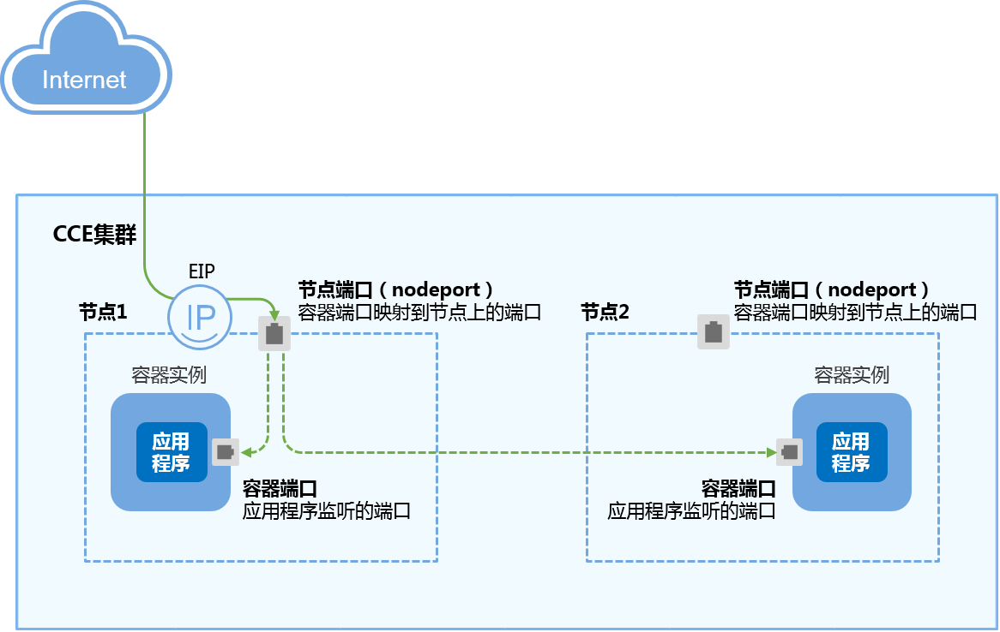

# 节点访问 \( NodePort \)<a name="cce_01_0142"></a>

节点访问 \( NodePort \)是指在每个节点的IP上开放一个静态端口，通过静态端口对外暴露服务。节点访问 \( NodePort \)会路由到ClusterIP服务，这个ClusterIP服务会自动创建。通过请求 <NodeIP\>:<NodePort\>，可以从集群的外部访问一个NodePort服务。

节点访问有VPC内网访问或弹性公网IP访问两种方式。

-   **VPC内网访问**

    VPC内网访问是指工作负载可以让同一VPC内其他工作负载访问，通过“集群节点的IP“的服务地址访问。

    主要场景：同一VPC内其他工作负载需要访问kubernetes集群内部的工作负载。

    **图 1**  VPC内网访问（通过集群节点IP访问）<a name="fig32443742164859"></a>  
    


-   **弹性公网IP访问**

    弹性公网IP访问可以通过弹性IP从公网访问工作负载，一般用于系统中需要暴露到公网的服务。

    弹性IP访问方式需要给集群内任一节点绑定弹性IP，并设置一个映射在节点上的端口，其中节点端口的范围在30000-32767之间，例如访问地址为10.117.117.117:30000。

    **图 2**  弹性公网IP访问<a name="fig57690358164948"></a>  
    


## 通过控制台操作<a name="section8124108325"></a>

您可以在创建工作负载时通过控制台设置Service访问方式，本节以nginx为例进行说明。

1.  参考[创建无状态负载\(Deployment\)](创建无状态负载(Deployment).md)或[创建有状态负载\(StatefulSet\)](创建有状态负载(StatefulSet).md)，在“工作负载访问设置“步骤，单击“添加服务“。
    -   **访问类型：**选择“节点访问 \( NodePort \)“。
    -   **服务名称：**自定义服务名称，可与工作负载名称保持一致。
    -   **服务亲和：**
        -   集群级别：集群下所有节点的IP+访问端口均可以访问到此服务关联的负载，服务访问会因路由跳转导致一定性能损失，且无法获取到客户端源IP。
        -   节点级别：只有通过负载所在节点的IP+访问端口才可以访问此服务关联的负载，服务访问没有因路由跳转导致的性能损失，且可以获取到客户端源IP。

    -   **端口配置：**
        -   协议：请根据业务的协议类型选择。
        -   容器端口：容器镜像中工作负载实际监听的端口，取值范围为1-65535。
        -   访问端口：容器端口映射到节点私有IP上的端口，建议选择“自动生成“。
            -   自动生成：系统会自动分配端口号。
            -   指定端口：指定固定的节点端口，默认取值范围为30000-32767。若指定端口时，请确保同个集群内的端口唯一性。


2.  单击“下一步“进入“高级设置“页面，直接单击“创建“。
3.  <a name="li13702330143312"></a>单击“查看工作负载详情“，在访问方式页签中获取访问地址，例如“192.168.0.160:30358“。

## kubectl命令行创建-VPC内访问<a name="section813715073217"></a>

您可以通过kubectl命令行设置Service访问方式。本节以nginx为例，说明kubectl命令实现VPC内访问的方法。

**前提条件**

请参见[通过kubectl或web-terminal插件连接CCE集群](通过kubectl或web-terminal插件连接CCE集群.md)配置kubectl命令，使弹性云服务器连接集群。

**操作步骤**

1.  登录已配置好kubectl命令的弹性云服务器。登录方法请参见[登录Linux弹性云服务器](https://support.huaweicloud.com/usermanual-ecs/zh-cn_topic_0013771089.html)。
2.  创建并编辑nginx-deployment.yaml以及nginx-nodeport-svc.yaml文件。

    其中，nginx-deployment.yaml和nginx-nodeport-svc.yaml为自定义名称，您可以随意命名。

    **vi nginx-deployment.yaml**

    ```
    apiVersion: extensions/v1beta1
    kind: Deployment
    metadata:
      name: nginx
    spec:
      replicas: 1
      selector:
        matchLabels:
          app: nginx
      strategy:
        type: RollingUpdate
      template:
        metadata:
          labels:
            app: nginx
        spec:
          containers:
          - image: nginx 
            imagePullPolicy: Always
            name: nginx
          imagePullSecrets:
          - name: default-secret
    ```

    **vi nginx-nodeport-svc.yaml**

    ```
    apiVersion: v1
    kind: Service
    metadata:
      labels:
        app: nginx
      name: nginx-nodeport
    spec:
      ports:
      - name: service
    #   nodePort: 30000
        port: 80
        protocol: TCP
        targetPort: 80
      selector:
        app: nginx
      type: NodePort
    ```

    **表 1**  关键参数说明

    <a name="table56443210447"></a>
    <table><thead align="left"><tr id="row157011325448"><th class="cellrowborder" valign="top" width="19.009999999999998%" id="mcps1.2.4.1.1"><p id="p127013213445"><a name="p127013213445"></a><a name="p127013213445"></a>参数</p>
    </th>
    <th class="cellrowborder" valign="top" width="18.43%" id="mcps1.2.4.1.2"><p id="p070113234410"><a name="p070113234410"></a><a name="p070113234410"></a>参数类型</p>
    </th>
    <th class="cellrowborder" valign="top" width="62.56%" id="mcps1.2.4.1.3"><p id="p870832124415"><a name="p870832124415"></a><a name="p870832124415"></a>描述</p>
    </th>
    </tr>
    </thead>
    <tbody><tr id="row19708321446"><td class="cellrowborder" valign="top" width="19.009999999999998%" headers="mcps1.2.4.1.1 "><p id="zh-cn_topic_0079615000_p41087597"><a name="zh-cn_topic_0079615000_p41087597"></a><a name="zh-cn_topic_0079615000_p41087597"></a>nodePort</p>
    </td>
    <td class="cellrowborder" valign="top" width="18.43%" headers="mcps1.2.4.1.2 "><p id="zh-cn_topic_0079615000_p66528668"><a name="zh-cn_topic_0079615000_p66528668"></a><a name="zh-cn_topic_0079615000_p66528668"></a>Integer</p>
    </td>
    <td class="cellrowborder" valign="top" width="62.56%" headers="mcps1.2.4.1.3 "><p id="p164654108492"><a name="p164654108492"></a><a name="p164654108492"></a>对应界面上的访问端口，取值范围为30000 ~ 32767，不填写表示自动生成。</p>
    </td>
    </tr>
    <tr id="row2787832142320"><td class="cellrowborder" valign="top" width="19.009999999999998%" headers="mcps1.2.4.1.1 "><p id="p5788113218236"><a name="p5788113218236"></a><a name="p5788113218236"></a>port</p>
    </td>
    <td class="cellrowborder" valign="top" width="18.43%" headers="mcps1.2.4.1.2 "><p id="zh-cn_topic_0079615000_p54093956"><a name="zh-cn_topic_0079615000_p54093956"></a><a name="zh-cn_topic_0079615000_p54093956"></a>Integer</p>
    </td>
    <td class="cellrowborder" valign="top" width="62.56%" headers="mcps1.2.4.1.3 "><p id="p167881320237"><a name="p167881320237"></a><a name="p167881320237"></a>集群虚拟IP的访问端口，取值范围为1 ~ 65535。</p>
    </td>
    </tr>
    <tr id="row13718321449"><td class="cellrowborder" valign="top" width="19.009999999999998%" headers="mcps1.2.4.1.1 "><p id="zh-cn_topic_0079615000_p11039195"><a name="zh-cn_topic_0079615000_p11039195"></a><a name="zh-cn_topic_0079615000_p11039195"></a>protocol</p>
    </td>
    <td class="cellrowborder" valign="top" width="18.43%" headers="mcps1.2.4.1.2 "><p id="zh-cn_topic_0079615000_p17699892"><a name="zh-cn_topic_0079615000_p17699892"></a><a name="zh-cn_topic_0079615000_p17699892"></a>String</p>
    </td>
    <td class="cellrowborder" valign="top" width="62.56%" headers="mcps1.2.4.1.3 "><p id="p835181810259"><a name="p835181810259"></a><a name="p835181810259"></a>该端口的IP协议，支持“TCP”和“UDP”。</p>
    </td>
    </tr>
    <tr id="row1671532144412"><td class="cellrowborder" valign="top" width="19.009999999999998%" headers="mcps1.2.4.1.1 "><p id="zh-cn_topic_0079615000_p53639231"><a name="zh-cn_topic_0079615000_p53639231"></a><a name="zh-cn_topic_0079615000_p53639231"></a>targetPort</p>
    </td>
    <td class="cellrowborder" valign="top" width="18.43%" headers="mcps1.2.4.1.2 "><p id="zh-cn_topic_0079615000_p8117426"><a name="zh-cn_topic_0079615000_p8117426"></a><a name="zh-cn_topic_0079615000_p8117426"></a>String</p>
    </td>
    <td class="cellrowborder" valign="top" width="62.56%" headers="mcps1.2.4.1.3 "><p id="p1262218433513"><a name="p1262218433513"></a><a name="p1262218433513"></a>对应界面上的容器端口，取值范围为1 ~ 65535。</p>
    </td>
    </tr>
    <tr id="row371674812911"><td class="cellrowborder" valign="top" width="19.009999999999998%" headers="mcps1.2.4.1.1 "><p id="p6716134816295"><a name="p6716134816295"></a><a name="p6716134816295"></a>type</p>
    </td>
    <td class="cellrowborder" valign="top" width="18.43%" headers="mcps1.2.4.1.2 "><p id="zh-cn_topic_0079615000_p18968549"><a name="zh-cn_topic_0079615000_p18968549"></a><a name="zh-cn_topic_0079615000_p18968549"></a>String</p>
    </td>
    <td class="cellrowborder" valign="top" width="62.56%" headers="mcps1.2.4.1.3 "><p id="p13717148202913"><a name="p13717148202913"></a><a name="p13717148202913"></a>对应界面上的访问类型，NodePort表示“节点私有IP”。</p>
    </td>
    </tr>
    </tbody>
    </table>

3.  创建工作负载。

    **kubectl create -f nginx-deployment.yaml**

    回显如下，表示工作负载已开始创建。

    ```
    deployment "nginx" created
    ```

    **kubectl get po**

    回显如下，工作负载状态为Running，表示工作负载已处于运行状态。

    ```
    NAME                     READY     STATUS             RESTARTS   AGE
    etcd-0                   0/1       ImagePullBackOff   0          48m
    icagent-m9dkt            0/0       Running            0          3d
    nginx-2601814895-qhxqv   1/1       Running            0          9s
    ```

4.  创建服务。

    **kubectl create -f nginx-nodeport-svc.yaml**

    回显如下，表示服务开始创建。

    ```
    service "nginx-nodeport" created
    ```

    **kubectl get svc**

    回显如下，表示服务已创建完成。

    ```
    NAME             TYPE        CLUSTER-IP     EXTERNAL-IP   PORT(S)        AGE
    etcd-svc         ClusterIP   None           <none>        3120/TCP       49m
    kubernetes       ClusterIP   10.247.0.1     <none>        443/TCP        3d
    nginx-nodeport   NodePort    10.247.4.225   <none>        80:30000/TCP   7s
    ```

5.  采用curl命令访问工作负载验证工作负载是否可以正常访问。

    **curl **_192.168.2.240:30000_

    其中192.168.2.240为集群中任意一个节点的IP地址，30000为节点开放的端口号。

    回显如下，表示可正常访问。

    ```
    <html>
    <head>
    <title>Welcome to nginx!</title>
    <style>
        body {
            width: 35em;
            margin: 0 auto;
            font-family: Tahoma, Verdana, Arial, sans-serif;
        }
    </style>
    </head>
    <body>
    <h1>Welcome to nginx!</h1>
    <p>If you see this page, the nginx web server is successfully installed and
    working. Further configuration is required.</p>
    
    <p>For online documentation and support please refer to
    <a href="http://nginx.org/">nginx.org</a>.<br/>
    Commercial support is available at
    <a href="http://nginx.com/">nginx.com</a>.</p>
    
    <p><em>Thank you for using nginx.</em></p>
    </body>
    </html>
    ```


## kubectl命令行创建-弹性公网IP<a name="section178584033417"></a>

本节以nginx为例，说明kubectl命令实现公网访问的方法。

**前提条件**

请参见[通过kubectl或web-terminal插件连接CCE集群](通过kubectl或web-terminal插件连接CCE集群.md)配置kubectl命令，使弹性云服务器连接集群。

**操作步骤**

1.  登录已配置好kubectl命令的弹性云服务器。登录方法请参见[登录Linux弹性云服务器](https://support.huaweicloud.com/usermanual-ecs/zh-cn_topic_0013771089.html)。
2.  创建并编辑nginx-deployment.yaml以及nginx-eip-svc.yaml文件。

    其中，nginx-deployment.yaml和nginx-eip-svc.yaml为自定义名称，您可以随意命名。

    **vi nginx-deployment.yaml**

    ```
    apiVersion: extensions/v1beta1
    kind: Deployment
    metadata:
      name: nginx
    spec:
      replicas: 1
      selector:
        matchLabels:
          app: nginx
      strategy:
        type: RollingUpdate
      template:
        metadata:
          labels:
            app: nginx
        spec:
          containers:
          - image: nginx 
            imagePullPolicy: Always
            name: nginx
          imagePullSecrets:
          - name: default-secret
    ```

    **vi nginx-eip-svc.yaml**

    ```
    apiVersion: v1
    kind: Service
    metadata:
      labels:
        app: nginx
      name: nginx-eip
    spec:
      ports:
      - name: service0
        nodePort: 30000
        port: 80
        protocol: TCP
        targetPort: 80
      selector:
        app: nginx
      type: NodePort
    ```

    **表 2**  关键参数说明

    <a name="table1819001615355"></a>
    <table><thead align="left"><tr id="row1519121663519"><th class="cellrowborder" valign="top" width="33.2%" id="mcps1.2.4.1.1"><p id="p18191161619356"><a name="p18191161619356"></a><a name="p18191161619356"></a>参数</p>
    </th>
    <th class="cellrowborder" valign="top" width="15.110000000000001%" id="mcps1.2.4.1.2"><p id="p1191141613357"><a name="p1191141613357"></a><a name="p1191141613357"></a>参数类型</p>
    </th>
    <th class="cellrowborder" valign="top" width="51.690000000000005%" id="mcps1.2.4.1.3"><p id="p1919116161353"><a name="p1919116161353"></a><a name="p1919116161353"></a>描述</p>
    </th>
    </tr>
    </thead>
    <tbody><tr id="row15191171618357"><td class="cellrowborder" valign="top" width="33.2%" headers="mcps1.2.4.1.1 "><p id="p20192181615358"><a name="p20192181615358"></a><a name="p20192181615358"></a>nodePort</p>
    </td>
    <td class="cellrowborder" valign="top" width="15.110000000000001%" headers="mcps1.2.4.1.2 "><p id="p14194181613351"><a name="p14194181613351"></a><a name="p14194181613351"></a>Integer</p>
    </td>
    <td class="cellrowborder" valign="top" width="51.690000000000005%" headers="mcps1.2.4.1.3 "><p id="p91941216193518"><a name="p91941216193518"></a><a name="p91941216193518"></a>对应界面上的访问端口，取值范围为30000 ~ 32767，不填写表示自动生成。</p>
    </td>
    </tr>
    <tr id="row81941516153513"><td class="cellrowborder" valign="top" width="33.2%" headers="mcps1.2.4.1.1 "><p id="p1619571643513"><a name="p1619571643513"></a><a name="p1619571643513"></a>port</p>
    </td>
    <td class="cellrowborder" valign="top" width="15.110000000000001%" headers="mcps1.2.4.1.2 "><p id="p1195181653518"><a name="p1195181653518"></a><a name="p1195181653518"></a>Integer</p>
    </td>
    <td class="cellrowborder" valign="top" width="51.690000000000005%" headers="mcps1.2.4.1.3 "><p id="p17195916113515"><a name="p17195916113515"></a><a name="p17195916113515"></a>集群虚拟IP的访问端口，取值范围为1 ~ 65535。</p>
    </td>
    </tr>
    <tr id="row201957167350"><td class="cellrowborder" valign="top" width="33.2%" headers="mcps1.2.4.1.1 "><p id="p17195131643517"><a name="p17195131643517"></a><a name="p17195131643517"></a>protocol</p>
    </td>
    <td class="cellrowborder" valign="top" width="15.110000000000001%" headers="mcps1.2.4.1.2 "><p id="p919551619351"><a name="p919551619351"></a><a name="p919551619351"></a>String</p>
    </td>
    <td class="cellrowborder" valign="top" width="51.690000000000005%" headers="mcps1.2.4.1.3 "><p id="p10195181611354"><a name="p10195181611354"></a><a name="p10195181611354"></a>该端口的IP协议，支持“TCP”和“UDP”。</p>
    </td>
    </tr>
    <tr id="row1719518169356"><td class="cellrowborder" valign="top" width="33.2%" headers="mcps1.2.4.1.1 "><p id="p1419521610354"><a name="p1419521610354"></a><a name="p1419521610354"></a>targetPort</p>
    </td>
    <td class="cellrowborder" valign="top" width="15.110000000000001%" headers="mcps1.2.4.1.2 "><p id="p17195171613355"><a name="p17195171613355"></a><a name="p17195171613355"></a>String</p>
    </td>
    <td class="cellrowborder" valign="top" width="51.690000000000005%" headers="mcps1.2.4.1.3 "><p id="p819511683519"><a name="p819511683519"></a><a name="p819511683519"></a>对应界面上的容器端口，取值范围为1 ~ 65535。</p>
    </td>
    </tr>
    <tr id="row619531693510"><td class="cellrowborder" valign="top" width="33.2%" headers="mcps1.2.4.1.1 "><p id="p1719615168353"><a name="p1719615168353"></a><a name="p1719615168353"></a>type</p>
    </td>
    <td class="cellrowborder" valign="top" width="15.110000000000001%" headers="mcps1.2.4.1.2 "><p id="p2196816113519"><a name="p2196816113519"></a><a name="p2196816113519"></a>String</p>
    </td>
    <td class="cellrowborder" valign="top" width="51.690000000000005%" headers="mcps1.2.4.1.3 "><p id="p16196121613518"><a name="p16196121613518"></a><a name="p16196121613518"></a>对应界面上的访问类型，弹性IP需要基于“NodePort”类型的服务。</p>
    </td>
    </tr>
    </tbody>
    </table>

3.  创建工作负载。

    **kubectl create -f nginx-deployment.yaml**

    回显如下表示工作负载开始创建。

    ```
    deployment "nginx" created
    ```

    **kubectl get po**

    回显如下，工作负载状态为Running，表示工作负载已运行中。

    ```
    NAME                     READY     STATUS             RESTARTS   AGE
    etcd-0                   0/1       ImagePullBackOff   0          59m
    icagent-m9dkt            0/0       Running            0          3d
    nginx-2601814895-sf71t   1/1       Running            0          8s
    ```

4.  创建服务。

    **kubectl create -f nginx-eip-svc.yaml**

    回显如下表示服务已创建成功。

    ```
    service "nginx-eip" created
    ```

    **kubectl get svc**

    回显如下表示服务访问方式已设置成功。

    ```
    NAME         TYPE        CLUSTER-IP       EXTERNAL-IP   PORT(S)        AGE
    etcd-svc     ClusterIP   None             <none>        3120/TCP       59m
    kubernetes   ClusterIP   10.247.0.1       <none>        443/TCP        3d
    nginx-eip    NodePort    10.247.120.135   <none>        80:30000/TCP   7s
    ```

5.  在浏览器中输入访问地址，例如为10.78.44.60:30000访问地址。

    其中10.78.44.60为弹性IP地址，30000为上一步中获取的节点端口号。

    **图 3**  通过弹性IP访问nginx（二）<a name="fig6924134814251"></a>  
    


## 验证访问方式<a name="section851316518140"></a>

-   **VPC内网访问验证**

1.  在管理控制台首页，单击“计算 \>  弹性云服务器“。
2.  在弹性云服务器页面，找到同一VPC内任意一台云服务器，并确认连接到访问地址中IP与端口的安全组是开放的。

    **图 4**  确认安全组开放<a name="fig4156913155815"></a>  
    

3.  单击“远程登录“，弹出登录页面，输入用户密码登录。
4.  使用curl命令访问工作负载验证工作负载是否可以正常访问。

    > **说明：**   
    >VPC内网访问方式在集群内会分配一个集群虚拟IP，即可以在集群内部通过集群虚拟IP的验证方式验证。其中，集群虚拟IP访问端口默认与容器端口一致，例如此示例的访问端口为80端口。  

    **curl **_192.168.0.160:_30358

    其中“192.168.0.160:30358“为[3](#li13702330143312)中获取到的访问地址。

    回显如下表示访问成功。

    ```
    <html>
    <head>
    <title>Welcome to nginx!</title>
    <style>
        body {
            width: 35em;
            margin: 0 auto;
            font-family: Tahoma, Verdana, Arial, sans-serif;
        }
    </style>
    </head>
    <body>
    <h1>Welcome to nginx!</h1>
    <p>If you see this page, the nginx web server is successfully installed and
    working. Further configuration is required.</p>
    
    <p>For online documentation and support please refer to
    <a href="http://nginx.org/">nginx.org</a>.<br/>
    Commercial support is available at
    <a href="http://nginx.com/">nginx.com</a>.</p>
    
    <p><em>Thank you for using nginx.</em></p>
    </body>
    </html>
    ```


-   **弹性公网IP访问验证**

1.  工作负载创建成功后，单击“工作负载 \> 无状态负载 Deployment“或“工作负载 \> 有状态负载 StatefulSet“，在工作负载列表页面，单击工作负载名称进入工作负载详情页，在“访问方式“页签下，获取方式地址，例如“10.78.27.59:30911“。
2.  单击访问地址，即可跳转到访问页面。

    **图 5**  通过弹性IP访问nginx（一）<a name="fig1543716518012"></a>  
    


## 工作负载创建完成后设置<a name="section41290043210"></a>

您可以在工作负载创建完成后对Service进行配置，此配置对工作负载状态无影响，且实时生效。具体操作如下：

1.  登录[CCE控制台](https://console.huaweicloud.com/cce2.0/?utm_source=helpcenter)，在左侧导航栏中选择“工作负载 \> 无状态 \( Deployment \)”，在工作负载列表页单击要设置Service的工作负载名称。

    > **说明：**   
    >如果当前Service被关联到Ingress，则更新Service的端口信息后Ingress将不可用，需要删除重建。  

2.  在“访问方式“页签，单击“添加Service”。
3.  在“添加Service“页面，访问类型选择“节点访问 \( NodePort \)“。
4.  设置节点访问参数：
    -   **服务名称：**自定义服务名称，可与工作负载名称保持一致。
    -   **集群名称：**工作负载所在集群的名称，此处不可修改。
    -   **命名空间：**工作负载所在命名空间，此处不可修改。
    -   **关联工作负载：**要添加Service的工作负载，此处不可修改。
    -   **服务亲和：**
        -   集群级别：集群下所有节点的IP+访问端口均可以访问到此服务关联的负载，服务访问会因路由跳转导致一定性能损失，且无法获取到客户端源IP。
        -   节点级别：只有通过负载所在节点的IP+访问端口才可以访问此服务关联的负载，服务访问没有因路由跳转导致的性能损失，且可以获取到客户端源IP。

    -   **端口配置：**
        -   协议：请根据业务的协议类型选择。
        -   容器端口：容器镜像中工作负载程序实际监听的端口，需用户确定。nginx程序实际监听的端口为80。
        -   访问端口：容器端口映射到节点私有IP上的端口，建议选择“自动生成“。
            -   自动生成：系统会自动分配端口号。
            -   指定端口：指定固定的节点端口，默认取值范围为30000-32767。若指定端口时，请确保同个集群内的端口唯一性。


5.  单击“创建”。工作负载已添加“节点访问 \( NodePort \)”的服务。

## 更新Service<a name="section14145190183217"></a>

您可以在添加完Service后，更新此Service的端口配置，操作步骤如下：

1.  登录[CCE控制台](https://console.huaweicloud.com/cce2.0/?utm_source=helpcenter)，在左侧导航栏中选择“资源管理 \> 网络管理“，在Service页签下，选择对应的集群和命名空间，单击需要更新端口配置的Service后的“更新“。
2.  在更新Service页面，访问类型选择“节点访问 \( NodePort \)“。
3.  更新节点访问参数：
    -   **集群名称：**工作负载所在集群的名称，此处不可修改。
    -   **命名空间：**工作负载所在命名空间，此处不可修改。
    -   **关联工作负载：**要添加Service的工作负载，此处不可修改。
    -   **服务亲和：**
        -   集群级别：集群下所有节点的IP+访问端口均可以访问到此服务关联的负载，服务访问会因路由跳转导致一定性能损失，且无法获取到客户端源IP。
        -   节点级别：只有通过负载所在节点的IP+访问端口才可以访问此服务关联的负载，服务访问没有因路由跳转导致的性能损失，且可以获取到客户端源IP。

    -   **端口配置：**
        -   协议：请根据业务的协议类型选择。
        -   容器端口：容器镜像中工作负载程序实际监听的端口，需用户确定。nginx程序实际监听的端口为80。
        -   访问端口：容器端口映射到节点私有IP上的端口，建议选择“自动生成“。
            -   自动生成：系统会自动分配端口号。
            -   指定端口：指定固定的节点端口，默认取值范围为30000-32767。若指定端口时，请确保同个集群内的端口唯一性。


4.  单击“更新”。工作负载已更新Service。

