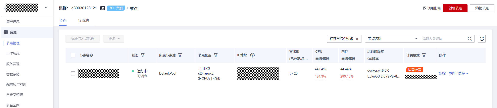
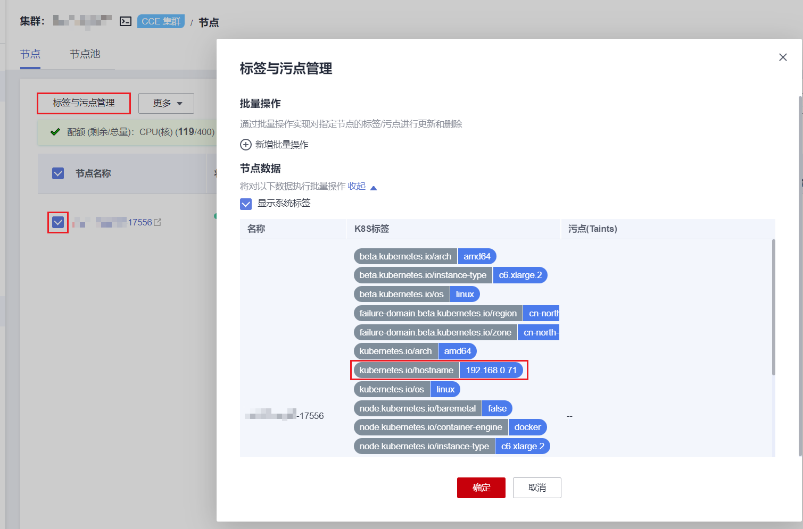

# 节点限制检查

## 检查项内容

当前检查项包括以下内容：

-   检查节点是否可用
-   检查节点操作系统是否支持升级
-   检查节点是否含有非预期的节点池标签
-   检查K8s节点名称是否与云服务器保持一致

## 解决方案

-   **问题场景一：节点不可用**

    若检查发现节点不可用，请登录CCE控制台，前往“集群信息-\>节点管理”处查看节点状态，请确保节点处于“运行中”状态。节点处于“安装中”、“删除中”状态时，均不支持升级。

    若节点状态异常，请参考  [集群可用，但节点状态为“不可用”](https://support.huaweicloud.com/cce_faq/cce_faq_00120.html)修复节点后，重试检查任务。

    

-   **问题场景二：节点操作系统升级支持受限**

    当前集群升级支持的节点操作系统范围如下表所示，若您的节点OS不在支持列表之内，暂时无法升级。您可将节点重置为列表中可用的操作系统。

    **表 1**  节点OS支持列表

    
    <table><thead align="left"><tr id="row16695202616314"><th class="cellrowborder" valign="top" width="50%" id="mcps1.2.3.1.1">
操作系统

    </th>
    <th class="cellrowborder" valign="top" width="50%" id="mcps1.2.3.1.2">
限制

    </th>
    </tr>
    </thead>
    <tbody><tr id="row126959261539"><td class="cellrowborder" valign="top" width="50%" headers="mcps1.2.3.1.1 ">
EulerOS

    </td>
    <td class="cellrowborder" valign="top" width="50%" headers="mcps1.2.3.1.2 ">
无限制

    </td>
    </tr>
    <tr id="row1169511261039"><td class="cellrowborder" valign="top" width="50%" headers="mcps1.2.3.1.1 ">
CentOS

    </td>
    <td class="cellrowborder" valign="top" width="50%" headers="mcps1.2.3.1.2 ">
无限制

    </td>
    </tr>
    <tr id="row96952261931"><td class="cellrowborder" valign="top" width="50%" headers="mcps1.2.3.1.1 ">
Ubuntu

    </td>
    <td class="cellrowborder" valign="top" width="50%" headers="mcps1.2.3.1.2 ">
部分局点受限，若检查结果不支持升级，请联系技术支持人员

    </td>
    </tr>
    <tr id="row46964261135"><td class="cellrowborder" valign="top" width="50%" headers="mcps1.2.3.1.1 ">
Huawei Cloud EulerOS 2.0

    </td>
    <td class="cellrowborder" valign="top" width="50%" headers="mcps1.2.3.1.2 ">
部分局点受限，若检查结果不支持升级，请联系技术支持人员

    </td>
    </tr>
    </tbody>
    </table>

-   **问题场景三：节点含有非预期的节点池标签**

    由节点池迁移至默认节点池的节点，仍然会保留节点池标签"cce.cloud.com/cce-nodepool"，影响集群升级。请确认该节点上的负载调度是否依赖改标签：

    -   若无依赖，请删除该标签。
    -   若存在依赖，请修改负载调度策略，解除依赖后再删除该标签。

-   **问题场景四：K8s节点名称与云服务器一致**

    CCEK8s节点名称默认“与节点私有IP保持一致”，若创建节点时选择“与云服务器名称保持一致”，当前暂不支持升级。

    请登录CCE控制台，前往“集群信息-\>节点管理”处查看节点标签，对比节点标签kubernetes.io/hostname的值是否与云服务器名称是否一致。如果一致，则需在集群升级前移除该节点。

    

