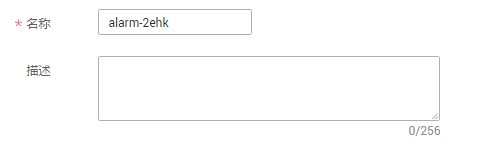
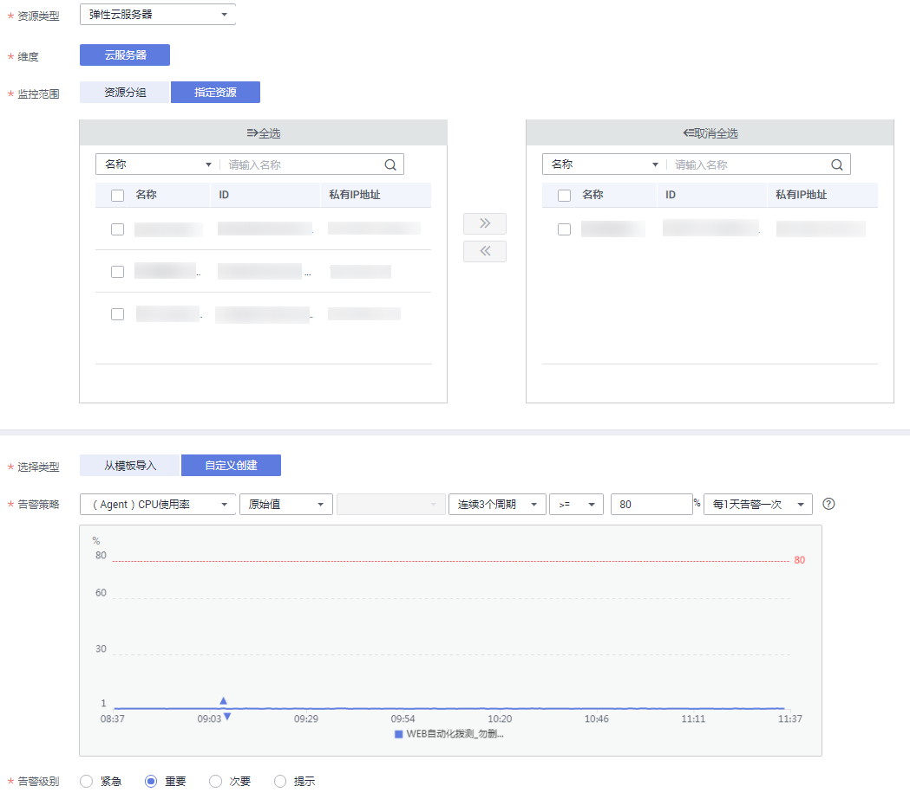
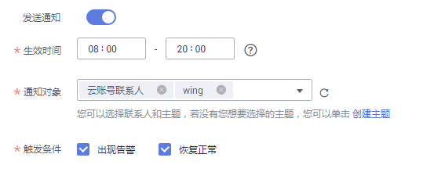

# 设置告警规则

通过设置节点告警规则，用户可自定义监控目标与通知策略，及时了解节点运行状况，从而起到预警作用。

## 操作场景

通过设置节点告警规则，用户可自定义监控目标与通知策略，及时了解节点运行状况，从而起到预警作用。

设置节点的告警规则包括设置告警规则名称、监控对象、监控指标、告警阈值、监控周期和是否发送通知等参数。本节介绍了设置告警规则的具体方法。

## 操作步骤

1.  登录管理控制台。
2.  单击“管理与部署 \> 云监控服务”。
3.  选择“告警 \> 告警规则”。
4.  单击“创建告警规则”。
5.  在“创建告警规则”界面，根据界面提示配置参数。
    1.  根据界面提示，配置规则信息参数。

        **图 1**  配置规则信息  
        

        **表 1**  配置规则信息

        
        <table><thead align="left"><tr id="row6481117152218"><th class="cellrowborder" valign="top" width="18.96%" id="mcps1.2.3.1.1">
参数

        </th>
        <th class="cellrowborder" valign="top" width="81.04%" id="mcps1.2.3.1.2">
参数说明

        </th>
        </tr>
        </thead>
        <tbody><tr id="row848111176224"><td class="cellrowborder" valign="top" width="18.96%" headers="mcps1.2.3.1.1 ">
名称

        </td>
        <td class="cellrowborder" valign="top" width="81.04%" headers="mcps1.2.3.1.2 ">
系统会随机产生一个名称，用户也可以进行修改。

        
取值样例：alarm-b6al

        </td>
        </tr>
        <tr id="row1348115178222"><td class="cellrowborder" valign="top" width="18.96%" headers="mcps1.2.3.1.1 ">
描述

        </td>
        <td class="cellrowborder" valign="top" width="81.04%" headers="mcps1.2.3.1.2 ">
告警规则描述（此参数非必填项）。

        </td>
        </tr>
        </tbody>
        </table>

    2.  选择监控对象，配置告警内容参数。

        **图 2**  配置告警内容  
        

        **表 2**  配置告警内容

        
        <table><thead align="left"><tr id="row79491995423"><th class="cellrowborder" valign="top" width="14.970000000000002%" id="mcps1.2.4.1.1">
参数

        </th>
        <th class="cellrowborder" valign="top" width="63.73000000000001%" id="mcps1.2.4.1.2">
参数说明

        </th>
        <th class="cellrowborder" valign="top" width="21.3%" id="mcps1.2.4.1.3">
取值样例

        </th>
        </tr>
        </thead>
        <tbody><tr id="row17949393429"><td class="cellrowborder" valign="top" width="14.970000000000002%" headers="mcps1.2.4.1.1 ">
资源类型

        </td>
        <td class="cellrowborder" valign="top" width="63.73000000000001%" headers="mcps1.2.4.1.2 ">
配置告警规则监控的服务名称。

        </td>
        <td class="cellrowborder" valign="top" width="21.3%" headers="mcps1.2.4.1.3 ">
弹性云服务器

        </td>
        </tr>
        <tr id="row895014917429"><td class="cellrowborder" valign="top" width="14.970000000000002%" headers="mcps1.2.4.1.1 ">
维度

        </td>
        <td class="cellrowborder" valign="top" width="63.73000000000001%" headers="mcps1.2.4.1.2 ">
用于指定告警规则对应指标的维度名称

        </td>
        <td class="cellrowborder" valign="top" width="21.3%" headers="mcps1.2.4.1.3 ">
云服务器

        </td>
        </tr>
        <tr id="row9950199425"><td class="cellrowborder" valign="top" width="14.970000000000002%" headers="mcps1.2.4.1.1 ">
监控范围

        </td>
        <td class="cellrowborder" valign="top" width="63.73000000000001%" headers="mcps1.2.4.1.2 ">
告警规则适用的资源范围，可选择资源分组或指定资源。

        
 说明： 
<ul id="ul895019914215"><li>当选择资源分组时，该分组下任何资源满足告警策略时，都会触发告警通知。</li><li>选择指定资源时，勾选具体的监控对象，单击将监控对象同步到右侧对话框。</li></ul>
        

        </td>
        <td class="cellrowborder" valign="top" width="21.3%" headers="mcps1.2.4.1.3 ">
指定资源

        </td>
        </tr>
        <tr id="row69501099422"><td class="cellrowborder" valign="top" width="14.970000000000002%" headers="mcps1.2.4.1.1 ">
选择分组

        </td>
        <td class="cellrowborder" valign="top" width="63.73000000000001%" headers="mcps1.2.4.1.2 ">
当监控范围为资源分组时需配置此参数。

        </td>
        <td class="cellrowborder" valign="top" width="21.3%" headers="mcps1.2.4.1.3 ">
-

        </td>
        </tr>
        <tr id="row5951139154215"><td class="cellrowborder" valign="top" width="14.970000000000002%" headers="mcps1.2.4.1.1 ">
选择类型

        </td>
        <td class="cellrowborder" valign="top" width="63.73000000000001%" headers="mcps1.2.4.1.2 ">
根据需要可选择从模板导入或自定义创建。

        
 说明： 

当监控范围为指定资源时可选择从模板导入。

        

        </td>
        <td class="cellrowborder" valign="top" width="21.3%" headers="mcps1.2.4.1.3 ">
自定义创建

        </td>
        </tr>
        <tr id="row1095129204217"><td class="cellrowborder" valign="top" width="14.970000000000002%" headers="mcps1.2.4.1.1 ">
模板

        </td>
        <td class="cellrowborder" valign="top" width="63.73000000000001%" headers="mcps1.2.4.1.2 ">
选择需要导入的模板。

        </td>
        <td class="cellrowborder" valign="top" width="21.3%" headers="mcps1.2.4.1.3 ">
-

        </td>
        </tr>
        <tr id="row89519954220"><td class="cellrowborder" valign="top" width="14.970000000000002%" headers="mcps1.2.4.1.1 ">
告警策略

        </td>
        <td class="cellrowborder" valign="top" width="63.73000000000001%" headers="mcps1.2.4.1.2 ">
触发告警规则的告警策略。

        
当资源类型选择站点监控、日志监控、自定义监控、具体的云服务时，告警策略为一个周期性的动作。当资源类型选择事件监控时，具体的事件为一个瞬间的操作动作，而不是周期性动作。

        
例如：CPU使用率，监控周期为5分钟，连续三个周期平均值≥80%

        </td>
        <td class="cellrowborder" valign="top" width="21.3%" headers="mcps1.2.4.1.3 ">
-

        </td>
        </tr>
        <tr id="row3951891428"><td class="cellrowborder" valign="top" width="14.970000000000002%" headers="mcps1.2.4.1.1 ">
挂载点

        </td>
        <td class="cellrowborder" valign="top" width="63.73000000000001%" headers="mcps1.2.4.1.2 ">
当监控指标为细颗粒度的磁盘类监控指标时需配置该参数。

        
Windows系统请输入对应的驱动器号，比如C、D或者E等，Linux系统请输入对应的挂载点，比如/dev、/opt等。

        </td>
        <td class="cellrowborder" valign="top" width="21.3%" headers="mcps1.2.4.1.3 ">
/dev

        </td>
        </tr>
        <tr id="row5951129114220"><td class="cellrowborder" valign="top" width="14.970000000000002%" headers="mcps1.2.4.1.1 ">
告警级别

        </td>
        <td class="cellrowborder" valign="top" width="63.73000000000001%" headers="mcps1.2.4.1.2 ">
根据告警的严重程度不同等级，可选择紧急、重要、次要、提示。

        </td>
        <td class="cellrowborder" valign="top" width="21.3%" headers="mcps1.2.4.1.3 ">
重要

        </td>
        </tr>
        </tbody>
        </table>

    3.  根据界面提示，配置告警通知参数。

        **图 3**  配置告警通知  
        

        **表 3**  配置告警通知

        
        <table><thead align="left"><tr id="row13415173554216"><th class="cellrowborder" valign="top" width="18.87%" id="mcps1.2.3.1.1">
参数

        </th>
        <th class="cellrowborder" valign="top" width="81.13%" id="mcps1.2.3.1.2">
参数说明

        </th>
        </tr>
        </thead>
        <tbody><tr id="row3415103514420"><td class="cellrowborder" valign="top" width="18.87%" headers="mcps1.2.3.1.1 ">
发送通知

        </td>
        <td class="cellrowborder" valign="top" width="81.13%" headers="mcps1.2.3.1.2 ">
配置是否发送邮件、短信、HTTP和HTTPS通知用户。

        </td>
        </tr>
        <tr id="row18415153564213"><td class="cellrowborder" valign="top" width="18.87%" headers="mcps1.2.3.1.1 ">
生效时间

        </td>
        <td class="cellrowborder" valign="top" width="81.13%" headers="mcps1.2.3.1.2 ">
该告警规则仅在生效时间内发送通知消息。

        
如生效时间为08:00-20:00，则该告警规则仅在08:00-20:00发送通知消息。

        </td>
        </tr>
        <tr id="row164156354426"><td class="cellrowborder" valign="top" width="18.87%" headers="mcps1.2.3.1.1 ">
主题通知

        </td>
        <td class="cellrowborder" valign="top" width="81.13%" headers="mcps1.2.3.1.2 ">
需要发送告警通知的主题名称。

        
当发送通知选择“是”时，需要选择已有的主题名称，若此处没有需要的主题则需先创建主题，该功能会调用消息通知服务（SMN），创建主题请参见《消息通知服务用户指南》。

        </td>
        </tr>
        <tr id="row1416153504210"><td class="cellrowborder" valign="top" width="18.87%" headers="mcps1.2.3.1.1 ">
触发条件

        </td>
        <td class="cellrowborder" valign="top" width="81.13%" headers="mcps1.2.3.1.2 ">
可以选择“出现告警”、“恢复正常”两种状态，作为触发告警通知的条件。

        </td>
        </tr>
        </tbody>
        </table>

    4.  配置完成后，单击“立即创建”，完成告警规则的创建。

告警规则添加完成后，当监控指标触发设定的阈值时，云监控服务会在第一时间通过消息通知服务实时告知您云上资源异常，以免因此造成业务损失。

更多关于监控规则的信息，请参见[云监控用户指南](https://support.huaweicloud.com/usermanual-ces/zh-cn_topic_0015479880.html)。

