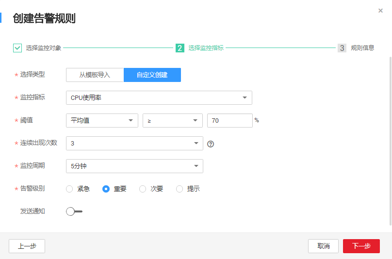

# 设置告警规则

通过设置节点告警规则，用户可自定义监控目标与通知策略，及时了解节点运行状况，从而起到预警作用。

## 操作场景

通过设置节点告警规则，用户可自定义监控目标与通知策略，及时了解节点运行状况，从而起到预警作用。

设置节点的告警规则包括设置告警规则名称、监控对象、监控指标、告警阈值、监控周期和是否发送通知等参数。本节介绍了设置告警规则的具体方法。

## 操作步骤

1.  登录管理控制台，选择“管理与部署 \>  云监控服务“。
2.  在左侧导航栏，选择“告警 \> 告警规则“。
3.  在告警规则界面，单击“创建告警规则“进行添加，或选择已有的告警规则进行修改，设置节点的告警规则。创建告警规则具体参数介绍，请参见《云监控用户指南》。

    以创建告警规则为例，介绍如何设置告警规则：

    1.  选择监控对象。
        -   资源类型：弹性云服务器。
        -   维度：云服务器
        -   监控对象：选择需要创建规则的节点。

    2.  单击“下一步“，选择监控指标。例如自定义创建CPU使用率的监控指标。

        **图 1**  选择监控指标  
        

    3.  单击“下一步“，输入规则的名称和描述。例如输入名称为**alarm-01**，单击“创建“。告警规则设置完成后，当符合规则的告警产生时，系统会自行进行通知。

        > **说明：**   
        >更多关于监控规则的信息，请参见《云监控用户指南》。  

