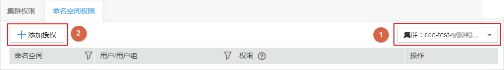
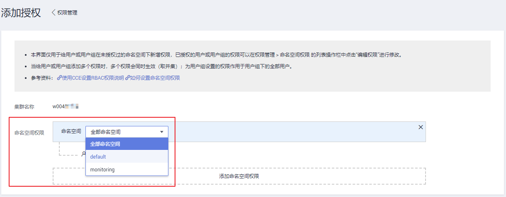
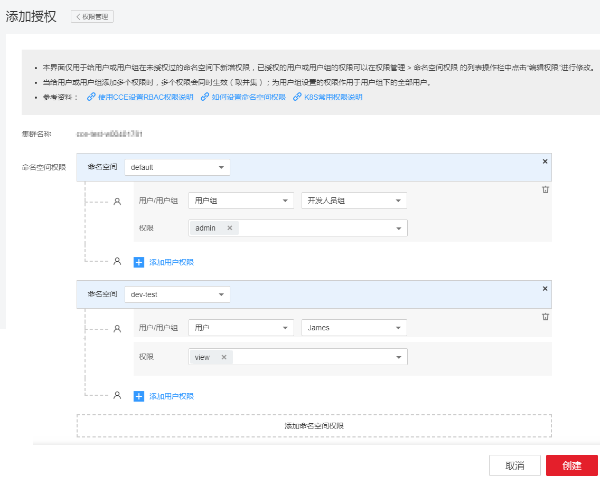
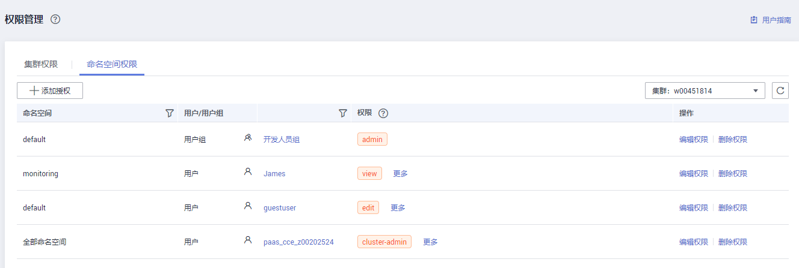

# 设置命名空间权限

本章节通过简单的命名空间授权方法，将CCE服务的用户和用户组授予操作不同命名空间资源的权限，从而使用户和用户组在拥有对应的CCE集群标准权限的同时，又可以拥有对集群中命名空间的操作权限。设置流程如[示例流程](#section41056841)所示。

## 配置说明

-   您需要拥有一个华为云主账号，有一个或若干个用户组和IAM用户。
-   本例将对用户和用户组授予操作不同命名空间资源的权限，在您的实际业务中，您可根据业务需求仅对用户或用户组授予不同的权限。
-   本例仅用于给用户或用户组在未授权过的命名空间下新增权限，已授权的用户或用户组的权限可以在“权限管理 \> 命名空间权限“  的列表“操作“栏中单击“编辑权限“进行修改。
-   当给用户或用户组添加多个权限时，多个权限会同时生效（取并集）；为用户组设置的权限将作用于用户组下的全部用户。

## 限制条件

kubernetes RBAC的授权能力支持1.13版本集群。

在v1.11.7-r2版本的集群中默认开启RBAC功能，若需使用RBAC功能请将集群升级至v1.11.7-r2或以上版本。升级方法请参见[升级集群](升级集群.md)。

**表 1**  各类型用户在不同版本集群中的权限对比

<table><thead align="left"><tr id="row14863201719502"><th class="cellrowborder" valign="top" width="33.33333333333333%" id="mcps1.2.4.1.1">
用户类型

</th>
<th class="cellrowborder" valign="top" width="33.33333333333333%" id="mcps1.2.4.1.2">
集群版本&lt; v1.11.7-r2

</th>
<th class="cellrowborder" valign="top" width="33.33333333333333%" id="mcps1.2.4.1.3">
集群版本 &gt;= v1.11.7-r2

</th>
</tr>
</thead>
<tbody><tr id="row138631617185012"><td class="cellrowborder" valign="top" width="33.33333333333333%" headers="mcps1.2.4.1.1 ">
主账号

</td>
<td class="cellrowborder" valign="top" width="33.33333333333333%" headers="mcps1.2.4.1.2 ">
所有权限

</td>
<td class="cellrowborder" valign="top" width="33.33333333333333%" headers="mcps1.2.4.1.3 ">
所有权限

</td>
</tr>
<tr id="row138631317205019"><td class="cellrowborder" valign="top" width="33.33333333333333%" headers="mcps1.2.4.1.1 ">
赋予CCE Administrator权限的IAM用户

</td>
<td class="cellrowborder" valign="top" width="33.33333333333333%" headers="mcps1.2.4.1.2 ">
所有权限

</td>
<td class="cellrowborder" valign="top" width="33.33333333333333%" headers="mcps1.2.4.1.3 ">
所有权限

</td>
</tr>
<tr id="row1386412176506"><td class="cellrowborder" valign="top" width="33.33333333333333%" headers="mcps1.2.4.1.1 ">
赋予CCE&nbsp;FullAccess或者CCE&nbsp;ReadOnlyAccess权限的IAM用户

</td>
<td class="cellrowborder" valign="top" width="33.33333333333333%" headers="mcps1.2.4.1.2 ">
所有权限

</td>
<td class="cellrowborder" valign="top" width="33.33333333333333%" headers="mcps1.2.4.1.3 ">
按照权限管理界面设置的命名空间权限处理

</td>
</tr>
<tr id="row141962030123614"><td class="cellrowborder" valign="top" width="33.33333333333333%" headers="mcps1.2.4.1.1 ">
赋予Tenant Guest权限的IAM用户（未申请开启细粒度公测的账号）

</td>
<td class="cellrowborder" valign="top" width="33.33333333333333%" headers="mcps1.2.4.1.2 ">
只读权限

</td>
<td class="cellrowborder" valign="top" width="33.33333333333333%" headers="mcps1.2.4.1.3 ">
只读权限

</td>
</tr>
<tr id="row28641117145019"><td class="cellrowborder" valign="top" width="33.33333333333333%" headers="mcps1.2.4.1.1 ">
赋予Tenant Guest权限的IAM用户（已申请开启细粒度公测的账号）

</td>
<td class="cellrowborder" valign="top" width="33.33333333333333%" headers="mcps1.2.4.1.2 ">
所有权限

 说明： 

开启细粒度公测后，行为有变，从只读变为所有权限

</td>
<td class="cellrowborder" valign="top" width="33.33333333333333%" headers="mcps1.2.4.1.3 ">
按照权限管理界面设置的命名空间权限处理

</td>
</tr>
</tbody>
</table>

## 示例流程

命名空间是对一组资源和对象的抽象整合。在同一个集群内可创建不同的命名空间，不同命名空间中的数据彼此隔离，使得它们既可以共享同一个集群的服务，也能够互不干扰。命名空间的一个重要的作用是充当一个虚拟的集群，用于多种工作用途，满足多用户的使用需求。

本章节将沿用[为IAM用户设置CCE权限](为IAM用户设置CCE权限.md)中创建的IAM用户“James”和用户组“开发人员组”进行示例，为IAM用户“James”和用户组“开发人员组”添加命名空间权限，可以参考如下操作：

-   [步骤一：为IAM用户/用户组添加命名空间权限](#section39693318615)
-   [步骤二：用户登录并验证权限](#section191001533766)

## 步骤一：为IAM用户/用户组添加命名空间权限

本步骤将在CCE控制台中为IAM用户“James”以及用户组“开发人员组”授予某个集群命名空间下资源的操作权限，设置如下：

1.  登录[CCE控制台](https://console.huaweicloud.com/cce2.0/?utm_source=helpcenter)，在左侧导航栏中选择“权限管理“，进入权限管理页面。
2.  单击“命名空间权限“页签，在命名空间权限列表右上方选择要添加授权的集群，单击“添加授权“按钮，进入添加授权页面。

    **图 1**  添加授权  
    

3.  在添加授权页面，确认集群名称，选择该集群下要授权使用的命名空间，此处选择“default”。

    **图 2**  选择命名空间  
    

4.  单击“添加用户权限“，为“开发人员组”增加“admin“权限，在展开的选项中进行如下配置：

    -   用户/用户组：选择“用户组“，并在二级选项中选择“开发人员组”。
    -   权限：选择“admin“。

    单击“添加用户权限“可继续增加其他用户或用户组，并赋予相应的权限。

5.  单击下方的“添加命名空间权限“，为用户“James”增加在另一个命名空间“monitoring”的权限，在展开的选项中进行如下配置：

    -   命名空间：选择“monitoring”。
    -   用户/用户组：选择“用户“，并在二级选项中选择“James”增加。
    -   权限：选择“view“。

    **图 3**  添加命名空间权限  
    

6.  单击“创建“，完成以上用户和用户组在命名空间中的相应权限设置。

    **图 4**  命名空间权限列表  
    

    > **说明：**   
    >经过以上操作，授权结果如下：  
    >-   由于“开发人员组”包含IAM用户“James”，因此IAM用户“James”也同时获得了在命名空间“default”的“admin“权限。  
    >-   为IAM用户“James”增加了在命名空间“monitoring”的“view“权限。  

## 步骤二：用户登录并验证权限

使用IAM用户“James”登录云容器引擎控制台，验证授予的命名空间权限，验证步骤如下：

1.  在华为云登录页面，单击右下角的“IAM用户登录”。

    **图 5**  IAM用户登录  
    

2.  在“IAM用户登录”页面，输入账号名、用户名及用户密码，使用新创建的IAM用户登录。

    -   账号名为该IAM用户所属华为云账号的名称。
    -   用户名和密码为创建IAM用户James时输入的用户名和密码，首次登录时需要重置密码。

    如果登录失败，您可以联系您的账号主体，确认用户名及密码是否正确，或是重置用户名及密码，重置方法请参见：[忘记IAM用户密码](https://support.huaweicloud.com/iam_faq/iam_01_0314.html#section1)。

3.  登录成功后，进入控制台，登录后默认区域为“华为-北京一”，请先切换至授权区域。

    

4.  在“服务列表”中选择“云容器引擎 CCE“，进入[CCE控制台](https://console.huaweicloud.com/cce2.0/?utm_source=helpcenter)，对IAM用户James的命名空间权限进行验证。

