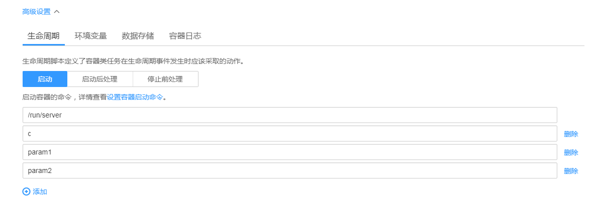

# 设置容器启动命令

创建任务时，通常通过镜像指定容器中运行的进程。

在默认情况下，镜像会运行默认命令，如果需要运行特定命令或重写镜像默认值，需要用到以下设置：

-   工作目录：指定运行命令的工作目录。

    > **说明：**   
    >若镜像中未指定工作目录，且在界面中也未指定，默认是“/”。  

-   可执行命令：控制镜像运行的实际命令。
-   参数：传递给运行命令的参数。

## 容器如何执行命令和参数

Docker 的镜像拥有存储镜像信息的相关元数据，如果不设置生命周期命令和参数，容器运行时会运行镜像制作时提供的默认的命令和参数，Docker 原生定义这两个字段为 “  Entrypoint ” 和 "  CMD "。详情可查看 Docker 的  [Entrypoint 说明](https://docs.docker.com/engine/reference/builder/#/entrypoint)，[CMD 说明](https://docs.docker.com/engine/reference/builder/#/cmd)。

如果在创建任务时填写了容器的可执行命令和参数，将会覆盖镜像构建时的默认命令 " Entrypoint "、" CMD "，规则如下：

**表 1** 容器如何执行命令和参数

<table><thead align="left"><tr id="row1683442952610"><th class="cellrowborder" valign="top" width="20%" id="mcps1.2.6.1.1">
镜像 Entrypoint

</th>
<th class="cellrowborder" valign="top" width="20%" id="mcps1.2.6.1.2">
镜像CMD

</th>
<th class="cellrowborder" valign="top" width="20%" id="mcps1.2.6.1.3">
容器运行命令

</th>
<th class="cellrowborder" valign="top" width="20%" id="mcps1.2.6.1.4">
容器运行参数

</th>
<th class="cellrowborder" valign="top" width="20%" id="mcps1.2.6.1.5">
最终执行

</th>
</tr>
</thead>
<tbody><tr id="row283622962618"><td class="cellrowborder" valign="top" width="20%" headers="mcps1.2.6.1.1 ">
[touch]

</td>
<td class="cellrowborder" valign="top" width="20%" headers="mcps1.2.6.1.2 ">
[/root/test]

</td>
<td class="cellrowborder" valign="top" width="20%" headers="mcps1.2.6.1.3 ">
未设置

</td>
<td class="cellrowborder" valign="top" width="20%" headers="mcps1.2.6.1.4 ">
未设置

</td>
<td class="cellrowborder" valign="top" width="20%" headers="mcps1.2.6.1.5 ">
[touch /root/test]

</td>
</tr>
<tr id="row283662932612"><td class="cellrowborder" valign="top" width="20%" headers="mcps1.2.6.1.1 ">
[touch]

</td>
<td class="cellrowborder" valign="top" width="20%" headers="mcps1.2.6.1.2 ">
[/root/test]

</td>
<td class="cellrowborder" valign="top" width="20%" headers="mcps1.2.6.1.3 ">
[mkdir]

</td>
<td class="cellrowborder" valign="top" width="20%" headers="mcps1.2.6.1.4 ">
未设置

</td>
<td class="cellrowborder" valign="top" width="20%" headers="mcps1.2.6.1.5 ">
[mkdir]

</td>
</tr>
<tr id="row9836152912618"><td class="cellrowborder" valign="top" width="20%" headers="mcps1.2.6.1.1 ">
[touch]

</td>
<td class="cellrowborder" valign="top" width="20%" headers="mcps1.2.6.1.2 ">
[/root/test]

</td>
<td class="cellrowborder" valign="top" width="20%" headers="mcps1.2.6.1.3 ">
未设置

</td>
<td class="cellrowborder" valign="top" width="20%" headers="mcps1.2.6.1.4 ">
[/opt/test]

</td>
<td class="cellrowborder" valign="top" width="20%" headers="mcps1.2.6.1.5 ">
[touch /opt/test]

</td>
</tr>
<tr id="row16837172972617"><td class="cellrowborder" valign="top" width="20%" headers="mcps1.2.6.1.1 ">
[touch]

</td>
<td class="cellrowborder" valign="top" width="20%" headers="mcps1.2.6.1.2 ">
[/root/test]

</td>
<td class="cellrowborder" valign="top" width="20%" headers="mcps1.2.6.1.3 ">
[mkdir]

</td>
<td class="cellrowborder" valign="top" width="20%" headers="mcps1.2.6.1.4 ">
[/opt/test]

</td>
<td class="cellrowborder" valign="top" width="20%" headers="mcps1.2.6.1.5 ">
[mkdir /opt/test]

</td>
</tr>
</tbody>
</table>

## 设置启动命令

1.  登录CCE控制台，在创建任务时，展开“高级设置 \> 生命周期 \> 启动“。
2.  参照[表2](#table94527255616)、[表3](#table113940208163)设置启动命令。

    > **说明：**   
    >-   当前启动命令以字符串数组形式提供，对应于Docker的Entrypoint启动命令，格式为： \["executable", "param1", "param2",..\]。Kubernetes的容器启动命令可参见[这里](https://kubernetes.io/docs/tasks/inject-data-application/define-command-argument-container/)。  
    >-   容器的生命周期与启动命令的生命周期一致，即启动命令执行完成后容器的生命周期结束。  

    **表 2**  容器启动命令-单命令

    
    <table><thead align="left"><tr id="row85331634326"><th class="cellrowborder" valign="top" width="28.999999999999996%" id="mcps1.2.3.1.1">
命令方式

    </th>
    <th class="cellrowborder" valign="top" width="71%" id="mcps1.2.3.1.2">
操作步骤

    </th>
    </tr>
    </thead>
    <tbody><tr id="row65339348218"><td class="cellrowborder" valign="top" width="28.999999999999996%" headers="mcps1.2.3.1.1 ">
可执行命令

    </td>
    <td class="cellrowborder" valign="top" width="71%" headers="mcps1.2.3.1.2 ">
单击“添加”，输入可执行的命令，例如“/run/server”。

    </td>
    </tr>
    <tr id="row85351342022"><td class="cellrowborder" valign="top" width="28.999999999999996%" headers="mcps1.2.3.1.1 ">
参数

    </td>
    <td class="cellrowborder" valign="top" width="71%" headers="mcps1.2.3.1.2 ">
单击“添加”，输入控制容器运行命令参数，例如--port=8080。

    
若参数有多个，多个参数输入到不同的输入框中，如<a href="#fig181710124584">图1</a>。

    </td>
    </tr>
    </tbody>
    </table>

    **表 3**  容器启动命令-多命令

    
    <table><thead align="left"><tr id="row939882012165"><th class="cellrowborder" valign="top" width="28.999999999999996%" id="mcps1.2.3.1.1">
命令方式

    </th>
    <th class="cellrowborder" valign="top" width="71%" id="mcps1.2.3.1.2">
操作步骤

    </th>
    </tr>
    </thead>
    <tbody><tr id="row540013200165"><td class="cellrowborder" valign="top" width="28.999999999999996%" headers="mcps1.2.3.1.1 ">
可执行命令

    </td>
    <td class="cellrowborder" valign="top" width="71%" headers="mcps1.2.3.1.2 ">
单击“添加”，输入可执行的命令，例如“/bin/sh”。

    </td>
    </tr>
    <tr id="row6407112010161"><td class="cellrowborder" valign="top" width="28.999999999999996%" headers="mcps1.2.3.1.1 ">
参数

    </td>
    <td class="cellrowborder" valign="top" width="71%" headers="mcps1.2.3.1.2 ">
单击“添加”，输入控制容器运行命令参数。

    
若参数有多个，多个参数输入到不同的输入框中。

    
 说明： 

多命令时，运行命令建议用/bin/sh或其他的shell，其他全部命令作为参数来传入，此时可执行命令与参数可以输入到同一个输入框中，如<a href="#fig171522334584">图2</a>。

    

    </td>
    </tr>
    </tbody>
    </table>

    **图 1**  单命令  
    

    **图 2**  多命令  
    

