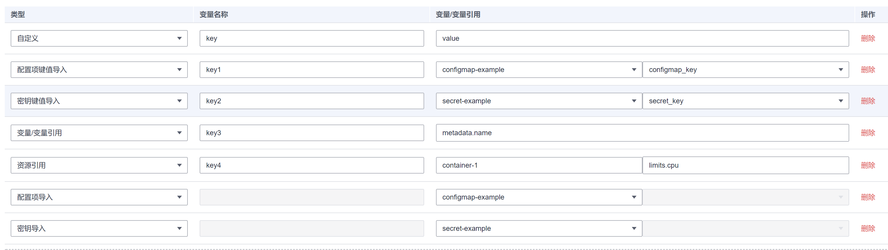

# 设置环境变量<a name="cce_10_0113"></a>

## 操作场景<a name="section91908379912"></a>

环境变量是指容器运行环境中设定的一个变量，环境变量可以在工作负载部署后修改，为工作负载提供极大的灵活性。

CCE中设置的环境变量与Dockerfile中的“ENV“效果相同。

> **须知：** 
>容器启动后，容器中的内容不应修改。如果修改配置项（例如将容器应用的密码、证书、环境变量配置到容器中），当容器重启（例如节点异常重新调度Pod）后，会导致配置丢失，业务异常。
>配置信息应通过入参等方式导入容器中，以免重启后配置丢失。

环境变量支持如下几种方式设置。

-   **自定义**
-   **配置项导入**：将配置项中所有键值都导入为环境变量。
-   **配置项键值导入**：将配置项中某个键的值导入作为某个环境变量的值。例如将configmap-example这个配置项中configmap\_key的值configmap\_value导入为环境变量key1的值，导入后容器中有一个名为key1的环境变量，其值为configmap\_value。
-   **密钥导入**：将密钥中所有键值都导入为环境变量。
-   **密钥键值导入**：将密钥中某个键的值导入作为某个环境变量的值。例如将secret-example这个配置项中secret\_key的值secret\_value导入为环境变量key2的值，导入后容器中有一个名为key2的环境变量，其值为secret\_value。
-   **变量/变量引用**：用Pod定义的字段作为环境变量的值，例如Pod的名称。
-   **资源引用**：用Container定义的字段作为环境变量的值，例如容器的CPU限制。

## 添加环境变量<a name="section13829152011595"></a>

1.  登录CCE控制台，在创建工作负载时，配置容器信息，选择“环境变量“。
2.  设置环境变量。

    


## YAML样例<a name="section19591158201313"></a>

```
apiVersion: apps/v1
kind: Deployment
metadata:
  name: env-example
  namespace: default
spec:
  replicas: 1
  selector:
    matchLabels:
      app: env-example
  template:
    metadata:
      labels:
        app: env-example
    spec:
      containers:
        - name: container-1
          image: nginx:alpine
          imagePullPolicy: Always
          resources:
            requests:
              cpu: 250m
              memory: 512Mi
            limits:
              cpu: 250m
              memory: 512Mi
          env:
            - name: key                     # 自定义
              value: value
            - name: key1                    # 配置项键值导入
              valueFrom:
                configMapKeyRef:
                  name: configmap-example
                  key: key1
            - name: key2                    # 密钥键值导入
              valueFrom:
                secretKeyRef:
                  name: secret-example
                  key: key2
            - name: key3                    # 变量引用，用Pod定义的字段作为环境变量的值
              valueFrom:
                fieldRef:
                  apiVersion: v1
                  fieldPath: metadata.name
            - name: key4                    # 资源引用，用Container定义的字段作为环境变量的值
              valueFrom:
                resourceFieldRef:
                  containerName: container1
                  resource: limits.cpu
                  divisor: 1
          envFrom:
            - configMapRef:                 # 配置项导入
                name: configmap-example
            - secretRef:                    # 密钥导入
                name: secret-example
      imagePullSecrets:
        - name: default-secret
```

## 环境变量查看<a name="section74514162911"></a>

如果configmap-example和secret-example的内容如下。

```
$ kubectl get configmap configmap-example -oyaml
apiVersion: v1
data:
  configmap_key: configmap_value
kind: ConfigMap
...

$ kubectl get secret secret-example -oyaml
apiVersion: v1
data:
  secret_key: c2VjcmV0X3ZhbHVl              # c2VjcmV0X3ZhbHVl为secret_value的base64编码
kind: Secret
...
```

则进入Pod中查看的环境变量结果如下。

```
$ kubectl get pod
NAME                           READY   STATUS    RESTARTS   AGE
env-example-695b759569-lx9jp   1/1     Running   0          17m

$ kubectl exec env-example-695b759569-lx9jp  -- printenv
/ # env
key=value                             # 自定义环境变量
key1=configmap_value                  # 配置项键值导入
key2=secret_value                     # 密钥键值导入
key3=env-example-695b759569-lx9jp     # Pod的metadata.name
key4=1                                # container1这个容器的limits.cpu，单位为Core，向上取整
configmap_key=configmap_value         # 配置项导入，原配置项中的键值直接会导入结果
secret_key=secret_value               # 密钥导入，原密钥中的键值直接会导入结果
```

