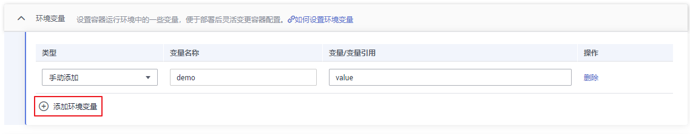
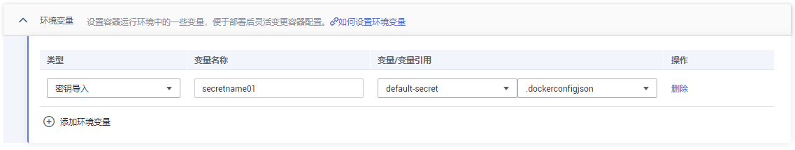
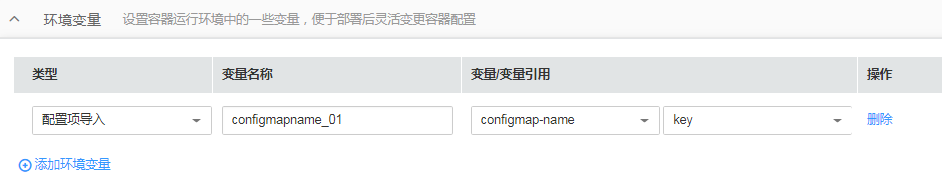

# 设置环境变量

## 操作场景

环境变量是指容器运行环境中设定的一个变量，环境变量可以在工作负载部署后修改，为工作负载提供极大的灵活性。

CCE中设置的环境变量与Dockerfile中的“ENV“效果相同。

在CCE中，您可以通过三种方式来添加环境变量：手动添加、密钥导入、配置项导入。

> **须知：** 
>容器启动后，容器中的内容不应修改。如果修改配置项（例如将容器应用的密码、证书、环境变量配置到容器中），当容器重启（例如节点异常重新调度pod）后，会导致配置丢失，业务异常。
>配置信息应通过入参等方式导入容器中，以免重启后配置丢失。

## 手动添加

1.  创建工作负载时，添加容器镜像后，展开“环境变量“，单击“添加环境变量“。
2.  根据实际需求，设置如下参数。

    -   类型：手动添加。
    -   变量名称：自定义填写变量名称，如demo。
    -   变量/变量引用：输入变量的值，如value。

    **图 1**  手动添加环境变量  
    

## 密钥导入

1.  您需要先创建密钥，详细步骤请参见[创建密钥](创建密钥.md)。
2.  创建工作负载时，添加容器镜像后，展开“环境变量“，单击“添加环境变量“。
3.  根据实际需求，设置如下参数。

    -   类型：密钥导入。
    -   变量名称：自定义填写变量名称。
    -   变量/变量引用：请选择对应的密钥名称和键。

    **图 2**  密钥导入  
    

## 配置项导入

1.  您需要先创建配置项，详细步骤请参见[创建配置项](创建配置项.md)。
2.  创建工作负载时，添加容器镜像后，展开“环境变量“，单击“添加环境变量“。
3.  根据实际需求，设置如下参数。

    -   类型：配置项导入。
    -   变量名称：自定义填写变量名称。
    -   变量/变量引用：请选择对应的配置项名称和键。

    **图 3**  配置项导入  
    

