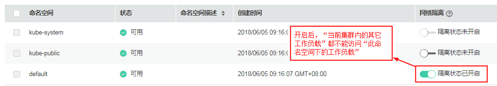

# 设置网络策略（NetworkPolicy）

CCE基于Kubernetes的网络策略功能进行了加强，通过配置网络策略，允许在同个集群内实现网络的隔离，也就是可以在某些实例（Pod）之间架起防火墙。

## 什么是网络策略

随着业务逻辑的复杂化，越来越多的应用需要大量模块之间的网络调用。传统的单一外部防火墙，或依照应用分层的防火墙已渐渐无法满足需求。在一个大的集群里面，各模块、业务逻辑层，或各职能团队之间的网络策略需求越来越强。

CCE基于Kubernetes的网络策略功能进行了加强，通过配置网络策略，允许在同个集群内实现网络的隔离，也就是可以在某些实例（Pod）之间架起防火墙。

使用场景例如：某个用户有支付系统，且严格要求只能某几个组件能访问该支付系统，否则有被攻破的安全风险，通过配置网络策略可免除该风险。

## 使用说明

若工作负载（例如名称为workload1）未配置网络策略，那“当前集群内的其它工作负载“都可以访问“名为workload1的工作负载“。

## 设置网络策略

1.  登录CCE控制台，选择左侧导航栏的“资源管理 \> 网络管理”，选择NetworkPolicy页签，单击“添加NetworkPolicy“。
    -   NetworkPolicy名称：自定义输入NetworkPolicy名称。
    -   集群名称：选择网络策略所在集群。
    -   命名空间：选择网络策略所在命名空间。
    -   关联工作负载：

        单击“选择工作负载“，选择“需要设置网络策略的工作负载“，例如工作负载名称为**workload1**，单击“确定“。

    -   规则：单击“添加规则“，参数设置请参见[表1](#table26919378234)。

        **表 1**  添加规则

        
        <table><thead align="left"><tr id="row117013742315"><th class="cellrowborder" valign="top" width="15%" id="mcps1.2.3.1.1">
参数

        </th>
        <th class="cellrowborder" valign="top" width="85%" id="mcps1.2.3.1.2">
参数说明

        </th>
        </tr>
        </thead>
        <tbody><tr id="row17073752310"><td class="cellrowborder" valign="top" width="15%" headers="mcps1.2.3.1.1 ">
方向

        </td>
        <td class="cellrowborder" valign="top" width="85%" headers="mcps1.2.3.1.2 ">
当前仅支持入方向。即“其它工作负载”访问“当前的工作负载（即当前案例中的workload1）”。

        </td>
        </tr>
        <tr id="row0706372237"><td class="cellrowborder" valign="top" width="15%" headers="mcps1.2.3.1.1 ">
协议

        </td>
        <td class="cellrowborder" valign="top" width="85%" headers="mcps1.2.3.1.2 ">
请选择对应的协议类型。

        </td>
        </tr>
        <tr id="row141931728132819"><td class="cellrowborder" valign="top" width="15%" headers="mcps1.2.3.1.1 ">
目的容器端口

        </td>
        <td class="cellrowborder" valign="top" width="85%" headers="mcps1.2.3.1.2 ">
容器镜像中应用程序实际监听端口，需用户确定。nginx程序实际监听的端口为80。

        
若不填写容器端口，默认所有端口都可被访问。

        </td>
        </tr>
        <tr id="row10711637182318"><td class="cellrowborder" valign="top" width="15%" headers="mcps1.2.3.1.1 ">
远端

        </td>
        <td class="cellrowborder" valign="top" width="85%" headers="mcps1.2.3.1.2 ">
选择可访问“当前工作负载”的“其它工作负载”。通过目的容器端口来访问。

        <ul id="ul28102117259"><li>命名空间：若选择某个命名空间，则该命名空间下的所有工作负载都会加入白名单，即都可访问<strong id="b6354262264">工作负载A</strong>。</li><li>工作负载：若选择某个工作负载，即该工作负载可以访问<strong id="b12101115402616">工作负载A</strong>。仅支持选择与“工作负载A”同个命名空间下的“其它工作负载”。</li></ul>
        </td>
        </tr>
        </tbody>
        </table>

2.  单击“确定“，单击“创建“。
3.  若需要为当前工作负载添加更多网络策略，例如其它端口需要被某个工作负载访问，可单击“添加NetworkPolicy“，继续添加更多策略。

    创建成功后，“仅远端中配置好的命名空间或工作负载“可以访问“当前工作负载“。

## 设置命名空间级的网络策略

您可以通过网络隔离开关，设置命名空间层面的网络策略。

例如命名空间default，网络隔离的默认状态为“命名空间网络隔离状态未开启”，表示“当前集群下的所有工作负载“都可以访问“命名空间default下的工作负载“。

若您需要设置其它工作负载不可以访问“命名空间default下的工作负载“，请参照以下步骤设置。

1.  登录CCE控制台，选择左侧导航栏的“资源管理 \> 命名空间“。
2.  在待设置命名空间（例如default）后，将网络隔离一栏的“命名空间网络隔离状态未开启”改为“命名空间网络隔离状态已开启”。

    设置完成后，当前集群内的其它工作负载都不能访问default下的工作负载。

    **图 1**  命名空间网络策略  
    

