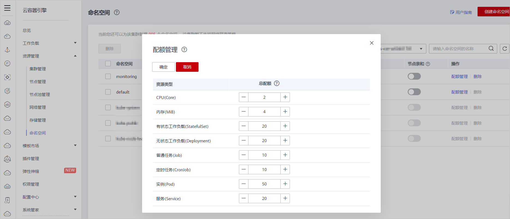

# 设置资源配额及限制

-   [前提条件](#section1974410198410)
-   [背景信息](#section161820104912)
-   [操作步骤](#section612004131015)

通过设置命名空间级别的资源配额，实现多团队或多用户在共享集群资源的情况下限制团队、用户可以使用的资源总量，包括限制命名空间下创建某一类型对象的数量以及对象消耗计算资源（CPU、内存）的总量。

> **说明：** 
>v1.9及以上版本的集群支持此功能。

## 前提条件

-   您已成功创建一个Kubernetes集群，参见[购买混合集群](购买混合集群.md)。
-   您已成功创建一个命名空间，参见[创建命名空间](创建命名空间.md)。

## 背景信息

默认情况下，运行中的Pod可以无限制的使用Node节点上的CPU和内存，这意味着任意一个Pod都可以无节制地使用集群的计算资源，某个命名空间的Pod可能会耗尽集群的所有资源。

kubernetes在一个物理集群上提供了多个虚拟集群，这些虚拟集群被称为命名空间。命名空间可用于多种工作用途，满足多用户的使用需求，通过为每个命名空间配置资源额度可以有效限制资源滥用，从而保证集群的可靠性。

您可为命名空间配置包括CPU、内存、Pod数量等资源的额度，更多信息请参见[Resource Quotas](https://kubernetes.io/docs/concepts/policy/resource-quotas/?spm=a2c4g.11186623.2.8.d882712bd1i8ae)。

其中，不同的集群规模对应的Pod数量推荐值如下：

<table><thead align="left"><tr id="row207441417281"><th class="cellrowborder" valign="top" width="24.03%" id="mcps1.1.4.1.1">
维度

</th>
<th class="cellrowborder" valign="top" width="36.22%" id="mcps1.1.4.1.2">
集群规模

</th>
<th class="cellrowborder" valign="top" width="39.75%" id="mcps1.1.4.1.3">
Pod数量推荐值

</th>
</tr>
</thead>
<tbody><tr id="row1974421112811"><td class="cellrowborder" rowspan="4" valign="top" width="24.03%" headers="mcps1.1.4.1.1 ">
规格

</td>
<td class="cellrowborder" valign="top" width="36.22%" headers="mcps1.1.4.1.2 ">
50节点

</td>
<td class="cellrowborder" valign="top" width="39.75%" headers="mcps1.1.4.1.3 ">
2500 Pod实例

</td>
</tr>
<tr id="row16744171192814"><td class="cellrowborder" valign="top" headers="mcps1.1.4.1.1 ">
200节点

</td>
<td class="cellrowborder" valign="top" headers="mcps1.1.4.1.2 ">
1W Pod实例

</td>
</tr>
<tr id="row1744611281"><td class="cellrowborder" valign="top" headers="mcps1.1.4.1.1 ">
1000节点

</td>
<td class="cellrowborder" valign="top" headers="mcps1.1.4.1.2 ">
3W Pod实例

</td>
</tr>
<tr id="row174413132813"><td class="cellrowborder" valign="top" headers="mcps1.1.4.1.1 ">
2000节点

</td>
<td class="cellrowborder" valign="top" headers="mcps1.1.4.1.2 ">
5W Pod实例

</td>
</tr>
</tbody>
</table>

## 操作步骤

1.  登录[CCE控制台](https://console.huaweicloud.com/cce2.0/?utm_source=helpcenter)，在左侧导航栏中选择“资源管理 \> 命名空间”。
2.  在“集群”下拉框中，选择命名空间所在的集群。
3.  单击对应命名空间后的“配额管理”，单击“编辑配额”。

    系统级别的命名空间kube-system、kube-public默认不支持设置资源配额。

    **图 1**  编辑配额  
    

4.  设置资源配额，单击“确定”。

    -   CPU（Core）：限制命名空间下工作负载实例（Pod）能申请CPU资源的最大值。单位为“核”。
    -   内存（MiB）：限制命名空间下工作负载实例能申请内存资源的最大值。单位为MiB。
    -   有状态工作负载（StatefulSet）：限制命名空间下能创建有状态负载的最大数量。
    -   无状态工作负载（Deployment）：限制命名空间下能创建无状态负载的最大数量。
    -   普通任务（Job）：限制命名空间下能创建普通任务的最大数量。
    -   定时任务（CronJob）：限制命名空间下能创建定时任务的最大数量。
    -   实例（Pod）：限制命名空间下能创建实例的最大数量。
    -   服务（Service）：限制命名空间下能创建服务的最大数量。

    > **须知：** 
    >-   命名空间设置了CPU或内存资源配额后，创建工作负载时，必须指定CPU或内存的请求值（request）和约束值（limit），否则CCE将拒绝创建实例。若设置资源配额值为0，则不限制该资源的使用。
    >-   配额累计使用量包含CCE系统默认创建的资源，如default命名空间下系统默认创建的kubernetes服务（该服务可通过后端kubectl工具查看）等，故建议命名空间下的资源配额略大于实际期望值以去除系统默认创建资源的影响。

