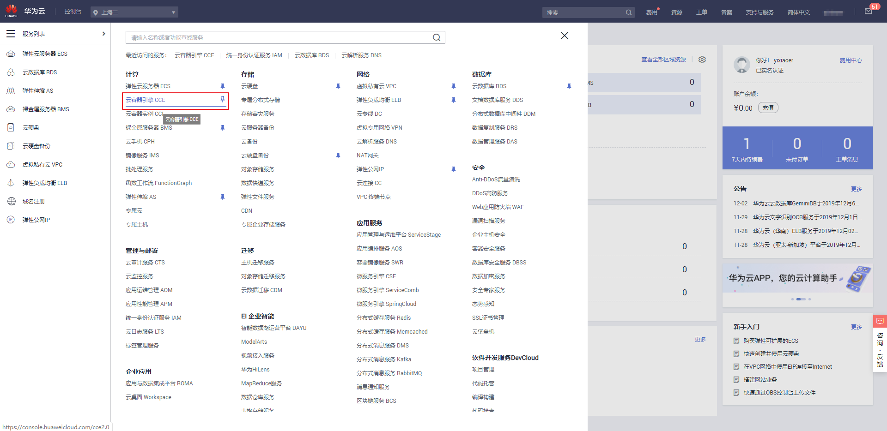
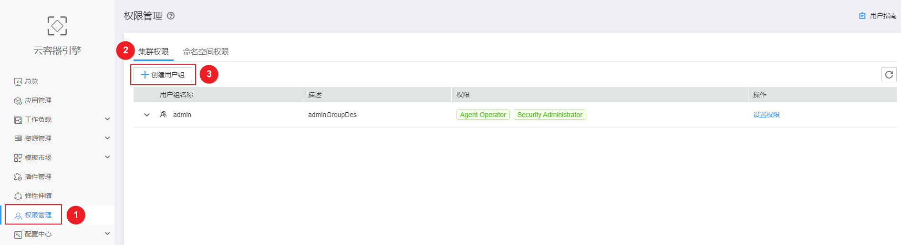
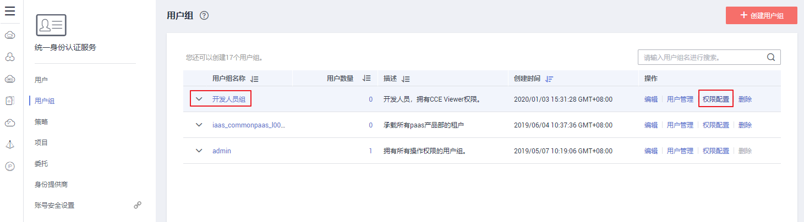
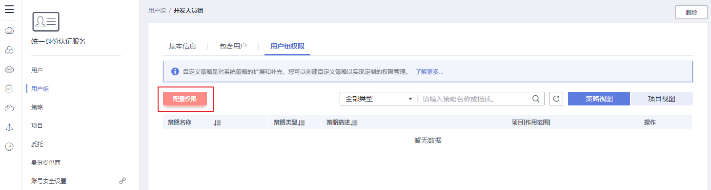
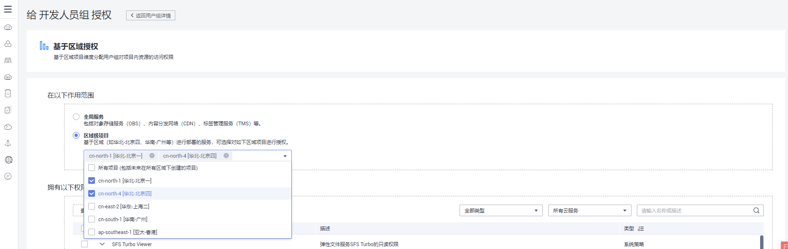
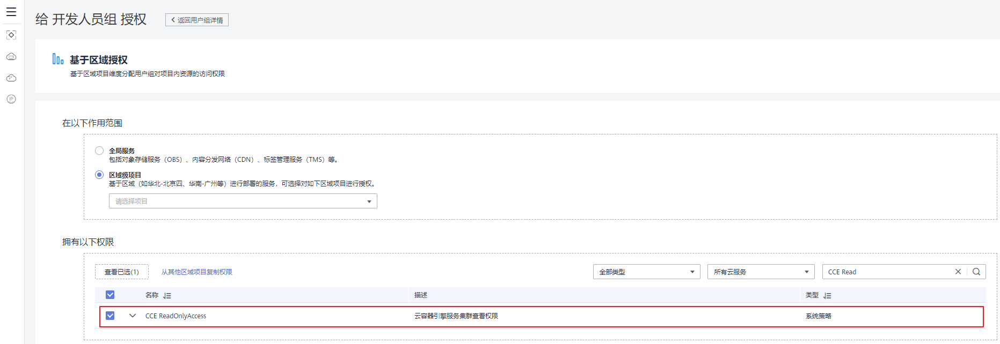
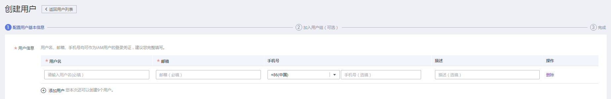
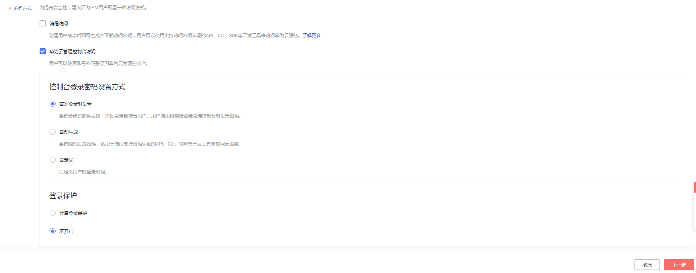
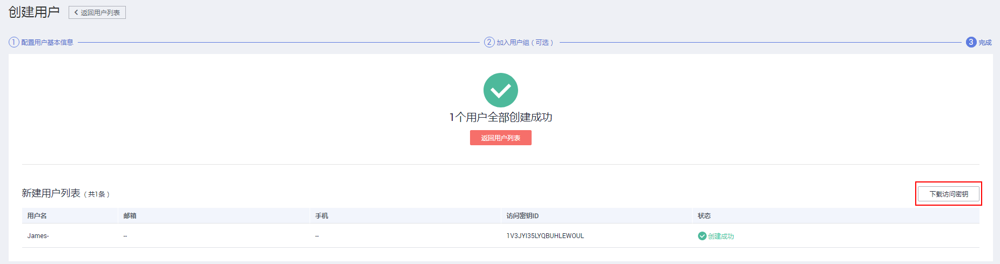

# 设置集群权限

本章节通过简单的用户组授权方法，使IAM用户“James”拥有对应集群的只读权限，操作流程如[示例流程](#section41056841)所示。

> **须知：**   
>-   CCE提供了CCE FullAccess和CCE ReadOnlyAccess两种策略，建议您通过默认的系统策略实现权限管理，关于CCE权限请参见[CCE系统权限](https://support.huaweicloud.com/productdesc-cce/cce_productdesc_0002.html)。  
>-   如果您需要使用自定义策略，请仔细阅读自定义策略中可以添加的授权项（Action），具体请参见[策略及授权项说明](https://support.huaweicloud.com/api-cce/cce_02_0327.html)，如遇问题[提交工单](https://console.huaweicloud.com/ticket/#/ticketindex/createIndex)处理。  

## 准备工作

给用户组授权之前，请您了解用户组可以添加的CCE系统策略，并结合实际需求进行选择，CCE支持的系统策略及策略间的对比，请参见[CCE系统权限](https://support.huaweicloud.com/productdesc-cce/cce_productdesc_0002.html)。若您需要对除CCE之外的其它服务授权，IAM支持服务的所有策略请参见[系统权限](https://support.huaweicloud.com/usermanual-permissions/iam_01_0001.html)。

## 配置说明

-   您需要拥有一个主账号，仅主账号或授予了CCE Administrator权限且全局设置了Security Administrator角色的IAM用户，才有权限进入CCE“权限管理“界面对其他IAM用户进行授权操作。
-   如果目标IAM用户涉及读写权限变更，只能由主账号授权。
-   由于IAM的安全限制，当您通过[云容器引擎控制台](https://console.huaweicloud.com/cce2.0?locale=zh-cn)的授权配置涉及到账号IAM授权的修改时，需要您按照页面上给出的参考策略内容和操作说明，在IAM控制台进行目标子账号的手动授权。

## 示例流程

用户组是用户的集合，CCE通过IAM的用户组功能实现用户的授权。您在IAM中创建的IAM用户，需要加入特定用户组后，IAM用户才具备用户组所拥有的权限。

关于创建用户组并给用户组授权的方法，可以参考如下操作：

-   [步骤一：创建用户组](#section1553217101617)
-   [步骤二：为用户组授权](#section993413129171)
-   [步骤二：创建IAM用户并加入用户组](#section1535210160)
-   [步骤三：使用IAM用户登录并验证权限](#section1953761017615)

## 步骤一：创建用户组

在“统一身份认证IAM“服务控制台创建用户组，并授予具有云容器引擎只读权限的“CCE ReadOnlyAccess”策略。

用户组是用户的集合，IAM通过用户组功能实现用户的授权。您在IAM中创建的用户，需要加入特定用户组后，用户才具备用户组所拥有的权限。关于创建用户组并给用户组授权的方法，可以参考如下操作。

1.  使用注册的华为云账号登录华为云，登录时请选择“账号登录”。

    **图 1**  账号登录  
    

2.  在控制台首页菜单中单击“云容器引擎CCE“，进入[CCE控制台](https://console.huaweicloud.com/cce2.0/?utm_source=helpcenter)。

    **图 2**  从控制台首页进入CCE Console  
    

3.  单击CCE控制台左侧导航栏中的“权限管理“，单击“集群权限“页签下的“创建用户组“。

    **图 3**  创建用户组  
    

4.  进入“统一身份认证服务“控制台的“创建用户组“界面，输入用户组名称（本例以“开发人员组”为例）。

    **图 4**  创建用户组  
    

    单击“确定”，用户组创建完成，界面自动返回用户组列表，列表中显示新建的用户组。

    > **说明：**   
    >您最多可以创建20个用户组，如果当前资源配额无法满足业务需要，您可以申请扩大配额，具体方法请参见：[如何修改配额](https://support.huaweicloud.com/usermanual-iaas/zh-cn_topic_0040259342.html)。  

## 步骤二：为用户组授权

1.  在用户组列表中，单击新建用户组右侧的“权限配置”。

    **图 5**  权限配置  
    

    在用户组权限页签中，单击列表左上方的“配置权限”。

    **图 6**  配置用户组权限  
    

2.  选择作用范围。CCE服务为区域级项目，本例选择“区域级项目“，则还需要在下拉框中选择需要授权的区域。

    -   全局服务：服务部署时不区分物理区域，为全局级服务，在全局区域中授权。包括对象存储服务（OBS）、内容分发网络（CDN）、标签管理服务（TMS）等。
    -   区域级项目：服务部署时通过物理区域划分，为项目级服务，授权后只在授权区域生效，如果需要所有区域都生效，则所有区域都需要进行授权操作。

    **图 7**  选择区域级项目  
    

3.  在搜索框中搜索“CCE“，勾选需要授予用户组的权限，本例此处选择“CCE ReadOnlyAccess“。

    **图 8**  选择策略  
    

4.  单击“确定”，完成用户组授权。

## 步骤二：创建IAM用户并加入用户组

IAM用户与企业中的实际员工或是应用程序相对应，有唯一的安全凭证，可以通过加入一个或多个用户组来获得用户组的权限。关于IAM用户的创建方式请参见如下步骤。

1.  在统一身份认证服务，左侧导航窗格中，单击“用户”\>“创建用户”。
2.  在“创建用户”页面填写“用户信息”。如需一次创建多个用户，可以单击“添加用户”进行批量创建，每次最多可创建10个用户。

    **图 9**  创建用户-填写用户信息  
    

    **表 1**  用户信息

    
    <table><thead align="left"><tr id="row1585971132215"><th class="cellrowborder" valign="top" width="7.870000000000001%" id="mcps1.2.3.1.1">
用户信息

    </th>
    <th class="cellrowborder" valign="top" width="92.13%" id="mcps1.2.3.1.2">
说明

    </th>
    </tr>
    </thead>
    <tbody><tr id="row148161516192520"><td class="cellrowborder" valign="top" width="7.870000000000001%" headers="mcps1.2.3.1.1 ">
用户名

    </td>
    <td class="cellrowborder" valign="top" width="92.13%" headers="mcps1.2.3.1.2 ">
必填。IAM用户登录华为云的用户名，此处以“James”和“Alice”为例。

    </td>
    </tr>
    <tr id="row138598110225"><td class="cellrowborder" valign="top" width="7.870000000000001%" headers="mcps1.2.3.1.1 ">
邮箱

    </td>
    <td class="cellrowborder" valign="top" width="92.13%" headers="mcps1.2.3.1.2 ">
“访问方式”选择“首次登录时设置”时必填，选择其他时选填。IAM用户绑定的邮箱，可作为子账户的登录凭证，也可由IAM用户自己绑定。

    </td>
    </tr>
    <tr id="row58605162217"><td class="cellrowborder" valign="top" width="7.870000000000001%" headers="mcps1.2.3.1.1 ">
手机号

    </td>
    <td class="cellrowborder" valign="top" width="92.13%" headers="mcps1.2.3.1.2 ">
选填。IAM用户绑定的手机号，可作为子账户的登录凭证，也可由IAM用户自己绑定。

    </td>
    </tr>
    <tr id="row7386153642217"><td class="cellrowborder" valign="top" width="7.870000000000001%" headers="mcps1.2.3.1.1 ">
描述

    </td>
    <td class="cellrowborder" valign="top" width="92.13%" headers="mcps1.2.3.1.2 ">
选填。记录IAM用户相关信息。

    </td>
    </tr>
    </tbody>
    </table>

3.  在“创建用户”页面选择“访问方式”，完成后单击“下一步”。

    **图 10**  创建用户-选择访问方式  
    

    **表 2**  访问方式

    
    <table><thead align="left"><tr id="row8779161802313"><th class="cellrowborder" valign="top" id="mcps1.2.5.1.1">
访问方式

    </th>
    <th class="cellrowborder" colspan="2" valign="top" id="mcps1.2.5.1.2">
配置信息

    </th>
    <th class="cellrowborder" valign="top" id="mcps1.2.5.1.3">
说明

    </th>
    </tr>
    </thead>
    <tbody><tr id="row10564326122520"><td class="cellrowborder" rowspan="5" valign="top" width="16.03839616038396%" headers="mcps1.2.5.1.1 ">
华为云管理控制台访问

    </td>
    <td class="cellrowborder" rowspan="3" valign="top" width="11.848815118488151%" headers="mcps1.2.5.1.2 ">
控制台登录密码设置方式

    

    </td>
    <td class="cellrowborder" valign="top" width="12.248775122487752%" headers="mcps1.2.5.1.2 ">
首次登录时设置

    </td>
    <td class="cellrowborder" valign="top" width="59.86401359864014%" headers="mcps1.2.5.1.3 ">
如果您不是用户James的使用主体，建议您选择该方式，输入用户的邮箱和手机，用户James通过邮件中的一次性链接登录华为云，自行设置密码。

    </td>
    </tr>
    <tr id="row10205744184711"><td class="cellrowborder" valign="top" headers="mcps1.2.5.1.1 ">
自动生成

    </td>
    <td class="cellrowborder" valign="top" headers="mcps1.2.5.1.2 ">
仅在创建单个用户时适用，如果您本次创建2个及以上的用户，则不支持此方式。

    </td>
    </tr>
    <tr id="row17779418132313"><td class="cellrowborder" valign="top" headers="mcps1.2.5.1.1 ">
自定义

    </td>
    <td class="cellrowborder" valign="top" headers="mcps1.2.5.1.2 ">
如果您是用户James的使用主体，建议您选择该方式，设置自己的登录密码。

    </td>
    </tr>
    <tr id="row18624110123516"><td class="cellrowborder" rowspan="2" valign="top" headers="mcps1.2.5.1.1 ">
登录保护

    

    </td>
    <td class="cellrowborder" valign="top" headers="mcps1.2.5.1.2 ">
开启登录保护

    </td>
    <td class="cellrowborder" valign="top" headers="mcps1.2.5.1.2 ">
开启登录保护后，IAM用户登录时，除了在登录页面输入用户名和密码外（第一次身份验证），还需要在登录验证页面输入验证码（第二次身份验证），该功能是一种安全实践，建议开启登录保护，多次身份认证可以提高账号安全性。

    
您可以选择通过手机、邮箱、虚拟MFA进行登录验证。

    </td>
    </tr>
    <tr id="row5127153713351"><td class="cellrowborder" valign="top" headers="mcps1.2.5.1.1 ">
不开启

    </td>
    <td class="cellrowborder" valign="top" headers="mcps1.2.5.1.2 ">
创建完成后，如需开启登录保护，请参见：<a href="https://support.huaweicloud.com/usermanual-iam/iam_01_0704.html" target="_blank" rel="noopener noreferrer">登录保护</a>。

    </td>
    </tr>
    <tr id="row177991813236"><td class="cellrowborder" valign="top" width="16.03839616038396%" headers="mcps1.2.5.1.1 ">
编程访问

    </td>
    <td class="cellrowborder" valign="top" width="11.848815118488151%" headers="mcps1.2.5.1.2 ">
--

    </td>
    <td class="cellrowborder" valign="top" width="12.248775122487752%" headers="mcps1.2.5.1.2 ">
--

    </td>
    <td class="cellrowborder" valign="top" width="59.86401359864014%" headers="mcps1.2.5.1.3 ">
创建用户完成后即可下载本次创建的所有用户的<a href="https://support.huaweicloud.com/usermanual-ca/ca_01_0003.html" target="_blank" rel="noopener noreferrer">管理访问密钥</a>。一个用户最多拥有两个访问密钥。这些AK/SK可以对华为云进行编程调用，例如，通过API调用方式访问华为云时，您可能需要使用访问密钥。

    </td>
    </tr>
    </tbody>
    </table>

    > **说明：**   
    >-   用户可以使用此处设置的用户名、邮箱或手机号码任意一种方式登录华为云。  
    >-   当用户忘记密码时，可以通过此处绑定的邮箱或手机自行重置密码，如果用户没有绑定邮箱或手机号码，只能由管理员重置密码。  
    >-   用户登录系统时，输入用户名和初始密码后，将进入“首次登录修改密码”，需要创建一个新密码，该功能可以保证用户的密码是由使用者本人所设置，防止密码泄露。  

4.  单击“下一步”，将用户加入到用户组（可选）。
    -   选择新创建的用户组“开发人员组”。将用户加入用户组，用户将具备用户组的权限，这一过程即给该用户授权。其中“admin”为系统缺省提供的用户组，具有管理人员以及所有云服务资源的操作权限。
    -   如需创建新的用户组，可单击“创建用户组”，填写用户组名称和描述（可选），创建成功后即可将用户加入到新创建的用户组中。

5.  单击“下一步”，IAM用户创建成功，用户列表中显示新创建的IAM用户。如果在访问方式中勾选了“编程访问”，可在此页面下载访问密钥。

    **图 11**  创建用户成功  
    

## 步骤三：使用IAM用户登录并验证权限

IAM用户创建完成后，可以使用新用户的用户名及身份凭证登录验证权限，即“CCE ReadOnlyAccess”权限。更多用户登录方法请参见[用户登录华为云方法](https://support.huaweicloud.com/qs-iam/iam_01_0031.html#section2)。

1.  在华为云登录页面，单击右下角的“IAM用户登录”。

    **图 12**  IAM用户登录  
    

2.  在“IAM用户登录”页面，输入账号名、用户名及用户密码，使用新创建的IAM用户登录。

    -   账号名为该IAM用户所属华为云账号的名称。
    -   用户名和密码为创建IAM用户James时输入的用户名和密码，首次登录时需要重置密码。

    如果登录失败，您可以联系您的账号主体，确认用户名及密码是否正确，或是重置用户名及密码，重置方法请参见：[忘记IAM用户密码](https://support.huaweicloud.com/iam_faq/iam_01_0314.html#section1)。

3.  登录成功后，进入控制台，登录后默认区域为“华为-北京一”，请先切换至授权区域。

    

4.  在“服务列表”中选择“云容器引擎 CCE“，返回[CCE控制台](https://console.huaweicloud.com/cce2.0/?utm_source=helpcenter)主界面，对IAM用户James的集群权限进行验证。

