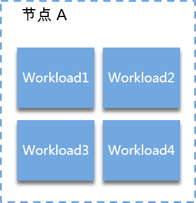
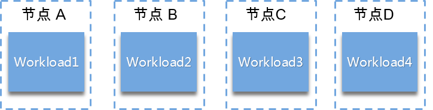

# 调度策略概述

CCE支持“自定义调度策略“和“简易调度策略“。自定义调度策略开放节点亲和、工作负载亲和以及工作负载反亲和调度策略的配置，以满足用户的更高需求。简易调度策略提供简单便捷以及足够功能的调度方式。

## 自定义调度策略

在自定义调度策略中用户可以设置“节点亲和性“、“工作负载亲和性“和“工作负载反亲和性“。

-   [节点的亲和性](节点亲和性.md)
-   [工作负载亲和性](工作负载亲和性.md)
-   [工作负载反亲和性](工作负载反亲和性.md)

> **说明：** 
>亲和性调度中需要设置的标签依赖节点的标签和Pod的标签，用户可以使用内置的标签进行设置，或者可以根据需求自定义节点和Pod的标签并使用。

## 简易调度策略

简易调度策略提供工作负载和可用区的亲和性、工作负载和节点的亲和性以及工作负载间的亲和性调度，用户可根据业务需求进行相应的设置部署工作负载。

-   **工作负载和可用区的亲和性：**基于可用区可以设置多条调度策略（包含亲和、反亲和），但只需满足其中一条就会进行调度。
    -   **与可用区的亲和性**：即[工作负载和可用区的亲和性](工作负载和可用区的亲和性.md)。
    -   **与可用区的反亲和性**：即[工作负载和可用区的反亲和性](工作负载和可用区的反亲和性.md)。

-   **工作负载和节点的亲和性：**基于节点可以设置多条调度策略（包含亲和、反亲和），但只需满足其中一条就会进行调度。例如集群下有节点A、B、C，设置调度策略为亲和节点A，反亲和节点B，则工作负载可以调度到除B以外任意一个节点上
    -   **与节点的亲和性**：即[工作负载和节点的亲和性](工作负载和节点的亲和性.md)。
    -   **与节点的反亲和性**：即[工作负载和节点的反亲和性](工作负载和节点的反亲和性.md)。

-   **工作负载间的亲和性：**基于工作负载可以设置多条调度策略，但多条策略中设置的标签必须同时出现在一个工作负载中。
    -   **与工作负载的亲和性**：即[工作负载间的亲和性](工作负载间的亲和性.md)。用户可根据业务需求进行工作负载的就近部署，容器间通信就近路由，减少网络消耗。

        如[图1](#fig3017424713)，Workload1、Workload2、Workload3和Workload4部署在相同节点上，为亲和性部署。

        **图 1**  工作负载间亲和  
        

    -   **与工作负载的反亲和性**：即[工作负载间的反亲和性](工作负载间的反亲和性.md)。同个工作负载的多个实例反亲和部署，减少宕机影响；互相干扰的工作负载反亲和部署，避免干扰。

        如[图2](#fig1505421971)，Workload1、Workload2、Workload3和Workload4分别部署在不同节点上，这四个工作负载为反亲和性部署。

        **图 2**  工作负载间反亲和  
        

> **须知：** 
>在设置“工作负载间的亲和性”和“工作负载和节点的亲和性”时，需确保不要出现互斥情况，否则工作负载会部署失败。
>例如如下互斥情况，工作负载将会部署失败：
>-   Workload1、Workload2设置了工作负载间的反亲和，例如Workload1部署在“节点A“，Workload2部署在“节点B“。
>-   Workload3部署上线时，既希望与Workload2亲和，又希望可以部署在不同节点如“节点C“或**“节点A”**上，这就造成了工作负载亲和节点亲和间的互斥，导致最终工作负载部署失败。

