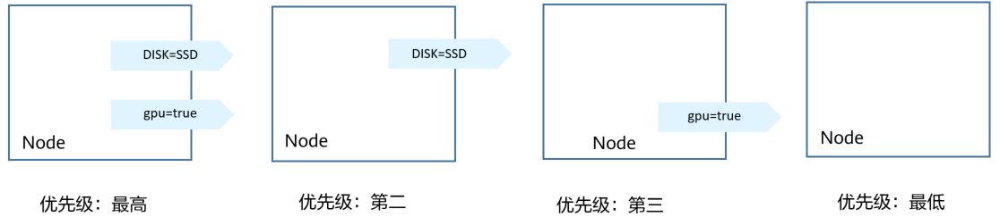

# 调度策略（亲和与反亲和）<a name="cce_10_0232"></a>

在[创建守护进程集\(DaemonSet\)](创建守护进程集(DaemonSet).md)中讲到使用nodeSelector选择Pod要部署的节点，其实Kubernetes还支持更精细、更灵活的调度机制，那就是亲和（affinity）与反亲和（anti-affinity）调度。

Kubernetes支持节点和Pod两个层级的亲和与反亲和。通过配置亲和与反亲和规则，可以允许您指定硬性限制或者偏好，例如将前台Pod和后台Pod部署在一起、某类应用部署到某些特定的节点、不同应用部署到不同的节点等等。

## 节点亲和（nodeAffinity）<a name="section1665272918139"></a>

亲和性规则的基础是标签，先来看一下集群中节点上有些什么标签。

```
$ kubectl describe node 192.168.0.212
Name:               192.168.0.212
Roles:              <none>
Labels:             beta.kubernetes.io/arch=amd64
                    beta.kubernetes.io/os=linux
                    failure-domain.beta.kubernetes.io/is-baremetal=false
                    failure-domain.beta.kubernetes.io/region=******
                    failure-domain.beta.kubernetes.io/zone=******
                    kubernetes.io/arch=amd64
                    kubernetes.io/availablezone=******
                    kubernetes.io/eniquota=12
                    kubernetes.io/hostname=192.168.0.212
                    kubernetes.io/os=linux
                    node.kubernetes.io/subnetid=fd43acad-33e7-48b2-a85a-24833f362e0e
                    os.architecture=amd64
                    os.name=EulerOS_2.0_SP5
                    os.version=3.10.0-862.14.1.5.h328.eulerosv2r7.x86_64
```

这些标签都是在创建节点的时候CCE会自动添加上的，下面介绍几个在调度中会用到比较多的标签。

-   failure-domain.beta.kubernetes.io/region：表示节点所在的区域。
-   failure-domain.beta.kubernetes.io/zone：表示节点所在的可用区（availability zone）。
-   kubernetes.io/hostname：节点的hostname。

在[DaemonSet](创建守护进程集(DaemonSet).md)中介绍了nodeSelector，通过nodeSelector可以让Pod只部署在具有特定标签的节点上。如下所示，Pod只会部署在拥有gpu=true这个标签的节点上。

```
apiVersion: v1
kind: Pod
metadata:
  name: nginx
spec:
  nodeSelector:                 # 节点选择，当节点拥有gpu=true标签时才在节点上创建Pod
    gpu: true
...
```

通过节点亲和性规则配置，也可以做到同样的事情，如下所示。

```
apiVersion: apps/v1
kind: Deployment
metadata:
  name:  gpu
  labels:
    app:  gpu
spec:
  selector:
    matchLabels:
      app: gpu
  replicas: 3
  template:
    metadata:
      labels:
        app:  gpu
    spec:
      containers:
      - image:  nginx:alpine
        name:  gpu
        resources:
          requests:
            cpu: 100m
            memory: 200Mi
          limits:
            cpu: 100m
            memory: 200Mi
      imagePullSecrets:
      - name: default-secret
      affinity:
        nodeAffinity:
          requiredDuringSchedulingIgnoredDuringExecution:
            nodeSelectorTerms:
            - matchExpressions:
              - key: gpu
                operator: In
                values:
                - "true"
```

看起来这要复杂很多，但这种方式可以得到更强的表达能力，后面会进一步介绍。

这里affinity表示亲和，nodeAffinity表示节点亲和，requiredDuringSchedulingIgnoredDuringExecution非常长，不过可以将这个分作两段来看：

-   前半段requiredDuringScheduling表示下面定义的规则必须强制满足（require）才会调度Pod到节点上。
-   后半段IgnoredDuringExecution表示已经在节点上运行的Pod不需要满足下面定义的规则，即去除节点上的某个标签，那些需要节点包含该标签的Pod不会被重新调度。

另外操作符operator的值为In，表示标签值需要在values的列表中，其他operator取值如下。

-   NotIn：标签的值不在某个列表中
-   Exists：某个标签存在
-   DoesNotExist：某个标签不存在
-   Gt：标签的值大于某个值（字符串比较）
-   Lt：标签的值小于某个值（字符串比较）

需要说明的是并没有nodeAntiAffinity（节点反亲和），因为NotIn和DoesNotExist可以提供相同的功能。

下面来验证这段规则是否生效，假设某集群有如下三个节点。

```
$ kubectl get node
NAME            STATUS   ROLES    AGE   VERSION                            
192.168.0.212   Ready    <none>   13m   v1.15.6-r1-20.3.0.2.B001-15.30.2
192.168.0.94    Ready    <none>   13m   v1.15.6-r1-20.3.0.2.B001-15.30.2   
192.168.0.97    Ready    <none>   13m   v1.15.6-r1-20.3.0.2.B001-15.30.2   
```

首先给192.168.0.212这个节点打上gpu=true的标签。

```
$ kubectl label node 192.168.0.212 gpu=true
node/192.168.0.212 labeled

$ kubectl get node -L gpu
NAME            STATUS   ROLES    AGE   VERSION                            GPU
192.168.0.212   Ready    <none>   13m   v1.15.6-r1-20.3.0.2.B001-15.30.2   true
192.168.0.94    Ready    <none>   13m   v1.15.6-r1-20.3.0.2.B001-15.30.2   
192.168.0.97    Ready    <none>   13m   v1.15.6-r1-20.3.0.2.B001-15.30.2   
```

创建这个Deployment，可以发现所有的Pod都部署在了192.168.0.212这个节点上。

```
$ kubectl create -f affinity.yaml 
deployment.apps/gpu created

$ kubectl get pod -o wide
NAME                     READY   STATUS    RESTARTS   AGE   IP            NODE         
gpu-6df65c44cf-42xw4     1/1     Running   0          15s   172.16.0.37   192.168.0.212
gpu-6df65c44cf-jzjvs     1/1     Running   0          15s   172.16.0.36   192.168.0.212
gpu-6df65c44cf-zv5cl     1/1     Running   0          15s   172.16.0.38   192.168.0.212
```

## 节点优先选择规则<a name="section168955237561"></a>

上面讲的requiredDuringSchedulingIgnoredDuringExecution是一种**强制**选择的规则，节点亲和还有一种优先选择规则，即preferredDuringSchedulingIgnoredDuringExecution，表示会根据规则**优先**选择哪些节点。

为演示这个效果，先为上面的集群添加一个SAS磁盘的节点，并打上DISK=SAS的标签，为另外三个节点打上DISK=SSD的标签。

```
$ kubectl get node -L DISK,gpu
NAME            STATUS   ROLES    AGE     VERSION                            DISK     GPU
192.168.0.100   Ready    <none>   7h23m   v1.15.6-r1-20.3.0.2.B001-15.30.2   SAS   
192.168.0.212   Ready    <none>   8h      v1.15.6-r1-20.3.0.2.B001-15.30.2   SSD      true
192.168.0.94    Ready    <none>   8h      v1.15.6-r1-20.3.0.2.B001-15.30.2   SSD   
192.168.0.97    Ready    <none>   8h      v1.15.6-r1-20.3.0.2.B001-15.30.2   SSD  
```

下面定义一个Deployment，要求Pod优先部署在SSD磁盘的节点上，可以像下面这样定义，使用preferredDuringSchedulingIgnoredDuringExecution规则，给SSD设置权重（weight）为80，而gpu=true权重为20，这样Pod就优先部署在SSD的节点上。

```
apiVersion: apps/v1
kind: Deployment
metadata:
  name:  gpu
  labels:
    app:  gpu
spec:
  selector:
    matchLabels:
      app: gpu
  replicas: 10
  template:
    metadata:
      labels:
        app:  gpu
    spec:
      containers:
      - image:  nginx:alpine
        name:  gpu
        resources:
          requests:
            cpu:  100m
            memory:  200Mi
          limits:
            cpu:  100m
            memory:  200Mi
      imagePullSecrets:
      - name: default-secret
      affinity:
        nodeAffinity:
          preferredDuringSchedulingIgnoredDuringExecution:
          - weight: 80 
            preference: 
              matchExpressions: 
              - key: DISK
                operator: In 
                values: 
                - SSD
          - weight: 20 
            preference: 
              matchExpressions: 
              - key: gpu
                operator: In 
                values: 
                - "true"
```

来看实际部署后的情况，可以看到部署到192.168.0.212（标签为DISK=SSD、gpu=true）这个节点上的Pod有5个，192.168.0.97（标签为DISK=SSD）上有3个，而192.168.0.100（标签为DISK=SAS）上只有2个。

这里您看到Pod并没有调度到192.168.0.94（标签为DISK=SSD）这个节点上，这是因为这个节点上部署了很多其他Pod，资源使用较多，所以并没有往这个节点上调度，这也侧面说明preferredDuringSchedulingIgnoredDuringExecution是优先规则，而不是强制规则。

```
$ kubectl create -f affinity2.yaml 
deployment.apps/gpu created

$ kubectl get po -o wide
NAME                   READY   STATUS    RESTARTS   AGE     IP            NODE         
gpu-585455d466-5bmcz   1/1     Running   0          2m29s   172.16.0.44   192.168.0.212
gpu-585455d466-cg2l6   1/1     Running   0          2m29s   172.16.0.63   192.168.0.97 
gpu-585455d466-f2bt2   1/1     Running   0          2m29s   172.16.0.79   192.168.0.100
gpu-585455d466-hdb5n   1/1     Running   0          2m29s   172.16.0.42   192.168.0.212
gpu-585455d466-hkgvz   1/1     Running   0          2m29s   172.16.0.43   192.168.0.212
gpu-585455d466-mngvn   1/1     Running   0          2m29s   172.16.0.48   192.168.0.97 
gpu-585455d466-s26qs   1/1     Running   0          2m29s   172.16.0.62   192.168.0.97 
gpu-585455d466-sxtzm   1/1     Running   0          2m29s   172.16.0.45   192.168.0.212
gpu-585455d466-t56cm   1/1     Running   0          2m29s   172.16.0.64   192.168.0.100
gpu-585455d466-t5w5x   1/1     Running   0          2m29s   172.16.0.41   192.168.0.212
```

上面这个例子中，对于节点排序优先级如下所示，有个两个标签的节点排序最高，只有SSD标签的节点排序第二（权重为80），只有gpu=true的节点排序第三，没有的节点排序最低。

**图 1**  优先级排序顺序<a name="fig1074885585814"></a>  


## 工作负载亲和（podAffinity）<a name="section3218151791419"></a>

节点亲和的规则只能影响Pod和节点之间的亲和，Kubernetes还支持Pod和Pod之间的亲和，例如将应用的前端和后端部署在一起，从而减少访问延迟。Pod亲和同样有requiredDuringSchedulingIgnoredDuringExecution和preferredDuringSchedulingIgnoredDuringExecution两种规则。

来看下面这个例子，假设有个应用的后端已经创建，且带有app=backend的标签。

```
$ kubectl get po -o wide
NAME                       READY   STATUS    RESTARTS   AGE     IP            NODE         
backend-658f6cb858-dlrz8   1/1     Running   0          2m36s   172.16.0.67   192.168.0.100
```

将前端frontend的pod部署在backend一起时，可以做如下Pod亲和规则配置。

```
apiVersion: apps/v1
kind: Deployment
metadata:
  name:   frontend
  labels:
    app:  frontend
spec:
  selector:
    matchLabels:
      app: frontend
  replicas: 3
  template:
    metadata:
      labels:
        app:  frontend
    spec:
      containers:
      - image:  nginx:alpine
        name:  frontend
        resources:
          requests:
            cpu:  100m
            memory:  200Mi
          limits:
            cpu:  100m
            memory:  200Mi
      imagePullSecrets:
      - name: default-secret
      affinity:
        podAffinity:
          requiredDuringSchedulingIgnoredDuringExecution:
          - topologyKey: kubernetes.io/hostname
            labelSelector:
              matchExpressions: 
              - key: app
                operator: In 
                values: 
                - backend
```

创建frontend然后查看，可以看到frontend都创建到跟backend一样的节点上了。

```
$ kubectl create -f affinity3.yaml 
deployment.apps/frontend created

$ kubectl get po -o wide
NAME                        READY   STATUS    RESTARTS   AGE     IP            NODE         
backend-658f6cb858-dlrz8    1/1     Running   0          5m38s   172.16.0.67   192.168.0.100
frontend-67ff9b7b97-dsqzn   1/1     Running   0          6s      172.16.0.70   192.168.0.100
frontend-67ff9b7b97-hxm5t   1/1     Running   0          6s      172.16.0.71   192.168.0.100
frontend-67ff9b7b97-z8pdb   1/1     Running   0          6s      172.16.0.72   192.168.0.100
```

这里有个**topologyKey**字段（拓扑域），意思是先圈定topologyKey指定的范围，然后再选择下面规则定义的内容。这里每个节点上都有kubernetes.io/hostname，所以看不出topologyKey起到的作用。

如果backend有两个Pod，分别在不同的节点上。

```
$ kubectl get po -o wide
NAME                       READY   STATUS    RESTARTS   AGE     IP            NODE         
backend-658f6cb858-5bpd6   1/1     Running   0          23m     172.16.0.40   192.168.0.97
backend-658f6cb858-dlrz8   1/1     Running   0          2m36s   172.16.0.67   192.168.0.100
```

给192.168.0.97和192.168.0.94打一个prefer=true的标签。

```
$ kubectl label node 192.168.0.97 prefer=true
node/192.168.0.97 labeled
$ kubectl label node 192.168.0.94 prefer=true
node/192.168.0.94 labeled

$ kubectl get node -L prefer
NAME            STATUS   ROLES    AGE   VERSION                            PREFER
192.168.0.100   Ready    <none>   44m   v1.15.6-r1-20.3.0.2.B001-15.30.2   
192.168.0.212   Ready    <none>   91m   v1.15.6-r1-20.3.0.2.B001-15.30.2   
192.168.0.94    Ready    <none>   91m   v1.15.6-r1-20.3.0.2.B001-15.30.2   true
192.168.0.97    Ready    <none>   91m   v1.15.6-r1-20.3.0.2.B001-15.30.2   true
```

将podAffinity的topologyKey定义为prefer。

```
      affinity:
        podAffinity:
          requiredDuringSchedulingIgnoredDuringExecution:
          - topologyKey: prefer
            labelSelector:
              matchExpressions: 
              - key: app
                operator: In 
                values: 
                - backend
```

调度时，先圈定拥有prefer标签的节点，这里也就是192.168.0.97和192.168.0.94，然后再匹配app=backend标签的Pod，从而frontend就会全部部署在192.168.0.97上。

```
$ kubectl create -f affinity3.yaml 
deployment.apps/frontend created

$ kubectl get po -o wide
NAME                        READY   STATUS    RESTARTS   AGE     IP            NODE         
backend-658f6cb858-5bpd6    1/1     Running   0          26m     172.16.0.40   192.168.0.97
backend-658f6cb858-dlrz8    1/1     Running   0          5m38s   172.16.0.67   192.168.0.100
frontend-67ff9b7b97-dsqzn   1/1     Running   0          6s      172.16.0.70   192.168.0.97
frontend-67ff9b7b97-hxm5t   1/1     Running   0          6s      172.16.0.71   192.168.0.97
frontend-67ff9b7b97-z8pdb   1/1     Running   0          6s      172.16.0.72   192.168.0.97
```

## 工作负载反亲和（podAntiAffinity）<a name="section59542620588"></a>

前面讲了Pod的亲和，通过亲和将Pod部署在一起，有时候需求却恰恰相反，需要将Pod分开部署，例如Pod之间部署在一起会影响性能的情况。

下面例子中定义了反亲和规则，这个规则表示Pod不能调度到拥有app=frontend标签Pod的节点上，也就是下面将frontend分别调度到不同的节点上（每个节点只有一个Pod）。

```
apiVersion: apps/v1
kind: Deployment
metadata:
  name:   frontend
  labels:
    app:  frontend
spec:
  selector:
    matchLabels:
      app: frontend
  replicas: 5
  template:
    metadata:
      labels:
        app:  frontend
    spec:
      containers:
      - image:  nginx:alpine
        name:  frontend
        resources:
          requests:
            cpu:  100m
            memory:  200Mi
          limits:
            cpu:  100m
            memory:  200Mi
      imagePullSecrets:
      - name: default-secret
      affinity:
        podAntiAffinity:
          requiredDuringSchedulingIgnoredDuringExecution:
          - topologyKey: kubernetes.io/hostname
            labelSelector:
              matchExpressions: 
              - key: app
                operator: In 
                values: 
                - frontend
```

创建并查看，可以看到每个节点上只有一个frontend的Pod，还有一个在Pending，因为在部署第5个时4个节点上都有了app=frontend的Pod，所以第5个一直是Pending。

```
$ kubectl create -f affinity4.yaml 
deployment.apps/frontend created

$ kubectl get po -o wide
NAME                        READY   STATUS    RESTARTS   AGE   IP            NODE         
frontend-6f686d8d87-8dlsc   1/1     Running   0          18s   172.16.0.76   192.168.0.100
frontend-6f686d8d87-d6l8p   0/1     Pending   0          18s   <none>        <none>       
frontend-6f686d8d87-hgcq2   1/1     Running   0          18s   172.16.0.54   192.168.0.97 
frontend-6f686d8d87-q7cfq   1/1     Running   0          18s   172.16.0.47   192.168.0.212
frontend-6f686d8d87-xl8hx   1/1     Running   0          18s   172.16.0.23   192.168.0.94 
```

## 通过控制台配置调度策略<a name="section14975195565810"></a>

1.  登录CCE控制台。
2.  在创建工作负载时，在“高级设置“中找到“调度策略“。

    **表 1**  节点亲和性设置

    <a name="table202751247311"></a>
    <table><thead align="left"><tr id="row6275154232"><th class="cellrowborder" valign="top" width="23.95%" id="mcps1.2.3.1.1"><p id="p11274641534"><a name="p11274641534"></a><a name="p11274641534"></a>参数名</p>
    </th>
    <th class="cellrowborder" valign="top" width="76.05%" id="mcps1.2.3.1.2"><p id="p12747418317"><a name="p12747418317"></a><a name="p12747418317"></a>参数描述</p>
    </th>
    </tr>
    </thead>
    <tbody><tr id="row1327511413311"><td class="cellrowborder" valign="top" width="23.95%" headers="mcps1.2.3.1.1 "><p id="p1827516415318"><a name="p1827516415318"></a><a name="p1827516415318"></a>必须满足</p>
    </td>
    <td class="cellrowborder" valign="top" width="76.05%" headers="mcps1.2.3.1.2 "><p id="p1427512410317"><a name="p1427512410317"></a><a name="p1427512410317"></a>即硬约束，设置必须要满足的条件，对应于<span>required</span>DuringSchedulingIgnoredDuringExecution，多条规则间是一种“或”的关系，即只需要满足一条规则即会进行调度。</p>
    </td>
    </tr>
    <tr id="row112751441939"><td class="cellrowborder" valign="top" width="23.95%" headers="mcps1.2.3.1.1 "><p id="p172751442316"><a name="p172751442316"></a><a name="p172751442316"></a>尽量满足</p>
    </td>
    <td class="cellrowborder" valign="top" width="76.05%" headers="mcps1.2.3.1.2 "><p id="p12275164932"><a name="p12275164932"></a><a name="p12275164932"></a>即软约束，设置尽量满足的条件，对应于<span>preferred</span>DuringSchedulingIgnoredDuringExecution，无论是满足其中一条或者是都不满足都会进行调度。</p>
    </td>
    </tr>
    </tbody>
    </table>

3.  在“节点亲和性“、“工作负载亲和性“、“工作负载反亲和性“下单击添加调度策略。在弹出的窗口中可以直接添加策略、指定节点或指定可用区。

    指定节点和指定可用区本质也是通过标签实现，只是通过控制台提供了更为便捷的操作。指定节点使用的是 kubernetes.io/hostname 标签，可用区使用的是 failure-domain.beta.kubernetes.io/zone 标签。

    **表 2**  调度策略设置

    <a name="table723331051417"></a>
    <table><thead align="left"><tr id="row102330108147"><th class="cellrowborder" valign="top" width="23.95%" id="mcps1.2.3.1.1"><p id="p1423201015144"><a name="p1423201015144"></a><a name="p1423201015144"></a>参数名</p>
    </th>
    <th class="cellrowborder" valign="top" width="76.05%" id="mcps1.2.3.1.2"><p id="p20232151015147"><a name="p20232151015147"></a><a name="p20232151015147"></a>参数描述</p>
    </th>
    </tr>
    </thead>
    <tbody><tr id="row19233110171411"><td class="cellrowborder" valign="top" width="23.95%" headers="mcps1.2.3.1.1 "><p id="p1323311105147"><a name="p1323311105147"></a><a name="p1323311105147"></a>标签名</p>
    </td>
    <td class="cellrowborder" valign="top" width="76.05%" headers="mcps1.2.3.1.2 "><p id="p1423331081410"><a name="p1423331081410"></a><a name="p1423331081410"></a>对应节点的标签，可以使用默认的标签也可以用户自定义标签。</p>
    </td>
    </tr>
    <tr id="row9233111019149"><td class="cellrowborder" valign="top" width="23.95%" headers="mcps1.2.3.1.1 "><p id="p3233191011410"><a name="p3233191011410"></a><a name="p3233191011410"></a>操作符</p>
    </td>
    <td class="cellrowborder" valign="top" width="76.05%" headers="mcps1.2.3.1.2 "><p id="p1723314104146"><a name="p1723314104146"></a><a name="p1723314104146"></a>可以设置六种匹配关系（In, NotIn, Exists, DoesNotExist. Gt, and Lt）。</p>
    <a name="ul10233151017145"></a><a name="ul10233151017145"></a><ul id="ul10233151017145"><li>In：是否在标签值的列表中</li><li>NotIn：是否不在标签值的列表中</li><li>Exists：某个标签存在</li><li>DoesNotExist：某个标签不存在</li><li>Gt：标签的值大于某个值（字符串比较）</li><li>Lt：标签的值小于某个值（字符串比较）</li></ul>
    </td>
    </tr>
    <tr id="row1523391051416"><td class="cellrowborder" valign="top" width="23.95%" headers="mcps1.2.3.1.1 "><p id="p4233181016141"><a name="p4233181016141"></a><a name="p4233181016141"></a>标签值</p>
    </td>
    <td class="cellrowborder" valign="top" width="76.05%" headers="mcps1.2.3.1.2 "><p id="p1233131051415"><a name="p1233131051415"></a><a name="p1233131051415"></a>请填写标签值。</p>
    </td>
    </tr>
    <tr id="row13233810151420"><td class="cellrowborder" valign="top" width="23.95%" headers="mcps1.2.3.1.1 "><p id="p196991729104014"><a name="p196991729104014"></a><a name="p196991729104014"></a>命名空间</p>
    </td>
    <td class="cellrowborder" valign="top" width="76.05%" headers="mcps1.2.3.1.2 "><p id="p281835112545"><a name="p281835112545"></a><a name="p281835112545"></a>仅支持在工作负载亲和/工作负载反亲和调度策略中使用。</p>
    <p id="p47694256418"><a name="p47694256418"></a><a name="p47694256418"></a>指定调度策略生效的命名空间。</p>
    </td>
    </tr>
    <tr id="row11982634104016"><td class="cellrowborder" valign="top" width="23.95%" headers="mcps1.2.3.1.1 "><p id="p11982173424017"><a name="p11982173424017"></a><a name="p11982173424017"></a>拓扑域</p>
    </td>
    <td class="cellrowborder" valign="top" width="76.05%" headers="mcps1.2.3.1.2 "><p id="p1073711319545"><a name="p1073711319545"></a><a name="p1073711319545"></a>仅支持在工作负载亲和/工作负载反亲和调度策略中使用。</p>
    <p id="p1075725320423"><a name="p1075725320423"></a><a name="p1075725320423"></a>先圈定拓扑域（topologyKey）指定的范围，然后再选择策略定义的内容。</p>
    </td>
    </tr>
    <tr id="row1389112844120"><td class="cellrowborder" valign="top" width="23.95%" headers="mcps1.2.3.1.1 "><p id="p168911385411"><a name="p168911385411"></a><a name="p168911385411"></a>权重</p>
    </td>
    <td class="cellrowborder" valign="top" width="76.05%" headers="mcps1.2.3.1.2 "><p id="p98926814113"><a name="p98926814113"></a><a name="p98926814113"></a>仅支持在<span class="uicontrol" id="uicontrol19651125725312"><a name="uicontrol19651125725312"></a><a name="uicontrol19651125725312"></a>“尽量满足”</span>策略中添加。</p>
    </td>
    </tr>
    </tbody>
    </table>


