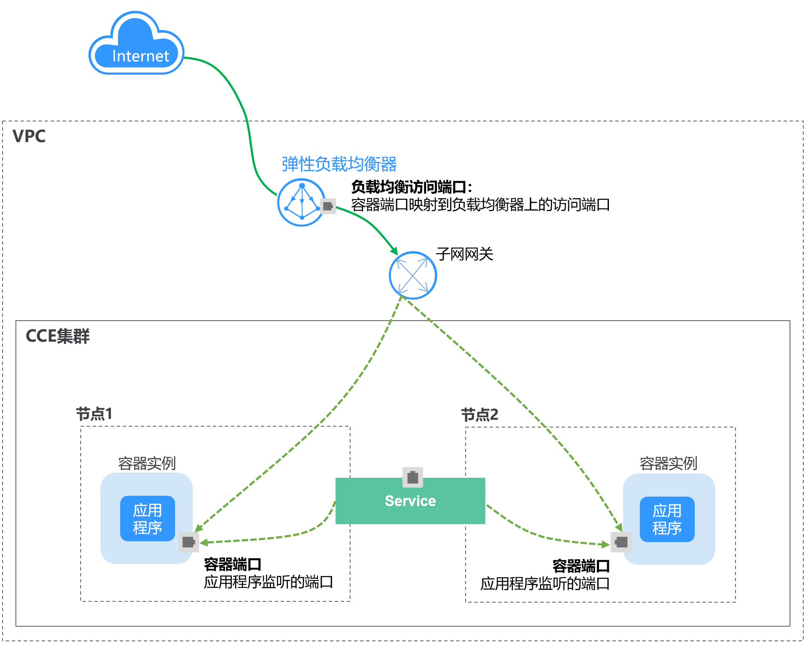
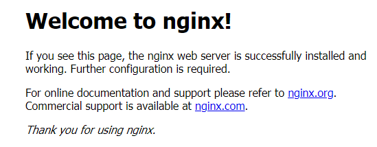
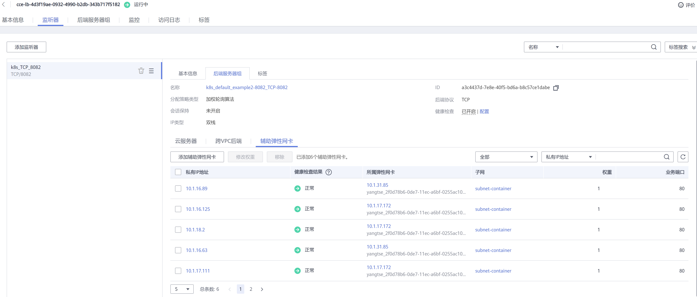
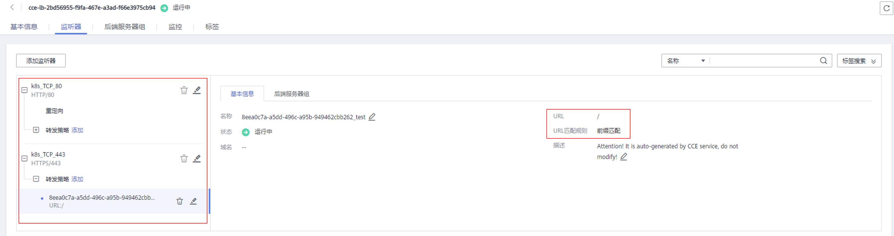

# 负载均衡\(LoadBalancer\)<a name="cce_10_0014"></a>

## 操作场景<a name="section19854101411508"></a>

负载均衡\( LoadBalancer \)可以通过弹性负载均衡从公网访问到工作负载，与弹性IP方式相比提供了高可靠的保障，一般用于系统中需要暴露到公网的服务。

负载均衡访问方式由公网弹性负载均衡服务地址以及设置的访问端口组成，例如“10.117.117.117:80“。

在访问时从ELB过来的流量会先访问到节点，然后通过Service转发到Pod。

**图 1**  负载均衡\( LoadBalancer \)<a name="fig1454926316508"></a>  
.png "负载均衡(-LoadBalancer-)")

在使用**CCE Turbo集群 + 独享型ELB实例**时，支持ELB直通Pod，使部署在容器中的业务时延降低、性能无损耗。

从集群外部访问时，从ELB直接转发到Pod；集群内部访问可通过Service转发到Pod。

**图 2**  ELB直通容器<a name="fig44531612193618"></a>  


## 约束与限制<a name="section11642143794611"></a>

-   CCE中的负载均衡 \( LoadBalancer \)访问类型使用弹性负载均衡 ELB提供网络访问，存在如下产品约束：
    -   自动创建的ELB实例建议不要被其他资源使用，否则会在删除时被占用，导致资源残留。
    -   1.15及之前版本集群使用的ELB实例请不要修改监听器名称，否则可能导致无法正常访问。

-   创建service后，如果服务亲和从集群级别切换为节点级别，连接跟踪表将不会被清理，建议用户创建service后不要修改服务亲和属性，如需修改请重新创建service。
-   当服务亲和设置为节点级别（即externalTrafficPolicy为local）时，集群内部可能使用ELB地址访问不通，具体情况请参见[集群内使用ELB地址无法访问Service说明](#section52631714117)。
-   CCE Turbo集群仅支持集群级别服务亲和。
-   独享型ELB仅支持1.17及以上集群。
-   独享型ELB规格必须支持网络型（TCP/UDP），且网络类型必须支持私网（有私有IP地址）。如果需要Service支持HTTP，则独享型ELB规格需要为网络型（TCP/UDP）和应用型（HTTP/HTTPS）。
-   使用控制台创建LoadBalancer类型Service时会自动生成一个节点端口（nodeport），端口号随机。使用kubectl创建LoadBalancer类型Service时，如不指定节点端口，也会随机生成一个节点端口，端口号随机。
-   使用CCE集群时，如果LoadBalancer类型Service的服务亲和类型为集群级别（cluster），当请求进入到集群时，会使用SNAT分发到各个节点的节点端口（nodeport），不能超过节点可用的nodeport数量，而服务亲和为节点级别（local）则无此约束。使用CCE Turbo集群时，如果是使用共享型ELB依然有此约束，而独享型ELB无此约束，建议使用CCE Turbo时配合使用独享型ELB。
-   集群服务转发模式为IPVS时，不支持配置节点的IP作为Service的externalIP，会导致节点不可用。
-   IPVS模式集群下，Ingress和Service使用相同ELB实例时，无法在集群内的节点和容器中访问Ingress，因为kube-proxy会在ipvs-0的网桥上挂载LB类型的Service地址，Ingress对接的ELB的流量会被ipvs-0网桥劫持。建议Ingress和Service使用不同ELB实例。

## 创建LoadBalancer类型Service<a name="section1325012312139"></a>

1.  登录CCE控制台，进入集群。
2.  在左侧导航栏中选择“服务发现“，在右上角单击“创建服务“。
3.  设置参数。
    -   **Service名称：**自定义服务名称，可与工作负载名称保持一致。
    -   **访问类型**：选择“负载均衡 LoadBalancer“。
    -   **命名空间：**工作负载所在命名空间。
    -   **服务亲和：**详情请参见[externalTrafficPolicy（服务亲和）](节点访问(NodePort).md#section18134208069)。
        -   集群级别：集群下所有节点的IP+访问端口均可以访问到此服务关联的负载，服务访问会因路由跳转导致一定性能损失，且无法获取到客户端源IP。
        -   节点级别：只有通过负载所在节点的IP+访问端口才可以访问此服务关联的负载，服务访问没有因路由跳转导致的性能损失，且可以获取到客户端源IP。

    -   **选择器：**添加标签，Service根据标签选择Pod，填写后单击“添加“。也可以引用已有工作负载的标签，单击“引用负载标签“，在弹出的窗口中选择负载，然后单击“确定“。
    -   **IPv6：**默认不开启，开启后服务的集群内IP地址（ClusterIP）变为IPv6地址，具体请参见[如何通过CCE搭建IPv4/IPv6双栈集群？](https://support.huaweicloud.com/bestpractice-cce/cce_bestpractice_00222.html)。**该功能仅在1.15及以上版本的集群创建时开启了IPv6功能才会显示。**
    -   **负载均衡器：**

        选择对接的ELB实例，仅支持与集群在同一个VPC下的ELB实例。如果没有可选的ELB实例，请单击“创建负载均衡器“跳转到ELB控制台创建。

        CCE控制台支持自动创建ELB实例，在下拉框选择自动创建，填写ELB实例名称、是否公网访问（将创建 5 Mbit/s 带宽的弹性公网 IP。默认按照流量计费），独享型ELB实例还需选择可用区、子网和规格。当前仅支持自动创建网络型（TCP/UDP）独享型ELB实例。

        您可以单击“编辑“配置ELB实例的参数，在弹出窗口中配置ELB实例的参数。

        -   分配策略：可选择加权轮询算法、加权最少连接或源IP算法。

            > **说明：** 
            >-   加权轮询算法：根据后端服务器的权重，按顺序依次将请求分发给不同的服务器。它用相应的权重表示服务器的处理性能，按照权重的高低以及轮询方式将请求分配给各服务器，相同权重的服务器处理相同数目的连接数。常用于短连接服务，例如HTTP等服务。
            >-   加权最少连接：最少连接是通过当前活跃的连接数来估计服务器负载情况的一种动态调度算法。加权最少连接就是在最少连接数的基础上，根据服务器的不同处理能力，给每个服务器分配不同的权重，使其能够接受相应权值数的服务请求。常用于长连接服务，例如数据库连接等服务。
            >-   源IP算法：将请求的源IP地址进行Hash运算，得到一个具体的数值，同时对后端服务器进行编号，按照运算结果将请求分发到对应编号的服务器上。这可以使得对不同源IP的访问进行负载分发，同时使得同一个客户端IP的请求始终被派发至某特定的服务器。该方式适合负载均衡无cookie功能的TCP协议。

        -   会话保持类型：默认不启用，可选择“源IP地址“。负载均衡监听是基于IP地址的会话保持，即来自同一IP地址的访问请求转发到同一台后端服务器上。
        -   健康检查：默认不启用。此处健康检查是设置负载均衡的健康检查配置，支持TCP和HTTP协议，其参数详细解释可参见[配置健康检查](https://support.huaweicloud.com/usermanual-elb/zh-cn_topic_0162227063.html#section2)。健康检查默认使用业务端口（Service的NodePort和容器端口）作为健康检查的端口；您也可以重新指定端口用于健康检查，重新制定端口会为服务增加一个名为cce-healthz的服务端口配置。

    -   **端口配置：**
        -   协议：请根据业务的协议类型选择。
        -   服务端口：Service使用的端口，端口范围为1-65535。
        -   容器端口：工作负载程序实际监听的端口，需用户确定。例如nginx默认使用80端口。

    -   **注解**：LoadBalancer类型Service有一些CCE定制的高级功能，通过注解annotations实现，具体注解的内容请参见[Service Annotations说明](Service-Annotations说明.md)。在使用kubectl创建时，会用到注解，具体请参见[通过kubectl命令行创建-使用已有ELB](#section1984211714368)和[通过kubectl命令行创建-自动创建ELB](#section12168131904611)。

4.  单击“确定”，创建Service。

## 通过kubectl命令行创建-使用已有ELB<a name="section1984211714368"></a>

您可以在创建工作负载时通过kubectl命令行设置Service访问方式。本节以nginx为例，说明kubectl命令实现负载均衡 \( LoadBalancer \)访问的方法。

1.  请参见[通过kubectl连接集群](通过kubectl连接集群.md)，使用kubectl连接集群。
2.  创建并编辑nginx-deployment.yaml以及nginx-elb-svc.yaml文件。

    其中，nginx-deployment.yaml和nginx-elb-svc.yaml为自定义名称，您可以随意命名。

    **vi nginx-deployment.yaml**

    ```
    apiVersion: apps/v1
    kind: Deployment
    metadata:
      name: nginx
    spec:
      replicas: 1
      selector:
        matchLabels:
          app: nginx
      template:
        metadata:
          labels:
            app: nginx
        spec:
          containers:
          - image: nginx 
            name: nginx
          imagePullSecrets:
          - name: default-secret
    ```

    **vi nginx-elb-svc.yaml**

    > **说明：** 
    >若需要开启会话保持，需要满足如下条件：
    >-   工作负载协议为TCP。
    >-   工作负载的各实例已设置反亲和部署，即所有的实例都部署在不同节点上。具体请参见[调度策略（亲和与反亲和）](调度策略（亲和与反亲和）.md)。

    ```
    apiVersion: v1 
    kind: Service 
    metadata: 
      annotations:
        kubernetes.io/elb.id: 5083f225-9bf8-48fa-9c8b-67bd9693c4c0   # ELB ID，替换为实际值
        kubernetes.io/elb.class: performance                    # 负载均衡器类型
      name: nginx 
    spec: 
      ports: 
      - name: service0 
        port: 80     #访问Service的端口，也是负载均衡上的监听器端口。
        protocol: TCP 
        targetPort: 80  #Service访问目标容器的端口，此端口与容器中运行的应用强相关
      selector: 
        app: nginx 
      type: LoadBalancer
    ```

    **表 1**  annotations关键参数说明

    <a name="table5352104717398"></a>
    <table><thead align="left"><tr id="row83526476396"><th class="cellrowborder" valign="top" width="24.85%" id="mcps1.2.5.1.1"><p id="p10352194713392"><a name="p10352194713392"></a><a name="p10352194713392"></a>参数</p>
    </th>
    <th class="cellrowborder" valign="top" width="12.31%" id="mcps1.2.5.1.2"><p id="p157981414511"><a name="p157981414511"></a><a name="p157981414511"></a>是否必填</p>
    </th>
    <th class="cellrowborder" valign="top" width="13.65%" id="mcps1.2.5.1.3"><p id="p173521147153917"><a name="p173521147153917"></a><a name="p173521147153917"></a>参数类型</p>
    </th>
    <th class="cellrowborder" valign="top" width="49.19%" id="mcps1.2.5.1.4"><p id="p1135224717395"><a name="p1135224717395"></a><a name="p1135224717395"></a>描述</p>
    </th>
    </tr>
    </thead>
    <tbody><tr id="row435284723911"><td class="cellrowborder" valign="top" width="24.85%" headers="mcps1.2.5.1.1 "><p id="p1535274714391"><a name="p1535274714391"></a><a name="p1535274714391"></a>kubernetes.io/elb.class</p>
    </td>
    <td class="cellrowborder" valign="top" width="12.31%" headers="mcps1.2.5.1.2 "><p id="p16843829579"><a name="p16843829579"></a><a name="p16843829579"></a>否</p>
    </td>
    <td class="cellrowborder" valign="top" width="13.65%" headers="mcps1.2.5.1.3 "><p id="p163521247103920"><a name="p163521247103920"></a><a name="p163521247103920"></a>String</p>
    </td>
    <td class="cellrowborder" valign="top" width="49.19%" headers="mcps1.2.5.1.4 "><p id="p193521947123917"><a name="p193521947123917"></a><a name="p193521947123917"></a>请根据不同的应用场景和功能需求选择合适的负载均衡器类型。</p>
    <p id="p163524473399"><a name="p163524473399"></a><a name="p163524473399"></a>取值如下：</p>
    <a name="ul16352114763920"></a><a name="ul16352114763920"></a><ul id="ul16352114763920"><li>union：共享型负载均衡。</li><li>performance：独享型负载均衡，仅支持1.17及以上集群，详情请参见<a href="https://support.huaweicloud.com/productdesc-elb/elb_pro_0004.html" target="_blank" rel="noopener noreferrer">共享型弹性负载均衡与独享型负载均衡的功能区别</a></li></ul>
    <p id="p861911425283"><a name="p861911425283"></a><a name="p861911425283"></a>默认值：union</p>
    </td>
    </tr>
    <tr id="row8353174763911"><td class="cellrowborder" valign="top" width="24.85%" headers="mcps1.2.5.1.1 "><p id="p6353144783916"><a name="p6353144783916"></a><a name="p6353144783916"></a>kubernetes.io/elb.session-affinity-mode</p>
    </td>
    <td class="cellrowborder" valign="top" width="12.31%" headers="mcps1.2.5.1.2 "><p id="p157989412514"><a name="p157989412514"></a><a name="p157989412514"></a>否</p>
    </td>
    <td class="cellrowborder" valign="top" width="13.65%" headers="mcps1.2.5.1.3 "><p id="p19353247143915"><a name="p19353247143915"></a><a name="p19353247143915"></a>String</p>
    </td>
    <td class="cellrowborder" valign="top" width="49.19%" headers="mcps1.2.5.1.4 "><p id="p2353847153912"><a name="p2353847153912"></a><a name="p2353847153912"></a>负载均衡监听是基于IP地址的会话保持，即来自同一IP地址的访问请求转发到同一台后端服务器上。</p>
    <a name="ul1135354733913"></a><a name="ul1135354733913"></a><ul id="ul1135354733913"><li>不启用：不填写该参数。</li><li>开启会话保持：需增加该参数，取值“SOURCE_IP”，表示基于源IP地址。</li></ul>
    </td>
    </tr>
    <tr id="row6353194714393"><td class="cellrowborder" valign="top" width="24.85%" headers="mcps1.2.5.1.1 "><p id="p235454793914"><a name="p235454793914"></a><a name="p235454793914"></a>kubernetes.io/elb.session-affinity-option</p>
    </td>
    <td class="cellrowborder" valign="top" width="12.31%" headers="mcps1.2.5.1.2 "><p id="p177981347513"><a name="p177981347513"></a><a name="p177981347513"></a>否</p>
    </td>
    <td class="cellrowborder" valign="top" width="13.65%" headers="mcps1.2.5.1.3 "><p id="p435474783911"><a name="p435474783911"></a><a name="p435474783911"></a><a href="#table43592047133910">表2</a> Object</p>
    </td>
    <td class="cellrowborder" valign="top" width="49.19%" headers="mcps1.2.5.1.4 "><p id="p11354154711399"><a name="p11354154711399"></a><a name="p11354154711399"></a>ELB会话保持配置选项，可设置会话保持的超时时间。</p>
    </td>
    </tr>
    <tr id="row43547471392"><td class="cellrowborder" valign="top" width="24.85%" headers="mcps1.2.5.1.1 "><p id="p1735404763915"><a name="p1735404763915"></a><a name="p1735404763915"></a>kubernetes.io/elb.id</p>
    </td>
    <td class="cellrowborder" valign="top" width="12.31%" headers="mcps1.2.5.1.2 "><p id="p2798174555"><a name="p2798174555"></a><a name="p2798174555"></a>是</p>
    </td>
    <td class="cellrowborder" valign="top" width="13.65%" headers="mcps1.2.5.1.3 "><p id="p10354947203912"><a name="p10354947203912"></a><a name="p10354947203912"></a>String</p>
    </td>
    <td class="cellrowborder" valign="top" width="49.19%" headers="mcps1.2.5.1.4 "><p id="p1435464793910"><a name="p1435464793910"></a><a name="p1435464793910"></a>为负载均衡实例的ID，取值范围：1-100字符。</p>
    <p id="p123611341161318"><a name="p123611341161318"></a><a name="p123611341161318"></a>在关联已有ELB时：必填。</p>
    <p id="p735464753918"><a name="p735464753918"></a><a name="p735464753918"></a><strong id="b10354347133914"><a name="b10354347133914"></a><a name="b10354347133914"></a>获取方法：</strong></p>
    <p id="p1335417476396"><a name="p1335417476396"></a><a name="p1335417476396"></a>在控制台的<span class="uicontrol" id="uicontrol1535474753911"><a name="uicontrol1535474753911"></a><a name="uicontrol1535474753911"></a>“服务列表”</span>中，单击<span class="uicontrol" id="uicontrol13541247103920"><a name="uicontrol13541247103920"></a><a name="uicontrol13541247103920"></a>“网络 &gt; 弹性负载均衡 ELB”</span>，单击ELB的名称，在ELB详情页的<span class="uicontrol" id="uicontrol1235454713918"><a name="uicontrol1235454713918"></a><a name="uicontrol1235454713918"></a>“基本信息”</span>页签下找到<span class="uicontrol" id="uicontrol735414773911"><a name="uicontrol735414773911"></a><a name="uicontrol735414773911"></a>“ID”</span>字段复制即可。</p>
    </td>
    </tr>
    <tr id="row13354124714392"><td class="cellrowborder" valign="top" width="24.85%" headers="mcps1.2.5.1.1 "><p id="p1435534753920"><a name="p1435534753920"></a><a name="p1435534753920"></a>kubernetes.io/elb.subnet-id</p>
    </td>
    <td class="cellrowborder" valign="top" width="12.31%" headers="mcps1.2.5.1.2 "><p id="p11798134154"><a name="p11798134154"></a><a name="p11798134154"></a>-</p>
    </td>
    <td class="cellrowborder" valign="top" width="13.65%" headers="mcps1.2.5.1.3 "><p id="p16355204793913"><a name="p16355204793913"></a><a name="p16355204793913"></a>String</p>
    </td>
    <td class="cellrowborder" valign="top" width="49.19%" headers="mcps1.2.5.1.4 "><p id="p13355154723918"><a name="p13355154723918"></a><a name="p13355154723918"></a>为集群所在子网的ID，取值范围：1-100字符。</p>
    <a name="ul93551647173917"></a><a name="ul93551647173917"></a><ul id="ul93551647173917"><li>Kubernetes v1.11.7-r0及以下版本的集群自动创建时：必填</li><li>Kubernetes v1.11.7-r0以上版本的集群：可不填</li></ul>
    <p id="p935584714395"><a name="p935584714395"></a><a name="p935584714395"></a>获取方法请参见：<a href="https://support.huaweicloud.com/api-vpc/vpc_api_0005.html" target="_blank" rel="noopener noreferrer">VPC子网接口与OpenStack Neutron子网接口的区别是什么？</a></p>
    </td>
    </tr>
    <tr id="row136381999318"><td class="cellrowborder" valign="top" width="24.85%" headers="mcps1.2.5.1.1 "><p id="p88687101934"><a name="p88687101934"></a><a name="p88687101934"></a>kubernetes.io/elb.lb-algorithm</p>
    </td>
    <td class="cellrowborder" valign="top" width="12.31%" headers="mcps1.2.5.1.2 "><p id="p4869141016313"><a name="p4869141016313"></a><a name="p4869141016313"></a>否</p>
    </td>
    <td class="cellrowborder" valign="top" width="13.65%" headers="mcps1.2.5.1.3 "><p id="p19869210635"><a name="p19869210635"></a><a name="p19869210635"></a>String</p>
    </td>
    <td class="cellrowborder" valign="top" width="49.19%" headers="mcps1.2.5.1.4 "><p id="p1486931014317"><a name="p1486931014317"></a><a name="p1486931014317"></a>默认值：“ROUND_ROBIN”，为后端云服务器组的负载均衡算法。</p>
    <p id="p486911016317"><a name="p486911016317"></a><a name="p486911016317"></a>取值范围：</p>
    <a name="ul2869210432"></a><a name="ul2869210432"></a><ul id="ul2869210432"><li>ROUND_ROBIN：加权轮询算法。</li><li>LEAST_CONNECTIONS：加权最少连接算法。</li><li>SOURCE_IP：源IP算法。</li></ul>
    <p id="p78692010435"><a name="p78692010435"></a><a name="p78692010435"></a>当该字段的取值为SOURCE_IP时，后端云服务器组绑定的后端云服务器的weight字段无效。</p>
    </td>
    </tr>
    <tr id="row53581147103917"><td class="cellrowborder" valign="top" width="24.85%" headers="mcps1.2.5.1.1 "><p id="p1986921014314"><a name="p1986921014314"></a><a name="p1986921014314"></a>kubernetes.io/elb.health-check-flag</p>
    </td>
    <td class="cellrowborder" valign="top" width="12.31%" headers="mcps1.2.5.1.2 "><p id="p886910101038"><a name="p886910101038"></a><a name="p886910101038"></a>否</p>
    </td>
    <td class="cellrowborder" valign="top" width="13.65%" headers="mcps1.2.5.1.3 "><p id="p786920109319"><a name="p786920109319"></a><a name="p786920109319"></a>String</p>
    </td>
    <td class="cellrowborder" valign="top" width="49.19%" headers="mcps1.2.5.1.4 "><p id="p168696109319"><a name="p168696109319"></a><a name="p168696109319"></a>是否开启ELB健康检查功能。</p>
    <a name="ul10870710633"></a><a name="ul10870710633"></a><ul id="ul10870710633"><li>开启：“（空值）”或“on”</li><li>关闭：“off”</li></ul>
    <p id="p1488621164517"><a name="p1488621164517"></a><a name="p1488621164517"></a>默认开启，采用如下默认值。</p>
    <a name="ul6443617184511"></a><a name="ul6443617184511"></a><ul id="ul6443617184511"><li>健康检查协议：TCP</li><li>健康检查端口：使用后端服务器端口</li><li>检查间隔(秒)：5</li><li>超时时间(秒)：10</li><li>最大重试次数：3</li></ul>
    </td>
    </tr>
    <tr id="row3358194712396"><td class="cellrowborder" valign="top" width="24.85%" headers="mcps1.2.5.1.1 "><p id="p1287011015315"><a name="p1287011015315"></a><a name="p1287011015315"></a>kubernetes.io/elb.health-check-option</p>
    </td>
    <td class="cellrowborder" valign="top" width="12.31%" headers="mcps1.2.5.1.2 "><p id="p48707103318"><a name="p48707103318"></a><a name="p48707103318"></a>否</p>
    </td>
    <td class="cellrowborder" valign="top" width="13.65%" headers="mcps1.2.5.1.3 "><p id="p187081019312"><a name="p187081019312"></a><a name="p187081019312"></a><a href="#table236017471397">表3</a> Object</p>
    </td>
    <td class="cellrowborder" valign="top" width="49.19%" headers="mcps1.2.5.1.4 "><p id="p7870111013310"><a name="p7870111013310"></a><a name="p7870111013310"></a>ELB健康检查配置选项。</p>
    </td>
    </tr>
    <tr id="row1450417188589"><td class="cellrowborder" valign="top" width="24.85%" headers="mcps1.2.5.1.1 "><p id="p13495161919441"><a name="p13495161919441"></a><a name="p13495161919441"></a>kubernetes.io/elb.adaptive-weight</p>
    </td>
    <td class="cellrowborder" valign="top" width="12.31%" headers="mcps1.2.5.1.2 "><p id="p74951819104419"><a name="p74951819104419"></a><a name="p74951819104419"></a>否</p>
    </td>
    <td class="cellrowborder" valign="top" width="13.65%" headers="mcps1.2.5.1.3 "><p id="p15495519164418"><a name="p15495519164418"></a><a name="p15495519164418"></a>String</p>
    </td>
    <td class="cellrowborder" valign="top" width="49.19%" headers="mcps1.2.5.1.4 "><p id="p89361223124517"><a name="p89361223124517"></a><a name="p89361223124517"></a>根据Pod动态调整ELB后端云服务器的权重。每个Pod收到的负载请求更加均衡。</p>
    <a name="ul545523614479"></a><a name="ul545523614479"></a><ul id="ul545523614479"><li>开启：true</li><li>关闭：false，默认为false</li></ul>
    <p id="p137687110478"><a name="p137687110478"></a><a name="p137687110478"></a>该参数仅1.21及以上集群适用，且ELB直通Pod场景下无效。</p>
    </td>
    </tr>
    <tr id="row1574163314103"><td class="cellrowborder" valign="top" width="24.85%" headers="mcps1.2.5.1.1 "><p id="p25247365105"><a name="p25247365105"></a><a name="p25247365105"></a>kubernetes.io/elb.protocol-port</p>
    </td>
    <td class="cellrowborder" valign="top" width="12.31%" headers="mcps1.2.5.1.2 "><p id="p1352419363103"><a name="p1352419363103"></a><a name="p1352419363103"></a>否</p>
    </td>
    <td class="cellrowborder" valign="top" width="13.65%" headers="mcps1.2.5.1.3 "><p id="p115244366104"><a name="p115244366104"></a><a name="p115244366104"></a>String</p>
    </td>
    <td class="cellrowborder" valign="top" width="49.19%" headers="mcps1.2.5.1.4 "><p id="p17524143691013"><a name="p17524143691013"></a><a name="p17524143691013"></a>Service使用7层能力配置端口。具体请参见<a href="#section833011453318">Service使用HTTP</a>。</p>
    <p id="p109178299443"><a name="p109178299443"></a><a name="p109178299443"></a>对于已创建且不支持HTTP的Service，不支持更新成支持HTTP的Service。</p>
    <p id="p10234112841311"><a name="p10234112841311"></a><a name="p10234112841311"></a><strong id="b12341428171316"><a name="b12341428171316"></a><a name="b12341428171316"></a>kubernetes.io/elb.protocol-port仅支持在新创建Service时配置，不支持更新</strong>。</p>
    </td>
    </tr>
    <tr id="row19579142951016"><td class="cellrowborder" valign="top" width="24.85%" headers="mcps1.2.5.1.1 "><p id="p652493681013"><a name="p652493681013"></a><a name="p652493681013"></a>kubernetes.io/elb.cert-id</p>
    </td>
    <td class="cellrowborder" valign="top" width="12.31%" headers="mcps1.2.5.1.2 "><p id="p352512369106"><a name="p352512369106"></a><a name="p352512369106"></a>否</p>
    </td>
    <td class="cellrowborder" valign="top" width="13.65%" headers="mcps1.2.5.1.3 "><p id="p14525113691012"><a name="p14525113691012"></a><a name="p14525113691012"></a>String</p>
    </td>
    <td class="cellrowborder" valign="top" width="49.19%" headers="mcps1.2.5.1.4 "><p id="p17525536181016"><a name="p17525536181016"></a><a name="p17525536181016"></a>Service使用7层能力配置HTTPS证书。具体请参见<a href="#section833011453318">Service使用HTTP</a>。</p>
    </td>
    </tr>
    <tr id="row133406444451"><td class="cellrowborder" valign="top" width="24.85%" headers="mcps1.2.5.1.1 "><p id="p16341194444516"><a name="p16341194444516"></a><a name="p16341194444516"></a>kubernetes.io/elb.pass-through</p>
    </td>
    <td class="cellrowborder" valign="top" width="12.31%" headers="mcps1.2.5.1.2 "><p id="p15341844194513"><a name="p15341844194513"></a><a name="p15341844194513"></a>否</p>
    </td>
    <td class="cellrowborder" valign="top" width="13.65%" headers="mcps1.2.5.1.3 "><p id="p16341544184518"><a name="p16341544184518"></a><a name="p16341544184518"></a>String</p>
    </td>
    <td class="cellrowborder" valign="top" width="49.19%" headers="mcps1.2.5.1.4 "><p id="p5981411479"><a name="p5981411479"></a><a name="p5981411479"></a>集群内访问Service是否经过ELB。具体使用场景和说明请参见<a href="LoadBalancer类型Service使用pass-through能力.md">LoadBalancer类型Service使用pass-through能力</a>。</p>
    </td>
    </tr>
    <tr id="row61081284536"><td class="cellrowborder" valign="top" width="24.85%" headers="mcps1.2.5.1.1 "><p id="p3108162817536"><a name="p3108162817536"></a><a name="p3108162817536"></a>kubernetes.io/elb.acl-id</p>
    </td>
    <td class="cellrowborder" valign="top" width="12.31%" headers="mcps1.2.5.1.2 "><p id="p104233142543"><a name="p104233142543"></a><a name="p104233142543"></a>否</p>
    </td>
    <td class="cellrowborder" valign="top" width="13.65%" headers="mcps1.2.5.1.3 "><p id="p1532492425419"><a name="p1532492425419"></a><a name="p1532492425419"></a>String</p>
    </td>
    <td class="cellrowborder" valign="top" width="49.19%" headers="mcps1.2.5.1.4 "><p id="p7109162885317"><a name="p7109162885317"></a><a name="p7109162885317"></a>为ELB设置IP地址黑名单或白名单时需填写，参数值为ELB的IP地址组ID，请参见<a href="https://support.huaweicloud.com/usermanual-elb/elb_ug_ip_0000.html" target="_blank" rel="noopener noreferrer">IP地址组</a>。</p>
    <p id="p11305142011715"><a name="p11305142011715"></a><a name="p11305142011715"></a><strong id="b537231114173"><a name="b537231114173"></a><a name="b537231114173"></a>该参数仅独享型ELB生效，且仅在新建Service或指定新的服务端口（监听器）时生效。</strong></p>
    </td>
    </tr>
    <tr id="row3852204775316"><td class="cellrowborder" valign="top" width="24.85%" headers="mcps1.2.5.1.1 "><p id="p10852147165310"><a name="p10852147165310"></a><a name="p10852147165310"></a>kubernetes.io/elb.acl-status</p>
    </td>
    <td class="cellrowborder" valign="top" width="12.31%" headers="mcps1.2.5.1.2 "><p id="p1142351495418"><a name="p1142351495418"></a><a name="p1142351495418"></a>否</p>
    </td>
    <td class="cellrowborder" valign="top" width="13.65%" headers="mcps1.2.5.1.3 "><p id="p19325132413540"><a name="p19325132413540"></a><a name="p19325132413540"></a>String</p>
    </td>
    <td class="cellrowborder" valign="top" width="49.19%" headers="mcps1.2.5.1.4 "><p id="p88521347175310"><a name="p88521347175310"></a><a name="p88521347175310"></a>为ELB设置IP地址黑名单或白名单时需填写，取值为'on'，表示开启访问控制。</p>
    <p id="p138740147386"><a name="p138740147386"></a><a name="p138740147386"></a><strong id="b10244450145219"><a name="b10244450145219"></a><a name="b10244450145219"></a>该参数仅独享型ELB生效，且仅在新建Service或指定新的服务端口（监听器）时生效。</strong></p>
    </td>
    </tr>
    <tr id="row164071017547"><td class="cellrowborder" valign="top" width="24.85%" headers="mcps1.2.5.1.1 "><p id="p429616418547"><a name="p429616418547"></a><a name="p429616418547"></a>kubernetes.io/elb.acl-type</p>
    </td>
    <td class="cellrowborder" valign="top" width="12.31%" headers="mcps1.2.5.1.2 "><p id="p1842314148540"><a name="p1842314148540"></a><a name="p1842314148540"></a>否</p>
    </td>
    <td class="cellrowborder" valign="top" width="13.65%" headers="mcps1.2.5.1.3 "><p id="p203251724175414"><a name="p203251724175414"></a><a name="p203251724175414"></a>String</p>
    </td>
    <td class="cellrowborder" valign="top" width="49.19%" headers="mcps1.2.5.1.4 "><p id="p24082012547"><a name="p24082012547"></a><a name="p24082012547"></a>为ELB设置IP地址黑名单或白名单时需填写。</p>
    <a name="ul184641838738"></a><a name="ul184641838738"></a><ul id="ul184641838738"><li>black：表示黑名单，所选IP地址组无法访问ELB地址。</li><li>white：表示白名单，仅所选IP地址组可以访问ELB地址。</li></ul>
    <p id="p147571016123820"><a name="p147571016123820"></a><a name="p147571016123820"></a><strong id="b0286105365213"><a name="b0286105365213"></a><a name="b0286105365213"></a>该参数仅独享型ELB生效，且仅在新建Service或指定新的服务端口（监听器）时生效。</strong></p>
    </td>
    </tr>
    </tbody>
    </table>

    **表 2**  elb.session-affinity-option字段数据结构说明

    <a name="table43592047133910"></a>
    <table><thead align="left"><tr id="row23591547163913"><th class="cellrowborder" valign="top" width="24.95%" id="mcps1.2.5.1.1"><p id="p6359124763911"><a name="p6359124763911"></a><a name="p6359124763911"></a>参数</p>
    </th>
    <th class="cellrowborder" valign="top" width="12.139999999999999%" id="mcps1.2.5.1.2"><p id="p8442205011314"><a name="p8442205011314"></a><a name="p8442205011314"></a>是否必填</p>
    </th>
    <th class="cellrowborder" valign="top" width="13.69%" id="mcps1.2.5.1.3"><p id="p23601947173914"><a name="p23601947173914"></a><a name="p23601947173914"></a>参数类型</p>
    </th>
    <th class="cellrowborder" valign="top" width="49.220000000000006%" id="mcps1.2.5.1.4"><p id="p19360647113911"><a name="p19360647113911"></a><a name="p19360647113911"></a>描述</p>
    </th>
    </tr>
    </thead>
    <tbody><tr id="row1236084719399"><td class="cellrowborder" valign="top" width="24.95%" headers="mcps1.2.5.1.1 "><p id="p1636019470393"><a name="p1636019470393"></a><a name="p1636019470393"></a>persistence_timeout</p>
    </td>
    <td class="cellrowborder" valign="top" width="12.139999999999999%" headers="mcps1.2.5.1.2 "><p id="p164427503134"><a name="p164427503134"></a><a name="p164427503134"></a>是</p>
    </td>
    <td class="cellrowborder" valign="top" width="13.69%" headers="mcps1.2.5.1.3 "><p id="p1236084793919"><a name="p1236084793919"></a><a name="p1236084793919"></a>String</p>
    </td>
    <td class="cellrowborder" valign="top" width="49.220000000000006%" headers="mcps1.2.5.1.4 "><p id="p12360147143917"><a name="p12360147143917"></a><a name="p12360147143917"></a>当elb.session-affinity-mode是“SOURCE_IP”时生效，设置会话保持的超时时间（分钟）。</p>
    <p id="p0360204713398"><a name="p0360204713398"></a><a name="p0360204713398"></a>默认值为：60，取值范围：1-60。</p>
    </td>
    </tr>
    </tbody>
    </table>

    **表 3**  elb.health-check-option字段数据结构说明

    <a name="table236017471397"></a>
    <table><thead align="left"><tr id="row336018475396"><th class="cellrowborder" valign="top" width="24.95%" id="mcps1.2.5.1.1"><p id="p15360184723911"><a name="p15360184723911"></a><a name="p15360184723911"></a>参数</p>
    </th>
    <th class="cellrowborder" valign="top" width="12.32%" id="mcps1.2.5.1.2"><p id="p139932420145"><a name="p139932420145"></a><a name="p139932420145"></a>是否必填</p>
    </th>
    <th class="cellrowborder" valign="top" width="13.5%" id="mcps1.2.5.1.3"><p id="p1036074715392"><a name="p1036074715392"></a><a name="p1036074715392"></a>参数类型</p>
    </th>
    <th class="cellrowborder" valign="top" width="49.230000000000004%" id="mcps1.2.5.1.4"><p id="p036084733912"><a name="p036084733912"></a><a name="p036084733912"></a>描述</p>
    </th>
    </tr>
    </thead>
    <tbody><tr id="row1136012478397"><td class="cellrowborder" valign="top" width="24.95%" headers="mcps1.2.5.1.1 "><p id="p1736074717393"><a name="p1736074717393"></a><a name="p1736074717393"></a>delay</p>
    </td>
    <td class="cellrowborder" valign="top" width="12.32%" headers="mcps1.2.5.1.2 "><p id="p2099132416147"><a name="p2099132416147"></a><a name="p2099132416147"></a>否</p>
    </td>
    <td class="cellrowborder" valign="top" width="13.5%" headers="mcps1.2.5.1.3 "><p id="p1360144773911"><a name="p1360144773911"></a><a name="p1360144773911"></a>String</p>
    </td>
    <td class="cellrowborder" valign="top" width="49.230000000000004%" headers="mcps1.2.5.1.4 "><p id="p7361154710397"><a name="p7361154710397"></a><a name="p7361154710397"></a>开始健康检查的初始等待时间（秒）</p>
    <p id="p17361184715394"><a name="p17361184715394"></a><a name="p17361184715394"></a>默认值：5，取值范围：1-50</p>
    </td>
    </tr>
    <tr id="row163618473395"><td class="cellrowborder" valign="top" width="24.95%" headers="mcps1.2.5.1.1 "><p id="p636114763916"><a name="p636114763916"></a><a name="p636114763916"></a>timeout</p>
    </td>
    <td class="cellrowborder" valign="top" width="12.32%" headers="mcps1.2.5.1.2 "><p id="p69919246147"><a name="p69919246147"></a><a name="p69919246147"></a>否</p>
    </td>
    <td class="cellrowborder" valign="top" width="13.5%" headers="mcps1.2.5.1.3 "><p id="p103611347123914"><a name="p103611347123914"></a><a name="p103611347123914"></a>String</p>
    </td>
    <td class="cellrowborder" valign="top" width="49.230000000000004%" headers="mcps1.2.5.1.4 "><p id="p113611447183912"><a name="p113611447183912"></a><a name="p113611447183912"></a>健康检查的超时时间（秒）</p>
    <p id="p143612047133913"><a name="p143612047133913"></a><a name="p143612047133913"></a>默认值：10，取值范围1-50</p>
    </td>
    </tr>
    <tr id="row18361154723913"><td class="cellrowborder" valign="top" width="24.95%" headers="mcps1.2.5.1.1 "><p id="p136144716396"><a name="p136144716396"></a><a name="p136144716396"></a>max_retries</p>
    </td>
    <td class="cellrowborder" valign="top" width="12.32%" headers="mcps1.2.5.1.2 "><p id="p166343581149"><a name="p166343581149"></a><a name="p166343581149"></a>否</p>
    </td>
    <td class="cellrowborder" valign="top" width="13.5%" headers="mcps1.2.5.1.3 "><p id="p17361114717395"><a name="p17361114717395"></a><a name="p17361114717395"></a>String</p>
    </td>
    <td class="cellrowborder" valign="top" width="49.230000000000004%" headers="mcps1.2.5.1.4 "><p id="p14361114712397"><a name="p14361114712397"></a><a name="p14361114712397"></a>健康检查的最大重试次数</p>
    <p id="p6361114733910"><a name="p6361114733910"></a><a name="p6361114733910"></a>默认值：3，取值范围1-10</p>
    </td>
    </tr>
    <tr id="row9361104720394"><td class="cellrowborder" valign="top" width="24.95%" headers="mcps1.2.5.1.1 "><p id="p1636111476395"><a name="p1636111476395"></a><a name="p1636111476395"></a>protocol</p>
    </td>
    <td class="cellrowborder" valign="top" width="12.32%" headers="mcps1.2.5.1.2 "><p id="p763495881417"><a name="p763495881417"></a><a name="p763495881417"></a>否</p>
    </td>
    <td class="cellrowborder" valign="top" width="13.5%" headers="mcps1.2.5.1.3 "><p id="p14361144716395"><a name="p14361144716395"></a><a name="p14361144716395"></a>String</p>
    </td>
    <td class="cellrowborder" valign="top" width="49.230000000000004%" headers="mcps1.2.5.1.4 "><p id="p15361164723916"><a name="p15361164723916"></a><a name="p15361164723916"></a>健康检查的协议</p>
    <p id="p2361204719390"><a name="p2361204719390"></a><a name="p2361204719390"></a>默认值：取关联服务的协议</p>
    <p id="p143617474391"><a name="p143617474391"></a><a name="p143617474391"></a>取值范围：“TCP”、“UDP_CONNECT”或者“HTTP”</p>
    </td>
    </tr>
    <tr id="row036113475395"><td class="cellrowborder" valign="top" width="24.95%" headers="mcps1.2.5.1.1 "><p id="p93612047133915"><a name="p93612047133915"></a><a name="p93612047133915"></a>path</p>
    </td>
    <td class="cellrowborder" valign="top" width="12.32%" headers="mcps1.2.5.1.2 "><p id="p159952471418"><a name="p159952471418"></a><a name="p159952471418"></a>否</p>
    </td>
    <td class="cellrowborder" valign="top" width="13.5%" headers="mcps1.2.5.1.3 "><p id="p13361747173915"><a name="p13361747173915"></a><a name="p13361747173915"></a>String</p>
    </td>
    <td class="cellrowborder" valign="top" width="49.230000000000004%" headers="mcps1.2.5.1.4 "><p id="p6361647183913"><a name="p6361647183913"></a><a name="p6361647183913"></a>健康检查的URL，协议是“HTTP”时配置</p>
    <p id="p636184753911"><a name="p636184753911"></a><a name="p636184753911"></a>默认值：“/”</p>
    <p id="p8361847153910"><a name="p8361847153910"></a><a name="p8361847153910"></a>取值范围：1-10000字符</p>
    </td>
    </tr>
    </tbody>
    </table>

3.  创建工作负载。

    **kubectl create -f nginx-deployment.yaml**

    回显如下，表示工作负载已创建完成。

    ```
    deployment "nginx" created
    ```

    **kubectl get pod**

    回显如下，工作负载状态为Running状态，表示工作负载已运行中。

    ```
    NAME                     READY     STATUS             RESTARTS   AGE
    nginx-2601814895-c1xhw   1/1       Running            0          6s
    ```

4.  创建服务。

    **kubectl create -f nginx-elb-svc.yaml**

    回显如下，表示服务已创建。

    ```
    service "nginx" created
    ```

    **kubectl get svc**

    回显如下，表示工作负载访问方式已设置成功，工作负载可访问。

    ```
    NAME         TYPE           CLUSTER-IP       EXTERNAL-IP   PORT(S)        AGE
    kubernetes   ClusterIP      10.247.0.1       <none>        443/TCP        3d
    nginx        LoadBalancer   10.247.130.196   10.78.42.242   80:31540/TCP   51s
    ```

5.  在浏览器中输入访问地址，例如输入10.78.42.242:80。10.78.42.242为负载均衡实例IP地址，80为对应界面上的访问端口。

    可成功访问nginx。

    **图 3**  通过负载均衡访问nginx<a name="fig1498213713356"></a>  
    


## 通过kubectl命令行创建-自动创建ELB<a name="section12168131904611"></a>

您可以在创建工作负载时通过kubectl命令行设置Service访问方式。本节以nginx为例，说明kubectl命令实现负载均衡 \( LoadBalancer \)访问的方法。

1.  请参见[通过kubectl连接集群](通过kubectl连接集群.md)，使用kubectl连接集群。
2.  创建并编辑nginx-deployment.yaml以及nginx-elb-svc.yaml文件。

    其中，nginx-deployment.yaml和nginx-elb-svc.yaml为自定义名称，您可以随意命名。

    **vi nginx-deployment.yaml**

    ```
    apiVersion: apps/v1
    kind: Deployment
    metadata:
      name: nginx
    spec:
      replicas: 1
      selector:
        matchLabels:
          app: nginx
      template:
        metadata:
          labels:
            app: nginx
        spec:
          containers:
          - image: nginx 
            name: nginx
          imagePullSecrets:
          - name: default-secret
    ```

    **vi nginx-elb-svc.yaml**

    > **说明：** 
    >若需要开启会话保持，需要满足如下条件：
    >-   工作负载协议为TCP。
    >-   工作负载的各实例已设置反亲和部署，即所有的实例都部署在不同节点上。具体请参见[调度策略（亲和与反亲和）](调度策略（亲和与反亲和）.md)。

    共享型负载均衡（公网访问）Service示例：

    ```
    apiVersion: v1 
    kind: Service 
    metadata: 
      annotations:   
        kubernetes.io/elb.class: union
        kubernetes.io/elb.autocreate: 
            '{
                "type": "public",
                "bandwidth_name": "cce-bandwidth-1551163379627",
                "bandwidth_chargemode": "bandwidth",
                "bandwidth_size": 5,
                "bandwidth_sharetype": "PER",
                "eip_type": "5_bgp"
            }'
      labels: 
        app: nginx 
      name: nginx 
    spec: 
      ports: 
      - name: service0 
        port: 80
        protocol: TCP 
        targetPort: 80
      selector: 
        app: nginx 
      type: LoadBalancer
    ```

    独享型负载均衡（公网访问）Service示例 - 仅支持1.17及以上集群：

    ```
    apiVersion: v1
    kind: Service
    metadata:
      name: nginx
      labels:
        app: nginx
      namespace: default
      annotations:
        kubernetes.io/elb.class: performance
        kubernetes.io/elb.autocreate: 
            '{
                "type": "public",
                "bandwidth_name": "cce-bandwidth-1626694478577",
                "bandwidth_chargemode": "bandwidth",
                "bandwidth_size": 5,
                "bandwidth_sharetype": "PER",
                "eip_type": "5_bgp",
                "available_zone": [
                    "cn-north-4b"
                ],
                "l4_flavor_name": "L4_flavor.elb.s1.small"
            }'
    spec:
      selector:
        app: nginx
      ports:
      - name: cce-service-0
        targetPort: 80
        nodePort: 0
        port: 80
        protocol: TCP
      type: LoadBalancer
    ```

    **表 4**  annotations关键参数说明

    <a name="table133089105019"></a>
    <table><thead align="left"><tr id="row11330199501"><th class="cellrowborder" valign="top" width="24.85%" id="mcps1.2.5.1.1"><p id="p173306915017"><a name="p173306915017"></a><a name="p173306915017"></a>参数</p>
    </th>
    <th class="cellrowborder" valign="top" width="12.32%" id="mcps1.2.5.1.2"><p id="p173308910507"><a name="p173308910507"></a><a name="p173308910507"></a>是否必填</p>
    </th>
    <th class="cellrowborder" valign="top" width="13.639999999999999%" id="mcps1.2.5.1.3"><p id="p233039175014"><a name="p233039175014"></a><a name="p233039175014"></a>参数类型</p>
    </th>
    <th class="cellrowborder" valign="top" width="49.19%" id="mcps1.2.5.1.4"><p id="p133301795508"><a name="p133301795508"></a><a name="p133301795508"></a>描述</p>
    </th>
    </tr>
    </thead>
    <tbody><tr id="row433017915509"><td class="cellrowborder" valign="top" width="24.85%" headers="mcps1.2.5.1.1 "><p id="p17331159135017"><a name="p17331159135017"></a><a name="p17331159135017"></a>kubernetes.io/elb.class</p>
    </td>
    <td class="cellrowborder" valign="top" width="12.32%" headers="mcps1.2.5.1.2 "><p id="p1968618512213"><a name="p1968618512213"></a><a name="p1968618512213"></a>否</p>
    </td>
    <td class="cellrowborder" valign="top" width="13.639999999999999%" headers="mcps1.2.5.1.3 "><p id="p5331189115017"><a name="p5331189115017"></a><a name="p5331189115017"></a>String</p>
    </td>
    <td class="cellrowborder" valign="top" width="49.19%" headers="mcps1.2.5.1.4 "><p id="p17331169135014"><a name="p17331169135014"></a><a name="p17331169135014"></a>请根据不同的应用场景和功能需求选择合适的负载均衡器类型。</p>
    <p id="p143311298508"><a name="p143311298508"></a><a name="p143311298508"></a>取值如下：</p>
    <a name="ul3415201212612"></a><a name="ul3415201212612"></a><ul id="ul3415201212612"><li>union：共享型负载均衡。</li><li>performance：独享型负载均衡，仅支持1.17及以上集群，详情请参见<a href="https://support.huaweicloud.com/productdesc-elb/elb_pro_0004.html" target="_blank" rel="noopener noreferrer">共享型弹性负载均衡与独享型负载均衡的功能区别</a></li></ul>
    <p id="p733118975010"><a name="p733118975010"></a><a name="p733118975010"></a>默认值：union</p>
    </td>
    </tr>
    <tr id="row790233013543"><td class="cellrowborder" valign="top" width="24.85%" headers="mcps1.2.5.1.1 "><p id="p143324917501"><a name="p143324917501"></a><a name="p143324917501"></a>kubernetes.io/elb.subnet-id</p>
    </td>
    <td class="cellrowborder" valign="top" width="12.32%" headers="mcps1.2.5.1.2 "><p id="p233212945015"><a name="p233212945015"></a><a name="p233212945015"></a>-</p>
    </td>
    <td class="cellrowborder" valign="top" width="13.639999999999999%" headers="mcps1.2.5.1.3 "><p id="p133327917509"><a name="p133327917509"></a><a name="p133327917509"></a>String</p>
    </td>
    <td class="cellrowborder" valign="top" width="49.19%" headers="mcps1.2.5.1.4 "><p id="p7332119105010"><a name="p7332119105010"></a><a name="p7332119105010"></a>为集群所在子网的ID，取值范围：1-100字符。</p>
    <a name="ul19332189145019"></a><a name="ul19332189145019"></a><ul id="ul19332189145019"><li>Kubernetes v1.11.7-r0及以下版本的集群自动创建时：必填，</li><li>Kubernetes v1.11.7-r0以上版本的集群：可不填。</li></ul>
    <p id="p133323917505"><a name="p133323917505"></a><a name="p133323917505"></a>获取方法请参见：<a href="https://support.huaweicloud.com/api-vpc/vpc_api_0005.html" target="_blank" rel="noopener noreferrer">VPC子网接口与OpenStack Neutron子网接口的区别是什么？</a></p>
    </td>
    </tr>
    <tr id="row523155017545"><td class="cellrowborder" valign="top" width="24.85%" headers="mcps1.2.5.1.1 "><p id="p433229115017"><a name="p433229115017"></a><a name="p433229115017"></a>kubernetes.io/elb.enterpriseID</p>
    </td>
    <td class="cellrowborder" valign="top" width="12.32%" headers="mcps1.2.5.1.2 "><p id="p193321994506"><a name="p193321994506"></a><a name="p193321994506"></a>否</p>
    </td>
    <td class="cellrowborder" valign="top" width="13.639999999999999%" headers="mcps1.2.5.1.3 "><p id="p123331599500"><a name="p123331599500"></a><a name="p123331599500"></a>String</p>
    </td>
    <td class="cellrowborder" valign="top" width="49.19%" headers="mcps1.2.5.1.4 "><p id="p1833312925015"><a name="p1833312925015"></a><a name="p1833312925015"></a><strong id="b133314910503"><a name="b133314910503"></a><a name="b133314910503"></a>v1.15及以上版本的集群支持此字段，v1.15以下版本默认创建到default项目下。</strong></p>
    <p id="p153331592508"><a name="p153331592508"></a><a name="p153331592508"></a>为ELB企业项目ID，选择后可以直接创建在具体的ELB企业项目下。</p>
    <p id="p63331395501"><a name="p63331395501"></a><a name="p63331395501"></a>该字段不传（或传为字符串'0'），则将资源绑定给默认企业项目。</p>
    <p id="p233313917501"><a name="p233313917501"></a><a name="p233313917501"></a><strong id="b733349135014"><a name="b733349135014"></a><a name="b733349135014"></a>获取方法：</strong></p>
    <p id="p833389105013"><a name="p833389105013"></a><a name="p833389105013"></a>登录控制台后，单击顶部菜单右侧的<span class="uicontrol" id="uicontrol633319205011"><a name="uicontrol633319205011"></a><a name="uicontrol633319205011"></a>“企业 &gt; 项目管理”</span>，在打开的企业项目列表中单击要加入的企业项目名称，进入企业项目详情页，找到<span class="uicontrol" id="uicontrol633399135010"><a name="uicontrol633399135010"></a><a name="uicontrol633399135010"></a>“ID”</span>字段复制即可。</p>
    </td>
    </tr>
    <tr id="row1133114925015"><td class="cellrowborder" valign="top" width="24.85%" headers="mcps1.2.5.1.1 "><p id="p13312912502"><a name="p13312912502"></a><a name="p13312912502"></a>kubernetes.io/elb.session-affinity-option</p>
    </td>
    <td class="cellrowborder" valign="top" width="12.32%" headers="mcps1.2.5.1.2 "><p id="p2331179195013"><a name="p2331179195013"></a><a name="p2331179195013"></a>否</p>
    </td>
    <td class="cellrowborder" valign="top" width="13.639999999999999%" headers="mcps1.2.5.1.3 "><p id="p8331199185014"><a name="p8331199185014"></a><a name="p8331199185014"></a><a href="#table43592047133910">表2</a> Object</p>
    </td>
    <td class="cellrowborder" valign="top" width="49.19%" headers="mcps1.2.5.1.4 "><p id="p1233116911506"><a name="p1233116911506"></a><a name="p1233116911506"></a>ELB会话保持配置选项，可设置会话保持的超时时间。</p>
    </td>
    </tr>
    <tr id="row8332096503"><td class="cellrowborder" valign="top" width="24.85%" headers="mcps1.2.5.1.1 "><p id="p839452715462"><a name="p839452715462"></a><a name="p839452715462"></a>kubernetes.io/elb.autocreate</p>
    </td>
    <td class="cellrowborder" valign="top" width="12.32%" headers="mcps1.2.5.1.2 "><p id="p143944279464"><a name="p143944279464"></a><a name="p143944279464"></a>是</p>
    </td>
    <td class="cellrowborder" valign="top" width="13.639999999999999%" headers="mcps1.2.5.1.3 "><p id="p1539432714615"><a name="p1539432714615"></a><a name="p1539432714615"></a><a href="#table939522754617">elb.autocreate </a> object</p>
    </td>
    <td class="cellrowborder" valign="top" width="49.19%" headers="mcps1.2.5.1.4 "><p id="p3394827134612"><a name="p3394827134612"></a><a name="p3394827134612"></a>自动创建service关联的ELB</p>
    <p id="p113941527154613"><a name="p113941527154613"></a><a name="p113941527154613"></a><strong id="b8394327204611"><a name="b8394327204611"></a><a name="b8394327204611"></a>示例：</strong></p>
    <a name="ul17394182711462"></a><a name="ul17394182711462"></a><ul id="ul17394182711462"><li>公网自动创建：<p id="p339413273467"><a name="p339413273467"></a><a name="p339413273467"></a>值为 '{"type":"public","bandwidth_name":"cce-bandwidth-1551163379627","bandwidth_chargemode":"bandwidth","bandwidth_size":5,"bandwidth_sharetype":"PER","eip_type":"5_bgp","name":"james"}'</p>
    </li><li>私网自动创建：<p id="p14395132717468"><a name="p14395132717468"></a><a name="p14395132717468"></a>值为 '{"type":"inner", "name": "A-location-d-test"}'</p>
    </li></ul>
    </td>
    </tr>
    <tr id="row1333313918508"><td class="cellrowborder" valign="top" width="24.85%" headers="mcps1.2.5.1.1 "><p id="p1133339115016"><a name="p1133339115016"></a><a name="p1133339115016"></a>kubernetes.io/elb.lb-algorithm</p>
    </td>
    <td class="cellrowborder" valign="top" width="12.32%" headers="mcps1.2.5.1.2 "><p id="p16333139115018"><a name="p16333139115018"></a><a name="p16333139115018"></a>否</p>
    </td>
    <td class="cellrowborder" valign="top" width="13.639999999999999%" headers="mcps1.2.5.1.3 "><p id="p933315995019"><a name="p933315995019"></a><a name="p933315995019"></a>String</p>
    </td>
    <td class="cellrowborder" valign="top" width="49.19%" headers="mcps1.2.5.1.4 "><p id="p0333699508"><a name="p0333699508"></a><a name="p0333699508"></a>默认值：“ROUND_ROBIN”，为后端云服务器组的负载均衡算法。</p>
    <p id="p6333198503"><a name="p6333198503"></a><a name="p6333198503"></a>取值范围：</p>
    <a name="ul13337919508"></a><a name="ul13337919508"></a><ul id="ul13337919508"><li>ROUND_ROBIN：加权轮询算法。</li><li>LEAST_CONNECTIONS：加权最少连接算法。</li><li>SOURCE_IP：源IP算法。</li></ul>
    <p id="p833315910507"><a name="p833315910507"></a><a name="p833315910507"></a>当该字段的取值为SOURCE_IP时，后端云服务器组绑定的后端云服务器的weight字段无效。</p>
    </td>
    </tr>
    <tr id="row1533329185018"><td class="cellrowborder" valign="top" width="24.85%" headers="mcps1.2.5.1.1 "><p id="p1533313905015"><a name="p1533313905015"></a><a name="p1533313905015"></a>kubernetes.io/elb.health-check-flag</p>
    </td>
    <td class="cellrowborder" valign="top" width="12.32%" headers="mcps1.2.5.1.2 "><p id="p43331394508"><a name="p43331394508"></a><a name="p43331394508"></a>否</p>
    </td>
    <td class="cellrowborder" valign="top" width="13.639999999999999%" headers="mcps1.2.5.1.3 "><p id="p16333993504"><a name="p16333993504"></a><a name="p16333993504"></a>String</p>
    </td>
    <td class="cellrowborder" valign="top" width="49.19%" headers="mcps1.2.5.1.4 "><p id="p1833315910509"><a name="p1833315910509"></a><a name="p1833315910509"></a>是否开启ELB健康检查功能。</p>
    <a name="ul19333199205012"></a><a name="ul19333199205012"></a><ul id="ul19333199205012"><li>开启：“（空值）”或“on”</li><li>关闭：“off”</li></ul>
    <p id="p1676918894612"><a name="p1676918894612"></a><a name="p1676918894612"></a>默认开启，采用如下默认值。</p>
    <a name="ul57693874615"></a><a name="ul57693874615"></a><ul id="ul57693874615"><li>健康检查协议：TCP</li><li>健康检查端口：使用后端服务器端口</li><li>检查间隔(秒)：5</li><li>超时时间(秒)：10</li><li>最大重试次数：3</li></ul>
    </td>
    </tr>
    <tr id="row14334169195010"><td class="cellrowborder" valign="top" width="24.85%" headers="mcps1.2.5.1.1 "><p id="p43341794509"><a name="p43341794509"></a><a name="p43341794509"></a>kubernetes.io/elb.health-check-option</p>
    </td>
    <td class="cellrowborder" valign="top" width="12.32%" headers="mcps1.2.5.1.2 "><p id="p113349935012"><a name="p113349935012"></a><a name="p113349935012"></a>否</p>
    </td>
    <td class="cellrowborder" valign="top" width="13.639999999999999%" headers="mcps1.2.5.1.3 "><p id="p113341919507"><a name="p113341919507"></a><a name="p113341919507"></a><a href="#table236017471397">表3</a> Object</p>
    </td>
    <td class="cellrowborder" valign="top" width="49.19%" headers="mcps1.2.5.1.4 "><p id="p933489175020"><a name="p933489175020"></a><a name="p933489175020"></a>ELB健康检查配置选项。</p>
    </td>
    </tr>
    <tr id="row3221105245619"><td class="cellrowborder" valign="top" width="24.85%" headers="mcps1.2.5.1.1 "><p id="p1033915126419"><a name="p1033915126419"></a><a name="p1033915126419"></a>kubernetes.io/elb.adaptive-weight</p>
    </td>
    <td class="cellrowborder" valign="top" width="12.32%" headers="mcps1.2.5.1.2 "><p id="p16339121215419"><a name="p16339121215419"></a><a name="p16339121215419"></a>否</p>
    </td>
    <td class="cellrowborder" valign="top" width="13.639999999999999%" headers="mcps1.2.5.1.3 "><p id="p1433914129416"><a name="p1433914129416"></a><a name="p1433914129416"></a>String</p>
    </td>
    <td class="cellrowborder" valign="top" width="49.19%" headers="mcps1.2.5.1.4 "><p id="p19339181216416"><a name="p19339181216416"></a><a name="p19339181216416"></a>根据Pod动态调整ELB后端云服务器的权重。每个Pod收到的负载请求更加均衡。</p>
    <a name="ul933917121846"></a><a name="ul933917121846"></a><ul id="ul933917121846"><li>开启：true</li><li>关闭：false，默认为false</li></ul>
    <p id="p333913125419"><a name="p333913125419"></a><a name="p333913125419"></a>该参数仅1.21及以上集群适用，且ELB直通Pod场景下无效。</p>
    </td>
    </tr>
    <tr id="row3360134514319"><td class="cellrowborder" valign="top" width="24.85%" headers="mcps1.2.5.1.1 "><p id="p14360154510319"><a name="p14360154510319"></a><a name="p14360154510319"></a>kubernetes.io/elb.protocol-port</p>
    </td>
    <td class="cellrowborder" valign="top" width="12.32%" headers="mcps1.2.5.1.2 "><p id="p1936024518318"><a name="p1936024518318"></a><a name="p1936024518318"></a>否</p>
    </td>
    <td class="cellrowborder" valign="top" width="13.639999999999999%" headers="mcps1.2.5.1.3 "><p id="p12360164512310"><a name="p12360164512310"></a><a name="p12360164512310"></a>String</p>
    </td>
    <td class="cellrowborder" valign="top" width="49.19%" headers="mcps1.2.5.1.4 "><p id="p113603453318"><a name="p113603453318"></a><a name="p113603453318"></a>Service使用7层能力配置端口。具体请参见<a href="#section833011453318">Service使用HTTP</a>。</p>
    <p id="p547534274618"><a name="p547534274618"></a><a name="p547534274618"></a>对于已创建且不支持HTTP的Service，不支持更新成支持HTTP的Service。</p>
    <p id="p424419133137"><a name="p424419133137"></a><a name="p424419133137"></a><strong id="b8244181351313"><a name="b8244181351313"></a><a name="b8244181351313"></a>kubernetes.io/elb.protocol-port仅支持在新创建Service时配置，不支持更新</strong>。</p>
    </td>
    </tr>
    <tr id="row6360174119318"><td class="cellrowborder" valign="top" width="24.85%" headers="mcps1.2.5.1.1 "><p id="p19360541138"><a name="p19360541138"></a><a name="p19360541138"></a>kubernetes.io/elb.cert-id</p>
    </td>
    <td class="cellrowborder" valign="top" width="12.32%" headers="mcps1.2.5.1.2 "><p id="p20360441734"><a name="p20360441734"></a><a name="p20360441734"></a>否</p>
    </td>
    <td class="cellrowborder" valign="top" width="13.639999999999999%" headers="mcps1.2.5.1.3 "><p id="p536024112315"><a name="p536024112315"></a><a name="p536024112315"></a>String</p>
    </td>
    <td class="cellrowborder" valign="top" width="49.19%" headers="mcps1.2.5.1.4 "><p id="p1236011413313"><a name="p1236011413313"></a><a name="p1236011413313"></a>Service使用7层能力配置HTTPS证书。具体请参见<a href="#section833011453318">Service使用HTTP</a>。</p>
    </td>
    </tr>
    <tr id="row68561030194816"><td class="cellrowborder" valign="top" width="24.85%" headers="mcps1.2.5.1.1 "><p id="p751093484811"><a name="p751093484811"></a><a name="p751093484811"></a>kubernetes.io/elb.pass-through</p>
    </td>
    <td class="cellrowborder" valign="top" width="12.32%" headers="mcps1.2.5.1.2 "><p id="p155106348481"><a name="p155106348481"></a><a name="p155106348481"></a>否</p>
    </td>
    <td class="cellrowborder" valign="top" width="13.639999999999999%" headers="mcps1.2.5.1.3 "><p id="p751063412485"><a name="p751063412485"></a><a name="p751063412485"></a>String</p>
    </td>
    <td class="cellrowborder" valign="top" width="49.19%" headers="mcps1.2.5.1.4 "><p id="p10510123411481"><a name="p10510123411481"></a><a name="p10510123411481"></a>集群内访问Service是否经过ELB。具体使用场景和说明请参见<a href="LoadBalancer类型Service使用pass-through能力.md">LoadBalancer类型Service使用pass-through能力</a>。</p>
    </td>
    </tr>
    <tr id="row175531326125510"><td class="cellrowborder" valign="top" width="24.85%" headers="mcps1.2.5.1.1 "><p id="p12261103110558"><a name="p12261103110558"></a><a name="p12261103110558"></a>kubernetes.io/elb.acl-id</p>
    </td>
    <td class="cellrowborder" valign="top" width="12.32%" headers="mcps1.2.5.1.2 "><p id="p15261113145513"><a name="p15261113145513"></a><a name="p15261113145513"></a>否</p>
    </td>
    <td class="cellrowborder" valign="top" width="13.639999999999999%" headers="mcps1.2.5.1.3 "><p id="p1126117316551"><a name="p1126117316551"></a><a name="p1126117316551"></a>String</p>
    </td>
    <td class="cellrowborder" valign="top" width="49.19%" headers="mcps1.2.5.1.4 "><p id="p426133116558"><a name="p426133116558"></a><a name="p426133116558"></a>为ELB设置IP地址黑名单或白名单时需填写，参数值为ELB的IP地址组ID，请参见<a href="https://support.huaweicloud.com/usermanual-elb/elb_ug_ip_0000.html" target="_blank" rel="noopener noreferrer">IP地址组</a>。</p>
    <p id="p15261133118559"><a name="p15261133118559"></a><a name="p15261133118559"></a><strong id="b1261153116554"><a name="b1261153116554"></a><a name="b1261153116554"></a>该参数仅独享型ELB生效，且仅在新建Service或指定新的服务端口（监听器）时生效。</strong></p>
    </td>
    </tr>
    <tr id="row16306183011555"><td class="cellrowborder" valign="top" width="24.85%" headers="mcps1.2.5.1.1 "><p id="p182629315554"><a name="p182629315554"></a><a name="p182629315554"></a>kubernetes.io/elb.acl-status</p>
    </td>
    <td class="cellrowborder" valign="top" width="12.32%" headers="mcps1.2.5.1.2 "><p id="p1262113135519"><a name="p1262113135519"></a><a name="p1262113135519"></a>否</p>
    </td>
    <td class="cellrowborder" valign="top" width="13.639999999999999%" headers="mcps1.2.5.1.3 "><p id="p1226243145512"><a name="p1226243145512"></a><a name="p1226243145512"></a>String</p>
    </td>
    <td class="cellrowborder" valign="top" width="49.19%" headers="mcps1.2.5.1.4 "><p id="p7262131105511"><a name="p7262131105511"></a><a name="p7262131105511"></a>为ELB设置IP地址黑名单或白名单时需填写，取值为'on'，表示开启访问控制。</p>
    <p id="p626273113555"><a name="p626273113555"></a><a name="p626273113555"></a><strong id="b926293113554"><a name="b926293113554"></a><a name="b926293113554"></a>该参数仅独享型ELB生效，且仅在新建Service或指定新的服务端口（监听器）时生效。</strong></p>
    </td>
    </tr>
    <tr id="row16561028115516"><td class="cellrowborder" valign="top" width="24.85%" headers="mcps1.2.5.1.1 "><p id="p326211315556"><a name="p326211315556"></a><a name="p326211315556"></a>kubernetes.io/elb.acl-type</p>
    </td>
    <td class="cellrowborder" valign="top" width="12.32%" headers="mcps1.2.5.1.2 "><p id="p11262153117559"><a name="p11262153117559"></a><a name="p11262153117559"></a>否</p>
    </td>
    <td class="cellrowborder" valign="top" width="13.639999999999999%" headers="mcps1.2.5.1.3 "><p id="p16262731185510"><a name="p16262731185510"></a><a name="p16262731185510"></a>String</p>
    </td>
    <td class="cellrowborder" valign="top" width="49.19%" headers="mcps1.2.5.1.4 "><p id="p526223185510"><a name="p526223185510"></a><a name="p526223185510"></a>为ELB设置IP地址黑名单或白名单时需填写。</p>
    <a name="ul1326211318559"></a><a name="ul1326211318559"></a><ul id="ul1326211318559"><li>black：表示黑名单，所选IP地址组无法访问ELB地址。</li><li>white：表示白名单，仅所选IP地址组可以访问ELB地址。</li></ul>
    <p id="p42623311558"><a name="p42623311558"></a><a name="p42623311558"></a><strong id="b1126273165514"><a name="b1126273165514"></a><a name="b1126273165514"></a>该参数仅独享型ELB生效，且仅在新建Service或指定新的服务端口（监听器）时生效。</strong></p>
    </td>
    </tr>
    <tr id="row638444875814"><td class="cellrowborder" valign="top" width="24.85%" headers="mcps1.2.5.1.1 "><p id="p9331159155018"><a name="p9331159155018"></a><a name="p9331159155018"></a>kubernetes.io/elb.session-affinity-mode</p>
    </td>
    <td class="cellrowborder" valign="top" width="12.32%" headers="mcps1.2.5.1.2 "><p id="p7331179125018"><a name="p7331179125018"></a><a name="p7331179125018"></a>否</p>
    </td>
    <td class="cellrowborder" valign="top" width="13.639999999999999%" headers="mcps1.2.5.1.3 "><p id="p43315965016"><a name="p43315965016"></a><a name="p43315965016"></a>String</p>
    </td>
    <td class="cellrowborder" valign="top" width="49.19%" headers="mcps1.2.5.1.4 "><p id="p533113915503"><a name="p533113915503"></a><a name="p533113915503"></a>负载均衡监听是基于IP地址的会话保持，即来自同一IP地址的访问请求转发到同一台后端服务器上。</p>
    <a name="ul113311191508"></a><a name="ul113311191508"></a><ul id="ul113311191508"><li>不启用：不填写该参数。</li><li>开启会话保持：需增加该参数，取值“SOURCE_IP”，表示基于源IP地址。</li></ul>
    </td>
    </tr>
    <tr id="row1421317512156"><td class="cellrowborder" valign="top" width="24.85%" headers="mcps1.2.5.1.1 "><p id="p12624252121514"><a name="p12624252121514"></a><a name="p12624252121514"></a>kubernetes.io/elb.session-affinity-option</p>
    </td>
    <td class="cellrowborder" valign="top" width="12.32%" headers="mcps1.2.5.1.2 "><p id="p662415526159"><a name="p662415526159"></a><a name="p662415526159"></a>否</p>
    </td>
    <td class="cellrowborder" valign="top" width="13.639999999999999%" headers="mcps1.2.5.1.3 "><p id="p116241552181515"><a name="p116241552181515"></a><a name="p116241552181515"></a><a href="#table43592047133910">表2</a> Object</p>
    </td>
    <td class="cellrowborder" valign="top" width="49.19%" headers="mcps1.2.5.1.4 "><p id="p5624145218150"><a name="p5624145218150"></a><a name="p5624145218150"></a>ELB会话保持配置选项，可设置会话保持的超时时间。</p>
    </td>
    </tr>
    <tr id="row619410431615"><td class="cellrowborder" valign="top" width="24.85%" headers="mcps1.2.5.1.1 "><p id="p93349995013"><a name="p93349995013"></a><a name="p93349995013"></a>kubernetes.io/hws-hostNetwork</p>
    </td>
    <td class="cellrowborder" valign="top" width="12.32%" headers="mcps1.2.5.1.2 "><p id="p1433413905019"><a name="p1433413905019"></a><a name="p1433413905019"></a>否</p>
    </td>
    <td class="cellrowborder" valign="top" width="13.639999999999999%" headers="mcps1.2.5.1.3 "><p id="p33341990503"><a name="p33341990503"></a><a name="p33341990503"></a>String</p>
    </td>
    <td class="cellrowborder" valign="top" width="49.19%" headers="mcps1.2.5.1.4 "><p id="p6334798502"><a name="p6334798502"></a><a name="p6334798502"></a>为标记工作负载服务是否使用主机网络模式。如果Pod使用的主机网络，开启这个annotation会ELB转发到主机网络的方式对接。</p>
    <p id="p14334095506"><a name="p14334095506"></a><a name="p14334095506"></a>默认是未使用主机网络，取值范围：“true”或者“false”</p>
    </td>
    </tr>
    <tr id="row933412905011"><td class="cellrowborder" valign="top" width="24.85%" headers="mcps1.2.5.1.1 "><p id="p12334129155012"><a name="p12334129155012"></a><a name="p12334129155012"></a>externalTrafficPolicy</p>
    </td>
    <td class="cellrowborder" valign="top" width="12.32%" headers="mcps1.2.5.1.2 "><p id="p113346910501"><a name="p113346910501"></a><a name="p113346910501"></a>否</p>
    </td>
    <td class="cellrowborder" valign="top" width="13.639999999999999%" headers="mcps1.2.5.1.3 "><p id="p1833499135011"><a name="p1833499135011"></a><a name="p1833499135011"></a>String</p>
    </td>
    <td class="cellrowborder" valign="top" width="49.19%" headers="mcps1.2.5.1.4 "><p id="p1533411945011"><a name="p1533411945011"></a><a name="p1533411945011"></a>若需要开启会话保持，需增加该参数，表示请求转到固定节点；若某个服务发布成ELB服务且为Local模式，客户端如果在集群内，那么必须与服务端在同一个节点上才能正常访问。</p>
    </td>
    </tr>
    </tbody>
    </table>

    **表 5**  elb.autocreate字段数据结构说明

    <a name="table939522754617"></a>
    <table><thead align="left"><tr id="row183958279468"><th class="cellrowborder" valign="top" width="25.069999999999997%" id="mcps1.2.5.1.1"><p id="p439572712466"><a name="p439572712466"></a><a name="p439572712466"></a>参数</p>
    </th>
    <th class="cellrowborder" valign="top" width="12.29%" id="mcps1.2.5.1.2"><p id="p5395162716461"><a name="p5395162716461"></a><a name="p5395162716461"></a>是否必填</p>
    </th>
    <th class="cellrowborder" valign="top" width="13.56%" id="mcps1.2.5.1.3"><p id="p1839522764612"><a name="p1839522764612"></a><a name="p1839522764612"></a>参数类型</p>
    </th>
    <th class="cellrowborder" valign="top" width="49.08%" id="mcps1.2.5.1.4"><p id="p13395182713462"><a name="p13395182713462"></a><a name="p13395182713462"></a>描述</p>
    </th>
    </tr>
    </thead>
    <tbody><tr id="row17395132744615"><td class="cellrowborder" valign="top" width="25.069999999999997%" headers="mcps1.2.5.1.1 "><p id="p239612715462"><a name="p239612715462"></a><a name="p239612715462"></a>name</p>
    </td>
    <td class="cellrowborder" valign="top" width="12.29%" headers="mcps1.2.5.1.2 "><p id="p939602714615"><a name="p939602714615"></a><a name="p939602714615"></a>否</p>
    </td>
    <td class="cellrowborder" valign="top" width="13.56%" headers="mcps1.2.5.1.3 "><p id="p039672712468"><a name="p039672712468"></a><a name="p039672712468"></a>String</p>
    </td>
    <td class="cellrowborder" valign="top" width="49.08%" headers="mcps1.2.5.1.4 "><p id="p1939611278467"><a name="p1939611278467"></a><a name="p1939611278467"></a>自动创建的负载均衡的名称。</p>
    <p id="p1339672794620"><a name="p1339672794620"></a><a name="p1339672794620"></a>取值范围：1-64个字符，小写字母，数字，下划线，小写字母开头，小写字母或者数字结尾。</p>
    <p id="p1039616277465"><a name="p1039616277465"></a><a name="p1039616277465"></a>默认名称：cce-lb+service.UID</p>
    </td>
    </tr>
    <tr id="row153968276468"><td class="cellrowborder" valign="top" width="25.069999999999997%" headers="mcps1.2.5.1.1 "><p id="p1939617273464"><a name="p1939617273464"></a><a name="p1939617273464"></a>type</p>
    </td>
    <td class="cellrowborder" valign="top" width="12.29%" headers="mcps1.2.5.1.2 "><p id="p1739622713461"><a name="p1739622713461"></a><a name="p1739622713461"></a>否</p>
    </td>
    <td class="cellrowborder" valign="top" width="13.56%" headers="mcps1.2.5.1.3 "><p id="p16396102784619"><a name="p16396102784619"></a><a name="p16396102784619"></a>String</p>
    </td>
    <td class="cellrowborder" valign="top" width="49.08%" headers="mcps1.2.5.1.4 "><p id="p14396172764615"><a name="p14396172764615"></a><a name="p14396172764615"></a>负载均衡实例网络类型，公网或者私网。</p>
    <a name="ul23961827154617"></a><a name="ul23961827154617"></a><ul id="ul23961827154617"><li>public：公网型负载均衡</li><li>inner：私网型负载均衡</li></ul>
    <p id="p539752754611"><a name="p539752754611"></a><a name="p539752754611"></a>默认类型：inner</p>
    </td>
    </tr>
    <tr id="row2397927194613"><td class="cellrowborder" valign="top" width="25.069999999999997%" headers="mcps1.2.5.1.1 "><p id="p12397122718464"><a name="p12397122718464"></a><a name="p12397122718464"></a>bandwidth_name</p>
    </td>
    <td class="cellrowborder" valign="top" width="12.29%" headers="mcps1.2.5.1.2 "><p id="p1129745332217"><a name="p1129745332217"></a><a name="p1129745332217"></a>公网型负载均衡必填</p>
    </td>
    <td class="cellrowborder" valign="top" width="13.56%" headers="mcps1.2.5.1.3 "><p id="p16397182734610"><a name="p16397182734610"></a><a name="p16397182734610"></a>String</p>
    </td>
    <td class="cellrowborder" valign="top" width="49.08%" headers="mcps1.2.5.1.4 "><p id="p113972278461"><a name="p113972278461"></a><a name="p113972278461"></a>带宽的名称，默认值为：cce-bandwidth-******。</p>
    <p id="p1439717273462"><a name="p1439717273462"></a><a name="p1439717273462"></a>取值范围：1-64个字符，小写字母，数字，下划线，小写字母开头，小写字母或者数字结尾。</p>
    </td>
    </tr>
    <tr id="row1439722794619"><td class="cellrowborder" valign="top" width="25.069999999999997%" headers="mcps1.2.5.1.1 "><p id="p7397182720466"><a name="p7397182720466"></a><a name="p7397182720466"></a>bandwidth_chargemode</p>
    </td>
    <td class="cellrowborder" valign="top" width="12.29%" headers="mcps1.2.5.1.2 "><p id="p71019556225"><a name="p71019556225"></a><a name="p71019556225"></a>否</p>
    </td>
    <td class="cellrowborder" valign="top" width="13.56%" headers="mcps1.2.5.1.3 "><p id="p193974278460"><a name="p193974278460"></a><a name="p193974278460"></a>String</p>
    </td>
    <td class="cellrowborder" valign="top" width="49.08%" headers="mcps1.2.5.1.4 "><p id="p83981227124616"><a name="p83981227124616"></a><a name="p83981227124616"></a>带宽付费模式。</p>
    <a name="ul33989277466"></a><a name="ul33989277466"></a><ul id="ul33989277466"><li>bandwidth：按带宽</li><li>traffic：按流量</li></ul>
    <p id="p12711141632814"><a name="p12711141632814"></a><a name="p12711141632814"></a>默认类型：bandwidth</p>
    </td>
    </tr>
    <tr id="row19398122716461"><td class="cellrowborder" valign="top" width="25.069999999999997%" headers="mcps1.2.5.1.1 "><p id="p739892794619"><a name="p739892794619"></a><a name="p739892794619"></a>bandwidth_size</p>
    </td>
    <td class="cellrowborder" valign="top" width="12.29%" headers="mcps1.2.5.1.2 "><p id="p639862719463"><a name="p639862719463"></a><a name="p639862719463"></a>公网型负载均衡必填</p>
    </td>
    <td class="cellrowborder" valign="top" width="13.56%" headers="mcps1.2.5.1.3 "><p id="p439882734619"><a name="p439882734619"></a><a name="p439882734619"></a>Integer</p>
    </td>
    <td class="cellrowborder" valign="top" width="49.08%" headers="mcps1.2.5.1.4 "><p id="p14398927134615"><a name="p14398927134615"></a><a name="p14398927134615"></a>带宽大小，<span>默认1Mbit/s~2000Mbit/s</span>，请根据Region带宽支持范围设置。</p>
    </td>
    </tr>
    <tr id="row193991627164615"><td class="cellrowborder" valign="top" width="25.069999999999997%" headers="mcps1.2.5.1.1 "><p id="p15399627174614"><a name="p15399627174614"></a><a name="p15399627174614"></a>bandwidth_sharetype</p>
    </td>
    <td class="cellrowborder" valign="top" width="12.29%" headers="mcps1.2.5.1.2 "><p id="p1239962754620"><a name="p1239962754620"></a><a name="p1239962754620"></a>公网型负载均衡必填</p>
    </td>
    <td class="cellrowborder" valign="top" width="13.56%" headers="mcps1.2.5.1.3 "><p id="p4399327124618"><a name="p4399327124618"></a><a name="p4399327124618"></a>String</p>
    </td>
    <td class="cellrowborder" valign="top" width="49.08%" headers="mcps1.2.5.1.4 "><p id="p6399227154620"><a name="p6399227154620"></a><a name="p6399227154620"></a>带宽共享方式。</p>
    <a name="ul1539932712464"></a><a name="ul1539932712464"></a><ul id="ul1539932712464"><li>PER：独享带宽</li></ul>
    </td>
    </tr>
    <tr id="row139952712463"><td class="cellrowborder" valign="top" width="25.069999999999997%" headers="mcps1.2.5.1.1 "><p id="p1139952764611"><a name="p1139952764611"></a><a name="p1139952764611"></a>eip_type</p>
    </td>
    <td class="cellrowborder" valign="top" width="12.29%" headers="mcps1.2.5.1.2 "><p id="p266247192314"><a name="p266247192314"></a><a name="p266247192314"></a>公网型负载均衡必填</p>
    </td>
    <td class="cellrowborder" valign="top" width="13.56%" headers="mcps1.2.5.1.3 "><p id="p84001027124612"><a name="p84001027124612"></a><a name="p84001027124612"></a>String</p>
    </td>
    <td class="cellrowborder" valign="top" width="49.08%" headers="mcps1.2.5.1.4 "><p id="p440013273464"><a name="p440013273464"></a><a name="p440013273464"></a>弹性公网IP类型。</p>
    <a name="ul18765175214406"></a><a name="ul18765175214406"></a><ul id="ul18765175214406"><li>5_telcom：电信</li><li>5_union：联通</li><li>5_bgp：全动态BGP</li><li>5_sbgp：静态BGP</li></ul>
    </td>
    </tr>
    <tr id="row1387015112170"><td class="cellrowborder" valign="top" width="25.069999999999997%" headers="mcps1.2.5.1.1 "><p id="p11871111191717"><a name="p11871111191717"></a><a name="p11871111191717"></a>vip_subnet_cidr_id</p>
    </td>
    <td class="cellrowborder" valign="top" width="12.29%" headers="mcps1.2.5.1.2 "><p id="p9871121112173"><a name="p9871121112173"></a><a name="p9871121112173"></a>否</p>
    </td>
    <td class="cellrowborder" valign="top" width="13.56%" headers="mcps1.2.5.1.3 "><p id="p3871151131716"><a name="p3871151131716"></a><a name="p3871151131716"></a>String</p>
    </td>
    <td class="cellrowborder" valign="top" width="49.08%" headers="mcps1.2.5.1.4 "><p id="p1687141121716"><a name="p1687141121716"></a><a name="p1687141121716"></a>指定ELB所在的子网。1.21及以上版本支持。</p>
    <p id="p1579416343117"><a name="p1579416343117"></a><a name="p1579416343117"></a>如不指定，则ELB与集群在同一个子网。</p>
    </td>
    </tr>
    <tr id="row20400102713466"><td class="cellrowborder" valign="top" width="25.069999999999997%" headers="mcps1.2.5.1.1 "><p id="p140015271469"><a name="p140015271469"></a><a name="p140015271469"></a>available_zone</p>
    </td>
    <td class="cellrowborder" valign="top" width="12.29%" headers="mcps1.2.5.1.2 "><p id="p15400727164618"><a name="p15400727164618"></a><a name="p15400727164618"></a>是</p>
    </td>
    <td class="cellrowborder" valign="top" width="13.56%" headers="mcps1.2.5.1.3 "><p id="p04001927144618"><a name="p04001927144618"></a><a name="p04001927144618"></a>Array of strings</p>
    </td>
    <td class="cellrowborder" valign="top" width="49.08%" headers="mcps1.2.5.1.4 "><p id="p64001827194610"><a name="p64001827194610"></a><a name="p64001827194610"></a>负载均衡所在可用区。</p>
    <p id="p81475267200"><a name="p81475267200"></a><a name="p81475267200"></a>可以通过<a href="https://support.huaweicloud.com/api-elb/ListAvailabilityZones.html" target="_blank" rel="noopener noreferrer">查询可用区列表</a>获取所有支持的可用区。</p>
    <p id="p2040082784615"><a name="p2040082784615"></a><a name="p2040082784615"></a>独享型负载均衡器独有字段。</p>
    </td>
    </tr>
    <tr id="row12400122734616"><td class="cellrowborder" valign="top" width="25.069999999999997%" headers="mcps1.2.5.1.1 "><p id="p040102718464"><a name="p040102718464"></a><a name="p040102718464"></a>l4_flavor_name</p>
    </td>
    <td class="cellrowborder" valign="top" width="12.29%" headers="mcps1.2.5.1.2 "><p id="p74011327184614"><a name="p74011327184614"></a><a name="p74011327184614"></a>是</p>
    </td>
    <td class="cellrowborder" valign="top" width="13.56%" headers="mcps1.2.5.1.3 "><p id="p4401227124615"><a name="p4401227124615"></a><a name="p4401227124615"></a>String</p>
    </td>
    <td class="cellrowborder" valign="top" width="49.08%" headers="mcps1.2.5.1.4 "><p id="p3911190135911"><a name="p3911190135911"></a><a name="p3911190135911"></a>四层负载均衡实例规格名称。</p>
    <p id="p124018276462"><a name="p124018276462"></a><a name="p124018276462"></a>可以通过<a href="https://support.huaweicloud.com/api-elb/ListFlavors.html" target="_blank" rel="noopener noreferrer">查询规格列表</a>获取所有支持的类型。</p>
    <p id="p16615412105"><a name="p16615412105"></a><a name="p16615412105"></a>独享型负载均衡器独有字段。</p>
    </td>
    </tr>
    <tr id="row64018274461"><td class="cellrowborder" valign="top" width="25.069999999999997%" headers="mcps1.2.5.1.1 "><p id="p94015275467"><a name="p94015275467"></a><a name="p94015275467"></a>l7_flavor_name</p>
    </td>
    <td class="cellrowborder" valign="top" width="12.29%" headers="mcps1.2.5.1.2 "><p id="p1840182714466"><a name="p1840182714466"></a><a name="p1840182714466"></a>否</p>
    </td>
    <td class="cellrowborder" valign="top" width="13.56%" headers="mcps1.2.5.1.3 "><p id="p5401132754612"><a name="p5401132754612"></a><a name="p5401132754612"></a>String</p>
    </td>
    <td class="cellrowborder" valign="top" width="49.08%" headers="mcps1.2.5.1.4 "><p id="p540115278464"><a name="p540115278464"></a><a name="p540115278464"></a>七层负载均衡实例规格名称。</p>
    <p id="p13981524241"><a name="p13981524241"></a><a name="p13981524241"></a>可以通过<a href="https://support.huaweicloud.com/api-elb/ListFlavors.html" target="_blank" rel="noopener noreferrer">查询规格列表</a>获取所有支持的类型。</p>
    <p id="p439195851013"><a name="p439195851013"></a><a name="p439195851013"></a>独享型负载均衡器独有字段。</p>
    </td>
    </tr>
    <tr id="row17401027104619"><td class="cellrowborder" valign="top" width="25.069999999999997%" headers="mcps1.2.5.1.1 "><p id="p2040112275467"><a name="p2040112275467"></a><a name="p2040112275467"></a>elb_virsubnet_ids</p>
    </td>
    <td class="cellrowborder" valign="top" width="12.29%" headers="mcps1.2.5.1.2 "><p id="p040262754619"><a name="p040262754619"></a><a name="p040262754619"></a>否</p>
    </td>
    <td class="cellrowborder" valign="top" width="13.56%" headers="mcps1.2.5.1.3 "><p id="p1540222710464"><a name="p1540222710464"></a><a name="p1540222710464"></a>Array of strings</p>
    </td>
    <td class="cellrowborder" valign="top" width="49.08%" headers="mcps1.2.5.1.4 "><p id="p1840292719463"><a name="p1840292719463"></a><a name="p1840292719463"></a>负载均衡后端所在子网，不填默认集群子网。不同实例规格将占用不同数量子网IP，不建议使用其他资源（如集群，节点等）的子网网段。</p>
    <p id="p3476173161118"><a name="p3476173161118"></a><a name="p3476173161118"></a>独享型负载均衡器独有字段。</p>
    <p id="p6628139141015"><a name="p6628139141015"></a><a name="p6628139141015"></a>示例：</p>
    <pre class="screen" id="screen18587145018263"><a name="screen18587145018263"></a><a name="screen18587145018263"></a>"elb_virsubnet_ids": [
       "14567f27-8ae4-42b8-ae47-9f847a4690dd"
     ]</pre>
    </td>
    </tr>
    </tbody>
    </table>

3.  创建工作负载。

    **kubectl create -f nginx-deployment.yaml**

    回显如下，表示工作负载已开始创建。

    ```
    deployment "nginx" created
    ```

    **kubectl get po**

    回显如下，工作负载状态为Running状态，表示工作负载已运行中。

    ```
    NAME                     READY     STATUS             RESTARTS   AGE
    nginx-2601814895-c1xhw   1/1       Running            0          6s
    ```

4.  创建服务。

    **kubectl create -f nginx-elb-svc.yaml**

    回显如下，表示服务已创建。

    ```
    service "nginx" created
    ```

    **kubectl get svc**

    回显如下，表示工作负载访问方式已设置成功，工作负载可访问。

    ```
    NAME         TYPE           CLUSTER-IP       EXTERNAL-IP   PORT(S)        AGE
    kubernetes   ClusterIP      10.247.0.1       <none>        443/TCP        3d
    nginx        LoadBalancer   10.247.130.196   10.78.42.242   80:31540/TCP   51s
    ```

5.  在浏览器中输入访问地址，例如输入10.78.42.242:80。10.78.42.242为负载均衡实例IP地址，80为对应界面上的访问端口。

    可成功访问nginx。

    **图 4**  通过负载均衡访问nginx<a name="fig2406102717469"></a>  
    


## ELB转发说明<a name="section18120261746"></a>

LoadBalancer类型Service创建完后，可以在ELB控制台查看ELB实例的监听器转发规则，如下所示。

**图 5**  ELB转发说明<a name="fig18958180171116"></a>  


可以看到这个ELB实例创建了一个监听器，其后端服务器为Pod所在的节点，后端服务器端口为Service的NodePort（节点端口）。当有流量通过ELB请求时，会转发给Pod所在节点IP:节点端口，也就是访问到了Service，从而访问到Pod，这跟[操作场景](#section19854101411508)中所述是一致的。

ELB直通容器场景（CCE Turbo + 独享型ELB实例）下，LoadBalancer类型Service创建完后，可以在ELB控制台查看ELB实例的监听器转发规则，如下所示。

**图 6**  ELB转发说明<a name="fig18321515105911"></a>  


可以看到这个ELB实例创建了一个监听器，其后端服务器地址是Pod的IP地址，业务端口是容器端口。这是因为Pod使用了ENI或Sub-ENI，ELB会直通Pod，当有流量通过ELB请求时，会直接转发给Pod，从而访问到Pod，这跟[操作场景](#section19854101411508)中所述是一致的。

## Service使用HTTP<a name="section833011453318"></a>

> **说明：** 
>-   Service使用HTTP仅1.21及以上版本集群支持。
>-   对于已创建且不支持HTTP的Service，不支持更新成支持HTTP的Service。
>-   CCE控制台当前仅支持自动创建4层独享型ELB实例，此种情况下无法使用HTTP能力，在控制台创建Service使用HTTP时请选择对接已有独享型ELB实例。

Service支持使用ELB的7层能力，共享型和独享型ELB都支持对接。您还可以通过[Ingress](Ingress.md)进行7层转发，Ingress支持根据域名和路径定义转发规则，完成对访问流量的细粒度划分。

独享型ELB实例有如下限制：

-   对接已有的独享型ELB实例，需要**独享型ELB实例同时支持4层和7层的flavor**，否则会功能不可用。
-   使用自动创建的ELB实例，注意**同时使用独享型ELB实例的4层和7层能力**，需要在kubernetes.io/elb.autocreate的annotation中指定4层和7层flavor。

使用ELB的7层能力时，需要添加如下annotation

-   **kubernetes.io/elb.protocol-port**: "https:443,http:80"

    protocol-port的取值需要和service的spec.ports字段中的端口对应，格式为protocol:port，port中的端口会匹配service.spec.ports中端口，并将该端口发布成对应的protocol协议。**kubernetes.io/elb.protocol-port仅支持在新创建Service时配置，不支持更新**。

-   **kubernetes.io/elb.cert-id**: "17e3b4f4bc40471c86741dc3aa211379"

    cert-id内容为ELB证书管理的证书ID，当protocol-port指定了https协议，ELB监听器的证书会设置为cert-id证书，当发布多个HTTPS的服务，会使用同一份证书。


配置示例如下，其中spec.ports中两个端口与kubernetes.io/elb.protocol-port中对应，443端口、80端口分别发布成HTTPS、HTTP协议。

```
apiVersion: v1
kind: Service
metadata:
  annotations:
    kubernetes.io/elb.autocreate: '
      {
          "type": "public",
          "bandwidth_name": "cce-bandwidth-1634816602057",
          "bandwidth_chargemode": "bandwidth",
          "bandwidth_size": 5,
          "bandwidth_sharetype": "PER",
          "eip_type": "5_bgp",
          "available_zone": [
              "cn-north-4b"
          ],
          "l7_flavor_name": "L7_flavor.elb.s2.small",
          "l4_flavor_name": "L4_flavor.elb.s1.medium"
      }'
    kubernetes.io/elb.class: performance
    kubernetes.io/elb.protocol-port: "https:443,http:80"
    kubernetes.io/elb.cert-id: "17e3b4f4bc40471c86741dc3aa211379"
  labels:
    app: nginx
    name: test
  name: test
  namespace: default
spec:
  ports:
  - name: cce-service-0
    port: 443
    protocol: TCP
    targetPort: 80
  - name: cce-service-1
    port: 80
    protocol: TCP
    targetPort: 80
  selector:
    app: nginx
    version: v1
  sessionAffinity: None
  type: LoadBalancer
```

使用上面的示例创建Service，在新建的ELB实例中可以看到创建了443端口和80端口的监听器。



## 集群内使用ELB地址无法访问Service说明<a name="section52631714117"></a>

当LoadBalancer Service设置了服务亲和为节点级别，即externalTrafficPolicy取值为Local时，在使用中可能会碰到从集群内部（节点上或容器中）使用ELB地址访问不通的情况。

这是因为创建LoadBalancer Service时，kube-proxy会把ELB的访问地址（external-ip）添加到iptables或IPVS中，当在集群内部访问ELB地址时不会经过ELB，而是kube-proxy直接转发。不同容器网络模型和服务转发模式下会有情况不同。

externalTrafficPolicy取值为Local时，存在如下场景存在访问不通的情况。

<a name="table198144149333"></a>
<table><tbody><tr id="row159506147335"><td class="cellrowborder" valign="top" width="18.28817118288171%"><p id="p1895081493315"><a name="p1895081493315"></a><a name="p1895081493315"></a>Server</p>
</td>
<td class="cellrowborder" valign="top" width="10.768923107689233%"><p id="p895021493310"><a name="p895021493310"></a><a name="p895021493310"></a>Client</p>
</td>
<td class="cellrowborder" valign="top" width="15.608439156084392%"><p id="p7950111483311"><a name="p7950111483311"></a><a name="p7950111483311"></a>容器隧道集群（IPVS）</p>
</td>
<td class="cellrowborder" valign="top" width="17.588241175882413%"><p id="p995011423320"><a name="p995011423320"></a><a name="p995011423320"></a>VPC集群（IPVS）</p>
</td>
<td class="cellrowborder" valign="top" width="18.21817818218178%"><p id="p18950201416330"><a name="p18950201416330"></a><a name="p18950201416330"></a>容器隧道集群（iptables）</p>
</td>
<td class="cellrowborder" valign="top" width="19.52804719528047%"><p id="p1595151433311"><a name="p1595151433311"></a><a name="p1595151433311"></a>VPC集群（iptables）</p>
</td>
</tr>
<tr id="row4951141412339"><td class="cellrowborder" rowspan="4" valign="top" width="18.28817118288171%"><p id="p14951171415338"><a name="p14951171415338"></a><a name="p14951171415338"></a>节点访问类型Service</p>
</td>
<td class="cellrowborder" valign="top" width="10.768923107689233%"><p id="p495121416339"><a name="p495121416339"></a><a name="p495121416339"></a>同节点</p>
</td>
<td class="cellrowborder" valign="top" width="15.608439156084392%"><p id="p1951514163312"><a name="p1951514163312"></a><a name="p1951514163312"></a>OK，Pod容器所在节点通，其他不通</p>
</td>
<td class="cellrowborder" valign="top" width="17.588241175882413%"><p id="p3951191420338"><a name="p3951191420338"></a><a name="p3951191420338"></a>OK，访问Pod容器所在节点通</p>
</td>
<td class="cellrowborder" valign="top" width="18.21817818218178%"><p id="p995151403314"><a name="p995151403314"></a><a name="p995151403314"></a>OK，访问Pod容器所在节点通</p>
</td>
<td class="cellrowborder" valign="top" width="19.52804719528047%"><p id="p20951171418334"><a name="p20951171418334"></a><a name="p20951171418334"></a>OK，访问Pod容器所在节点通</p>
</td>
</tr>
<tr id="row1895191413332"><td class="cellrowborder" valign="top"><p id="p395131473311"><a name="p395131473311"></a><a name="p395131473311"></a>跨节点</p>
</td>
<td class="cellrowborder" valign="top"><p id="p9951181413334"><a name="p9951181413334"></a><a name="p9951181413334"></a>OK，Pod容器所在节点通，其他不通</p>
</td>
<td class="cellrowborder" valign="top"><p id="p209511614183315"><a name="p209511614183315"></a><a name="p209511614183315"></a>OK，访问Pod容器所在节点通</p>
</td>
<td class="cellrowborder" valign="top"><p id="p1295101473316"><a name="p1295101473316"></a><a name="p1295101473316"></a>OK，访问Pod容器所在节点通，访问本节点IP+访问端口通；其他不通</p>
</td>
<td class="cellrowborder" valign="top"><p id="p69514140334"><a name="p69514140334"></a><a name="p69514140334"></a>OK，访问Pod容器所在节点通，访问本节点IP+访问端口通；其他不通</p>
</td>
</tr>
<tr id="row7951201463311"><td class="cellrowborder" valign="top"><p id="p395121473312"><a name="p395121473312"></a><a name="p395121473312"></a>同节点容器</p>
</td>
<td class="cellrowborder" valign="top"><p id="p16951121419335"><a name="p16951121419335"></a><a name="p16951121419335"></a>OK，Pod容器所在节点通，其他不通</p>
</td>
<td class="cellrowborder" valign="top"><p id="p199511114123320"><a name="p199511114123320"></a><a name="p199511114123320"></a>OK，访问Pod容器所在节点不通</p>
</td>
<td class="cellrowborder" valign="top"><p id="p0951814153320"><a name="p0951814153320"></a><a name="p0951814153320"></a>OK，访问Pod容器所在节点通</p>
</td>
<td class="cellrowborder" valign="top"><p id="p1895111414334"><a name="p1895111414334"></a><a name="p1895111414334"></a>OK，访问Pod容器所在节点不通</p>
</td>
</tr>
<tr id="row12951101413315"><td class="cellrowborder" valign="top"><p id="p9951314113314"><a name="p9951314113314"></a><a name="p9951314113314"></a>跨节点容器</p>
</td>
<td class="cellrowborder" valign="top"><p id="p395111415331"><a name="p395111415331"></a><a name="p395111415331"></a>OK，Pod容器所在节点通，其他不通</p>
</td>
<td class="cellrowborder" valign="top"><p id="p495111144330"><a name="p495111144330"></a><a name="p495111144330"></a>OK，访问Pod容器所在节点通</p>
</td>
<td class="cellrowborder" valign="top"><p id="p149513142332"><a name="p149513142332"></a><a name="p149513142332"></a>OK，访问Pod容器所在节点通</p>
</td>
<td class="cellrowborder" valign="top"><p id="p795131413313"><a name="p795131413313"></a><a name="p795131413313"></a>OK，访问Pod容器所在节点通</p>
</td>
</tr>
<tr id="row139511414173317"><td class="cellrowborder" rowspan="2" valign="top" width="18.28817118288171%"><p id="p295141453314"><a name="p295141453314"></a><a name="p295141453314"></a>独享型负载均衡类型Service</p>
</td>
<td class="cellrowborder" valign="top" width="10.768923107689233%"><p id="p1695151411331"><a name="p1695151411331"></a><a name="p1695151411331"></a>同节点</p>
</td>
<td class="cellrowborder" valign="top" width="15.608439156084392%"><p id="p15951131419330"><a name="p15951131419330"></a><a name="p15951131419330"></a>公网通，私网不通</p>
</td>
<td class="cellrowborder" valign="top" width="17.588241175882413%"><p id="p12951714203310"><a name="p12951714203310"></a><a name="p12951714203310"></a>公网通，私网不通</p>
</td>
<td class="cellrowborder" valign="top" width="18.21817818218178%"><p id="p1295111148335"><a name="p1295111148335"></a><a name="p1295111148335"></a>公网通，私网不通</p>
</td>
<td class="cellrowborder" valign="top" width="19.52804719528047%"><p id="p0951161493317"><a name="p0951161493317"></a><a name="p0951161493317"></a>公网通，私网不通</p>
</td>
</tr>
<tr id="row16951131410338"><td class="cellrowborder" valign="top"><p id="p29511214113316"><a name="p29511214113316"></a><a name="p29511214113316"></a>同节点容器</p>
</td>
<td class="cellrowborder" valign="top"><p id="p39511214103320"><a name="p39511214103320"></a><a name="p39511214103320"></a>公网通，私网不通</p>
</td>
<td class="cellrowborder" valign="top"><p id="p159518148334"><a name="p159518148334"></a><a name="p159518148334"></a>公网通，私网不通</p>
</td>
<td class="cellrowborder" valign="top"><p id="p99511114113315"><a name="p99511114113315"></a><a name="p99511114113315"></a>公网通，私网不通</p>
</td>
<td class="cellrowborder" valign="top"><p id="p10951181433320"><a name="p10951181433320"></a><a name="p10951181433320"></a>公网通，私网不通</p>
</td>
</tr>
<tr id="row91135211363"><td class="cellrowborder" rowspan="2" valign="top" width="18.28817118288171%"><p id="p3201147183714"><a name="p3201147183714"></a><a name="p3201147183714"></a>nginx-ingress插件的service为Local级别独享型</p>
</td>
<td class="cellrowborder" valign="top" width="10.768923107689233%"><p id="p466020112376"><a name="p466020112376"></a><a name="p466020112376"></a>同节点</p>
</td>
<td class="cellrowborder" valign="top" width="15.608439156084392%"><p id="p26601113378"><a name="p26601113378"></a><a name="p26601113378"></a>公网通，私网不通</p>
</td>
<td class="cellrowborder" valign="top" width="17.588241175882413%"><p id="p15660816375"><a name="p15660816375"></a><a name="p15660816375"></a>公网通，私网不通</p>
</td>
<td class="cellrowborder" valign="top" width="18.21817818218178%"><p id="p106600193712"><a name="p106600193712"></a><a name="p106600193712"></a>公网通，私网不通</p>
</td>
<td class="cellrowborder" valign="top" width="19.52804719528047%"><p id="p5660201133711"><a name="p5660201133711"></a><a name="p5660201133711"></a>公网通，私网不通</p>
</td>
</tr>
<tr id="row38691655153619"><td class="cellrowborder" valign="top"><p id="p116611316374"><a name="p116611316374"></a><a name="p116611316374"></a>同节点容器</p>
</td>
<td class="cellrowborder" valign="top"><p id="p966110163712"><a name="p966110163712"></a><a name="p966110163712"></a>公网通，私网不通</p>
</td>
<td class="cellrowborder" valign="top"><p id="p1766110110371"><a name="p1766110110371"></a><a name="p1766110110371"></a>公网通，私网不通</p>
</td>
<td class="cellrowborder" valign="top"><p id="p166161193710"><a name="p166161193710"></a><a name="p166161193710"></a>公网通，私网不通</p>
</td>
<td class="cellrowborder" valign="top"><p id="p26611413372"><a name="p26611413372"></a><a name="p26611413372"></a>公网通，私网不通</p>
</td>
</tr>
</tbody>
</table>

解决这个问题通常有如下办法：

-   （**推荐**）在集群内部访问使用Service的ClusterIP或服务域名访问。
-   将Service的externalTrafficPolicy设置为Cluster，即集群级别服务亲和。不过需要注意这会影响源地址保持。

    ```
    apiVersion: v1 
    kind: Service
    metadata: 
      annotations:   
        kubernetes.io/elb.class: union
        kubernetes.io/elb.autocreate: '{"type":"public","bandwidth_name":"cce-bandwidth","bandwidth_chargemode":"bandwidth","bandwidth_size":5,"bandwidth_sharetype":"PER","eip_type":"5_bgp","name":"james"}'
      labels: 
        app: nginx 
      name: nginx 
    spec: 
      externalTrafficPolicy: Cluster
      ports: 
      - name: service0 
        port: 80
        protocol: TCP 
        targetPort: 80
      selector: 
        app: nginx 
      type: LoadBalancer
    ```

-   使用Service的pass-through特性（独享型负载均衡在工作负载同节点和同节点容器内无法通过Service访问），使用ELB地址访问时绕过kube-proxy，先访问ELB，经过ELB再访问到负载。具体请参见[LoadBalancer类型Service使用pass-through能力](LoadBalancer类型Service使用pass-through能力.md)。

    ```
    apiVersion: v1 
    kind: Service 
    metadata: 
      annotations:   
        kubernetes.io/elb.pass-through: "true"
        kubernetes.io/elb.class: union
        kubernetes.io/elb.autocreate: '{"type":"public","bandwidth_name":"cce-bandwidth","bandwidth_chargemode":"bandwidth","bandwidth_size":5,"bandwidth_sharetype":"PER","eip_type":"5_bgp","name":"james"}'
      labels: 
        app: nginx 
      name: nginx 
    spec: 
      externalTrafficPolicy: Local
      ports: 
      - name: service0 
        port: 80
        protocol: TCP 
        targetPort: 80
      selector: 
        app: nginx 
      type: LoadBalancer
    ```


