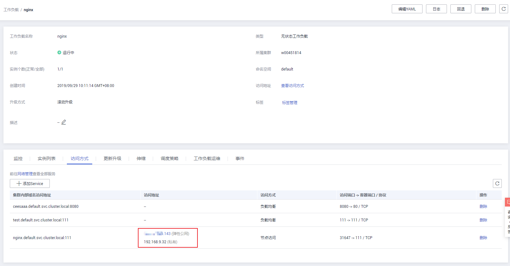

# 负载均衡\(LoadBalancer\)<a name="cce_01_0014"></a>

## 操作场景<a name="section19854101411508"></a>

负载均衡\( LoadBalancer \)可以通过弹性负载均衡从公网访问到工作负载，与弹性IP方式相比提供了高可靠的保障，一般用于系统中需要暴露到公网的服务。

负载均衡访问方式由公网弹性负载均衡ELB服务地址以及设置的访问端口组成，例如“10.117.117.117:80“。

在访问时从ELB过来的流量会先访问到节点，然后通过Service转发到Pod。

**图 1**  负载均衡\( LoadBalancer \)<a name="fig1454926316508"></a>  
.png "负载均衡(-LoadBalancer-)")

## 约束与限制<a name="section11642143794611"></a>

-   CCE中的负载均衡 \( LoadBalancer \)访问类型使用弹性负载均衡 ELB提供网络访问，存在如下产品约束：
    -   自动创建的ELB实例建议不要被其他资源使用，否则会在删除时被占用，导致资源残留。
    -   正在使用的ELB实例请不要修改监听器名称，否则可能导致无法正常访问。

-   创建service后，如果[服务亲和](#li36098269511)从集群级别切换为节点级别，连接跟踪表将不会被清理，建议用户创建service后不要修改服务亲和属性，如需修改请重新创建service。
-   容器内不支持访问**externalTrafficPolicy**为local的service。
-   独享型ELB仅支持1.17及以上集群。
-   使用控制台创建LoadBalancer类型Service时会自动生成一个节点端口（nodeport），端口号随机。使用kubectl创建LoadBalancer类型Service时，如不指定节点端口，也会随机生成一个节点端口，端口号随机。

## 工作负载创建时设置<a name="section744117150366"></a>

可以在创建工作负载时通过CCE控制台设置Service访问方式，本节以nginx为例进行说明。

1.  参考[创建无状态负载\(Deployment\)](创建无状态负载(Deployment).md)、[创建有状态负载\(StatefulSet\)](创建有状态负载(StatefulSet).md)或[创建守护进程集\(DaemonSet\)](创建守护进程集(DaemonSet).md)，在“工作负载访问设置“步骤，单击“添加服务“。

    -   **访问类型：**选择“负载均衡 \( LoadBalancer \)“。
    -   **Service名称：**自定义服务名称，可与工作负载名称保持一致。
    -   <a name="li36098269511"></a>**服务亲和：**
        -   集群级别：集群下所有节点的IP+访问端口均可以访问到此服务关联的负载，服务访问会因路由跳转导致一定性能损失，且无法获取到客户端源IP。
        -   节点级别：只有通过负载所在节点的IP+访问端口才可以访问此服务关联的负载，服务访问没有因路由跳转导致的性能损失，且可以获取到客户端源IP。

    **负载均衡配置：**

    -   **负载均衡：**可选择共享性和独享型负载均衡器类型，请根据业务需求选择，详情请参见[共享型弹性负载均衡与独享型负载均衡的功能区别](https://support.huaweicloud.com/productdesc-elb/elb_pro_0004.html)。

        -   共享型：提供基于域名和URL的路由均衡能力，实现更加灵活的业务需求。共享型负载均衡实例资源共享，实例的性能会受其它实例的影响。
        -   独享型：独享型负载均衡实例资源独享，实例的性能不受其它实例的影响，提供IPv6功能。
            -   可用区：独享型负载均衡可同时部署在多个可用区，提供更高的可靠性。
            -   所在子网：负载均衡后端所在子网。

                负载均衡会根据不同的实例规格，占用不同数量的子网IP数，因此不建议使用其他资源（如集群，节点等）的子网网段。

            -   实例规格：实例规格决定了负载均衡可创建的监听器类型，可根据业务特点选择规格类型，根据业务量选择规格大小。具体请参见[独享型负载均衡实例规格](https://support.huaweicloud.com/productdesc-elb/zh-cn_topic_0287737145.html)。

        根据业务需求选择“公网“或“私网“。

        -   公网：支持自动创建和使用已有负载均衡实例两种方式。
        -   私网：支持自动创建和使用已有负载均衡实例两种方式。

        负载均衡实例需与当前集群处于相同VPC且为相同公网或私网类型。

        -   企业项目：请选择企业项目名称，选择后可以直接创建在具体的ELB企业项目下。
        -   规格配置：选择“公网 \> 自动创建“时显示此配置项，单击可修改负载均衡实例的名称、规格、计费模式和带宽。
        -   分配策略类型：可选择加权轮询算法、加权最少连接或源IP算法。

            > **说明：** 
            >-   加权轮询算法：根据后端服务器的权重，按顺序依次将请求分发给不同的服务器。它用相应的权重表示服务器的处理性能，按照权重的高低以及轮询方式将请求分配给各服务器，相同权重的服务器处理相同数目的连接数。常用于短连接服务，例如HTTP等服务。
            >-   加权最少连接：最少连接是通过当前活跃的连接数来估计服务器负载情况的一种动态调度算法。加权最少连接就是在最少连接数的基础上，根据服务器的不同处理能力，给每个服务器分配不同的权重，使其能够接受相应权值数的服务请求。常用于长连接服务，例如数据库连接等服务。
            >-   源IP算法：将请求的源IP地址进行Hash运算，得到一个具体的数值，同时对后端服务器进行编号，按照运算结果将请求分发到对应编号的服务器上。这可以使得对不同源IP的访问进行负载分发，同时使得同一个客户端IP的请求始终被派发至某特定的服务器。该方式适合负载均衡无cookie功能的TCP协议。

        -   会话保持：默认不启用，可选择“源IP地址“。负载均衡监听是基于IP地址的会话保持，即来自同一IP地址的访问请求转发到同一台后端服务器上。
        -   健康检查：默认开启。此处健康检查是设置负载均衡的健康检查配置，其参数详细解释可参见[配置健康检查](https://support.huaweicloud.com/usermanual-elb/zh-cn_topic_0162227063.html#section2)。

    -   **端口配置：**
        -   协议：请根据业务的协议类型选择。
        -   容器端口：容器镜像中工作负载实际监听端口，需用户确定。nginx程序实际监听的端口为80。
        -   访问端口：容器端口最终映射到负载均衡服务地址的端口，用负载均衡服务地址访问工作负载时使用，端口范围为1-65535，可任意指定。

2.  完成配置后，直接单击“确定“。
3.  单击“下一步：高级配置“进入高级设置页面，直接单击“创建“。
4.  创建成功后，单击“工作负载 \> 无状态负载 Deployment“或“工作负载 \> 有状态负载 StatefulSet“，在工作负载列表页面，单击“工作负载名称“进入工作负载详情页，在“访问方式“页签下，即可获取方式地址，如[图2](#fig756114141119)。

    **图 2**  获取负载均衡访问地址<a name="fig756114141119"></a>  
    

5.  单击访问地址，即可跳转到访问页面。

## 工作负载创建完成后设置<a name="section51925078171335"></a>

您可以在工作负载创建完成后对Service进行配置，此配置对工作负载状态无影响，且实时生效。具体操作如下：

1.  登录CCE控制台，在左侧导航栏中选择“工作负载 \> 无状态负载 Deployment”或“工作负载 \> 有状态负载 StatefulSet”，在工作负载列表页单击要设置Service的工作负载名称。
2.  在“访问方式“页签，单击“添加Service”。

    参数与[工作负载创建时设置](#section744117150366)一致。

3.  单击“创建”。

## 通过kubectl命令行创建-使用已有ELB<a name="section1984211714368"></a>

您可以在创建工作负载时通过kubectl命令行设置Service访问方式。本节以nginx为例，说明kubectl命令实现负载均衡 \( LoadBalancer \)访问的方法。

1.  请参见[通过kubectl连接集群](通过kubectl连接集群.md)，使用kubectl连接集群。
2.  创建并编辑nginx-deployment.yaml以及nginx-elb-svc.yaml文件。

    其中，nginx-deployment.yaml和nginx-elb-svc.yaml为自定义名称，您可以随意命名。

    **vi nginx-deployment.yaml**

    ```
    apiVersion: apps/v1
    kind: Deployment
    metadata:
      name: nginx
    spec:
      replicas: 1
      selector:
        matchLabels:
          app: nginx
      strategy:
        type: RollingUpdate
      template:
        metadata:
          labels:
            app: nginx
        spec:
          containers:
          - image: nginx 
            imagePullPolicy: Always
            name: nginx
          imagePullSecrets:
          - name: default-secret
    ```

    **vi nginx-elb-svc.yaml**

    > **说明：** 
    >若需要开启会话保持，需要满足如下条件：
    >-   工作负载协议为TCP。
    >-   工作负载的各实例已设置反亲和部署，即所有的实例都部署在不同节点上。具体请参见[工作负载和节点的反亲和性](工作负载和节点的反亲和性.md)。

    ```
    apiVersion: v1 
    kind: Service 
    metadata: 
      annotations:
        kubernetes.io/elb.class: union
        kubernetes.io/session-affinity-mode: SOURCE_IP
        kubernetes.io/elb.id: 3c7caa5a-a641-4bff-801a-feace27424b6
        kubernetes.io/elb.subnet-id: 5083f225-9bf8-48fa-9c8b-67bd9693c4c0
      labels: 
        app: nginx 
      name: nginx 
    spec: 
      loadBalancerIP: 10.78.42.242
      externalTrafficPolicy: Local
      ports: 
      - name: service0 
        port: 80
        protocol: TCP 
        targetPort: 80
      selector: 
        app: nginx 
      type: LoadBalancer
    ```

    **表 1**  关键参数说明

    <a name="table5352104717398"></a>
    <table><thead align="left"><tr id="row83526476396"><th class="cellrowborder" valign="top" width="24.85%" id="mcps1.2.5.1.1"><p id="p10352194713392"><a name="p10352194713392"></a><a name="p10352194713392"></a>参数</p>
    </th>
    <th class="cellrowborder" valign="top" width="12.32%" id="mcps1.2.5.1.2"><p id="p157981414511"><a name="p157981414511"></a><a name="p157981414511"></a>是否必填</p>
    </th>
    <th class="cellrowborder" valign="top" width="13.639999999999999%" id="mcps1.2.5.1.3"><p id="p173521147153917"><a name="p173521147153917"></a><a name="p173521147153917"></a>参数类型</p>
    </th>
    <th class="cellrowborder" valign="top" width="49.19%" id="mcps1.2.5.1.4"><p id="p1135224717395"><a name="p1135224717395"></a><a name="p1135224717395"></a>描述</p>
    </th>
    </tr>
    </thead>
    <tbody><tr id="row435284723911"><td class="cellrowborder" valign="top" width="24.85%" headers="mcps1.2.5.1.1 "><p id="p1535274714391"><a name="p1535274714391"></a><a name="p1535274714391"></a>kubernetes.io/elb.class</p>
    </td>
    <td class="cellrowborder" valign="top" width="12.32%" headers="mcps1.2.5.1.2 "><p id="p1979854852"><a name="p1979854852"></a><a name="p1979854852"></a>否</p>
    </td>
    <td class="cellrowborder" valign="top" width="13.639999999999999%" headers="mcps1.2.5.1.3 "><p id="p163521247103920"><a name="p163521247103920"></a><a name="p163521247103920"></a>String</p>
    </td>
    <td class="cellrowborder" valign="top" width="49.19%" headers="mcps1.2.5.1.4 "><p id="p193521947123917"><a name="p193521947123917"></a><a name="p193521947123917"></a>请根据不同的应用场景和功能需求选择合适的负载均衡器类型。</p>
    <p id="p163524473399"><a name="p163524473399"></a><a name="p163524473399"></a>取值如下：</p>
    <a name="ul16352114763920"></a><a name="ul16352114763920"></a><ul id="ul16352114763920"><li>union：共享型负载均衡。</li><li>performance：独享型负载均衡，仅支持1.17及以上集群，详情请参见<a href="https://support.huaweicloud.com/productdesc-elb/elb_pro_0004.html" target="_blank" rel="noopener noreferrer">共享型弹性负载均衡与独享型负载均衡的功能区别</a></li></ul>
    <p id="p861911425283"><a name="p861911425283"></a><a name="p861911425283"></a>默认值：union</p>
    </td>
    </tr>
    <tr id="row8353174763911"><td class="cellrowborder" valign="top" width="24.85%" headers="mcps1.2.5.1.1 "><p id="p6353144783916"><a name="p6353144783916"></a><a name="p6353144783916"></a>kubernetes.io/session-affinity-mode</p>
    </td>
    <td class="cellrowborder" valign="top" width="12.32%" headers="mcps1.2.5.1.2 "><p id="p157989412514"><a name="p157989412514"></a><a name="p157989412514"></a>否</p>
    </td>
    <td class="cellrowborder" valign="top" width="13.639999999999999%" headers="mcps1.2.5.1.3 "><p id="p19353247143915"><a name="p19353247143915"></a><a name="p19353247143915"></a>String</p>
    </td>
    <td class="cellrowborder" valign="top" width="49.19%" headers="mcps1.2.5.1.4 "><p id="p2353847153912"><a name="p2353847153912"></a><a name="p2353847153912"></a>负载均衡监听是基于IP地址的会话保持，即来自同一IP地址的访问请求转发到同一台后端服务器上。</p>
    <a name="ul1135354733913"></a><a name="ul1135354733913"></a><ul id="ul1135354733913"><li>不启用：不填写该参数。</li><li>开启会话保持：需增加该参数，取值“SOURCE_IP”，表示基于源IP地址。</li></ul>
    </td>
    </tr>
    <tr id="row6353194714393"><td class="cellrowborder" valign="top" width="24.85%" headers="mcps1.2.5.1.1 "><p id="p235454793914"><a name="p235454793914"></a><a name="p235454793914"></a>kubernetes.io/elb.session-affinity-option</p>
    </td>
    <td class="cellrowborder" valign="top" width="12.32%" headers="mcps1.2.5.1.2 "><p id="p177981347513"><a name="p177981347513"></a><a name="p177981347513"></a>否</p>
    </td>
    <td class="cellrowborder" valign="top" width="13.639999999999999%" headers="mcps1.2.5.1.3 "><p id="p435474783911"><a name="p435474783911"></a><a name="p435474783911"></a><a href="#table43592047133910">表2</a> Object</p>
    </td>
    <td class="cellrowborder" valign="top" width="49.19%" headers="mcps1.2.5.1.4 "><p id="p11354154711399"><a name="p11354154711399"></a><a name="p11354154711399"></a>ELB会话保持配置选项，可设置会话保持的超时时间。</p>
    </td>
    </tr>
    <tr id="row43547471392"><td class="cellrowborder" valign="top" width="24.85%" headers="mcps1.2.5.1.1 "><p id="p1735404763915"><a name="p1735404763915"></a><a name="p1735404763915"></a>kubernetes.io/elb.id</p>
    </td>
    <td class="cellrowborder" valign="top" width="12.32%" headers="mcps1.2.5.1.2 "><p id="p2798174555"><a name="p2798174555"></a><a name="p2798174555"></a>是</p>
    </td>
    <td class="cellrowborder" valign="top" width="13.639999999999999%" headers="mcps1.2.5.1.3 "><p id="p10354947203912"><a name="p10354947203912"></a><a name="p10354947203912"></a>String</p>
    </td>
    <td class="cellrowborder" valign="top" width="49.19%" headers="mcps1.2.5.1.4 "><p id="p1435464793910"><a name="p1435464793910"></a><a name="p1435464793910"></a>为负载均衡实例的ID，取值范围：1-100字符。</p>
    <p id="p123611341161318"><a name="p123611341161318"></a><a name="p123611341161318"></a>在关联已有ELB时：必填。</p>
    <p id="p735464753918"><a name="p735464753918"></a><a name="p735464753918"></a><strong id="b10354347133914"><a name="b10354347133914"></a><a name="b10354347133914"></a>获取方法：</strong></p>
    <p id="p1335417476396"><a name="p1335417476396"></a><a name="p1335417476396"></a>在控制台的<span class="uicontrol" id="uicontrol1535474753911"><a name="uicontrol1535474753911"></a><a name="uicontrol1535474753911"></a>“服务列表”</span>中，单击<span class="uicontrol" id="uicontrol13541247103920"><a name="uicontrol13541247103920"></a><a name="uicontrol13541247103920"></a>“网络 &gt; 弹性负载均衡 ELB”</span>，单击ELB的名称，在ELB详情页的<span class="uicontrol" id="uicontrol1235454713918"><a name="uicontrol1235454713918"></a><a name="uicontrol1235454713918"></a>“基本信息”</span>页签下找到<span class="uicontrol" id="uicontrol735414773911"><a name="uicontrol735414773911"></a><a name="uicontrol735414773911"></a>“ID”</span>字段复制即可。</p>
    </td>
    </tr>
    <tr id="row13354124714392"><td class="cellrowborder" valign="top" width="24.85%" headers="mcps1.2.5.1.1 "><p id="p1435534753920"><a name="p1435534753920"></a><a name="p1435534753920"></a>kubernetes.io/elb.subnet-id</p>
    </td>
    <td class="cellrowborder" valign="top" width="12.32%" headers="mcps1.2.5.1.2 "><p id="p11798134154"><a name="p11798134154"></a><a name="p11798134154"></a>是</p>
    </td>
    <td class="cellrowborder" valign="top" width="13.639999999999999%" headers="mcps1.2.5.1.3 "><p id="p16355204793913"><a name="p16355204793913"></a><a name="p16355204793913"></a>String</p>
    </td>
    <td class="cellrowborder" valign="top" width="49.19%" headers="mcps1.2.5.1.4 "><p id="p13355154723918"><a name="p13355154723918"></a><a name="p13355154723918"></a>为集群所在子网的ID，取值范围：1-100字符。</p>
    <a name="ul93551647173917"></a><a name="ul93551647173917"></a><ul id="ul93551647173917"><li>Kubernetes v1.11.7-r0及以下版本的集群自动创建时：必填，</li><li>Kubernetes v1.11.7-r0以上版本的集群：可不填。</li></ul>
    <p id="p935584714395"><a name="p935584714395"></a><a name="p935584714395"></a>获取方法请参见：<a href="https://support.huaweicloud.com/api-vpc/vpc_api_0005.html" target="_blank" rel="noopener noreferrer">VPC子网接口与OpenStack Neutron子网接口的区别是什么？</a></p>
    </td>
    </tr>
    <tr id="row136381999318"><td class="cellrowborder" valign="top" width="24.85%" headers="mcps1.2.5.1.1 "><p id="p88687101934"><a name="p88687101934"></a><a name="p88687101934"></a>kubernetes.io/elb.lb-algorithm</p>
    </td>
    <td class="cellrowborder" valign="top" width="12.32%" headers="mcps1.2.5.1.2 "><p id="p4869141016313"><a name="p4869141016313"></a><a name="p4869141016313"></a>否</p>
    </td>
    <td class="cellrowborder" valign="top" width="13.639999999999999%" headers="mcps1.2.5.1.3 "><p id="p19869210635"><a name="p19869210635"></a><a name="p19869210635"></a>String</p>
    </td>
    <td class="cellrowborder" valign="top" width="49.19%" headers="mcps1.2.5.1.4 "><p id="p1486931014317"><a name="p1486931014317"></a><a name="p1486931014317"></a>默认值：“ROUND_ROBIN”，为后端云服务器组的负载均衡算法。</p>
    <p id="p486911016317"><a name="p486911016317"></a><a name="p486911016317"></a>取值范围：</p>
    <a name="ul2869210432"></a><a name="ul2869210432"></a><ul id="ul2869210432"><li>ROUND_ROBIN：加权轮询算法。</li><li>LEAST_CONNECTIONS：加权最少连接算法。</li><li>SOURCE_IP：源IP算法。</li></ul>
    <p id="p78692010435"><a name="p78692010435"></a><a name="p78692010435"></a>当该字段的取值为SOURCE_IP时，后端云服务器组绑定的后端云服务器的weight字段无效。</p>
    </td>
    </tr>
    <tr id="row53581147103917"><td class="cellrowborder" valign="top" width="24.85%" headers="mcps1.2.5.1.1 "><p id="p1986921014314"><a name="p1986921014314"></a><a name="p1986921014314"></a>kubernetes.io/elb.health-check-flag</p>
    </td>
    <td class="cellrowborder" valign="top" width="12.32%" headers="mcps1.2.5.1.2 "><p id="p886910101038"><a name="p886910101038"></a><a name="p886910101038"></a>否</p>
    </td>
    <td class="cellrowborder" valign="top" width="13.639999999999999%" headers="mcps1.2.5.1.3 "><p id="p786920109319"><a name="p786920109319"></a><a name="p786920109319"></a>String</p>
    </td>
    <td class="cellrowborder" valign="top" width="49.19%" headers="mcps1.2.5.1.4 "><p id="p168696109319"><a name="p168696109319"></a><a name="p168696109319"></a>是否开启ELB健康检查功能。</p>
    <p id="p148701510835"><a name="p148701510835"></a><a name="p148701510835"></a>默认关闭。</p>
    <a name="ul10870710633"></a><a name="ul10870710633"></a><ul id="ul10870710633"><li>开启：“（空值）”或“on”</li><li>关闭：“off”</li></ul>
    </td>
    </tr>
    <tr id="row3358194712396"><td class="cellrowborder" valign="top" width="24.85%" headers="mcps1.2.5.1.1 "><p id="p1287011015315"><a name="p1287011015315"></a><a name="p1287011015315"></a>kubernetes.io/elb.health-check-option</p>
    </td>
    <td class="cellrowborder" valign="top" width="12.32%" headers="mcps1.2.5.1.2 "><p id="p48707103318"><a name="p48707103318"></a><a name="p48707103318"></a>否</p>
    </td>
    <td class="cellrowborder" valign="top" width="13.639999999999999%" headers="mcps1.2.5.1.3 "><p id="p187081019312"><a name="p187081019312"></a><a name="p187081019312"></a><a href="#table236017471397">表3</a> Object</p>
    </td>
    <td class="cellrowborder" valign="top" width="49.19%" headers="mcps1.2.5.1.4 "><p id="p7870111013310"><a name="p7870111013310"></a><a name="p7870111013310"></a>ELB健康检查配置选项。</p>
    </td>
    </tr>
    <tr id="row133406444451"><td class="cellrowborder" valign="top" width="24.85%" headers="mcps1.2.5.1.1 "><p id="p16341194444516"><a name="p16341194444516"></a><a name="p16341194444516"></a>kubernetes.io/elb.pass-through</p>
    </td>
    <td class="cellrowborder" valign="top" width="12.32%" headers="mcps1.2.5.1.2 "><p id="p15341844194513"><a name="p15341844194513"></a><a name="p15341844194513"></a>否</p>
    </td>
    <td class="cellrowborder" valign="top" width="13.639999999999999%" headers="mcps1.2.5.1.3 "><p id="p16341544184518"><a name="p16341544184518"></a><a name="p16341544184518"></a>String</p>
    </td>
    <td class="cellrowborder" valign="top" width="49.19%" headers="mcps1.2.5.1.4 "><p id="p5981411479"><a name="p5981411479"></a><a name="p5981411479"></a>集群内访问Service是否经过ELB。具体使用场景和说明请参见<a href="LoadBalancer类型Service使用pass-through能力.md">LoadBalancer类型Service使用pass-through能力</a>。</p>
    </td>
    </tr>
    <tr id="row83591847203914"><td class="cellrowborder" valign="top" width="24.85%" headers="mcps1.2.5.1.1 "><p id="p1735944715392"><a name="p1735944715392"></a><a name="p1735944715392"></a>port</p>
    </td>
    <td class="cellrowborder" valign="top" width="12.32%" headers="mcps1.2.5.1.2 "><p id="p67999417519"><a name="p67999417519"></a><a name="p67999417519"></a>是</p>
    </td>
    <td class="cellrowborder" valign="top" width="13.639999999999999%" headers="mcps1.2.5.1.3 "><p id="p6359134716391"><a name="p6359134716391"></a><a name="p6359134716391"></a>Integer</p>
    </td>
    <td class="cellrowborder" valign="top" width="49.19%" headers="mcps1.2.5.1.4 "><p id="p13359647163913"><a name="p13359647163913"></a><a name="p13359647163913"></a>集群虚拟IP的访问端口，也是注册到负载均衡上的端口。</p>
    </td>
    </tr>
    <tr id="row7359447173918"><td class="cellrowborder" valign="top" width="24.85%" headers="mcps1.2.5.1.1 "><p id="p3359124753916"><a name="p3359124753916"></a><a name="p3359124753916"></a>targetPort</p>
    </td>
    <td class="cellrowborder" valign="top" width="12.32%" headers="mcps1.2.5.1.2 "><p id="p127991041253"><a name="p127991041253"></a><a name="p127991041253"></a>是</p>
    </td>
    <td class="cellrowborder" valign="top" width="13.639999999999999%" headers="mcps1.2.5.1.3 "><p id="p4359184712395"><a name="p4359184712395"></a><a name="p4359184712395"></a>String</p>
    </td>
    <td class="cellrowborder" valign="top" width="49.19%" headers="mcps1.2.5.1.4 "><p id="p135924733911"><a name="p135924733911"></a><a name="p135924733911"></a>对应界面上的容器端口。</p>
    </td>
    </tr>
    </tbody>
    </table>

    **表 2**  elb.session-affinity-option字段数据结构说明

    <a name="table43592047133910"></a>
    <table><thead align="left"><tr id="row23591547163913"><th class="cellrowborder" valign="top" width="24.95%" id="mcps1.2.5.1.1"><p id="p6359124763911"><a name="p6359124763911"></a><a name="p6359124763911"></a>参数</p>
    </th>
    <th class="cellrowborder" valign="top" width="12.139999999999999%" id="mcps1.2.5.1.2"><p id="p8442205011314"><a name="p8442205011314"></a><a name="p8442205011314"></a>是否必填</p>
    </th>
    <th class="cellrowborder" valign="top" width="13.69%" id="mcps1.2.5.1.3"><p id="p23601947173914"><a name="p23601947173914"></a><a name="p23601947173914"></a>参数类型</p>
    </th>
    <th class="cellrowborder" valign="top" width="49.220000000000006%" id="mcps1.2.5.1.4"><p id="p19360647113911"><a name="p19360647113911"></a><a name="p19360647113911"></a>描述</p>
    </th>
    </tr>
    </thead>
    <tbody><tr id="row1236084719399"><td class="cellrowborder" valign="top" width="24.95%" headers="mcps1.2.5.1.1 "><p id="p1636019470393"><a name="p1636019470393"></a><a name="p1636019470393"></a>persistence_timeout</p>
    </td>
    <td class="cellrowborder" valign="top" width="12.139999999999999%" headers="mcps1.2.5.1.2 "><p id="p164427503134"><a name="p164427503134"></a><a name="p164427503134"></a>是</p>
    </td>
    <td class="cellrowborder" valign="top" width="13.69%" headers="mcps1.2.5.1.3 "><p id="p1236084793919"><a name="p1236084793919"></a><a name="p1236084793919"></a>String</p>
    </td>
    <td class="cellrowborder" valign="top" width="49.220000000000006%" headers="mcps1.2.5.1.4 "><p id="p12360147143917"><a name="p12360147143917"></a><a name="p12360147143917"></a>当elb.session-affinity-mode是“SOURCE_IP”时生效，设置会话保持的超时时间（分钟）。</p>
    <p id="p0360204713398"><a name="p0360204713398"></a><a name="p0360204713398"></a>默认值为：60，取值范围：1-60。</p>
    </td>
    </tr>
    </tbody>
    </table>

    **表 3**  elb.health-check-option字段数据结构说明

    <a name="table236017471397"></a>
    <table><thead align="left"><tr id="row336018475396"><th class="cellrowborder" valign="top" width="24.95%" id="mcps1.2.5.1.1"><p id="p15360184723911"><a name="p15360184723911"></a><a name="p15360184723911"></a>参数</p>
    </th>
    <th class="cellrowborder" valign="top" width="12.32%" id="mcps1.2.5.1.2"><p id="p139932420145"><a name="p139932420145"></a><a name="p139932420145"></a>是否必填</p>
    </th>
    <th class="cellrowborder" valign="top" width="13.5%" id="mcps1.2.5.1.3"><p id="p1036074715392"><a name="p1036074715392"></a><a name="p1036074715392"></a>参数类型</p>
    </th>
    <th class="cellrowborder" valign="top" width="49.230000000000004%" id="mcps1.2.5.1.4"><p id="p036084733912"><a name="p036084733912"></a><a name="p036084733912"></a>描述</p>
    </th>
    </tr>
    </thead>
    <tbody><tr id="row1136012478397"><td class="cellrowborder" valign="top" width="24.95%" headers="mcps1.2.5.1.1 "><p id="p1736074717393"><a name="p1736074717393"></a><a name="p1736074717393"></a>delay</p>
    </td>
    <td class="cellrowborder" valign="top" width="12.32%" headers="mcps1.2.5.1.2 "><p id="p2099132416147"><a name="p2099132416147"></a><a name="p2099132416147"></a>否</p>
    </td>
    <td class="cellrowborder" valign="top" width="13.5%" headers="mcps1.2.5.1.3 "><p id="p1360144773911"><a name="p1360144773911"></a><a name="p1360144773911"></a>String</p>
    </td>
    <td class="cellrowborder" valign="top" width="49.230000000000004%" headers="mcps1.2.5.1.4 "><p id="p7361154710397"><a name="p7361154710397"></a><a name="p7361154710397"></a>开始健康检查的初始等待时间（秒）</p>
    <p id="p17361184715394"><a name="p17361184715394"></a><a name="p17361184715394"></a>默认值：5，取值范围：1-50</p>
    </td>
    </tr>
    <tr id="row163618473395"><td class="cellrowborder" valign="top" width="24.95%" headers="mcps1.2.5.1.1 "><p id="p636114763916"><a name="p636114763916"></a><a name="p636114763916"></a>timeout</p>
    </td>
    <td class="cellrowborder" valign="top" width="12.32%" headers="mcps1.2.5.1.2 "><p id="p69919246147"><a name="p69919246147"></a><a name="p69919246147"></a>否</p>
    </td>
    <td class="cellrowborder" valign="top" width="13.5%" headers="mcps1.2.5.1.3 "><p id="p103611347123914"><a name="p103611347123914"></a><a name="p103611347123914"></a>String</p>
    </td>
    <td class="cellrowborder" valign="top" width="49.230000000000004%" headers="mcps1.2.5.1.4 "><p id="p113611447183912"><a name="p113611447183912"></a><a name="p113611447183912"></a>健康检查的超时时间（秒）</p>
    <p id="p143612047133913"><a name="p143612047133913"></a><a name="p143612047133913"></a>默认值：10，取值范围1-50</p>
    </td>
    </tr>
    <tr id="row18361154723913"><td class="cellrowborder" valign="top" width="24.95%" headers="mcps1.2.5.1.1 "><p id="p136144716396"><a name="p136144716396"></a><a name="p136144716396"></a>max_retries</p>
    </td>
    <td class="cellrowborder" valign="top" width="12.32%" headers="mcps1.2.5.1.2 "><p id="p166343581149"><a name="p166343581149"></a><a name="p166343581149"></a>否</p>
    </td>
    <td class="cellrowborder" valign="top" width="13.5%" headers="mcps1.2.5.1.3 "><p id="p17361114717395"><a name="p17361114717395"></a><a name="p17361114717395"></a>String</p>
    </td>
    <td class="cellrowborder" valign="top" width="49.230000000000004%" headers="mcps1.2.5.1.4 "><p id="p14361114712397"><a name="p14361114712397"></a><a name="p14361114712397"></a>健康检查的最大重试次数</p>
    <p id="p6361114733910"><a name="p6361114733910"></a><a name="p6361114733910"></a>默认值：3，取值范围1-10</p>
    </td>
    </tr>
    <tr id="row9361104720394"><td class="cellrowborder" valign="top" width="24.95%" headers="mcps1.2.5.1.1 "><p id="p1636111476395"><a name="p1636111476395"></a><a name="p1636111476395"></a>protocol</p>
    </td>
    <td class="cellrowborder" valign="top" width="12.32%" headers="mcps1.2.5.1.2 "><p id="p763495881417"><a name="p763495881417"></a><a name="p763495881417"></a>否</p>
    </td>
    <td class="cellrowborder" valign="top" width="13.5%" headers="mcps1.2.5.1.3 "><p id="p14361144716395"><a name="p14361144716395"></a><a name="p14361144716395"></a>String</p>
    </td>
    <td class="cellrowborder" valign="top" width="49.230000000000004%" headers="mcps1.2.5.1.4 "><p id="p15361164723916"><a name="p15361164723916"></a><a name="p15361164723916"></a>健康检查的协议</p>
    <p id="p2361204719390"><a name="p2361204719390"></a><a name="p2361204719390"></a>默认值：取关联服务的协议</p>
    <p id="p143617474391"><a name="p143617474391"></a><a name="p143617474391"></a>取值范围：“TCP”、“UDP_CONNECT”或者“HTTP”</p>
    </td>
    </tr>
    <tr id="row036113475395"><td class="cellrowborder" valign="top" width="24.95%" headers="mcps1.2.5.1.1 "><p id="p93612047133915"><a name="p93612047133915"></a><a name="p93612047133915"></a>path</p>
    </td>
    <td class="cellrowborder" valign="top" width="12.32%" headers="mcps1.2.5.1.2 "><p id="p159952471418"><a name="p159952471418"></a><a name="p159952471418"></a>否</p>
    </td>
    <td class="cellrowborder" valign="top" width="13.5%" headers="mcps1.2.5.1.3 "><p id="p13361747173915"><a name="p13361747173915"></a><a name="p13361747173915"></a>String</p>
    </td>
    <td class="cellrowborder" valign="top" width="49.230000000000004%" headers="mcps1.2.5.1.4 "><p id="p6361647183913"><a name="p6361647183913"></a><a name="p6361647183913"></a>健康检查的URL，协议是“HTTP”时配置</p>
    <p id="p636184753911"><a name="p636184753911"></a><a name="p636184753911"></a>默认值：“/”</p>
    <p id="p8361847153910"><a name="p8361847153910"></a><a name="p8361847153910"></a>取值范围：1-10000字符</p>
    </td>
    </tr>
    </tbody>
    </table>

3.  创建工作负载。

    **kubectl create -f nginx-deployment.yaml**

    回显如下，表示工作负载已创建完成。

    ```
    deployment "nginx" created
    ```

    **kubectl get pod**

    回显如下，工作负载状态为Running状态，表示工作负载已运行中。

    ```
    NAME                     READY     STATUS             RESTARTS   AGE
    etcd-0                   0/1       ImagePullBackOff   0          1h
    icagent-m9dkt            0/0       Running            0          3d
    nginx-2601814895-c1xhw   1/1       Running            0          6s
    ```

4.  创建服务。

    **kubectl create -f nginx-elb-svc.yaml**

    回显如下，表示服务已创建。

    ```
    service "nginx" created
    ```

    **kubectl get svc**

    回显如下，表示工作负载访问方式已设置成功，工作负载可访问。

    ```
    NAME         TYPE           CLUSTER-IP       EXTERNAL-IP   PORT(S)        AGE
    etcd-svc     ClusterIP      None             <none>        3120/TCP       1h
    kubernetes   ClusterIP      10.247.0.1       <none>        443/TCP        3d
    nginx        LoadBalancer   10.247.130.196   10.78.42.242   80:31540/TCP   51s
    ```

5.  在浏览器中输入访问地址，例如输入10.78.42.242:80。10.78.42.242为负载均衡实例IP地址，80为对应界面上的访问端口。

    可成功访问nginx。

    **图 3**  通过负载均衡访问nginx<a name="fig1498213713356"></a>  
    


## 通过kubectl命令行创建-自动创建ELB<a name="section12168131904611"></a>

您可以在创建工作负载时通过kubectl命令行设置Service访问方式。本节以nginx为例，说明kubectl命令实现负载均衡 \( LoadBalancer \)访问的方法。

1.  请参见[通过kubectl连接集群](通过kubectl连接集群.md)，使用kubectl连接集群。
2.  创建并编辑nginx-deployment.yaml以及nginx-elb-svc.yaml文件。

    其中，nginx-deployment.yaml和nginx-elb-svc.yaml为自定义名称，您可以随意命名。

    **vi nginx-deployment.yaml**

    ```
    apiVersion: apps/v1
    kind: Deployment
    metadata:
      name: nginx
    spec:
      replicas: 1
      selector:
        matchLabels:
          app: nginx
      strategy:
        type: RollingUpdate
      template:
        metadata:
          labels:
            app: nginx
        spec:
          containers:
          - image: nginx 
            imagePullPolicy: Always
            name: nginx
          imagePullSecrets:
          - name: default-secret
    ```

    **vi nginx-elb-svc.yaml**

    > **说明：** 
    >若需要开启会话保持，需要满足如下条件：
    >-   工作负载协议为TCP。
    >-   工作负载的各实例已设置反亲和部署，即所有的实例都部署在不同节点上。具体请参见[工作负载和节点的反亲和性](工作负载和节点的反亲和性.md)。

    共享型负载均衡（公网访问）Service示例：

    ```
    apiVersion: v1 
    kind: Service 
    metadata: 
      annotations:   
        kubernetes.io/elb.class: union
        kubernetes.io/session-affinity-mode: SOURCE_IP
        kubernetes.io/elb.subnet-id: ca5b861e-4e13-480a-996a-6c84c1d9538d
        kubernetes.io/elb.enterpriseID: '0'
        kubernetes.io/elb.autocreate: 
            '{
                "type": "public",
                "bandwidth_name": "cce-bandwidth-1551163379627",
                "bandwidth_chargemode": "bandwidth",
                "bandwidth_size": 1,
                "bandwidth_sharetype": "PER",
                "eip_type": "5_bgp",
                "name": "james"
            }'
      labels: 
        app: nginx 
      name: nginx 
    spec: 
      externalTrafficPolicy: Local
      ports: 
      - name: service0 
        port: 80
        protocol: TCP 
        targetPort: 80
      selector: 
        app: nginx 
      type: LoadBalancer
    ```

    独享型负载均衡（公网访问）Service示例 - 仅支持1.17及以上集群：

    ```
    apiVersion: v1
    kind: Service
    metadata:
      name: nginx
      labels:
        app: nginx
      namespace: default
      annotations:
        kubernetes.io/elb.class: performance
        kubernetes.io/elb.subnet-id: ca5b861e-4e13-480a-996a-6c84c1d9538d
        kubernetes.io/elb.enterpriseID: '0'
        kubernetes.io/elb.autocreate: 
            '{
                "type": "public",
                "bandwidth_name": "cce-bandwidth-1626694478577",
                "bandwidth_chargemode": "bandwidth",
                "bandwidth_size": 1,
                "bandwidth_sharetype": "PER",
                "eip_type": "5_gray",
                "available_zone": [
                    "cn-south-2b",
                    "cn-south-1c"
                ],
                "l4_flavor_name": "L4_flavor.elb.s1.small",
                "elb_virsubnet_ids": [
                    "14567f27-8ae4-42b8-ae47-9f847a4690dd"
                ]
            }'
        kubernetes.io/elb.lb-algorithm: ROUND_ROBIN
        kubernetes.io/elb.health-check-flag: 'on'
        kubernetes.io/elb.health-check-option: '{"protocol":"TCP","delay":"5","timeout":"10","max_retries":"3"}'
    spec:
      selector:
        app: nginx
      externalTrafficPolicy: Local
      ports:
      - name: cce-service-0
        targetPort: 80
        nodePort: 0
        port: 80
        protocol: TCP
      type: LoadBalancer
    ```

    **表 4**  关键参数说明

    <a name="table133089105019"></a>
    <table><thead align="left"><tr id="row11330199501"><th class="cellrowborder" valign="top" width="24.85%" id="mcps1.2.5.1.1"><p id="p173306915017"><a name="p173306915017"></a><a name="p173306915017"></a>参数</p>
    </th>
    <th class="cellrowborder" valign="top" width="12.32%" id="mcps1.2.5.1.2"><p id="p173308910507"><a name="p173308910507"></a><a name="p173308910507"></a>是否必填</p>
    </th>
    <th class="cellrowborder" valign="top" width="13.639999999999999%" id="mcps1.2.5.1.3"><p id="p233039175014"><a name="p233039175014"></a><a name="p233039175014"></a>参数类型</p>
    </th>
    <th class="cellrowborder" valign="top" width="49.19%" id="mcps1.2.5.1.4"><p id="p133301795508"><a name="p133301795508"></a><a name="p133301795508"></a>描述</p>
    </th>
    </tr>
    </thead>
    <tbody><tr id="row433017915509"><td class="cellrowborder" valign="top" width="24.85%" headers="mcps1.2.5.1.1 "><p id="p17331159135017"><a name="p17331159135017"></a><a name="p17331159135017"></a>kubernetes.io/elb.class</p>
    </td>
    <td class="cellrowborder" valign="top" width="12.32%" headers="mcps1.2.5.1.2 "><p id="p173313910501"><a name="p173313910501"></a><a name="p173313910501"></a>否</p>
    </td>
    <td class="cellrowborder" valign="top" width="13.639999999999999%" headers="mcps1.2.5.1.3 "><p id="p5331189115017"><a name="p5331189115017"></a><a name="p5331189115017"></a>String</p>
    </td>
    <td class="cellrowborder" valign="top" width="49.19%" headers="mcps1.2.5.1.4 "><p id="p17331169135014"><a name="p17331169135014"></a><a name="p17331169135014"></a>请根据不同的应用场景和功能需求选择合适的负载均衡器类型。</p>
    <p id="p143311298508"><a name="p143311298508"></a><a name="p143311298508"></a>取值如下：</p>
    <a name="ul3415201212612"></a><a name="ul3415201212612"></a><ul id="ul3415201212612"><li>union：共享型负载均衡。</li><li>performance：独享型负载均衡，仅支持1.17及以上集群，详情请参见<a href="https://support.huaweicloud.com/productdesc-elb/elb_pro_0004.html" target="_blank" rel="noopener noreferrer">共享型弹性负载均衡与独享型负载均衡的功能区别</a></li></ul>
    <p id="p733118975010"><a name="p733118975010"></a><a name="p733118975010"></a>默认值：union</p>
    </td>
    </tr>
    <tr id="row790233013543"><td class="cellrowborder" valign="top" width="24.85%" headers="mcps1.2.5.1.1 "><p id="p143324917501"><a name="p143324917501"></a><a name="p143324917501"></a>kubernetes.io/elb.subnet-id</p>
    </td>
    <td class="cellrowborder" valign="top" width="12.32%" headers="mcps1.2.5.1.2 "><p id="p233212945015"><a name="p233212945015"></a><a name="p233212945015"></a>-</p>
    </td>
    <td class="cellrowborder" valign="top" width="13.639999999999999%" headers="mcps1.2.5.1.3 "><p id="p133327917509"><a name="p133327917509"></a><a name="p133327917509"></a>String</p>
    </td>
    <td class="cellrowborder" valign="top" width="49.19%" headers="mcps1.2.5.1.4 "><p id="p7332119105010"><a name="p7332119105010"></a><a name="p7332119105010"></a>为集群所在子网的ID，取值范围：1-100字符。</p>
    <a name="ul19332189145019"></a><a name="ul19332189145019"></a><ul id="ul19332189145019"><li>Kubernetes v1.11.7-r0及以下版本的集群自动创建时：必填，</li><li>Kubernetes v1.11.7-r0以上版本的集群：可不填。</li></ul>
    <p id="p133323917505"><a name="p133323917505"></a><a name="p133323917505"></a>获取方法请参见：<a href="https://support.huaweicloud.com/api-vpc/vpc_api_0005.html" target="_blank" rel="noopener noreferrer">VPC子网接口与OpenStack Neutron子网接口的区别是什么？</a></p>
    </td>
    </tr>
    <tr id="row523155017545"><td class="cellrowborder" valign="top" width="24.85%" headers="mcps1.2.5.1.1 "><p id="p433229115017"><a name="p433229115017"></a><a name="p433229115017"></a>kubernetes.io/elb.enterpriseID</p>
    </td>
    <td class="cellrowborder" valign="top" width="12.32%" headers="mcps1.2.5.1.2 "><p id="p193321994506"><a name="p193321994506"></a><a name="p193321994506"></a>否</p>
    </td>
    <td class="cellrowborder" valign="top" width="13.639999999999999%" headers="mcps1.2.5.1.3 "><p id="p123331599500"><a name="p123331599500"></a><a name="p123331599500"></a>String</p>
    </td>
    <td class="cellrowborder" valign="top" width="49.19%" headers="mcps1.2.5.1.4 "><p id="p1833312925015"><a name="p1833312925015"></a><a name="p1833312925015"></a><strong id="b133314910503"><a name="b133314910503"></a><a name="b133314910503"></a>v1.15及以上版本的集群支持此字段，v1.15以下版本默认创建到default项目下。</strong></p>
    <p id="p153331592508"><a name="p153331592508"></a><a name="p153331592508"></a>为ELB企业项目ID，选择后可以直接创建在具体的ELB企业项目下。</p>
    <p id="p63331395501"><a name="p63331395501"></a><a name="p63331395501"></a>该字段不传（或传为字符串'0'），则将资源绑定给默认企业项目。</p>
    <p id="p233313917501"><a name="p233313917501"></a><a name="p233313917501"></a><strong id="b733349135014"><a name="b733349135014"></a><a name="b733349135014"></a>获取方法：</strong></p>
    <p id="p833389105013"><a name="p833389105013"></a><a name="p833389105013"></a>登录控制台后，单击顶部菜单右侧的<span class="uicontrol" id="uicontrol633319205011"><a name="uicontrol633319205011"></a><a name="uicontrol633319205011"></a>“企业 &gt; 项目管理”</span>，在打开的企业项目列表中单击要加入的企业项目名称，进入企业项目详情页，找到<span class="uicontrol" id="uicontrol633399135010"><a name="uicontrol633399135010"></a><a name="uicontrol633399135010"></a>“ID”</span>字段复制即可。</p>
    </td>
    </tr>
    <tr id="row1133114925015"><td class="cellrowborder" valign="top" width="24.85%" headers="mcps1.2.5.1.1 "><p id="p13312912502"><a name="p13312912502"></a><a name="p13312912502"></a>kubernetes.io/elb.session-affinity-option</p>
    </td>
    <td class="cellrowborder" valign="top" width="12.32%" headers="mcps1.2.5.1.2 "><p id="p2331179195013"><a name="p2331179195013"></a><a name="p2331179195013"></a>否</p>
    </td>
    <td class="cellrowborder" valign="top" width="13.639999999999999%" headers="mcps1.2.5.1.3 "><p id="p8331199185014"><a name="p8331199185014"></a><a name="p8331199185014"></a><a href="#table43592047133910">表2</a> Object</p>
    </td>
    <td class="cellrowborder" valign="top" width="49.19%" headers="mcps1.2.5.1.4 "><p id="p1233116911506"><a name="p1233116911506"></a><a name="p1233116911506"></a>ELB会话保持配置选项，可设置会话保持的超时时间。</p>
    </td>
    </tr>
    <tr id="row8332096503"><td class="cellrowborder" valign="top" width="24.85%" headers="mcps1.2.5.1.1 "><p id="p839452715462"><a name="p839452715462"></a><a name="p839452715462"></a>kubernetes.io/elb.autocreate</p>
    </td>
    <td class="cellrowborder" valign="top" width="12.32%" headers="mcps1.2.5.1.2 "><p id="p143944279464"><a name="p143944279464"></a><a name="p143944279464"></a>是</p>
    </td>
    <td class="cellrowborder" valign="top" width="13.639999999999999%" headers="mcps1.2.5.1.3 "><p id="p1539432714615"><a name="p1539432714615"></a><a name="p1539432714615"></a><a href="#table939522754617">elb.autocreate </a> object</p>
    </td>
    <td class="cellrowborder" valign="top" width="49.19%" headers="mcps1.2.5.1.4 "><p id="p3394827134612"><a name="p3394827134612"></a><a name="p3394827134612"></a>自动创建service关联的ELB</p>
    <p id="p113941527154613"><a name="p113941527154613"></a><a name="p113941527154613"></a><strong id="b8394327204611"><a name="b8394327204611"></a><a name="b8394327204611"></a>示例：</strong></p>
    <a name="ul17394182711462"></a><a name="ul17394182711462"></a><ul id="ul17394182711462"><li>公网自动创建：<p id="p339413273467"><a name="p339413273467"></a><a name="p339413273467"></a>值为 '{"type":"public","bandwidth_name":"cce-bandwidth-1551163379627","bandwidth_chargemode":"bandwidth","bandwidth_size":5,"bandwidth_sharetype":"PER","eip_type":"5_bgp","name":"james"}'</p>
    </li><li>私网自动创建：<p id="p14395132717468"><a name="p14395132717468"></a><a name="p14395132717468"></a>值为 '{"type":"inner", "name": "A-location-d-test"}'</p>
    </li></ul>
    </td>
    </tr>
    <tr id="row1333313918508"><td class="cellrowborder" valign="top" width="24.85%" headers="mcps1.2.5.1.1 "><p id="p1133339115016"><a name="p1133339115016"></a><a name="p1133339115016"></a>kubernetes.io/elb.lb-algorithm</p>
    </td>
    <td class="cellrowborder" valign="top" width="12.32%" headers="mcps1.2.5.1.2 "><p id="p16333139115018"><a name="p16333139115018"></a><a name="p16333139115018"></a>否</p>
    </td>
    <td class="cellrowborder" valign="top" width="13.639999999999999%" headers="mcps1.2.5.1.3 "><p id="p933315995019"><a name="p933315995019"></a><a name="p933315995019"></a>String</p>
    </td>
    <td class="cellrowborder" valign="top" width="49.19%" headers="mcps1.2.5.1.4 "><p id="p0333699508"><a name="p0333699508"></a><a name="p0333699508"></a>默认值：“ROUND_ROBIN”，为后端云服务器组的负载均衡算法。</p>
    <p id="p6333198503"><a name="p6333198503"></a><a name="p6333198503"></a>取值范围：</p>
    <a name="ul13337919508"></a><a name="ul13337919508"></a><ul id="ul13337919508"><li>ROUND_ROBIN：加权轮询算法。</li><li>LEAST_CONNECTIONS：加权最少连接算法。</li><li>SOURCE_IP：源IP算法。</li></ul>
    <p id="p833315910507"><a name="p833315910507"></a><a name="p833315910507"></a>当该字段的取值为SOURCE_IP时，后端云服务器组绑定的后端云服务器的weight字段无效。</p>
    </td>
    </tr>
    <tr id="row1533329185018"><td class="cellrowborder" valign="top" width="24.85%" headers="mcps1.2.5.1.1 "><p id="p1533313905015"><a name="p1533313905015"></a><a name="p1533313905015"></a>kubernetes.io/elb.health-check-flag</p>
    </td>
    <td class="cellrowborder" valign="top" width="12.32%" headers="mcps1.2.5.1.2 "><p id="p43331394508"><a name="p43331394508"></a><a name="p43331394508"></a>否</p>
    </td>
    <td class="cellrowborder" valign="top" width="13.639999999999999%" headers="mcps1.2.5.1.3 "><p id="p16333993504"><a name="p16333993504"></a><a name="p16333993504"></a>String</p>
    </td>
    <td class="cellrowborder" valign="top" width="49.19%" headers="mcps1.2.5.1.4 "><p id="p1833315910509"><a name="p1833315910509"></a><a name="p1833315910509"></a>是否开启ELB健康检查功能。</p>
    <p id="p1233320913508"><a name="p1233320913508"></a><a name="p1233320913508"></a>默认关闭。</p>
    <a name="ul19333199205012"></a><a name="ul19333199205012"></a><ul id="ul19333199205012"><li>开启：“（空值）”或“on”</li><li>关闭：“off”</li></ul>
    </td>
    </tr>
    <tr id="row14334169195010"><td class="cellrowborder" valign="top" width="24.85%" headers="mcps1.2.5.1.1 "><p id="p43341794509"><a name="p43341794509"></a><a name="p43341794509"></a>kubernetes.io/elb.health-check-option</p>
    </td>
    <td class="cellrowborder" valign="top" width="12.32%" headers="mcps1.2.5.1.2 "><p id="p113349935012"><a name="p113349935012"></a><a name="p113349935012"></a>否</p>
    </td>
    <td class="cellrowborder" valign="top" width="13.639999999999999%" headers="mcps1.2.5.1.3 "><p id="p113341919507"><a name="p113341919507"></a><a name="p113341919507"></a><a href="#table236017471397">表3</a> Object</p>
    </td>
    <td class="cellrowborder" valign="top" width="49.19%" headers="mcps1.2.5.1.4 "><p id="p933489175020"><a name="p933489175020"></a><a name="p933489175020"></a>ELB健康检查配置选项。</p>
    </td>
    </tr>
    <tr id="row68561030194816"><td class="cellrowborder" valign="top" width="24.85%" headers="mcps1.2.5.1.1 "><p id="p751093484811"><a name="p751093484811"></a><a name="p751093484811"></a>kubernetes.io/elb.pass-through</p>
    </td>
    <td class="cellrowborder" valign="top" width="12.32%" headers="mcps1.2.5.1.2 "><p id="p155106348481"><a name="p155106348481"></a><a name="p155106348481"></a>否</p>
    </td>
    <td class="cellrowborder" valign="top" width="13.639999999999999%" headers="mcps1.2.5.1.3 "><p id="p751063412485"><a name="p751063412485"></a><a name="p751063412485"></a>String</p>
    </td>
    <td class="cellrowborder" valign="top" width="49.19%" headers="mcps1.2.5.1.4 "><p id="p10510123411481"><a name="p10510123411481"></a><a name="p10510123411481"></a>集群内访问Service是否经过ELB。具体使用场景和说明请参见<a href="LoadBalancer类型Service使用pass-through能力.md">LoadBalancer类型Service使用pass-through能力</a>。</p>
    </td>
    </tr>
    <tr id="row638444875814"><td class="cellrowborder" valign="top" width="24.85%" headers="mcps1.2.5.1.1 "><p id="p9331159155018"><a name="p9331159155018"></a><a name="p9331159155018"></a>kubernetes.io/session-affinity-mode</p>
    </td>
    <td class="cellrowborder" valign="top" width="12.32%" headers="mcps1.2.5.1.2 "><p id="p7331179125018"><a name="p7331179125018"></a><a name="p7331179125018"></a>否</p>
    </td>
    <td class="cellrowborder" valign="top" width="13.639999999999999%" headers="mcps1.2.5.1.3 "><p id="p43315965016"><a name="p43315965016"></a><a name="p43315965016"></a>String</p>
    </td>
    <td class="cellrowborder" valign="top" width="49.19%" headers="mcps1.2.5.1.4 "><p id="p533113915503"><a name="p533113915503"></a><a name="p533113915503"></a>负载均衡监听是基于IP地址的会话保持，即来自同一IP地址的访问请求转发到同一台后端服务器上。</p>
    <a name="ul113311191508"></a><a name="ul113311191508"></a><ul id="ul113311191508"><li>不启用：不填写该参数。</li><li>开启会话保持：需增加该参数，取值“SOURCE_IP”，表示基于源IP地址。</li></ul>
    </td>
    </tr>
    <tr id="row1421317512156"><td class="cellrowborder" valign="top" width="24.85%" headers="mcps1.2.5.1.1 "><p id="p12624252121514"><a name="p12624252121514"></a><a name="p12624252121514"></a>kubernetes.io/elb.session-affinity-option</p>
    </td>
    <td class="cellrowborder" valign="top" width="12.32%" headers="mcps1.2.5.1.2 "><p id="p662415526159"><a name="p662415526159"></a><a name="p662415526159"></a>否</p>
    </td>
    <td class="cellrowborder" valign="top" width="13.639999999999999%" headers="mcps1.2.5.1.3 "><p id="p116241552181515"><a name="p116241552181515"></a><a name="p116241552181515"></a><a href="#table43592047133910">表2</a> Object</p>
    </td>
    <td class="cellrowborder" valign="top" width="49.19%" headers="mcps1.2.5.1.4 "><p id="p5624145218150"><a name="p5624145218150"></a><a name="p5624145218150"></a>ELB会话保持配置选项，可设置会话保持的超时时间。</p>
    </td>
    </tr>
    <tr id="row619410431615"><td class="cellrowborder" valign="top" width="24.85%" headers="mcps1.2.5.1.1 "><p id="p93349995013"><a name="p93349995013"></a><a name="p93349995013"></a>kubernetes.io/hws-hostNetwork</p>
    </td>
    <td class="cellrowborder" valign="top" width="12.32%" headers="mcps1.2.5.1.2 "><p id="p1433413905019"><a name="p1433413905019"></a><a name="p1433413905019"></a>否</p>
    </td>
    <td class="cellrowborder" valign="top" width="13.639999999999999%" headers="mcps1.2.5.1.3 "><p id="p33341990503"><a name="p33341990503"></a><a name="p33341990503"></a>String</p>
    </td>
    <td class="cellrowborder" valign="top" width="49.19%" headers="mcps1.2.5.1.4 "><p id="p6334798502"><a name="p6334798502"></a><a name="p6334798502"></a>为标记工作负载服务是否使用主机网络模式。</p>
    <p id="p14334095506"><a name="p14334095506"></a><a name="p14334095506"></a>默认是未使用主机网络，取值范围：“true”或者“false”</p>
    </td>
    </tr>
    <tr id="row933412905011"><td class="cellrowborder" valign="top" width="24.85%" headers="mcps1.2.5.1.1 "><p id="p12334129155012"><a name="p12334129155012"></a><a name="p12334129155012"></a>externalTrafficPolicy</p>
    </td>
    <td class="cellrowborder" valign="top" width="12.32%" headers="mcps1.2.5.1.2 "><p id="p113346910501"><a name="p113346910501"></a><a name="p113346910501"></a>否</p>
    </td>
    <td class="cellrowborder" valign="top" width="13.639999999999999%" headers="mcps1.2.5.1.3 "><p id="p1833499135011"><a name="p1833499135011"></a><a name="p1833499135011"></a>String</p>
    </td>
    <td class="cellrowborder" valign="top" width="49.19%" headers="mcps1.2.5.1.4 "><p id="p1533411945011"><a name="p1533411945011"></a><a name="p1533411945011"></a>若需要开启会话保持，需增加该参数，表示请求转到固定节点；若某个服务发布成ELB服务且为Local模式，客户端如果在集群内，那么必须与服务端在同一个节点上才能正常访问。</p>
    </td>
    </tr>
    </tbody>
    </table>

    **表 5**  elb.autocreate字段数据结构说明

    <a name="table939522754617"></a>
    <table><thead align="left"><tr id="row183958279468"><th class="cellrowborder" valign="top" width="25.069999999999997%" id="mcps1.2.5.1.1"><p id="p439572712466"><a name="p439572712466"></a><a name="p439572712466"></a>参数</p>
    </th>
    <th class="cellrowborder" valign="top" width="12.29%" id="mcps1.2.5.1.2"><p id="p5395162716461"><a name="p5395162716461"></a><a name="p5395162716461"></a>是否必填</p>
    </th>
    <th class="cellrowborder" valign="top" width="13.56%" id="mcps1.2.5.1.3"><p id="p1839522764612"><a name="p1839522764612"></a><a name="p1839522764612"></a>参数类型</p>
    </th>
    <th class="cellrowborder" valign="top" width="49.08%" id="mcps1.2.5.1.4"><p id="p13395182713462"><a name="p13395182713462"></a><a name="p13395182713462"></a>描述</p>
    </th>
    </tr>
    </thead>
    <tbody><tr id="row17395132744615"><td class="cellrowborder" valign="top" width="25.069999999999997%" headers="mcps1.2.5.1.1 "><p id="p239612715462"><a name="p239612715462"></a><a name="p239612715462"></a>name</p>
    </td>
    <td class="cellrowborder" valign="top" width="12.29%" headers="mcps1.2.5.1.2 "><p id="p939602714615"><a name="p939602714615"></a><a name="p939602714615"></a>否</p>
    </td>
    <td class="cellrowborder" valign="top" width="13.56%" headers="mcps1.2.5.1.3 "><p id="p039672712468"><a name="p039672712468"></a><a name="p039672712468"></a>String</p>
    </td>
    <td class="cellrowborder" valign="top" width="49.08%" headers="mcps1.2.5.1.4 "><p id="p1939611278467"><a name="p1939611278467"></a><a name="p1939611278467"></a>自动创建的负载均衡的名称。</p>
    <p id="p1339672794620"><a name="p1339672794620"></a><a name="p1339672794620"></a>取值范围：1-64个字符，小写字母，数字，下划线，小写字母开头，小写字母或者数字结尾。</p>
    <p id="p1039616277465"><a name="p1039616277465"></a><a name="p1039616277465"></a>默认名称：cce-lb+service.UID</p>
    </td>
    </tr>
    <tr id="row153968276468"><td class="cellrowborder" valign="top" width="25.069999999999997%" headers="mcps1.2.5.1.1 "><p id="p1939617273464"><a name="p1939617273464"></a><a name="p1939617273464"></a>type</p>
    </td>
    <td class="cellrowborder" valign="top" width="12.29%" headers="mcps1.2.5.1.2 "><p id="p1739622713461"><a name="p1739622713461"></a><a name="p1739622713461"></a>否</p>
    </td>
    <td class="cellrowborder" valign="top" width="13.56%" headers="mcps1.2.5.1.3 "><p id="p16396102784619"><a name="p16396102784619"></a><a name="p16396102784619"></a>String</p>
    </td>
    <td class="cellrowborder" valign="top" width="49.08%" headers="mcps1.2.5.1.4 "><p id="p14396172764615"><a name="p14396172764615"></a><a name="p14396172764615"></a>负载均衡实例网络类型，公网或者私网。</p>
    <a name="ul23961827154617"></a><a name="ul23961827154617"></a><ul id="ul23961827154617"><li>public：公网型负载均衡</li><li>inner：私网型负载均衡</li></ul>
    <p id="p539752754611"><a name="p539752754611"></a><a name="p539752754611"></a>默认类型：inner</p>
    </td>
    </tr>
    <tr id="row2397927194613"><td class="cellrowborder" valign="top" width="25.069999999999997%" headers="mcps1.2.5.1.1 "><p id="p12397122718464"><a name="p12397122718464"></a><a name="p12397122718464"></a>bandwidth_name</p>
    </td>
    <td class="cellrowborder" valign="top" width="12.29%" headers="mcps1.2.5.1.2 "><p id="p1129745332217"><a name="p1129745332217"></a><a name="p1129745332217"></a>否</p>
    </td>
    <td class="cellrowborder" valign="top" width="13.56%" headers="mcps1.2.5.1.3 "><p id="p16397182734610"><a name="p16397182734610"></a><a name="p16397182734610"></a>String</p>
    </td>
    <td class="cellrowborder" valign="top" width="49.08%" headers="mcps1.2.5.1.4 "><p id="p113972278461"><a name="p113972278461"></a><a name="p113972278461"></a>带宽的名称，默认值为：cce-bandwidth-******。</p>
    <p id="p1439717273462"><a name="p1439717273462"></a><a name="p1439717273462"></a>取值范围：1-64个字符，小写字母，数字，下划线，小写字母开头，小写字母或者数字结尾。</p>
    </td>
    </tr>
    <tr id="row1439722794619"><td class="cellrowborder" valign="top" width="25.069999999999997%" headers="mcps1.2.5.1.1 "><p id="p7397182720466"><a name="p7397182720466"></a><a name="p7397182720466"></a>bandwidth_chargemode</p>
    </td>
    <td class="cellrowborder" valign="top" width="12.29%" headers="mcps1.2.5.1.2 "><p id="p71019556225"><a name="p71019556225"></a><a name="p71019556225"></a>否</p>
    </td>
    <td class="cellrowborder" valign="top" width="13.56%" headers="mcps1.2.5.1.3 "><p id="p193974278460"><a name="p193974278460"></a><a name="p193974278460"></a>String</p>
    </td>
    <td class="cellrowborder" valign="top" width="49.08%" headers="mcps1.2.5.1.4 "><p id="p83981227124616"><a name="p83981227124616"></a><a name="p83981227124616"></a>带宽付费模式。</p>
    <a name="ul33989277466"></a><a name="ul33989277466"></a><ul id="ul33989277466"><li>bandwidth：按带宽计费</li><li>traffic：按流量计费</li></ul>
    </td>
    </tr>
    <tr id="row19398122716461"><td class="cellrowborder" valign="top" width="25.069999999999997%" headers="mcps1.2.5.1.1 "><p id="p739892794619"><a name="p739892794619"></a><a name="p739892794619"></a>bandwidth_size</p>
    </td>
    <td class="cellrowborder" valign="top" width="12.29%" headers="mcps1.2.5.1.2 "><p id="p639862719463"><a name="p639862719463"></a><a name="p639862719463"></a>否</p>
    </td>
    <td class="cellrowborder" valign="top" width="13.56%" headers="mcps1.2.5.1.3 "><p id="p439882734619"><a name="p439882734619"></a><a name="p439882734619"></a>Integer</p>
    </td>
    <td class="cellrowborder" valign="top" width="49.08%" headers="mcps1.2.5.1.4 "><p id="p14398927134615"><a name="p14398927134615"></a><a name="p14398927134615"></a>带宽大小，<span>默认1Mbit/s~2000Mbit/s</span>，请根据Region带宽支持范围设置。</p>
    </td>
    </tr>
    <tr id="row193991627164615"><td class="cellrowborder" valign="top" width="25.069999999999997%" headers="mcps1.2.5.1.1 "><p id="p15399627174614"><a name="p15399627174614"></a><a name="p15399627174614"></a>bandwidth_sharetype</p>
    </td>
    <td class="cellrowborder" valign="top" width="12.29%" headers="mcps1.2.5.1.2 "><p id="p1239962754620"><a name="p1239962754620"></a><a name="p1239962754620"></a>否</p>
    </td>
    <td class="cellrowborder" valign="top" width="13.56%" headers="mcps1.2.5.1.3 "><p id="p4399327124618"><a name="p4399327124618"></a><a name="p4399327124618"></a>String</p>
    </td>
    <td class="cellrowborder" valign="top" width="49.08%" headers="mcps1.2.5.1.4 "><p id="p6399227154620"><a name="p6399227154620"></a><a name="p6399227154620"></a>带宽共享方式。</p>
    <a name="ul1539932712464"></a><a name="ul1539932712464"></a><ul id="ul1539932712464"><li>PER：独享带宽</li></ul>
    </td>
    </tr>
    <tr id="row139952712463"><td class="cellrowborder" valign="top" width="25.069999999999997%" headers="mcps1.2.5.1.1 "><p id="p1139952764611"><a name="p1139952764611"></a><a name="p1139952764611"></a>eip_type</p>
    </td>
    <td class="cellrowborder" valign="top" width="12.29%" headers="mcps1.2.5.1.2 "><p id="p266247192314"><a name="p266247192314"></a><a name="p266247192314"></a>否</p>
    </td>
    <td class="cellrowborder" valign="top" width="13.56%" headers="mcps1.2.5.1.3 "><p id="p84001027124612"><a name="p84001027124612"></a><a name="p84001027124612"></a>String</p>
    </td>
    <td class="cellrowborder" valign="top" width="49.08%" headers="mcps1.2.5.1.4 "><p id="p440013273464"><a name="p440013273464"></a><a name="p440013273464"></a>弹性公网IP类型。</p>
    <a name="ul18765175214406"></a><a name="ul18765175214406"></a><ul id="ul18765175214406"><li>5_telcom：电信</li><li>5_union：联通</li><li>5_bgp：全动态BGP</li><li>5_sbgp：静态BGP</li></ul>
    <p id="p367234613416"><a name="p367234613416"></a><a name="p367234613416"></a>独享型负载均衡的类型请填<span class="uicontrol" id="uicontrol9881125856"><a name="uicontrol9881125856"></a><a name="uicontrol9881125856"></a>“5_gray”</span>。</p>
    </td>
    </tr>
    <tr id="row20400102713466"><td class="cellrowborder" valign="top" width="25.069999999999997%" headers="mcps1.2.5.1.1 "><p id="p140015271469"><a name="p140015271469"></a><a name="p140015271469"></a>available_zone</p>
    </td>
    <td class="cellrowborder" valign="top" width="12.29%" headers="mcps1.2.5.1.2 "><p id="p15400727164618"><a name="p15400727164618"></a><a name="p15400727164618"></a>是</p>
    </td>
    <td class="cellrowborder" valign="top" width="13.56%" headers="mcps1.2.5.1.3 "><p id="p04001927144618"><a name="p04001927144618"></a><a name="p04001927144618"></a>Array of strings</p>
    </td>
    <td class="cellrowborder" valign="top" width="49.08%" headers="mcps1.2.5.1.4 "><p id="p64001827194610"><a name="p64001827194610"></a><a name="p64001827194610"></a>负载均衡所在可用区。</p>
    <p id="p2040082784615"><a name="p2040082784615"></a><a name="p2040082784615"></a>独享型负载均衡器独有字段。</p>
    </td>
    </tr>
    <tr id="row12400122734616"><td class="cellrowborder" valign="top" width="25.069999999999997%" headers="mcps1.2.5.1.1 "><p id="p040102718464"><a name="p040102718464"></a><a name="p040102718464"></a>l4_flavor_name</p>
    </td>
    <td class="cellrowborder" valign="top" width="12.29%" headers="mcps1.2.5.1.2 "><p id="p74011327184614"><a name="p74011327184614"></a><a name="p74011327184614"></a>是</p>
    </td>
    <td class="cellrowborder" valign="top" width="13.56%" headers="mcps1.2.5.1.3 "><p id="p4401227124615"><a name="p4401227124615"></a><a name="p4401227124615"></a>String</p>
    </td>
    <td class="cellrowborder" valign="top" width="49.08%" headers="mcps1.2.5.1.4 "><p id="p124018276462"><a name="p124018276462"></a><a name="p124018276462"></a>四层负载均衡实例名称。</p>
    <p id="p16615412105"><a name="p16615412105"></a><a name="p16615412105"></a>独享型负载均衡器独有字段。</p>
    </td>
    </tr>
    <tr id="row64018274461"><td class="cellrowborder" valign="top" width="25.069999999999997%" headers="mcps1.2.5.1.1 "><p id="p94015275467"><a name="p94015275467"></a><a name="p94015275467"></a>l7_flavor_name</p>
    </td>
    <td class="cellrowborder" valign="top" width="12.29%" headers="mcps1.2.5.1.2 "><p id="p1840182714466"><a name="p1840182714466"></a><a name="p1840182714466"></a>是</p>
    </td>
    <td class="cellrowborder" valign="top" width="13.56%" headers="mcps1.2.5.1.3 "><p id="p5401132754612"><a name="p5401132754612"></a><a name="p5401132754612"></a>String</p>
    </td>
    <td class="cellrowborder" valign="top" width="49.08%" headers="mcps1.2.5.1.4 "><p id="p540115278464"><a name="p540115278464"></a><a name="p540115278464"></a>七层负载均衡实例名称。</p>
    <p id="p439195851013"><a name="p439195851013"></a><a name="p439195851013"></a>独享型负载均衡器独有字段。</p>
    </td>
    </tr>
    <tr id="row17401027104619"><td class="cellrowborder" valign="top" width="25.069999999999997%" headers="mcps1.2.5.1.1 "><p id="p2040112275467"><a name="p2040112275467"></a><a name="p2040112275467"></a>elb_virsubnet_ids</p>
    </td>
    <td class="cellrowborder" valign="top" width="12.29%" headers="mcps1.2.5.1.2 "><p id="p040262754619"><a name="p040262754619"></a><a name="p040262754619"></a>是</p>
    </td>
    <td class="cellrowborder" valign="top" width="13.56%" headers="mcps1.2.5.1.3 "><p id="p1540222710464"><a name="p1540222710464"></a><a name="p1540222710464"></a>Array of strings</p>
    </td>
    <td class="cellrowborder" valign="top" width="49.08%" headers="mcps1.2.5.1.4 "><p id="p1840292719463"><a name="p1840292719463"></a><a name="p1840292719463"></a>负载均衡后端所在子网，不填默认集群子网。不同实例规格将占用不同数量子网IP，不建议使用其他资源（如集群，节点等）的子网网段。</p>
    <p id="p3476173161118"><a name="p3476173161118"></a><a name="p3476173161118"></a>独享型负载均衡器独有字段。</p>
    </td>
    </tr>
    </tbody>
    </table>

3.  创建工作负载。

    **kubectl create -f nginx-deployment.yaml**

    回显如下，表示工作负载已开始创建。

    ```
    deployment "nginx" created
    ```

    **kubectl get po**

    回显如下，工作负载状态为Running状态，表示工作负载已运行中。

    ```
    NAME                     READY     STATUS             RESTARTS   AGE
    etcd-0                   0/1       ImagePullBackOff   0          1h
    icagent-m9dkt            0/0       Running            0          3d
    nginx-2601814895-c1xhw   1/1       Running            0          6s
    ```

4.  创建服务。

    **kubectl create -f nginx-elb-svc.yaml**

    回显如下，表示服务已创建。

    ```
    service "nginx" created
    ```

    **kubectl get svc**

    回显如下，表示工作负载访问方式已设置成功，工作负载可访问。

    ```
    NAME         TYPE           CLUSTER-IP       EXTERNAL-IP   PORT(S)        AGE
    etcd-svc     ClusterIP      None             <none>        3120/TCP       1h
    kubernetes   ClusterIP      10.247.0.1       <none>        443/TCP        3d
    nginx        LoadBalancer   10.247.130.196   10.78.42.242   80:31540/TCP   51s
    ```

5.  在浏览器中输入访问地址，例如输入10.78.42.242:80。10.78.42.242为负载均衡实例IP地址，80为对应界面上的访问端口。

    可成功访问nginx。

    **图 4**  通过负载均衡访问nginx<a name="fig2406102717469"></a>  
    


