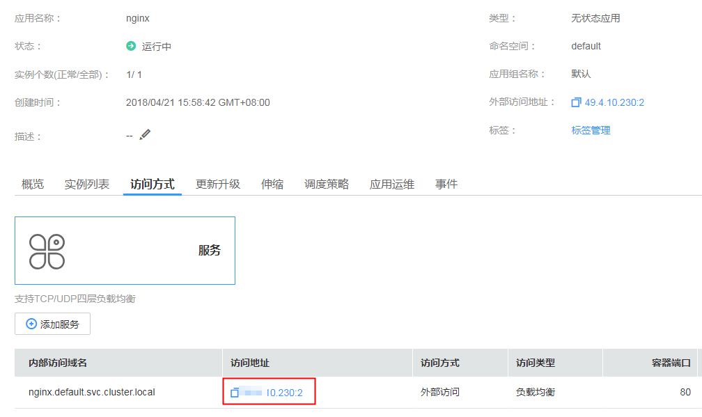

# 负载均衡 \( LoadBalancer \)<a name="cce_01_0014"></a>

负载均衡\( LoadBalancer \)可以通过弹性负载均衡从公网访问到工作负载，与弹性IP方式相比提供了高可靠的保障，一般用于系统中需要暴露到公网的服务。

负载均衡访问方式由公网弹性负载均衡ELB服务地址以及设置的访问端口组成，例如“10.117.117.117:80“。

**图 1**  负载均衡\( LoadBalancer \)<a name="fig1454926316508"></a>  
.png "负载均衡(-LoadBalancer-)")

## 添加方式<a name="section10392205822818"></a>

您可以在创建工作负载时设置访问方式，也可以工作负载创建完成后添加访问方式。

-   方式一：创建工作负载时配置，请参见[通过界面创建](#section744117150366)和[kubectl命令行创建](#section1944313158364)。
-   方式二：工作负载创建完成后配置，此配置对工作负载状态无影响，且实时生效。具体步骤如下：
    1.  单击CCE左侧导航栏的“工作负载”，单击工作负载名称，进入工作负载详情页面。选择“访问方式“页签，单击“添加服务“。
    2.  参照[通过界面创建](#section744117150366)的配置参数添加访问方式。


## 更新方式<a name="section173415165619"></a>

您可以在添加完Service后，更新此Service的端口配置，请参见[更新Service端口配置](#section1591712812718)。

## 通过界面创建<a name="section744117150366"></a>

本节以nginx为例进行说明。

1.  参考[创建无状态工作负载](创建无状态工作负载.md)或[创建有状态工作负载](创建有状态工作负载.md)，在“工作负载访问设置“步骤，单击“添加服务“。
    -   访问类型：选择“负载均衡 \( LoadBalancer \)“。
    -   服务名称：自定义服务名称，可与工作负载名称保持一致。
    -   负载均衡：

        负载均衡（ELB）：可以将互联网访问流量自动分发到工作负载所在的多个节点上。请根据业务需求选择“公网“或“私网“，区别请参见[公网和私网负载均衡器。](https://support.huaweicloud.com/productdesc-elb/zh_cn_elb_01_0004.html)

        > **说明：**   
        >-   增强型负载均衡配额不足时，不支持在云容器引擎中自动创建，请通过[新建增强型弹性负载均衡](https://console.huaweicloud.com/vpc/#/ulb/createUlb)创建。  
        >-   负载均衡实例需与当前集群处于相同VPC \( my-vpc-9207ba6f \) 、相同子网 \( my-subnet-9207ba6f \) ，且与选择的公网/私网类型保持一致。  

    -   端口配置：
        -   协议：请根据业务的协议类型选择。
        -   容器端口：容器镜像中工作负载实际监听端口，需用户确定。nginx程序实际监听的端口为80。
        -   访问端口：容器端口最终映射到负载均衡服务地址的端口，用负载均衡服务地址访问工作负载时使用，端口范围为1-65535，可任意指定。


2.  完成配置后，直接单击“确定“。
3.  单击“下一步“进入“高级设置“页面，直接单击“创建“。
4.  创建成功后，单击“工作负载 \> 无状态（Deployment）“或“工作负载 \> 有状态（StatefulSet）“，在工作负载列表页面，单击“工作负载名称“进入工作负载详情页，在“访问方式“页签下，获取方式地址，例如10.4.10.230:2。
5.  单击访问地址，即可跳转到访问页面。

    **图 2**  通过负载均衡访问nginx（一）<a name="fig756114141119"></a>  
    


## 工作负载创建完成后设置<a name="section51925078171335"></a>

1.  登录CCE控制台，选择左侧导航栏的“资源管理 \> 网络管理”，在**Service**页签下，单击“添加Service”。选择service类型为“负载均衡 \( LoadBalancer \)”。
2.  在“添加service“页面，确保访问类型为“负载均衡 \( LoadBalancer \)”。
3.  设置访问参数。
    -   服务名称：自定义服务名称，可与工作负载名称保持一致。
    -   集群名称：选择服务所在集群。
    -   命名空间：选择服务所在命名空间。
    -   关联工作负载：选择需要添加Service的工作负载。
    -   访问类型：选择负载均衡。

        负载均衡（ELB）：可以将互联网访问流量自动分发到工作负载所在的多个节点上。请根据业务需求选择“公网“或“私网“，区别请参见[公网和私网负载均衡器。](https://support.huaweicloud.com/productdesc-elb/zh_cn_elb_01_0004.html)

        > **说明：**   
        >-   增强型负载均衡配额不足时，不支持在云容器引擎中自动创建，请通过[新建增强型弹性负载均衡](https://console.huaweicloud.com/vpc/#/ulb/createUlb)创建。  
        >-   负载均衡实例需与当前集群处于相同VPC \( my-vpc-9207ba6f \) 、相同子网 \( my-subnet-9207ba6f \) ，且与选择的公网/私网类型保持一致。  

    -   端口配置：
        -   协议：请根据业务的协议类型选择。
        -   容器端口：容器镜像中工作负载程序实际监听的端口，需用户确定。nginx程序实际监听的端口为80。
        -   访问端口：容器端口最终映射到负载均衡服务地址的端口，用负载均衡服务地址访问工作负载时使用，端口范围为1-65535，可任意指定。


4.  单击“创建”。工作负载已添加“负载均衡 \( LoadBalancer \)”的服务。

## kubectl命令行创建<a name="section1944313158364"></a>

本节以nginx为例，说明kubectl命令实现集群内访问的方法。

**前提条件**

请参见[通过Kubectl连接集群](通过Kubectl连接集群.md)配置kubectl命令，使弹性云服务器连接集群。

1.  登录已配置好kubectl命令的弹性云服务器。登录方法请参见[登录Linux弹性云服务器](https://support.huaweicloud.com/usermanual-ecs/zh-cn_topic_0013771089.html)。
2.  创建并编辑nginx-deployment.yaml以及nginx-elb-svc.yaml文件。

    其中，nginx-deployment.yaml和nginx-elb-svc.yaml为自定义名称，您可以随意命名。

    **vi nginx-deployment.yaml**

    ```
    apiVersion: extensions/v1beta1
    kind: Deployment
    metadata:
      name: nginx
    spec:
      replicas: 1
      selector:
        matchLabels:
          app: nginx
      strategy:
        type: RollingUpdate
      template:
        metadata:
          labels:
            app: nginx
        spec:
          containers:
          - image: nginx 
            imagePullPolicy: Always
            name: nginx
          imagePullSecrets:
          - name: default-secret
    ```

    **vi nginx-elb-svc.yaml**

    > **说明：**   
    >若需要开启会话保持，需要满足如下条件：  
    >-   工作负载协议为TCP。  
    >-   工作负载的各实例已设置反亲和部署，即所有的实例都部署在不同节点上。详细请参见[指定工作负载部署在不同节点](https://support.huaweicloud.com/usermanual-cce/cce_01_0051.html#section11)。  

    ```
    apiVersion: v1 
    kind: Service 
    metadata: 
      annotations:   
        kubernetes.io/elb.class: elasticity                 #对接负载均衡需要加此参数，若对接增强型负载均衡，值为union 
        kubernetes.io/session-affinity-mode: SOURCE_IP      #可选，若需要开启会话保持，需增加该参数，表示基于源IP
        kubernetes.io/elb.id: 3c7caa5a-a641-4bff-801a-feace27424b6        #必填，为负载均衡增强型实例的ID
      labels: 
        app: nginx 
      name: nginx 
    spec: 
      loadBalancerIP: 10.78.42.242                          #配置为ELB的IP地址，私网ELB配置私有IP，公网ELB配置为公网IP 
     externalTrafficPolicy: Local                          #可选，若需要开启会话保持，需增加该参数，表示请求转到固定节点
      ports: 
      - name: service0 
        port: 80             #集群虚拟IP的访问端口，也是注册到负载均衡上的端口 
        protocol: TCP 
        targetPort: 80       #对应界面上的容器端口 
      selector: 
        app: nginx 
      type: LoadBalancer
    ```

3.  创建工作负载。

    **kubectl create -f nginx-deployment.yaml**

    回显如下，表示工作负载已开始创建。

    ```
    deployment "nginx" created
    ```

    **kubectl get po**

    回显如下，工作负载状态为Running状态，表示工作负载已运行中。

    ```
    NAME                     READY     STATUS             RESTARTS   AGE
    etcd-0                   0/1       ImagePullBackOff   0          1h
    icagent-m9dkt            0/0       Running            0          3d
    nginx-2601814895-c1xhw   1/1       Running            0          6s
    ```

4.  创建服务。

    **kubectl create -f nginx-elb-svc.yaml**

    回显如下，表示服务已创建。

    ```
    service "nginx" created
    ```

    **kubectl get svc**

    回显如下，表示工作负载访问方式已设置成功，工作负载可访问。

    ```
    NAME         TYPE           CLUSTER-IP       EXTERNAL-IP   PORT(S)        AGE
    etcd-svc     ClusterIP      None             <none>        3120/TCP       1h
    kubernetes   ClusterIP      10.247.0.1       <none>        443/TCP        3d
    nginx        LoadBalancer   10.247.130.196   10.78.42.242   80:31540/TCP   51s
    ```

5.  在浏览器中输入访问地址，例如输入10.78.42.242:31540。10.78.42.242为负载均衡实例IP地址，31540为对应界面上的访问端口。

    可成功访问nginx。

    **图 3**  通过负载均衡访问nginx（二）<a name="fig1498213713356"></a>  
    


## 更新Service端口配置<a name="section1591712812718"></a>

1.  登录CCE控制台，选择左侧导航栏的“资源管理 \> 网络管理”，在**Service**页签下，单击需要更新端口配置的Service的“更新”。
2.  更新“端口配置“参数。
    -   协议：请根据业务的协议类型选择。
    -   容器端口：容器镜像中工作负载程序实际监听的端口，需用户确定。nginx程序实际监听的端口为80。
    -   访问端口：容器端口最终映射到负载均衡服务地址的端口，用负载均衡服务地址访问工作负载时使用，端口范围为1-65535，可任意指定。

3.  单击“更新”。工作负载已更新Service。

