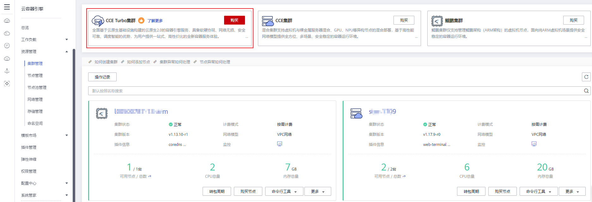
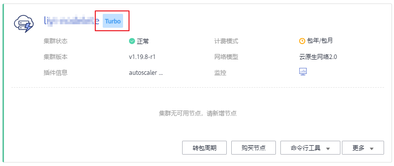

# 购买CCE Turbo集群

CCE Turbo集群是基于云原生基础设施构建的云原生2.0容器引擎服务，具备软硬协同、网络无损、安全可靠、调度智能的优势，为用户提供一站式、高性价比的全新容器服务体验。

CCE Turbo集群提供了面向大规模高性能的场景云原生2.0网络，容器直接从VPC网段内分配IP地址，容器和节点可以分属不同子网，支持VPC内的外部网络与容器IP直通，享有高性能。**强烈建议**您在购买前阅读[云原生网络2.0](云原生网络2-0-69.md)，了解云原生2.0网络特性、各网段网络规划等内容。

## 约束与限制

-   创建节点过程中会使用域名方式从OBS下载软件包，需要能够使用云上内网DNS解析OBS域名，否则会导致创建不成功。为此，节点所在子网需要配置为[内网DNS地址](https://support.huaweicloud.com/dns_faq/dns_faq_002.html)，从而使得节点使用内网DNS。在创建子网时DNS默认配置为内网DNS，如果您修改过子网的DNS，请务必**确保子网下的DNS服务器可以解析OBS服务域名**，否则需要将DNS改成内网DNS。
-   单Region下单用户可创建的集群总数限制为50个，如果配额不满足业务需求，请[到“我的配额”提交申请](https://console.huaweicloud.com/quota/?locale=zh-cn#/quota)，查看配额请参见[关于配额](https://support.huaweicloud.com/usermanual-iaas/zh-cn_topic_0040259342.html)。
-   CCE Turbo集群的网络模式只支持云原生网络2.0，云原生网络2.0的详细介绍请参见[云原生网络2.0](云原生网络2-0-69.md)。
-   CCE Turbo集群的节点目前仅支持基于擎天软硬件协同架构的机型。

## 操作步骤

1.  登录CCE控制台，在左侧导航栏中单击“资源管理  \>  集群管理”，单击“CCE Turbo集群“右侧的“购买”。

    **图 1**  购买CCE Turbo集群  
    

2.  在购买CCE Turbo集群页面中，参照如下表格设置集群参数。

    **基础配置**：

    创建集群，作为运行容器的独立环境，需要您完成如下基础配置。

    **表 1**  创建集群基础配置

    
    <table><thead align="left"><tr id="row157523542279"><th class="cellrowborder" valign="top" width="20.02%" id="mcps1.2.3.1.1">
参数

    </th>
    <th class="cellrowborder" valign="top" width="79.97999999999999%" id="mcps1.2.3.1.2">
参数说明

    </th>
    </tr>
    </thead>
    <tbody><tr id="row3752125482710"><td class="cellrowborder" valign="top" width="20.02%" headers="mcps1.2.3.1.1 ">
集群名称

    </td>
    <td class="cellrowborder" valign="top" width="79.97999999999999%" headers="mcps1.2.3.1.2 ">
新建集群的名称，同一账户下集群不可重名，创建后不可修改。

    
集群名称长度范围为4-128个字符，以小写字母开头，由小写字母、数字、中划线（-）组成，且不能以中划线（-）结尾。

    </td>
    </tr>
    <tr id="row875345462719"><td class="cellrowborder" valign="top" width="20.02%" headers="mcps1.2.3.1.1 ">
版本

    </td>
    <td class="cellrowborder" valign="top" width="79.97999999999999%" headers="mcps1.2.3.1.2 ">
集群要安装的Kubernetes软件版本。

    </td>
    </tr>
    <tr id="row1175325415272"><td class="cellrowborder" valign="top" width="20.02%" headers="mcps1.2.3.1.1 ">
集群管理规模

    </td>
    <td class="cellrowborder" valign="top" width="79.97999999999999%" headers="mcps1.2.3.1.2 ">
集群管理规模是指当前集群的控制节点可以管理的最大工作节点规模，您可以选择200节点、1000节点或2000节点三种管理规模，请根据您的业务需求选择。如果您需要创建5000节点的集群，请<a href="https://console.huaweicloud.com/quota/?locale=zh-cn#/quota" target="_blank" rel="noopener noreferrer">提交工单</a>申请。

    
若选择“1000节点”，表示当前集群的控制节点最多可管理1000个工作节点。由于不同管理规模的控制节点规格不同，因此配置费用会有差异。

    </td>
    </tr>
    </tbody>
    </table>

    **网络配置**：

    选择集群下节点和容器所使用的网段，当网段下IP资源不足时将无法继续创建节点和容器。

    **表 2**  网络配置参数

    
    <table><thead align="left"><tr id="row81961759182810"><th class="cellrowborder" valign="top" width="20.02%" id="mcps1.2.3.1.1">
参数

    </th>
    <th class="cellrowborder" valign="top" width="79.97999999999999%" id="mcps1.2.3.1.2">
参数说明

    </th>
    </tr>
    </thead>
    <tbody><tr id="row20197165992816"><td class="cellrowborder" valign="top" width="20.02%" headers="mcps1.2.3.1.1 ">
网络模型

    </td>
    <td class="cellrowborder" valign="top" width="79.97999999999999%" headers="mcps1.2.3.1.2 ">
<strong id="b19197185972816">云原生网络2.0：</strong>深度整合虚拟私有云VPC原生弹性网卡（Elastic Network Interface，简称ENI）能力，采用VPC网段分配容器地址，支持ELB直通容器，享有高性能。

    
了解更多请参见<a href="云原生网络2-0-69.md">云原生网络2.0</a>

    </td>
    </tr>
    <tr id="row1319717598282"><td class="cellrowborder" valign="top" width="20.02%" headers="mcps1.2.3.1.1 ">
虚拟私有云

    </td>
    <td class="cellrowborder" valign="top" width="79.97999999999999%" headers="mcps1.2.3.1.2 ">
请选择新建集群下节点和容器使用的虚拟私有云VPC，集群创建后不可更改。

    
虚拟私有云是通过逻辑方式进行网络隔离，提供安全、隔离的网络环境。

    
若没有虚拟私有云可选择，请单击<a href="https://console.huaweicloud.com/vpc/?region=cn-north-4&amp;locale=zh-cn#/vpcs" target="_blank" rel="noopener noreferrer">虚拟私有云控制台</a>“虚拟私有云控制台”进行创建，完成创建后单击刷新按钮。操作步骤请参见<a href="https://support.huaweicloud.com/usermanual-vpc/zh-cn_topic_0013935842.html" target="_blank" rel="noopener noreferrer">创建虚拟私有云和子网</a>。

    </td>
    </tr>
    <tr id="row9961959174010"><td class="cellrowborder" valign="top" width="20.02%" headers="mcps1.2.3.1.1 ">
节点子网

    </td>
    <td class="cellrowborder" valign="top" width="79.97999999999999%" headers="mcps1.2.3.1.2 ">
选择一个虚拟私有云后可显示该选项。

    
集群下节点使用的子网，决定了集群下节点的数量上限。创建节点时支持选择相同VPC下的其他子网。

    
通过节点子网提供与其他网络隔离的、可以独享的网络资源，以提高网络安全。

    
若没有节点子网可选择，请单击“新建子网”进行创建，完成创建后单击刷新按钮。虚拟私有云、子网、集群的关系请参见<a href="集群概述-2.md">集群概述</a>。

    
创建节点过程中会使用域名方式从OBS下载软件包，需要能够使用内网DNS解析OBS域名，否则会导致创建不成功。为此，节点所在子网需要配置为<a href="https://support.huaweicloud.com/dns_faq/dns_faq_002.html" target="_blank" rel="noopener noreferrer">内网DNS地址</a>，从而使得节点使用内网DNS。在创建子网时DNS默认配置为内网DNS，如果您修改过子网的DNS，请务必<strong id="cce_01_0028_b8921731141716">确保子网下的DNS服务器可以解析OBS服务域名</strong>，否则需要将DNS改成内网DNS。

    
<strong id="b1119161703511">集群创建后子网无法修改，请谨慎选择。</strong>

    </td>
    </tr>
    <tr id="row19944514416"><td class="cellrowborder" valign="top" width="20.02%" headers="mcps1.2.3.1.1 ">
容器子网

    </td>
    <td class="cellrowborder" valign="top" width="79.97999999999999%" headers="mcps1.2.3.1.2 ">
选择一个虚拟私有云后可显示该选项。

    
集群下容器使用的子网，决定了集群下容器的数量上限，集群创建后该网段不可更改。

    
请根据业务需求选择容器子网，确定容器子网后，容器实例将在规划的网段内分配IP。

    
 说明： 

如果容器子网和节点子网相同，容器和节点将共同使用子网下剩余IP，易出现IP资源不足的场景导致容器或节点创建失败。

    

    </td>
    </tr>
    </tbody>
    </table>

    **高级配置**：

    根据业务需求选择配置CCE Turbo集群的增强能力。

    **表 3**  网络配置参数

    
    <table><thead align="left"><tr id="row1913122610307"><th class="cellrowborder" valign="top" width="20.02%" id="mcps1.2.3.1.1">
参数

    </th>
    <th class="cellrowborder" valign="top" width="79.97999999999999%" id="mcps1.2.3.1.2">
参数说明

    </th>
    </tr>
    </thead>
    <tbody><tr id="row13913122623018"><td class="cellrowborder" valign="top" width="20.02%" headers="mcps1.2.3.1.1 ">
服务网段

    </td>
    <td class="cellrowborder" valign="top" width="79.97999999999999%" headers="mcps1.2.3.1.2 ">
服务网段为kubernetes service ip网段，集群创建后该网段不可更改。服务网段与已创建的路由不能冲突，如果冲突，请重新选择。

    
默认设置为10.247.0.0/16网段。请根据业务需求设置合理的网段和掩码，掩码决定集群内可用service ip数量。

    
服务网段要设置合理的掩码，掩码决定集群内可用service数量。集群中服务网段掩码设置不合适，会导致集群实际可用的service较少。设置掩码后，选项右侧会有当前网段最多支持的实例估算值，请作参考。详情请参见<a href="https://support.huaweicloud.com/bestpractice-cce/cce_bestpractice_00004.html" target="_blank" rel="noopener noreferrer">如何规划CCE集群的网络地址段？</a>。

    </td>
    </tr>
    <tr id="row9381745114114"><td class="cellrowborder" valign="top" width="20.02%" headers="mcps1.2.3.1.1 ">
kube-proxy转发模式

    </td>
    <td class="cellrowborder" valign="top" width="79.97999999999999%" headers="mcps1.2.3.1.2 ">
设置Service和其后端容器Pod之间进行负载均衡的方式，创建后不可修改。

    <ul id="ul171711948164219"><li>IPVS：在社区获得广泛支持的kube-proxy模式，采用增量式更新，吞吐更高，速度更快，并可以保证service更新期间连接保持不断开，适用于大规模场景。
IPVS模式下，ingress和service使用相同的ELB实例时，无法在集群内的节点和容器中访问ingress。

    </li><li>iptables：社区传统的kube-proxy模式，完全以iptables规则的方式来实现service负载均衡。该方式最主要的问题是在服务多的时候产生太多的iptables规则，非增量式更新会引入一定的时延，大规模情况下有明显的性能问题。</li></ul>
    
 说明： 
<ul id="ul1617174814217"><li>IPVS为大型集群提供了更好的可扩展性和性能。</li><li>IPVS支持比iptables更复杂的负载平衡算法（最小负载，最少连接，位置，加权等）。</li><li>IPVS支持服务器健康检查和连接重试等。</li></ul>
    

    </td>
    </tr>
    <tr id="row12310175135716"><td class="cellrowborder" valign="top" width="20.02%" headers="mcps1.2.3.1.1 ">
CPU管理策略

    </td>
    <td class="cellrowborder" valign="top" width="79.97999999999999%" headers="mcps1.2.3.1.2 "><ul id="ul14813182993518"><li>开启：支持给工作负载实例配置CPU独占，适用于对CPU缓存和调度延迟敏感的工作负载。</li><li>关闭：关闭工作负载实例独占CPU核的功能，优点是CPU共享池的可分配核数较多。</li></ul>
    </td>
    </tr>
    <tr id="row1640647144410"><td class="cellrowborder" valign="top" width="20.02%" headers="mcps1.2.3.1.1 ">
计费

    </td>
    <td class="cellrowborder" valign="top" width="79.97999999999999%" headers="mcps1.2.3.1.2 "><ul id="ul463941414445"><li>包年/包月：预付费模式，按订单的购买周期计费，适用于可预估资源使用周期的场景，价格比按需计费模式更优惠。若选择创建“包年/包月”的集群，请设置购买时长。包年/包月集群创建后不能删除，如需停止使用，请到<a href="https://account.huaweicloud.com/usercenter/#/userindex/retreatManagement" target="_blank" rel="noopener noreferrer">费用中心</a>执行退订操作。</li><li>按需计费：后付费模式，按资源的实际使用时长计费，可以随时开通/删除资源。</li></ul>
    </td>
    </tr>
    </tbody>
    </table>

3.  单击“下一步：配置确认”，确认所设置的服务选型参数、规格和费用等信息，您可以参照如下参数选择企业项目、修改计费模式和购买时长。

    
    <table><thead align="left"><tr id="row10638181262612"><th class="cellrowborder" valign="top" width="20.02%" id="mcps1.1.3.1.1">
参数

    </th>
    <th class="cellrowborder" valign="top" width="79.97999999999999%" id="mcps1.1.3.1.2">
参数说明

    </th>
    </tr>
    </thead>
    <tbody><tr id="row196852801312"><td class="cellrowborder" valign="top" width="20.02%" headers="mcps1.1.3.1.1 ">
企业项目

    </td>
    <td class="cellrowborder" valign="top" width="79.97999999999999%" headers="mcps1.1.3.1.2 ">
该参数仅对开通企业项目的企业客户帐号显示。

    
选择某企业项目（如：default）后，集群、集群下节点、集群安全组、节点安全组和自动创建的节点EIP（弹性公网IP）将创建到所选企业项目下。为方便管理资源，在集群创建成功后，建议不要修改集群下节点、集群安全组、节点安全组的企业项目。

    
企业项目是一种云资源管理方式，企业项目管理服务提供统一的云资源按项目管理，以及项目内的资源管理、成员管理。了解更多企业项目相关信息，请查看<a href="https://support.huaweicloud.com/usermanual-em/zh-cn_topic_0123692049.html" target="_blank" rel="noopener noreferrer">企业管理</a>。

    </td>
    </tr>
    <tr id="row1922964644615"><td class="cellrowborder" valign="top" width="20.02%" headers="mcps1.1.3.1.1 ">
计费模式

    </td>
    <td class="cellrowborder" valign="top" width="79.97999999999999%" headers="mcps1.1.3.1.2 ">
如果确认集群的计费模式有误，您可以在此修改。

    <ul id="ul1571804084210"><li>包年/包月：预付费模式，按订单的购买周期计费，适用于可预估资源使用周期的场景，价格比按需计费模式更优惠。包年/包月集群创建后不能删除，如需停止使用，请到<a href="https://account.huaweicloud.com/usercenter/#/userindex/retreatManagement" target="_blank" rel="noopener noreferrer">费用中心</a>执行退订操作。</li><li>按需计费：后付费模式，按资源的实际使用时长计费，可以随时开通/删除资源。</li></ul>
    </td>
    </tr>
    <tr id="row12321131519262"><td class="cellrowborder" valign="top" width="20.02%" headers="mcps1.1.3.1.1 ">
购买时长

    </td>
    <td class="cellrowborder" valign="top" width="79.97999999999999%" headers="mcps1.1.3.1.2 ">
若选择创建“包年/包月”的集群，请设置购买时长。

    
自动续费：勾选后可在自动。若按月购买，则自动续费周期为1个月；若按年购买，则自动续费周期为1年。

    </td>
    </tr>
    </tbody>
    </table>

4.  确认规格和费用后，单击“提交”，集群开始创建。

    集群创建预计需要6-10分钟，您可以单击“返回集群管理“进行其他操作或单击“查看集群事件列表“后查看集群详情。

5.  待集群状态为“正常”，表示CCE Turbo集群创建成功，集群名称后方显示为Turbo字样。

    

## 相关操作

-   通过命令行工具连接集群：请参见[通过kubectl连接集群](通过kubectl连接集群-7.md)。
-   登录节点：请参见[登录节点](登录节点-26.md)。

-   创建命名空间：同个集群内可创建多个命名空间，形成逻辑上的不同分组，便于不同的分组在共享使用集群资源时还能被分别管理。若您需要为集群创建命名空间，请参见[命名空间](命名空间-139.md)。
-   创建工作负载：集群创建完成后，您可以使用镜像创建一个可公网访问的应用，请参见[创建无状态负载\(Deployment\)](创建无状态负载(Deployment)-40.md)、[创建有状态负载\(StatefulSet\)](创建有状态负载(StatefulSet)-41.md)或[创建守护进程集\(DaemonSet\)](创建守护进程集(DaemonSet)-42.md)。
-   单击已成功创建的集群名称，进入“集群详情“页可查看集群详情。

    **表 4**  已创建的集群详情

    
    <table><thead align="left"><tr id="cce_01_0028_row1264365516359"><th class="cellrowborder" valign="top" width="20%" id="mcps1.2.3.1.1">
页签类别

    </th>
    <th class="cellrowborder" valign="top" width="80%" id="mcps1.2.3.1.2">
说明

    </th>
    </tr>
    </thead>
    <tbody><tr id="cce_01_0028_row5975069716956"><td class="cellrowborder" valign="top" width="20%" headers="mcps1.2.3.1.1 ">
集群详情

    </td>
    <td class="cellrowborder" valign="top" width="80%" headers="mcps1.2.3.1.2 ">
可查看该集群的详情及运行状态等。

    </td>
    </tr>
    <tr id="cce_01_0028_row106431055133510"><td class="cellrowborder" valign="top" width="20%" headers="mcps1.2.3.1.1 ">
监控

    </td>
    <td class="cellrowborder" valign="top" width="80%" headers="mcps1.2.3.1.2 ">
可查看集群下全部节点的CPU和内存分配率（即分配量的最大值），以及控制节点的CPU和内存使用率、控制节点规格等信息。

    </td>
    </tr>
    <tr id="cce_01_0028_row1464335593515"><td class="cellrowborder" valign="top" width="20%" headers="mcps1.2.3.1.1 ">
事件

    </td>
    <td class="cellrowborder" valign="top" width="80%" headers="mcps1.2.3.1.2 "><ul id="cce_01_0028_ul42186174161243"><li>可以直接在“事件”页签下查看集群的事件。</li><li>可以设置查询条件，比如设置事件产生的时间段或搜索事件名称，查看相关事件。</li></ul>
    
 说明： 

由于版本更新演进，旧版Console不再支持查看新集群的事件，请前往新版Console使用。

    

    </td>
    </tr>
    <tr id="cce_01_0028_row506129238"><td class="cellrowborder" valign="top" width="20%" headers="mcps1.2.3.1.1 ">
弹性扩容

    </td>
    <td class="cellrowborder" valign="top" width="80%" headers="mcps1.2.3.1.2 ">
您可以根据实际业务需要对集群的工作节点进行扩容和缩容，详情请参见<a href="集群弹性扩容.md">集群弹性扩容</a>。

    
v1.17版本的集群不再支持AOM提供的弹性伸缩机制，请使用节点池功能进行弹性伸缩，详情请参见<a href="节点池概述-35.md">节点池概述</a>。

    </td>
    </tr>
    <tr id="cce_01_0028_row651036112414"><td class="cellrowborder" valign="top" width="20%" headers="mcps1.2.3.1.1 ">
kubectl

    </td>
    <td class="cellrowborder" valign="top" width="80%" headers="mcps1.2.3.1.2 ">
若您需要从客户端计算机连接到kubernetes集群，请使用kubernetes命令行客户端<a href="https://kubernetes.io/zh-cn/docs/reference/kubectl/" target="_blank" rel="noopener noreferrer">kubectl</a>，详情请参见<a href="通过kubectl连接集群-7.md">通过kubectl连接集群</a>。

    </td>
    </tr>
    <tr id="row1562810082313"><td class="cellrowborder" valign="top" width="20%" headers="mcps1.2.3.1.1 ">
资源标签

    </td>
    <td class="cellrowborder" valign="top" width="80%" headers="mcps1.2.3.1.2 ">
通过为资源添加标签，可以对资源进行自定义标记，实现资源的分类。

    
您可以在TMS中创建“预定义标签”，预定义标签对所有支持标签功能的服务资源可见，通过使用预定义标签可以提升标签创建和迁移效率。具体请参见<a href="https://support.huaweicloud.com/usermanual-tms/zh-cn_topic_0144368884.html" target="_blank" rel="noopener noreferrer">创建预定义标签</a>。

    
CCE服务会自动帮您创建CCE-Dynamic-Provisioning-Node=节点id的标签，允许增加5个标签。

    </td>
    </tr>
    <tr id="cce_01_0028_row2701721182419"><td class="cellrowborder" valign="top" width="20%" headers="mcps1.2.3.1.1 ">
Istioctl

    </td>
    <td class="cellrowborder" valign="top" width="80%" headers="mcps1.2.3.1.2 ">
在集群开启istio服务网格功能后，您使用Istio命令行工具Istioctl配置多种路由策略，从而管理服务流量，包括流量转移、故障注入、限流熔断等。详情请参见<a href="启用istio.md">启用istio</a>。

    </td>
    </tr>
    </tbody>
    </table>

