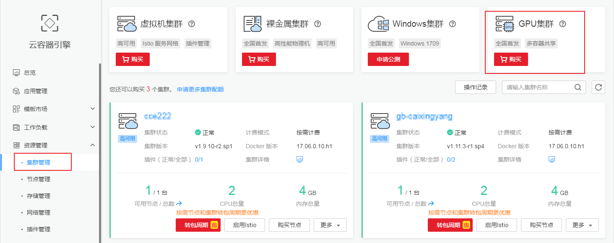
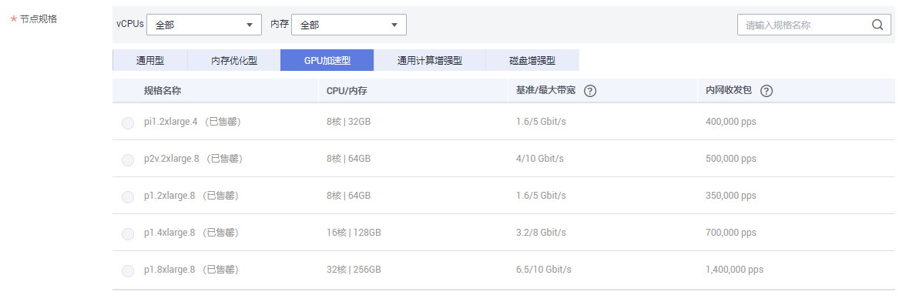

# 购买GPU集群

混合集群支持支持GPU、NPU等异构节点的混合部署，GPU集群是指使用GPU节点部署的集群，支持主流AI计算框架、支持多容器共享GPU资源。

自从1.8版本开始，Kubernetes已经明确将通过统一的[设备插件方式](https://kubernetes.io/docs/concepts/cluster-administration/device-plugins/)支持像Nvidia GPU，InfiniBand，FPGA等硬件加速设备，而社区的GPU方案已在1.10全面弃用，并在1.11版本彻底从主干代码移除。

若您需要通过华为云GPU容器集群运行机器学习、科学计算、AI推理等高运算密度任务，无需安装nvidia driver，就能实现一键部署和弹性扩缩容等功能。

## 约束与限制

-   每个账号默认可以创建的云资源有一定的配额，如果超过配额创建集群会失败。请在创建集群前确认您的配额，查看配额请参见[关于配额](https://support.huaweicloud.com/usermanual-iaas/zh-cn_topic_0040259342.html)。如果您需要提高您的配额，请[提交工单](https://console.huaweicloud.com/console/#/quota)申请。
-   Kubernetes 1.9版本的集群，GPU组件默认强制安装；Kubernetes 1.11及以上版本的集群，GPU能力以插件的方式外接提供，需要您在“插件管理“中安装[GPU-beta插件。](gpu-beta.md)
-   ECS 实例使用限制：CUDA需要您自行在镜像中安装。

## 购买GPU集群

混合集群支持GPU、NPU等异构节点的混合部署，其购买方式与混合集群基本类似，你只需在创建混合集群时的“创建节点”步骤中选择**“GPU加速型“**下的节点规格即可。

1.  登录[CCE控制台](https://console.huaweicloud.com/cce2.0/?utm_source=helpcenter)，在左侧导航栏中单击“资源管理 \> 集群管理“，进入集群列表页面。
2.  单击页面右上角“混合集群“右侧的“购买“按钮，进入购买集群页面。

    > **说明：** 
    >由于GPU集群与混合集群的控制节点和创建步骤一致，区别在于工作节点使用GPU类型的ECS，因此购买GPU集群的入口现已统一到“购买混合集群“。

    **图 1**  购买GPU集群  
    

3.  请参考购买混合集群时的[操作步骤](购买混合集群.md#section463761220269)，填写服务选项参数。
4.  在“创建节点“步骤中，注意参照如下参数配置节点。

    **节点规格：**请根据业务需求选择**“GPU加速型“**下的节点规格。

    **图 2**  选择GPU节点规格  
    

    > **说明：** 
    >为确保节点稳定性，系统会自动预留部分资源，运行必须的系统组件。详细请参见[节点预留资源计算公式](节点预留资源计算公式.md)。

5.  其他操作与购买混合集群一致，确认规格和费用后，单击“提交”，集群开始创建。

    若选择购买“包年包月“的集群，请单击“去支付“，根据界面提示进行付款操作。

    集群创建预计需要6-10分钟，您可以单击“返回集群管理“进行其他操作或单击“查看集群事件列表“后查看集群详情。

## 相关操作

-   通过命令行工具连接集群：请参见[通过kubectl或web-terminal插件连接CCE集群](通过kubectl或web-terminal插件连接CCE集群.md)。
-   添加节点：集群创建完成后，若您需要为集群添加更多节点，请参见[购买节点](购买节点.md)。
-   登录节点：请参见[登录节点](登录节点.md)。

-   创建命名空间：同个集群内可创建多个命名空间，形成逻辑上的不同分组，便于不同的分组在共享使用集群资源时还能被分别管理。若您需要为集群创建命名空间，请参见[命名空间](命名空间.md)。
-   创建工作负载：集群创建完成后，您可以使用镜像创建一个可公网访问的应用，请参见[创建无状态负载\(Deployment\)](创建无状态负载(Deployment).md)或[创建有状态负载\(StatefulSet\)](创建有状态负载(StatefulSet).md)。
-   单击已成功创建的集群名称，进入“集群详情“页可查看集群详情。

    **表 1**  已创建的集群详情

    
    <table><thead align="left"><tr id="cce_01_0028_row1264365516359"><th class="cellrowborder" valign="top" width="20%" id="mcps1.2.3.1.1">
页签类别

    </th>
    <th class="cellrowborder" valign="top" width="80%" id="mcps1.2.3.1.2">
说明

    </th>
    </tr>
    </thead>
    <tbody><tr id="cce_01_0028_row5975069716956"><td class="cellrowborder" valign="top" width="20%" headers="mcps1.2.3.1.1 ">
集群详情

    </td>
    <td class="cellrowborder" valign="top" width="80%" headers="mcps1.2.3.1.2 ">
可查看该集群的详情及运行状态等。

    </td>
    </tr>
    <tr id="cce_01_0028_row106431055133510"><td class="cellrowborder" valign="top" width="20%" headers="mcps1.2.3.1.1 ">
监控

    </td>
    <td class="cellrowborder" valign="top" width="80%" headers="mcps1.2.3.1.2 ">
可查看集群下全部节点的CPU和内存分配率（即分配量的最大值），以及控制节点的CPU和内存使用率、控制节点规格等信息。

    </td>
    </tr>
    <tr id="cce_01_0028_row1464335593515"><td class="cellrowborder" valign="top" width="20%" headers="mcps1.2.3.1.1 ">
事件

    </td>
    <td class="cellrowborder" valign="top" width="80%" headers="mcps1.2.3.1.2 "><ul id="cce_01_0028_ul42186174161243"><li>可以直接在“事件”页签下查看集群的事件。</li><li>可以设置查询条件，比如设置事件产生的时间段或搜索事件名称，查看相关事件。</li></ul>
    </td>
    </tr>
    <tr id="cce_01_0028_row506129238"><td class="cellrowborder" valign="top" width="20%" headers="mcps1.2.3.1.1 ">
弹性扩容

    </td>
    <td class="cellrowborder" valign="top" width="80%" headers="mcps1.2.3.1.2 ">
您可以根据实际业务需要对集群的工作节点进行扩容和缩容，详情请参见<a href="集群弹性扩容.md">集群弹性扩容</a>。

    </td>
    </tr>
    <tr id="cce_01_0028_row651036112414"><td class="cellrowborder" valign="top" width="20%" headers="mcps1.2.3.1.1 ">
kubectl

    </td>
    <td class="cellrowborder" valign="top" width="80%" headers="mcps1.2.3.1.2 ">
若您需要从客户端计算机连接到kubernetes集群，请使用kubernetes命令行客户端<a href="https://kubernetes.io/docs/user-guide/kubectl/" target="_blank" rel="noopener noreferrer">kubectl</a>，详情请参见<a href="通过kubectl或web-terminal插件连接CCE集群.md">通过kubectl或web-terminal插件连接CCE集群</a>。

    </td>
    </tr>
    <tr id="cce_01_0028_row2701721182419"><td class="cellrowborder" valign="top" width="20%" headers="mcps1.2.3.1.1 ">
Istioctl

    </td>
    <td class="cellrowborder" valign="top" width="80%" headers="mcps1.2.3.1.2 ">
在集群开启istio服务网格功能后，您使用Istio命令行工具Istioctl配置多种路由策略，从而管理服务流量，包括流量转移、故障注入、限流熔断等。详情请参见<a href="通过Istioctl配置路由策略.md">通过Istioctl配置路由策略</a>。

    </td>
    </tr>
    </tbody>
    </table>

